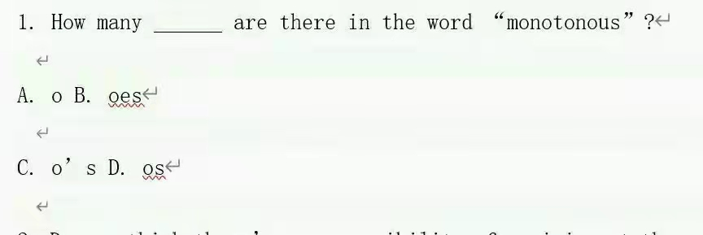

# kangroo与volcano的复数形式

 

## Reference

1.  [The Plural of Kangaroo](https://www.grammar-monster.com/plurals/plural_of_kangaroo.htm)
2. [以o结尾的单词，复数时什么时候加s，什么时候加es？](https://www.lishixinzhi.com/zs/post/457021.html)
3. [英语有的说以o结尾的词变复数，有生命的物体加es，没生命的加s，bamboo是有生命还是无生命？](https://zhidao.baidu.com/question/1931124083398954587.html)
4. [**以“O”结尾的单词变复数，应加“s”还是“es”？**](https://baijiahao.baidu.com/s?id=1689829642038788771&wfr=spider&for=pc)