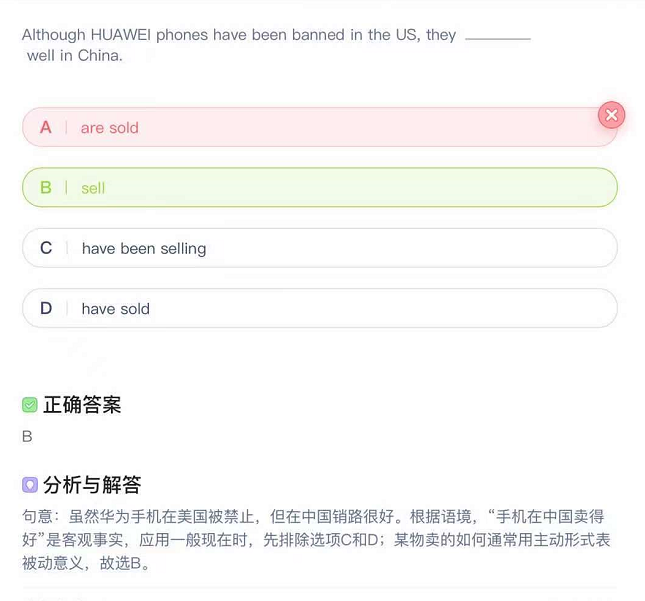

# 初中英语中主动形式表被动意义

[toc]

我们在英语学习中经常会遇到一些动词，它们的主动形式就可以表示被动意义。很多同学遇到这类题的时候常常会出错。今天给同学们整理归纳了这些词的用法，大家可以通过具体的例句，理解掌握消化吸收。下面是小编为您收集整理的初中英语中主动形式表被动意义，供大家参考!

## 初中英语中主动形式表被动意义

###  一、某些系统动词

某些系动词，如feel， look， seem， appear， taste， sound， smell， prove， remain等用主动形式表示被动意义;

主语通常是事物，且表示该事物本身具有某一固有特征。

如：

| 正确                                                       | 错误                                |
| ---------------------------------------------------------- | ----------------------------------- |
| The material feels very soft.  这种料子摸起来很柔软。 | 误：The material is felt very soft. |
| The music sounds beautiful. 这音乐听起来很美妙。           | 误：The music is sounded beautiful. |
|                                                            |                                     |

### 二、表示主语由内在品质或性能

表示主语由内在品质或性能，使得主语得以实现或不能实现，用主动表示被动，常见的这类动词有：write， read， clean， sell， wash， cook， open， close， lock等。

####  1. 同well， badly， easily等副词连用。如：

- The cloth washes easily. 这布很好洗。　　
- The book sells well. 那本书很畅销。　　
- The pen writes smoothly. 这支笔很好写

####  2. 谓语动词用否定式。如：

- The window won’t open. 这扇窗开不了。　　
- The door won’t lock. 这门锁不上。

####  3. 主语+谓语(blow， wear等) +主补。如：

- The door blew open. 门被风吹开了。

###  三、某些日常用语于进行时态时，可用主动形式表示被动意义

某些日常用语，如：cook， bake， make， print， pack， build， work out等动词用于进行时态时，可用主动形式表示被动意义。如：　　

- The fish is cooking. 鱼正在煮。　　
- The book is printing. 那本书正在印刷中。　　
- The plan is working out. 计划正在制订。

### 四、不定式

不定式在下列情况下用主动形式表示被动意义：

#### 1. 在“be+形容词+fit to do”句型中。

- 　English words are difficult to remember. 英语单词很难记。

  > 注：常用于此句型形容词有easy， hard， difficult， heavy， light， comfortable等。

#### 2. 在作补语的形容词后作状语的不定式

- We found the book easy to understand. 我们觉得这本书的容易懂。

#### 3. 在This /That /These /Those be后的名词后的不定式。

- This is a difficult problem to solve. 这是一个很难解决的问题。

#### 4. 在“there be/have/with sth. to do(有……要……) ”结构中

- I have a lot of work to do. 我有许多事要做。

#### 5. 在“疑问代词+不定式”结构

 - The question is what to do next. 问题是接下来做什么。

#### 6. 在“be to blame/seek/let”结构中

- The house is to let. 此房出租。
- He is to blame for this. 他因此事应受到责备

### 五、在表示“需要”句子用主动形式表示被动含义

在表示“需要”的need、 want、 require、及be worth后的动词-ing形式，用主动形式表示被动含义。如：

- The floor needs sweeping. 这地需要打扫了。
- That picture is worth looking at. 那幅画值得看。

### 六 所遇记录

| 原句                                                         | 修改后                                                       | Remark               |
| :----------------------------------------------------------- | ------------------------------------------------------------ | -------------------- |
| Dean would sort out a maintenance list to determine what services will ***be included*** for regular maintenance. | Dean would sort out a maintenance list to determine what services will include for regular maintenance. | Passive voice misuse |
|                                                              |                                                              |                      |
|                                                              |                                                              |                      |

