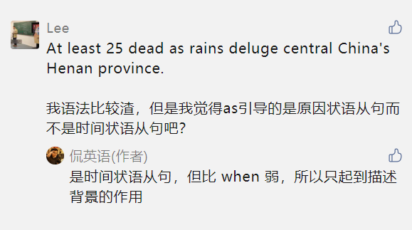

# 文法俱乐部2 - 副词从句
@(哦呵呵)[Toastmasters, Word of the Day, 旋元佑, 文法俱乐部]

[toc]

* [文法俱乐部2 \- 副词从句](#文法俱乐部2---副词从句)
  * [1\. Overview](#1-overview)
  * [2\. 副词从句 /状语从句 (adverbial clause) [18]](#2-副词从句-状语从句-adverbial-clause-18)
    * [2\.1 副词从句与名词从句的构造比较](#21-副词从句与名词从句的构造比较)
    * [2\.2 常用的副词从句连接词](#22-常用的副词从句连接词)
      * [After](#after)
      * [Although /though](#although-though)
      * [As](#as)
        * [1\. 方式?副词从句](#1-方式副词从句)
        * [2\. 时间副词从句](#2-时间副词从句)
        * [3\.  原因副词从句](#3--原因副词从句)
      * [As … as](#as--as)
      * [As well as](#as-well-as)
        * [1\. As well as 构成同级比较结构：](#1-as-well-as-构成同级比较结构)
        * [2\. As well as 用作连接词](#2-as-well-as-用作连接词)
      * [As far as](#as-far-as)
      * [As if [方法、状态]](#as-if-方法状态)
      * [As long as  [条件]](#as-long-as--条件)
      * [<a href="https://www\.zybang\.com/question/5cbac6aec502173fffa3f5a4e10d7c26\.html" rel="nofollow">Even if</a>](#even-if)
      * [if](#if)
  * [6\. References &amp; Connections](#6-references--connections)
  * [7\. 文档修订记录](#7-文档修订记录)

## 1. Overview

I think of this process [as a lottery](https://blog.ploeh.dk/2020/09/14/we-need-young-programmers-we-need-old-programmers/). 

## 2. 副词从句 /状语从句 (adverbial clause) [18]

> [状语](https://zhidao.baidu.com/question/1384111696162641900.html)，就是用来修饰动词、形容词、副词或者是整个句子的。比如时间状语、地点状语、原因状语、目的状语……eg.I met my old friend yesterday中的yesterday就是一个时间状语。
>  
> adverbial **/ædˈvɜːrbiəl/** Adverbial means relating to adverbs or like an adverb. (adj. 副词的;状语的)

副词从句是三种从属从句（名词、形容词、副词从句）之中最简单的一种。
> 副词从句则是副词类，在主要从句中用它来修饰动词、形容词、副词等等，基本上它只是个可有可无的修饰语，整个删除掉的话也不会影响到主要从句句型的正确性。

### 2.1 副词从句与名词从句的构造比较

### 2.2 常用的副词从句连接词

直述句改造为名词从句时，要外加一个单独的、没有意义的从属连接词that，表示「那句话、那件事」。

反之，如果直述句要改造为副词从句，那么**同样要外加从属连接词**，但并不是加没有意义的that，而是要加各式各样如**because, although, if, as, when, where[^1]等等「有意义」的连接词，用来表达各式各样的逻辑关系如「原因、让步、条件、状态、时间、地方、方式」等等**

[^1]: All API access is over HTTPS, and accessed from  ht tps://[site].eliteextra.com/x/api/  [where](https://developer.eliteextra.com/#api-reference) [site] represents the specific EXTRA intance used.

#### After
 <u>After he graduated</u>, the young man <u>found</u> himself unemployed.

外加after构成**时间副词从句**，`修饰动词found的时间`。

#### Although /though
My sister <u>dosen't have</u> a boyfriend now, <u>although(though) she is very pretty</u>.

拼成although或拼成though，用法与意思都完全相同。外加although或though成为表示**让步的副词从句**，修饰动词**doesn’t have**。

#### As

这个连接词有几种不同的意思：

#####  1. 方式?副词从句

Haste makes waste, as the saying goes. (俗话说，欲速则不达。)

外加连接词as表示「正如、如同」，构成副词从句，修饰整个主要从句。

---------------------

It's not [as straightforward](https://softwareengineering.stackexchange.com/questions/417896/what-benefit-do-we-get-by-thinking-of-objects-as-sending-messages-to-each-other/417902#comment919148_417902) but it's another detail avoided(它不是那么简单，但是避免了另一个细节。).

[方式状语从句](https://zhuanlan.zhihu.com/p/256401050)就是描述动作进行方式的状语从句，常用**“和...一样”**、**“像/仿佛...”**以及**“按照...的方法”**等来表达。常见的引导词有：as, as if, as though, the way等。

-  You should wait in line **as** others do.
-  The boy talks **as if** he is an old man.(那男孩说话的方式像个老人。)
-  Don't behave **as though** you are the only one struggling for survival. (不要表现得好像只有你一个人在为生存而挣扎。)
-  I just did it **the way** you taught me. (我只是按照你教我的方法去做了。)

> 值得注意的是，由于状语的本质是副词，通常只起到修饰动词、动词词组或补充句子信息的作用，所以状语（包括状语从句）本身一般不会对句子的完整性产生任何影响。试试把上面那些例句中的状语部分全部删掉，就会发现，其实这些剩下的语句部分在语法结构上依然是完整的，而且完全是可以独立存在的句子。

##### 2. 时间副词从句

Tears **ran** down the woman’s cheeks **as the train pulled away**.(火车离开时，泪水流下这个女人的脸颊。)

外加连接词as表示「当…时」，构成时间副词从句，修饰动词ran的时间。

> In addition, [as you manipulate your query](https://developer.wayfair.com/docs/?php#frequently-asked-questions) in the left panel you will see a list of acceptable inputs as you type.

-------------------

At least 25 dead [as](https://mp.weixin.qq.com/s/kgreEzFCkLmzwM4OsLWTYg) rains deluge central China's Henan province.
> 这句话是 时间状语 而不是 原因状语从句，相当于when，**但比 when 弱，所以只起到描述背景的作用**。

##### 3.  原因副词从句

**As there is little time left**, we’**d better hurry**.(因为时间所剩无多，我们最好赶快。)

外加连接词as表示「因为」，构成表示原因的副词从句，修饰动词had better hurry的原因。

#### As … as

You can stay on for <u>as many</u> days <u>as you like</u>.

这是一组**作比较的连接词**，外加在**`限定从句`you like上面**，构成作**比较的副词从句**，**修饰限定符many**。

#### As well as

>  ***You use `as well as` when you want to mention another item connected with the subject you are discussing.***

**As well as有两种用法：**

#####  1. As well as 构成同级比较结构：

As well as 构成同级比较结构，意为“和...一样好”。 这时：`第一个 as 是副词，第二个 as 是连接词，引导一个 状语从句，表示同级比较`;

- He speaks English as well as a native speaker.
- He can operate the machine as well as me.
-  It is in his best interests as well as yours.

##### 2. As well as 用作连接词

As well as 用作连接词，连接两个并列的同等成分，其意义为“不但...而且.. / 既....又....”，这时候相当于“not only...but also...”

- The girl is lively as well as healthy.
- He can speak Spanish as well as English.
- She published historical novels, as well as a non-fiction study of women in the British Empire
- Now enjoy the same powerful AFE (Advanced Field Editor) 2.0 functionality in our database connectors, **as well as** when editing a Data URI or Concurrency Lock ID template
- As well as running my organics company, I am Ronnie's PA (除了经营我的有机食品公司，我还是罗尼的爸爸)
- In China, as well as in Canada, the weather changes from season to season.
- Hiking is good exercise as well as fun.
- As well as eating seven-course meals, they drunk three bottles of wine.
- The API uses predictable, resource-oriented URLs, [as well as](https://developer.eliteextra.com/#api-reference) HTTP response codes to indicate errors. 

--------------------------

#### As far as

As far as I know, your friend had no part in the scandal. (就我所知，你的朋友并未涉入这桩丑闻。)

外加连接词as far as构成表示**程度的副词从句**，**`修饰整个主要从句`**。

#### As if [方法、状态]

这个连接词，后面的副词从句可以采用陈述语气、也可以采用虚拟语气。

The student raised a hand, as if he was going to ask a question. (这名学生举手，好像要问问题。)

外加as if构成表示**方法、状态的副词从句**，修饰动词rased的方式。时间在过去，采用过去式的动词was，所以这个副词从句的语气是表达事实的「陈述语气」。

The woman <u>treats</u> her husband <u>as if he **were** a baby</u>. (这个女人对待老公好像对待婴儿一样。)

外加连接词as if构成表示**方法、状态的副词从句**，修饰动词treats的方式。时间是现在，却采用were这个动词，所以这个副词从句的语气是**表达非事实的「虚拟语气」**。

#### As long as  [条件]

As long as there is ammunition left, we will fight on. (只要还有弹药剩下，我们就会奋战下去。)

外加连接词as long as构成**条件副词从句**，修饰动词will fight on的条件。

#### [Even if](https://www.zybang.com/question/5cbac6aec502173fffa3f5a4e10d7c26.html)

- **even（*甚至*）：**是个副词,常用作状语,常表示程度,或强调。
> He even came late in the morning.
>  
> even是强调的，只是个副词，是不能引导从句的。 [用作加强语气]表示׃ 即使，纵然；再者，加之；此外，而且；[表示进一层的意思]甚至(…也)，连

- **even if = even though:** 是个引导词,引导状语从句,表示让步,是“即使”的意思
> He came late even if he had promised to come early.
>  
> Scott Adams popularized ***/ˈpɑː.pjə.lə.raɪz/*** the idea of finding the  intersection of 2-3 things you're best at [even if](https://eriktorenberg.substack.com/p/build-personal-moats) you're not best at any of them individually.
>  
> You can now view requests and responses from endpoints (even if errors occur).

#### if

> If his story <u>is</u> true, I'm going to help him.

同样的，在解释为「如果」的if引导的**副词从句中**，本来无法确定是不是事实。但是，if his story is true这种说法就是把这件事「当作是」真的，所以动词采用的是「陈述语气」叙述事实的is。

传统文法那条规则「表示条件的副词从句用现在式代替未来式」，其实就是「**未来尚无法确定的事情先当作是真的，应采陈述语气表示**」。陈述语气当中不能使用带有不确定意味的语气助动词（包括will），所以包括未来时间都不能用will，而必须用现在式来表示。

##  6. References & Connections
1. 《旋元佑进阶文法V101-B5print.docx》
2. [We need young programmers; we need old programmers](https://blog.ploeh.dk/2020/09/14/we-need-young-programmers-we-need-old-programmers/)
3. 

 

##  7. 文档修订记录

| 版本号|     变化状态|   简要说明|  日期	|   变更人/参与者   |
| :-------- | :--------| :------ |:------ |:------ |
| V1.0|   建立| 新建文档 |2020-9-25  | Lee|
| V1.1|   增加| 增加常见的副词从句连接词|2020-10-15 | Lee|
|v1.2|增加 | As引导的时间状语从句 | 2021-7-23| Lee| 

*变化状态：建立，修改，增加，删除.
