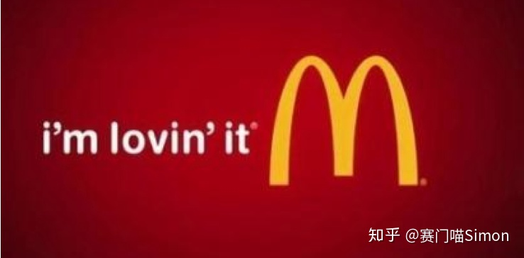

# 文法俱乐部3 - 静态动词
@(哦呵呵)[Toastmasters, Word of the Day, 旋元佑, 文法俱乐部]

[toc]

* [文法俱乐部3 \- 静态动词](#文法俱乐部3---静态动词)
  * [1\. Overview](#1-overview)
  * [2\. 我的女神](#2-我的女神)
  * [3\. 静态动词](#3-静态动词)
  * [4\. 想不到吧](#4-想不到吧)
    * [4\.1 语法是对语言的抽象](#41-语法是对语言的抽象)
  * [5\. 改错题](#5-改错题)
    * [5\.1  I've been loving chocolate since childhood](#51--ive-been-loving-chocolate-since-childhood)
    * [5\.2 不及物动词，没有被动语态](#52-不及物动词没有被动语态)
  * [6\. References &amp; Connection](#6-references--connection)
  * [7\. 文档修订记录](#7-文档修订记录)

## 1. Overview

- **action verb**: 行为动词;  动作动词;  实义动词

## 2. 我的女神

当年上高中的时候，我刚学会了现在**完成进行时**，表示过去做一件事情，现在还在做，将来还会做。于是兴奋之余，课堂上给女神递了个小纸条，上面写着:
> I have been loving you for 3 years.

半响，女神冷冷的递回一张纸条,赫然写着:
> 动词love是静态动词，没有ing形式

看了很久我没看懂，于是我又问她如果要改成正确的要怎么改，她说：
> **I wish you have been my love since 3 years ago**.
> 
> 或者
> 
> **I have been in love with you for 3 years**.

自尊心受挫的我，一咬牙就从此不和女神说话，发誓暗暗要学习超过她。

一晃多年，她去大学当了老师，我每个月都要去看守所签到，这里的小姐姐个个都是人才，说话又好听，超喜欢在里面的感觉。

## 3. 静态动词

英文动词当中有一批相当「名不符实」，虽然叫做动词却并没有「动作」在里头。真正名符其实的动词如hit, kill, eat, run, talk, jump, swim等等，代表的都是某种「动作」。以传统文法的分类来说，这种「动态」的动词才能够有所谓的「进行式」，也就是说只有动态动词才适合加上-ing字尾变成现在分词、用来表示「正在做」或「一直在做」某个动作。例如：

- He is eating breakfast now.
- The dog was swimming toward the shore then.

如果依照传统文法的诠释:
 - 第1句的动词是is eating、「现在进行式」；
 - 第2句的动词是was swimming、「过去进行式」。

关键在于eat和swim都是属于「动态动词」、代表的是「动作」，所以才可以有进行式，表示「正在做」或「一直做」这个动作。

简单化的看法是：
- 第1句的动词是is、现在简单式，后面的eating breakfast是现在分词词组，当形容词补语使用，表达出进行状态、解释为「正在吃早饭」，修饰主词he。
- 第2句的动词是was、过去简单式，它后面swimming toward the shore这个现在分词词组当形容词补语看待，表达出进行状态，意思是「正在朝岸边游」，修饰主词the dog。

关键在于：表示「动作」的动态动词如eat与swim等等才可以有现在分词的形容词eating与swimming、表示这个动作「正在进行中」。

反之，如果动词是「静态动词」、并不代表「动作」，自然也就没有所谓的「正在做」或「一直做」的进行状态可言。因此，以传统文法的角度来说：静态动词不能用于进行式。换言之，**静态动词不适合加上-ing字尾成为现在分词的形容词**。

## 4. 想不到吧

然而我还是找到了一首歌曲叫《[I've Been Loving You Too Long](https://en.wikipedia.org/wiki/I%27ve_Been_Loving_You_Too_Long)》,是一个叫[Otis Redding](https://en.wikipedia.org/wiki/Otis_Redding "Otis Redding") 的美国黑人歌手兼歌词家的作品。

你可以[猛击这里](https://www.azlyrics.com/lyrics/ledzeppelin/sinceivebeenlovingyou.html)收听这首歌。

You know, we really don't advise lyrics for grammar points. It's a song, the writers do things to suit the music not grammar.

The point here is that "love" is a **stative verb**. If you look at the British Council Learn English site [here](http://learnenglish.britishcouncil.org/en/grammar-reference/stative-verbs), you'll see that stative verbs are *"not usually used in the continuous form, even when we are talking about temporary situations or states ..."*\
So strictly speaking, you are correct, but as suzi says, we can sometimes use them to** stress** that the action (even of a stative verb) is - or has been - in progress, and this is actually one of the trends in the way the use of English is developing.

If you look at [this](http://forum.wordreference.com/showthread.php?t=2771585) grammatically related thread, is very informative on the point you're querying here.

Then, as suzi also says, people who write poetry or music lyrics use all kinds of poetic licence to play around with the conventions of language, often to suit the rhyme or metre of their line, so expect the unexpected.

[Ed: if you want to find out more, there's a Polish research paper on it [here](http://ifa.amu.edu.pl/psicl/files/38/10Smiecinska.pdf) (pdf file): 'Stative Verbs and the Progressive Aspect in English', Joanna Smiecinska, Poznan Studies in Contemporary Linguistics 38, 2002/2003 pp 187-195.]

### 4.1 语法是对语言的抽象

语法是对语言的抽象，是从日常用语中凝练出来的公式规则。但语言五花八门，并不断演化，所以语法规则肯定无法涵盖所有的语言现象。

因此，[语法规则往往只意味着「99%的情况都这么说」](https://www.zhihu.com/question/30030877/answer/1449871589)，不包含那1%的罕见说法。比如麦当劳的广告语「I’m loving it」铺天盖地地出现在广告板上，但语法上是讲不通的，因为这不符合英语世界的表达习惯。

所以学习语法，是为了理解99%的表达逻辑。但又不能完全仰仗语法，因为语法正确不等于表达地道。

## 5.  You are being rude.

参考：[You are being rude. Being 到底是个什么东西？](https://zhuanlan.zhihu.com/p/26797446)

### 5.1 态的概念

以**eat**例子，讲述动词的四个**态**.

我们现在用动词**be**代替上图中的eat如下图：

我们可以看出being就是动词原形be的进行态而已，那么文首的句子也就是由being构成的进行时态:

You are being rude.

**谓语动词（are being） = 时间助动词（are） + 状态主动词（being）**

### 5.2 常态 v.s 进行态

我们讲过**常态**和**非常态/进行态**概念的区别，常态为长期不变的动作状态，反之，不是长期不变的就是非常态/进行态。

如： 

- You are rude. 你很粗鲁。（你的性格就是鲁莽，长期不变。）
- You are being rude. （你（最近）很粗鲁，原来不是这样的。)
- You are being funny. 你在搞笑。
- You are being silly. 你傻啦。
- You are just being sweet. 你只是甜言蜜语而已。

### 5.3 作为进行时代被动态的助动词

being 还有一些其它用法，如用于**进行时态的被动**等，就是作为进行时态的**助动词**之用，而不是主动词之用了。

- An interesting experiment is being tried by Prof. Zhou. 周教授正在做一项有趣的试验。
  - **谓语动词（ is being tried） = 时间助动词（is） + 状态主动词（being tried）**
  - **状态主动词（being tried） = 被动助动词（being) + 完成态主动词（tried)**

## 6. 改错题

### 6.1  I've been loving chocolate since childhood

[Question about English (UK)](https://hinative.com/en-US/questions/1665624)

> Is this grammatically correct: **I've been loving chocolate since childhood**

**Answer**:

Mmm I don't think so. "**I've loved chocolate**" makes more sense. 

I think "**I have been doing/I have been..."** **`only works with an action`**.

eg:
-  I've been playing the guitar for a while now.
-  I've been playing football since I was a child.

We would say
- **I have loved chocolate since childhood**
 or 
- **I've been a lover of chocolate since I was a child**
or
- **I have been in love with chocolate since childhood**

### 6.2 不及物动词，没有被动语态

An error has been occurred when the system was trying to parsing of a resource 

- **`occur是不及物动词，没有被动语态`**。

  

  It appears you have attempted to use the **intransitive verb** *occurred* in a **passive voice** construction. Consider writing the sentence in the active voice.(你似乎试图使用被动语态结构中的不及物动词。考虑用主动语态写句子。)

- try 是加to do sth.

> Something unexpected occurred. 这里的occured后面没有接宾语，因为是不及物动词。

## 7. References & Connection
1. [【推荐阅读】Since I've been loving you/Since I've loved you](https://forum.wordreference.com/threads/since-ive-been-loving-you-since-ive-loved-you.2778264/)
2. [【推荐阅读】关于静态动词和动态动词，以及延续性动词和短暂动词](http://ask.yygrammar.com/q-40318.html)
2. [“I've been loving you” is not a formal English --Stackexchange](https://ell.stackexchange.com/questions/132588/ive-been-loving-you-is-not-a-formal-english)
3. [Stative verb -- Wikipedia](https://en.wikipedia.org/wiki/Stative_verb)
4. [Is this grammatically correct: I've been loving chocolate since childhood](https://hinative.com/en-US/questions/1665624)
5. [(How many years) have you been married?/studying English? -- Stackexchange](https://ell.stackexchange.com/questions/14323/how-many-years-have-you-been-married-studying-english?rq=1)
6. [I've Been Loving You Too Long --Wikipedia](https://en.wikipedia.org/wiki/I%27ve_Been_Loving_You_Too_Long)
7. [静态动词、终结性动词和非终结性动词的理解 -- 英语答疑网](http://ask.yygrammar.com/q-33262.html)

## 8. 文档修订记录

| 版本号|     变化状态|   简要说明|  日期	|   变更人/参与者   |
| :-------- | :--------| :------ |:------ |:------ |
| V1.0|   建立| 新建文档 |2020-10-7  | Lee|
| V1.1|   增加|新增`Overview`环节 |2020-10-8  | Lee|

*变化状态：建立，修改，增加，删除