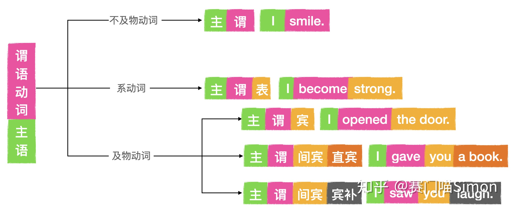
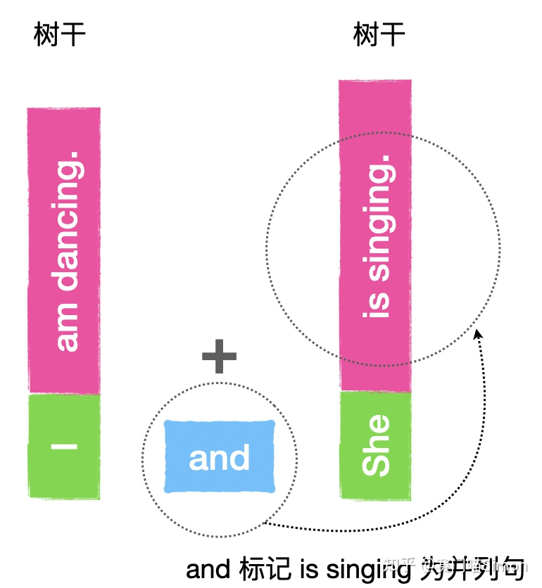
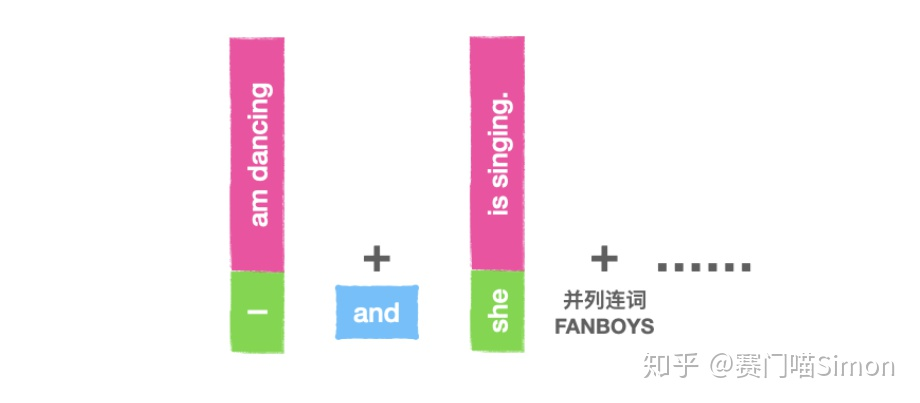
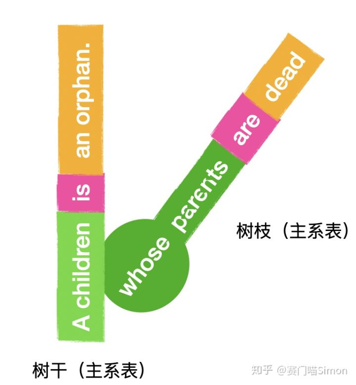
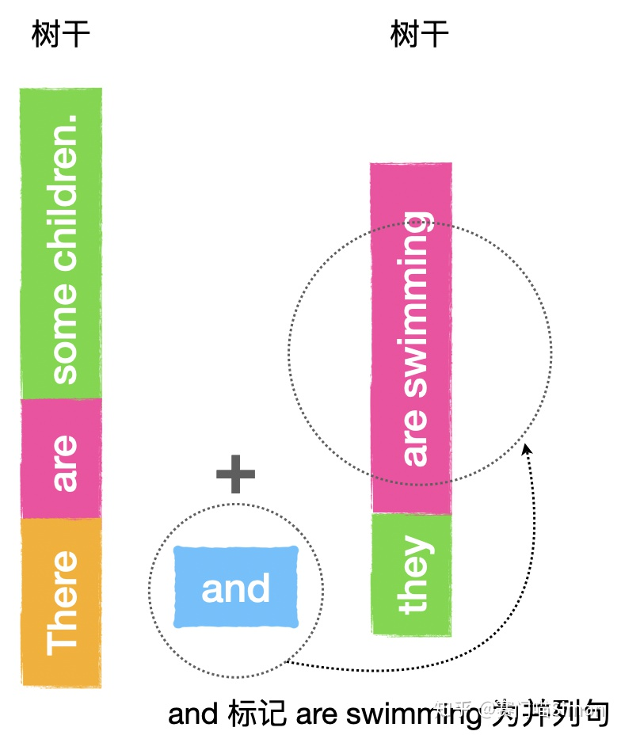
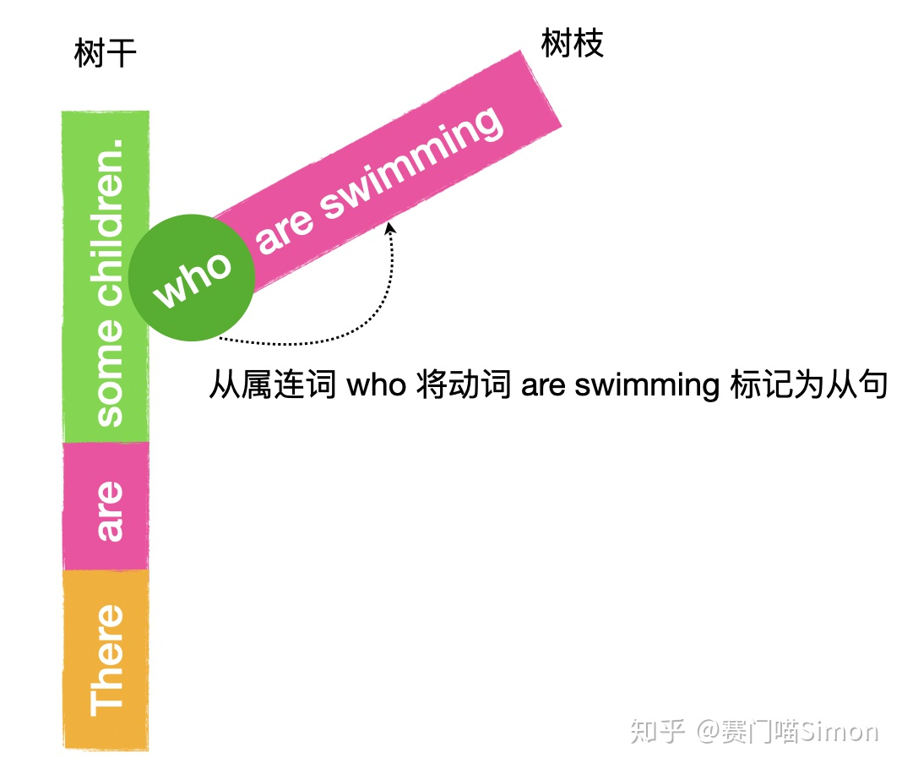
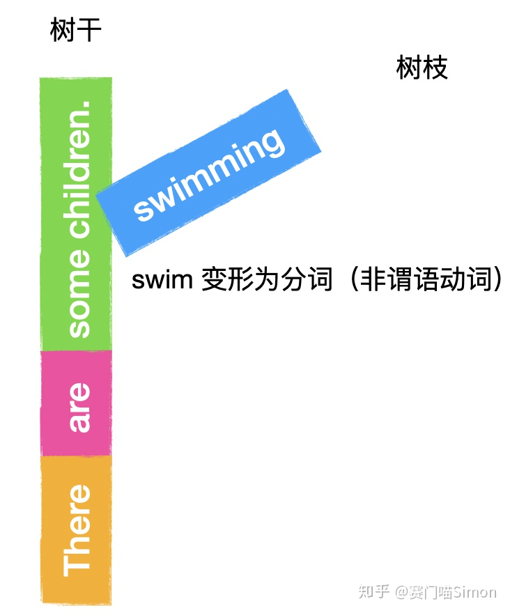
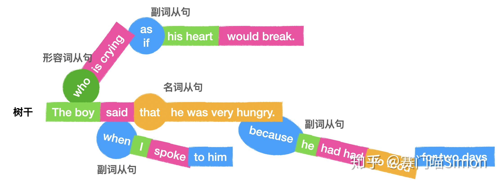

# 文法俱乐部4 - 语法是英语的标记语言
@(哦呵呵)[Toastmasters, Word of the Day, 旋元佑, 文法俱乐部]

[toc]

* [文法俱乐部4 \- 语法是英语的标记语言](#文法俱乐部4---语法是英语的标记语言)
  * [1\.  语法是英语的标记语言](#1--语法是英语的标记语言)
  * [2\. 简单句](#2-简单句)
  * [4\. 复杂句](#4-复杂句)
    * [4\.1 限定从句与非限定从句](#41-限定从句与非限定从句)
    * [4\.2 When引导的时间状从 v\.s 定从](#42-when引导的时间状从-vs-定从)
  * [5\. References &amp; Connections](#5-references--connections)
  * [6\. 文档修订记录](#6-文档修订记录)


> [本文](https://www.zhihu.com/question/30030877/answer/1449871589)2239个字，阅读大约5分钟。耐心看完，绝对可以建立起一个清晰的语法脉络。

相比汉语，英语的语法规则其实真的是非常非常简单哒。通过很短时间建立起一个语法框架真的是一件人人都可以完成的事。

## 1.  语法是英语的标记语言

语法是对语言的抽象，是从日常用语中凝练出来的公式规则。但语言五花八门，并不断演化，所以语法规则肯定无法涵盖所有的语言现象。


因此，语法规则往往只意味着「99%的情况都这么说」，不包含那1%的罕见说法。比如麦当劳的广告语「I’m loving it」铺天盖地地出现在广告板上，但语法上是讲不通的，因为这不符合英语世界的表达习惯。

所以学习语法，是为了理解99%的表达逻辑。但又不能完全仰仗语法，因为语法正确不等于表达地道。

首先，什么是语法？**英语形式和意义高度统一，即「形意结合」**

刘美君教授说，**语法规则是一套标记系统**。

> Dog run**s**.
> Dog**s** run.

一个s， 要么在前，要么放在后，语法叫主谓一致。但底层逻辑就是：**s** 就是一个记号，用来明确标记主语是复数（在前）还是单数（在后）。

用这种视角理解语法：

- 用助动词不同形式来明确标记事情发生的时间。
- 用动词的非谓语形式来明确标记动作的状态。
- 用情态动词来标记事实还是想象。
- ......

好了，总结一下，英语要求「形意结合」，句子的意思（时间、状态、人称、虚实……）要和形式（时态、从句、虚拟语气……）一一对应。你学的越多，对这一点的体会就会越来越深刻。

## 2. 简单句

为了便于理解，我们当然是用图文结合的方式来学习啦。

所有的英语句子都必须有主谓结构：


用一句话概括：**一个英语句子有且仅有一个主谓结构**。

复旦大学语言学家申小龙教授说过，英语的句子好似一棵大树。这棵树的「树干」就是谓语动词。动词的不同，决定了树干是不是有宾语、有什么样的宾语。就有了5种简单句，如下图。





聪明的你一眼就明白，如果把图中宾语看成谓语动词的一部分，那么**这5种简单句本质上没啥区别：它们都只有一个谓语动词。如果从「树」的角度理解，简单句就是一棵只有树干，没有任何树枝的树**。

## 3. 并列句

明白了简单句，你会发现任何复杂的英语句子不过就是这5种简单句的**引申**和**排列**。

比如下面两个简单句：

> I am dancing.
> She is singing.

怎么把它们连起来形成一个句子？最简单的，就是通过一个并列连词 and：
> I am dancing **and** she is singing.

如果画成树就变成了：





简单句只包含一个谓语动词。如果要增加谓语动词，就必须通过并列连词，并列连词的个数和**增加的**谓语动词数量是一致的。用公式来表达，在并列句中：

```
并列连词数量 = 增加的谓语动词数量 = 总谓语动词数量 - 1
```

聪明的你又会发现，之所以叫并列连词，是因为其前后的谓语动词是并列关系。你可以去掉一个连词和一个句子，只要满足上述公式，剩下的句子依然语法正确。


英语中的并列连词包括但不限于
- and
- but
-  for
-  nor
-  or
-  so
-  yet

它们的首字母组成了FANBOYS，便于记忆。只要满足上述等式关系，理论上我们可以通过并列连词增加无数个谓语动词（树干），如下图：




从树形图理解，并列连词就是把简单句（树干）连接起来了。这就像一片刚栽起的苗圃，一个个的树干都是并列关系。

这里要特别强调一下哦。并列连词可以连接多个谓语动词（树干），但**属于并列关系的谓语动词，无论有多少个，统统都只算一个主谓结构。** 这样，无论有多少个并列句，都可以满足「一个英语句子有且仅有一个主谓结构」的规定啦。


刚才说了并列连词，大家都明白，还有一类叫从属连词。这名字起的太形象了，我们来看看从属连词形象在哪里？

## 4. 复杂句

我们一直在说树干，但三岁小朋友都明白，一棵树不可能只有树干，还应该有很多树枝。这些树枝搭架在树干上，层层叠叠，就形成了高阶复杂的长难句。

```
复杂句 = 树干 + 从句（树枝）
```

看两个简单句：
> A child’s parents are dead.
> A child is an orphan.

根据逻辑关系，这句话可以写成一个定语从句：

> A child **whose** parents are dead is an orphan.

用树表示：




你看，从属连词 whose 让其后面的句子变成树枝，从而保证句子只有一个树干（谓语动词）。

顺着这个思路往下分析，你会发现英语句子真是的太奇妙啦！

如果没有并列连词，句子只能有一个谓语动词。这个句子的谓语动词显然就是 A child is an orphan中的 is。那么问题来了，我们怎么看待树枝中的 are 呢？它属不属于谓语动词呢？

答案是不属于。虽然 are 是从句的谓语动词，但从整个句子的角度看，它并不是谓语动词。因为在没有并列连词的情况下，整个句子就只能有一个谓语动词 is，所以就只能通过 whose 将后面的 are 「标记」为从句，相当于把 are 降级了，让它**从属**于主句，这也就是我们常说的「主从分明」。

到这里，我们就有必要总结一下上面的知识了。非常重要哦！

简单句只有一个谓语动词。而如果我们需要增加动词时，只能通过以下三种方式：

1. **并列连词，构成并列句**
2. **从属连词，构成从句**
3. **非谓语动词**

看两个简单句：
> There are some children in the pool.
> Some children are swimming in the pool.

1. 并列连词：There **are** some children in the pool **and** they **are swimming**.




你看，当有两个谓语动词时，其中一个必须和 and 配对形成并列句。and 就是标记并列关系的「记号」。如果把 and 去掉，这句话就语法错误，因为一个句子不能有两个非并列关系的谓语动词。

2. 从属连词：There are some children **who are swimming** in the pool.




虽然都是谓语，但待遇不同啊。are swimming 被 who 标记为树枝，依附于树干，这才满足「一个句子只有一个主谓结构」的规则。

如果我们将树干去掉，剩下的树枝 who are swimming 不能成句。反过来，去掉树枝，树干是可以单独成句的。

3. 非谓语动词：There are some children **swimming** in the pool.




动词的非谓语形式swimming本身就是标记。

长难句，说白了，就是上面三种句型的随意组合。我们要做的，就是根据「标记」找出句子的树干和树枝，这样就没有读不懂的句子了。

> The boy, who is crying as if his heart would break, said, when I spoken to him, that he was very hungry because he had had no food for two days.

用一样的思路拆解：




冗长的句子是不是一下子清晰了很多？

-----------------

| 奇怪的知识|    又增加了| 
| :-------- | --------:| 
|名词从句 | 宾语从句| 
| 形容词从句|   定语从句|
| 副词从句|   状语从句|  

### 4.1 限定从句与非限定从句

所谓限定从句，指的是具有**`限定动词`**在内的从句，**而限定动词就是具备了人称变化、时态变化等等**，可以用来制造一个**`完整单句的动词`**。

至于非限定动词，指的是像**现在分词、过去分词、动名词、不定式等等在传统文法中称为动状词的东西**。从句当中如果只有非限定动词，就称为非限定从句。例如：

> He <u>understands</u> that he <u>did</u> the wrong thing then.

这个句子当中有两个从句。He understands … 是个限定从句，因为它里面有限定动词understands（第三人称单数、现在简单式）。He did the wrong thing then也是个限定从句，因为它里面有限定动词did（过去简单式）。

比较一下底下这个例子：
> He <u>hates</u> his girlfriend’s <u>spending</u> so much time on makeup every day.

这个句子只有一个限定从句，就是He hates …，因为它里面**有限定动词hates**（第三人称单数、现在简单式）。至于his girlfriend’s spending so much time on makeup every day，这个部分则是个**非限定从句**，因为**它只有非限定动词spending（动名词）**。


再比较：
-  He is a gentleman, who never breaks his word. (非限定从句)
-  He is a gentleman who never breaks his word.（非限定从句）

### 4.2 When引导的时间状从 v.s 定从

**Axure’s repeater widget is often the last thing prototypers learn [when approaching](https://medium.com/@jebsphone/understanding-axures-repeater-widget-79e08688783a) the product.** 

-  这是When引导的时间状语从句
-  这里省略了主语和be动词。**`当从句的主语与主句的主语一致时，从句中的主语和be动词通常可以省略`**
-  完整的全句是Axure's repeater widget is often the last thing prototypers learn when (the widget is) approaching the product.
-  这里不能算是**非谓语动词**；只有把**连接词**也省略的情况下才算非谓语动词。

**I will never forget the days when (in which) we shared all the roses and thorns.**

- 如果是when（[关系副词](https://www.hjenglish.com/new/p1166561/)）引导的定语从句那必定有个先行词，比如the days, moments
- 即：从句的现行词一般都是表示时间的名词
- When引导限定性定语从句是对先行词进行修饰限定，在语法功能上就是一个定语。

## 5. References & Connections

作者：赛门喵Simon
链接：https://www.zhihu.com/question/30030877/answer/1449871589
来源：知乎
著作权归作者所有。商业转载请联系作者获得授权，非商业转载请注明出处。


## 6. 文档修订记录

| 版本号|     变化状态|   简要说明|  日期	|   变更人/参与者   |
| :-------- | :--------| :------ |:------ |:------ |
| V1.0|   建立| 新建文档 |2020-9-11  | Lee|
| V1.2|   删除| 区分when引导的时间状语从句 与 定语从句 的区别  |2020-4-21  | Lynn.Jiang|