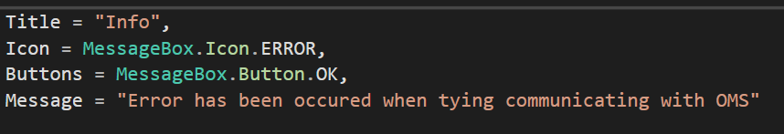

# 文法俱乐部5 -  动词时态 (tense/aspects)(9)
@(哦呵呵)[Toastmasters, Word of the Day, 旋元佑, 文法俱乐部]

[toc]

* [文法俱乐部5 \-  动词时态 (tense/aspects)(9)](#文法俱乐部5----动词时态-tenseaspects9)
  * [动词时态 (tense/aspects)(9)](#动词时态-tenseaspects9)
    * [1\. 完成时](#1-完成时)
    * [2\. 完成式](#2-完成式)
      * [过去时间](#过去时间)
      * [现在时间](#现在时间)
      * [未来时间](#未来时间)
  * [3\. 合句 (16) [分词\-简化从句\-fei]](#3-合句-16-分词-简化从句-fei)
    * [3\.1 限定从句与非限定从句](#31-限定从句与非限定从句)
    * [3\.2 句子的三种层次](#32-句子的三种层次)
      * [初级：单句](#初级单句)
      * [复合句](#复合句)
      * [高级：减化从句](#高级减化从句)
    * [3\.3 并列从句](#33-并列从句)
      * [关联词的倒装](#关联词的倒装)
    * [3\.4 并列从句的省略](#34-并列从句的省略)

## 动词时态 (tense/aspects)(9)

英文动词的时态，可以分成现在、过去、未来等三种时间（times），简单式、完成式、进行式、完成进行式等四种状态（aspects）。如果再加上主动、被动两种语态（voices），那么动词时态变化多达24种。扣掉一、两种很少使用的，实际上经常用到的时态也有22至23种之多。

### 1. 完成时

### 2. 完成式

#### 过去时间

#### 现在时间 
We've listened to your great feedback on our mapping page, and have made it easy for you to see if you've changed your field settings to Hard-coded, Lookup, or Multi-expression.

An error occurred during the parsing of a resource required to service this request.

[动词的语义分类](http://ask.yygrammar.com/q-40318.html)(动态、静态、延续、短暂、终结性、非终结性）与时态有着密不可分的关系，直接影响动词时态的选用。例如，静态动词（或者动词的静态意义）不可用进行体。延续性动态动词不可以用一般现在时表示说话时发生的事件。

#### 未来时间

## 3. 合句 (16) [分词-简化从句-fei]

### 3.1 限定从句与非限定从句

如果有两个以上的单句写在同一个句子里面，那么里面的每一个单句都称为「从句」（clause）。从句可分成限定从句（finite clause）与非限定从句（nonfinite clause）两种。

所谓限定从句，指的是具有**`限定动词`**在内的从句，**而限定动词就是具备了人称变化、时态变化等等**，可以用来制造一个**`完整单句的动词`**。

至于非限定动词，指的是像**现在分词、过去分词、动名词、不定式等等在传统文法中称为动状词的东西**。从句当中如果只有非限定动词，就称为非限定从句。例如：

> He <u>understands</u> that he <u>did</u> the wrong thing then.

这个句子当中有两个从句。He understands … 是个限定从句，因为它里面有限定动词understands（第三人称单数、现在简单式）。He did the wrong thing then也是个限定从句，因为它里面有限定动词did（过去简单式）。

比较一下底下这个例子：
> He <u>hates</u> his girlfriend’s <u>spending</u> so much time on makeup every day.

这个句子只有一个限定从句，就是He hates …，因为它里面**有限定动词hates**（第三人称单数、现在简单式）。至于his girlfriend’s spending so much time on makeup every day，这个部分则是个**非限定从句**，因为**它只有非限定动词spending（动名词）**。

### 3.2 句子的三种层次

英文句子可以分成三个层次：初级的单句、中级的复合句、以及高级的减化从句。单句必须是限定从句。复合句则是由两个以上的限定从句经由连接词的连接而构成。减化从句则是在复合句当中尽量只留下一个限定从句、其余的尽可能改写为非限定从句。

#### 初级：单句

> We are sitting here in the sun.
> 
> We can see snow-covered hills.

####  复合句

| 类型      |     句子 |   
| :-------- | :--------| 
| 合句|   We are sitting here in the sun （并列合句）, and we can see snow-covered hills.（并列合句）| 
|复句|As we sit here in the sun(从属从句), we can see snow-covered hills（主要从句）| 

#### 高级：减化从句

>  Setting here in the sun(非限定从句), we can see snow-covered hills.（限定从句） 

减化从句的特色在于：**省略掉所有重复与空洞的部分、大力压缩，尽量只留下一个限定从句、获得最精简的修辞效果**。

不过，高级的减化从句必须建立在中级的复合句基础上，正如中级的复合句必须建立在初级的单句基础上。这一章我们先来处理合句，也就是由并列从句（**coordinate clauses**）构成的句子。

------------------

- Something [generating the track url](https://nhservices-review.eliteextra.com/x/api/track/N00000000000000185102) went wrong.
- Something went wrong generating the track url.
> generating the track url 动名词修饰主语Somthing, 这是**简化从句**，是一种高级写法。

### 3.3 并列从句

#### 关联词的倒装

对等连接词的关联词有时可用在倒装句中，这时候得特别注意对称的要求，例如：

> China is not <u>only the world's most populous state but also the largest market in the 21st century </u>.

本句中用到的对等连接词关联词是not only A but also B，在句中A是the world’s most populous state，B是the largest market in the 21st century，两个都是名词词组、符合对称的要求。

这个句子还可以选择把not only移到句首、**以倒装句的方式来`加强语气`**。但是这样做的时候很容易产生如下的错误：

| A|      Not only is China the world's most populous state|  
| :-------- | :--------|
| B|   but also the largest market in the 21st century.（误）| 

像not only A but also B之类的对等连接词关联词，在对称方面的要求更为严格：**A与B必须对称**。

上面那个句子因为把not only移到句首变成了倒装句，造成的结果是not only与but之间（A部分）变成一个完整的***限定从句***（is China the world’s most populous state）。但是but的右边（B部分）却仍然只是一个***名词词组***（the largest market in the 21st century），所以A与B并不对称。应该把右边也改写为完整的限定从句才符合对称的要求，如下：

| A|  Not only is China the world's most populous state | 
| :-------- | :--------|
| B|but **it is** also the largest market in the 21st century.| 

请注意：also的位置不一定要和but放在一起。also和only一样，是强调范围的副词(focusing adverb)。**Not only强调中国是「世界人口最多的国家」，also则是要强调中国还是「21世纪最大的市场」，所以右边应该把also放在the largest market前面最恰当。**

### 3.4 并列从句的省略

用对等连接词连接的并列从句，因为必须对称所以经常会有重复的部分。想要避免重复的话，最常用的手段就是省略掉重复的部分，这又是一个写作时容易出错的地方。

对等连接词本身固然很单纯，但它在句中的运用却是变化万千。写作时凡是用到对等连接词都要特别小心，尤其是「对称」的要求不得马虎。以下几个例子都有省略不当的错误，请读者仔细观察。

After years of hard work, <u>spring floods and summer droughts</u>(S:主语) <u>have not been<u> eliminated from this area.
