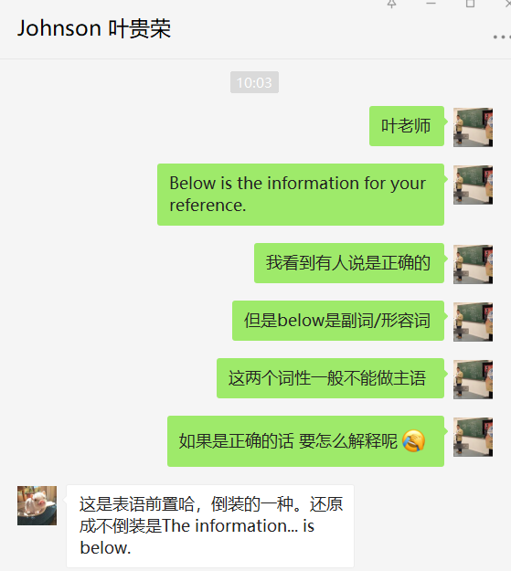
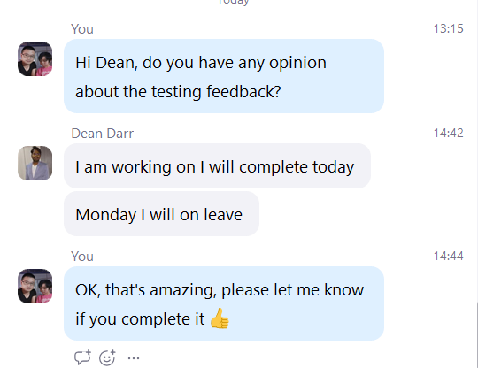
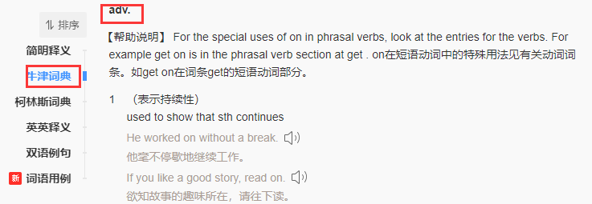
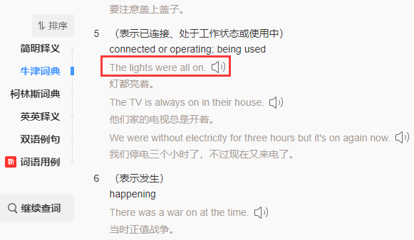
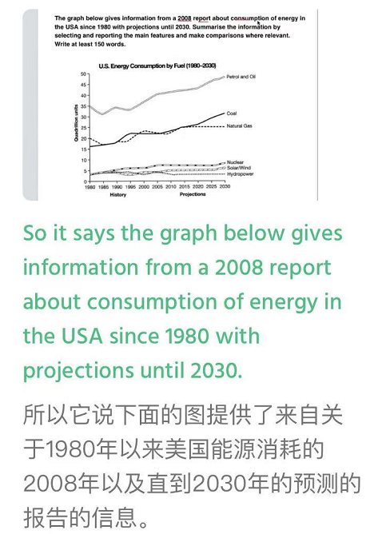
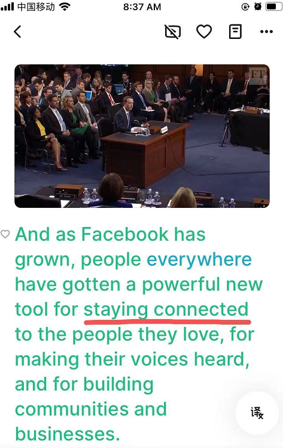

# 文法俱乐部7 - 表语（补语）前置: 从 Below is the xxx 说起
@(哦呵呵)[Toastmasters, Word of the Day, 旋元佑, 文法俱乐部]

[toc]

* [文法俱乐部7 \- 表语（补语）前置: 从 Below is the xxx 说起](#文法俱乐部7---表语补语前置-从-below-is-the-xxx-说起)
  * [2\. 表语 v\.s 补语](#2-表语-vs-补语)
  * [3\. 副词是否可以做表语](#3-副词是否可以做表语)
  * [4\. the information below v\.s the below information](#4-the-information-below-vs-the-below-information)
  * [5\.  系表结构高级用法](#5--系表结构高级用法)
  * [6\. Reference &amp; Connection](#6-reference--connection)
  * [7\. 文档修订记录](#7-文档修订记录)

## 1.  什么是表语

- 百度百科[提到](https://baike.baidu.com/item/%E8%A1%A8%E8%AF%AD/2017501?fr=aladdin)，表语是表明主语的身份、特质、品质、特征和状态的，表语位于系动词之后。

- 表语是补语的一种。表语对应的英文是**[Predicative](https://fanyi.baidu.com/#en/zh/predicative)**,牛静字典的解释是：

  > Coming after a verb such as be, become, get, seem, look. Many adjectives,  for example, old can be either predictive as in The man is very old, or attributive as in an old man. Some, like asleep, can only be predictive.

- 表语英语为predicative，有表示判断的意思，是英语特有的句法成分，在早期汉语语法著作里曾被引入过，叫做表词，表是“表态”的意思，特指来描述主语的特征和性质，后来发现台湾地区的汉语句法里仍然保留了该称谓。

## 2. 表语 v.s 补语 

**`表语 v.s 补语 （predicative v.s complement）`**

- 似乎在台湾那边，没有所谓的表语一说。台湾那边表语统称为补语。至少在旋元佑的语法书里面，没有单独提到表语的，都是归类在了补足语里面说明。
- 在旋的语法书上的第四章提到**Predicative adjectives**翻译成了 ***补语位置的形容词***，我们更多翻译成***表语形容词***。
- 在第一章的有一个章节是**补语的词类**，提到了补语的类型，分为名词补语、形容词补语、时间副词补语、地方副词补语和介词补语，按照大陆习惯都应该翻译为表语。

## 3. 副词是否可以做表语

 

> I will be on leave during the week commencing 15 February. 《牛津高阶英汉双解词典》

根据知乎的这[篇文章](https://www.zhihu.com/question/370471953)可以知道，副词是可以做表语的：

副词可以做表语的，但此时，其意义**与介词有别**——独立，说明主语的方向，方位，地点，状态等，如：
- The light is on. （此时on 的意思：亮着；但介词是：在……上面）
- Class is over.（此时over的意思：完了，结束了；但介词是：在……上方）
- The girl is here.（here 没有介词：在这里）
- I think we must be off now.（此时off 的意思：离开；但介词是：从……离开）
- Is anybody in?（此时in 的意思：里面；但介词是：在……里面）

牛津词典上很清楚，有些副词是可以做表语的，比如on,off等：

The light is on.（ on 就是副词做 is 的表语）:

---------------------

**做表语的副词，都可以做介词: ** 

| adv.|     prep.|   
| :-------- | --------:| 
| the light is on. |    the light is on the desk.| 
|the light is off. |the light is off the table. |
|the movie is over. | the movie is over the hill. |

**不是介词的就不能做表语:**
the man is quickly. 错     

he is basically. 错。

### 既作副词又做介词的词叫小品词: 

> Particles(介副词): 有一种词类，看起来和介系词一模一样，但是后面却没有受词（宾语），而是直接当做副词使用。这种词类称为介副词（particles），应该当作副词看待
>  
>  In grammar, a particle is a preposition such as ‘into’ or and adverb such as ‘out’ which can combine with a verb to form a **phrasal verb**. 小品词(与动词构成短语动词的副词或介词)

 - up
 - down
 -  in
 - out
 - on
 - off
 - over
 - away 

等所有这些词的特点是，**`其实意思都是延续性的动词。`**

- He is up the hill.  
- She is down the hill. 
- I am away from you. 
- The light is on.  

中文中都是按照动词翻译。

## 4. the information below v.s the below information

> So it says **the graph `below`** gives information from a 2008 report about consumption of energy in the USA since 1980 with projections until 2030.

## 5.  系表结构高级用法

**这个 Stay 后面跟上过去分词是什么用法呢?** 

- 这是（把connect) 变成**形容词**（connected)，做***表语***；与**stay**构成系表结构. （2021-7-9）

## 6. Reference & Connection

1. [省略名词: 从 Please find the attached 说起](https://www.evernote.com/l/ALovu1DFfd1FPZfiOpk6_XiVTPqnIKGarmU/)
2. [表语前置: 从 Below is the xxx 说起](https://www.evernote.com/l/ALqIa0bSt0RDcZ2NHFg70hAdYQl3qlfQ2B4/)
3. [【精华】Which is correct: “the below information” or “the information below”? -- Stackexchange](https://english.stackexchange.com/questions/609/which-is-correct-the-below-information-or-the-information-below)
> 这篇文章的第三个答案提到了[Ngram](https://books.google.com/ngrams/graph?content=the%20below%20information,the%20information%20below&year_start=1940&year_end=2008&corpus=0&smoothing=3&direct_url=t1;,the%20below%20information;,c0;.t1;,the%20information%20below;,c0)，让我大开眼界
4. [Google Books Ngram Viewer](https://books.google.com/ngrams/graph?content=the%20below%20information,the%20information%20below&year_start=1940&year_end=2008&corpus=0&smoothing=3&direct_url=t1;,the%20below%20information;,c0;.t1;,the%20information%20below;,c0)
5. [标语前置-语法PPT](https://max.book118.com/html/2018/1024/7152154013001154.shtm)
6. [Google有哪些逆天的黑科技---知乎](https://www.zhihu.com/question/26166417/answer/32329856)
7. [工具 | 使用Google Ngram Viewer -- 简书](https://www.jianshu.com/p/285cc5ee8dde)
5. [Predicate vs Complement - What's the difference? -- Wikidiff](https://wikidiff.com/predicate/complement)
6. [副词可以作表语吗？--知乎](https://www.zhihu.com/question/370471953)

##  7. 文档修订记录

| 版本号|     变化状态|   简要说明|  日期	|   变更人/参与者   |
| :-------- | :--------| :------ |:------ |:------ |
| V1.0|   建立| 新建文档 |2021-1-26  | Lee|
| V1.1|   增加| 副词做表语的情况记录 |2021-1-29 | Lee|
| V1.2|   增加| 新增 Below做介词的描述章节 |2021-2-12 | Lee|

*变化状态：建立，修改，增加，删除