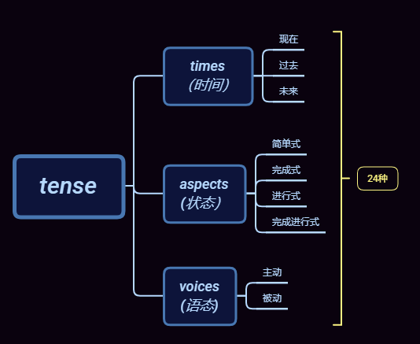
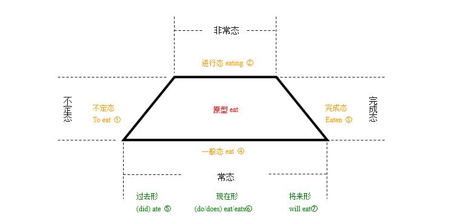
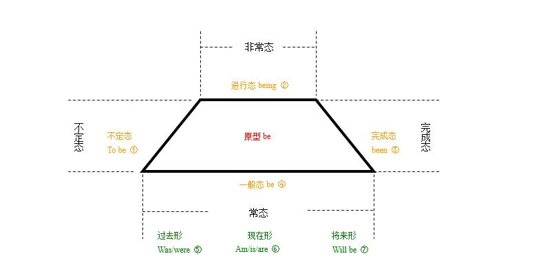
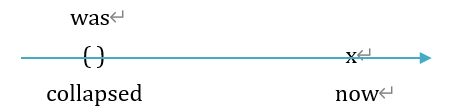
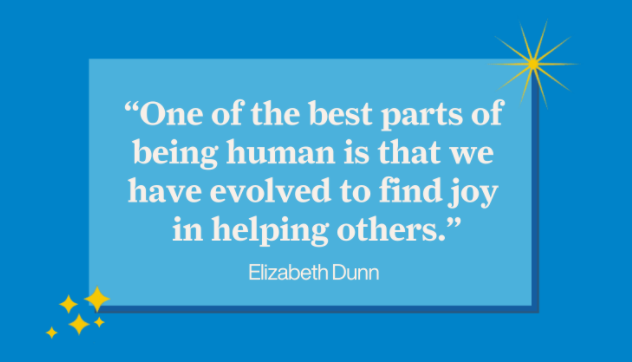

# 文法俱乐部9 - being的用法记录
@(哦呵呵)[Toastmasters, Word of the Day, 旋元佑, 文法俱乐部]

[toc]

* [文法俱乐部9 \- being的用法记录](#文法俱乐部9---being的用法记录)
  * [1\. 表达进行时态 表明动作正在发生](#1-表达进行时态-表明动作正在发生)
    * [1\.1 旋元佑的说法](#11-旋元佑的说法)
  * [2\. being\+ adj 做主/宾语。](#2-being-adj-做主宾语)
    * [2\.1  主语](#21--主语)
    * [2\.2 宾语](#22-宾语)
    * [2\.3  being \+ adj 是名词性，动名词（gerund)](#23--being--adj-是名词性动名词gerund)
  * [3\. 独立主格](#3-独立主格)
  * [4\. 符合with结构的句子](#4-符合with结构的句子)
  * [6\. References &amp; Connection](#6-references--connection)
  * [7\. 文档修订记录](#7-文档修订记录)

## 1. 表达进行时态 表明动作正在发生

英语中有“时态”(tense)的概念， 分别按照 时间(times)、状态(aspects)和语态(voices)三个维度划分出了24种不同的时态。

大部分动词也会根据时态而调整不同的形态，比如eat这个词就有：
- 一般态 （常态为长期不变的动作状态）
- 非常态
- 不定态
- 完成态

四个维度。（参考来源：[You are being rude. Being 到底是个什么东西？ - 英语思维的文章 - 知乎](https://zhuanlan.zhihu.com/p/26797446)）

我们现在用动词be代替上图中的eat如下图

由此可见，我们可以看出being就是动词原形be的进行态而已，那么以下这些句子也就是由being构成的进行时态:

**谓语动词（are being） = 时间助动词（are） + 状态主动词（being）**

- Glitch is a pretty new word, introduced in the 1960s when the science and technology of space flight was being developed. 
- You are being rude.

比较下面两句翻译：
- You are rude. 你很粗鲁。 （解释：你的性格就是鲁莽，长期不变。）
- You are being rude.（解释：你（最近）很粗鲁，原来不是这样的。）

- You are being contacted by an automated emergency voice service on behalf of a caller. 

### 1.1 旋元佑的说法

The house was being renovated when it collapsed on the workers.

## 2. being+ adj 做主/宾语。

being帮助其他修饰成分做成了主语宾语的主干成分。

- 这个句子的时间副词是when引导的那个副词从句，从句中过去简单式的动词collapsed显示它的时间是个过去的括号。所以，主要从句的动词也应该是过去简单式，因此就是was。
- 后面的分词词组being renovated含有现在分词being与过去分词renovated，整个分词词组当形容词补语使用、修饰主词the house。
- 现在分词being里面的be无意义、不须解释，字尾的-ing表达进行状态，因为是短时间所以解释为「正在」。
- 过去分词renovated表达被动语态、解释为「被翻修」。
- 整个词组being renovated仍视为现在分词词组，意思是「正在被翻修」。这就是一般文法书所谓的过去进行被动态。

> 第九章：动词时代 -简单式 -现代时间 - 几个常见的静态动词

### 2.1  主语

***形容词不能做主语***，因此下面这句话是不对的
- Peaceful is the key to learn GMAT. 

需要改成：
- Being peaceful is the key to learn GMAT.
> 如果改成Peace is the key to learn GMAT 感觉存在一些歧义，感觉是和平是学习的关键。或者改成 Inner peace is the key to learn GMAT.

- Being smart seems to make you unpopular.

這裡的「being」，是名詞詞性，動名詞。 

而且，在這個句子當中，**「being」是以「smart」做為 `補語 (complement)`**。如此構成的動名詞短語「being smart」，在"Being smart seems to make you unpopular."這個句子當中是做為句子的主語。

或者，反過來說，因為 「being smart」這个短語是這個句子的主語，所以它一定是名詞，動名詞(短語)。

「Being (smart)」 跟比如「Seeing is believing.」這句俗話當中的 seeing 和 believing，是相同的詞性，都是 名詞。動名詞。也跟下列各例句當中的smoking， playing (small)， owning (a stud) 和 (breeding racehorses), 的詞性，都一樣，都是 名詞。動名詞。
- **Smoking** is not good for your health.
- **Owning a stud** and **breeding racehorses** required an ample fortune.
- We ask ourselves, Who am I to be brilliant, gorgeous, talented, and fabulous? Actually, who are you not to be? You are a child of God. **Your playing small** does not serve the world.

### 2.2 宾语

 - An interesting experiment is being tried by Prof. Zhou
 > **谓语动词（ is being tried） = 时间助动词（is） + 状态主动词（being tried）**
 >  
 >  而： **状态主动词（being tried） = 被动助动词（being) + 完成态主动词（tried)**

- This message is being sent to you because you are a moderator of the group xxxx;

- Understanding the role of the protégé is fundamental to [being the best mentor you can be](https://toastmasters.csod.com/lms/scorm/clientLMS/ScormFrames.aspx?aicc_sid=AICCwXuR_e9bvwHQne-dFJXn7Z3RCTgPXvEJPEzXRdRQhFI&aicc_url=https://toastmasters.csod.com/LMS/scorm/aicc.aspx).

### 2.3  being + adj 是名词性，动名词（gerund)

> A gerund is a noun formed from a verb that refers to an action, process, or state. In English, gerunds end in 'ing', for example 'running and 'thinking'.

- We are currently investigating reports of customers **being unable to** access XX accounts.
- I am able to discuss skills I need to develop without being overly critical.
-  almost all orders being multiplied QTY twice have encountered an “Order allocation Response” error.
-  we haven’t found any other orders being overlooked by Automation.

只是隐隐然觉得 名词+ 动词+ed的句子感觉有点奇怪，说不上哪里不对。比如：
- We haven't found any other orders overlooked by Automation.
- Brightpearl **have been investigating** **`whether or not`** we are exposed to this problem since early this morning, and so far all evidence **points to** a very low risk **of this being an issue** for us.

## 3. 独立主格

Thirty-two per cent of all women are over-weight, the main culprits being the fats and sugar. (CCE) 百分之三十二的妇女超重，脂肪和糖是罪魁祸首。

**Reference:**

1. [独立主格结构的用法讲解--知乎](https://zhuanlan.zhihu.com/p/99343581)

## 4. 符合with结构的句子

## 5.  Seem / appear 的一些用法记录

- Her main occupation **[seems](https://mp.weixin.qq.com/s/U-24KvVutORhH_0CHYBNmg)** to be shopping. 逛街购物似乎是她的主要消遣。

- It **appears** you have attempted to use the **intransitive verb** *occurred* in a **passive voice** construction. Consider writing the sentence in the active voice

- She's always dieting but she never **seems** to lose any weight.

  > Please can we get off the subject of **dieting**.

## 6. References & Connection
1. [You are being rude. Being 到底是个什么东西？ - 英语思维的文章 - 知乎](https://zhuanlan.zhihu.com/p/26797446)
2. [Being + 形容词 的用法如何理解？其中的 being 是什么词性？ - sapereaude的回答 - 知乎](https://www.zhihu.com/question/49311081/answer/255054419)
3. [being正确的几种情况 - GMAT侯老的文章 - 知乎](https://zhuanlan.zhihu.com/p/70367055)
4. [【精华】Being + 形容词 的用法如何理解？其中的 being 是什么词性？ - sapereaude的回答 - 知乎](https://www.zhihu.com/question/49311081/answer/255054419)

## 7. 文档修订记录

| 版本号|     变化状态|   简要说明|  日期	|   变更人/参与者   |
| :-------- | :--------| :------ |:------ |:------ |
| v1.0 |   建立| 新建文档 |2021-3-25  | Lee|
| v1.1 | 新增 | 增加Seem的用法 |2021-11-23 | Lee |

*变化状态：建立，修改，增加，删除
