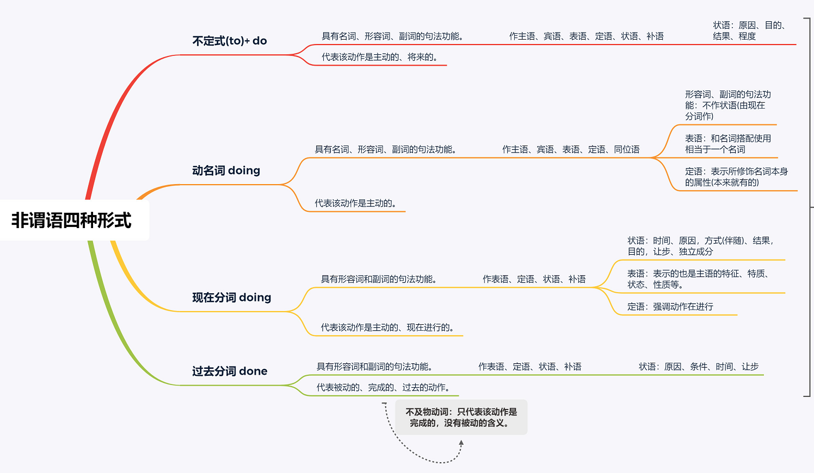
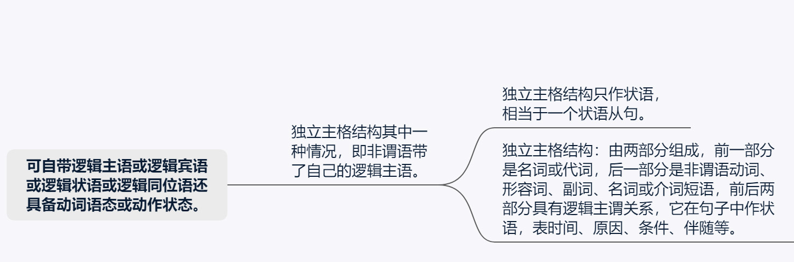
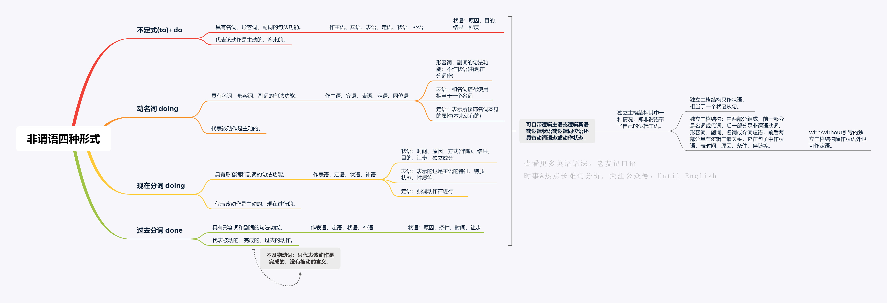
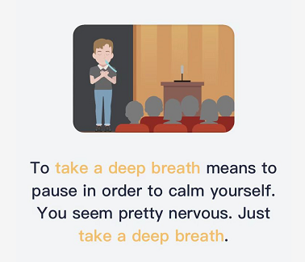

# 文法俱乐部9 - being的用法记录
@(哦呵呵)[Toastmasters, Word of the Day, 旋元佑, 文法俱乐部]

[toc]

## 1. 表达进行时态 表明动作正在发生

英语中有“时态”(tense)的概念， 分别按照 时间(times)、状态(aspects)和语态(voices)三个维度划分出了24种不同的时态。

大部分动词也会根据时态而调整不同的形态，比如eat这个词就有：
- 一般态 （常态为长期不变的动作状态）
- 非常态
- 不定态
- 完成态

四个维度。（参考来源：[You are being rude. Being 到底是个什么东西？ - 英语思维的文章 - 知乎](https://zhuanlan.zhihu.com/p/26797446)）

我们现在用动词be代替上图中的eat如下图

由此可见，我们可以看出being就是动词原形be的进行态而已，那么以下这些句子也就是由being构成的进行时态:

**谓语动词（are being） = 时间助动词（are） + 状态主动词（being）**

- Glitch is a pretty new word, introduced in the 1960s when the science and technology of space flight was being developed. 
- You are being rude.

比较下面两句翻译：
- You are rude. 你很粗鲁。 （解释：你的性格就是鲁莽，长期不变。）
- You are being rude.（解释：你（最近）很粗鲁，原来不是这样的。）

- You are being contacted by an automated emergency voice service on behalf of a caller. 

### 1.1 旋元佑的说法

The house was being renovated when it collapsed on the workers.

## 2. being+ adj 做主/宾语。

being帮助其他修饰成分做成了主语宾语的主干成分。

- 这个句子的时间副词是when引导的那个副词从句，从句中过去简单式的动词collapsed显示它的时间是个过去的括号。所以，主要从句的动词也应该是过去简单式，因此就是was。
- 后面的分词词组being renovated含有现在分词being与过去分词renovated，整个分词词组当形容词补语使用、修饰主词the house。
- 现在分词being里面的be无意义、不须解释，字尾的-ing表达进行状态，因为是短时间所以解释为「正在」。
- 过去分词renovated表达被动语态、解释为「被翻修」。
- 整个词组being renovated仍视为现在分词词组，意思是「正在被翻修」。这就是一般文法书所谓的过去进行被动态。

> 第九章：动词时代 -简单式 -现代时间 - 几个常见的静态动词

### 2.1  主语

***形容词不能做主语***，因此下面这句话是不对的
- Peaceful is the key to learn GMAT. 

需要改成：
- Being peaceful is the key to learn GMAT.
> 如果改成Peace is the key to learn GMAT 感觉存在一些歧义，感觉是和平是学习的关键。或者改成 Inner peace is the key to learn GMAT.

- Being smart seems to make you unpopular.

這裡的「being」，是名詞詞性，動名詞。 

而且，在這個句子當中，**「being」是以「smart」做為 `補語 (complement)`**。如此構成的動名詞短語「being smart」，在"Being smart seems to make you unpopular."這個句子當中是做為句子的主語。

或者，反過來說，因為 「being smart」這个短語是這個句子的主語，所以它一定是名詞，動名詞(短語)。

「Being (smart)」 跟比如「Seeing is believing.」這句俗話當中的 seeing 和 believing，是相同的詞性，都是 名詞。動名詞。也跟下列各例句當中的smoking， playing (small)， owning (a stud) 和 (breeding racehorses), 的詞性，都一樣，都是 名詞。動名詞。
- **Smoking** is not good for your health.
- **Owning a stud** and **breeding racehorses** required an ample fortune.
- We ask ourselves, Who am I to be brilliant, gorgeous, talented, and fabulous? Actually, who are you not to be? You are a child of God. **Your playing small** does not serve the world.

### 2.2 宾语

 - An interesting experiment is being tried by Prof. Zhou
 > **谓语动词（ is being tried） = 时间助动词（is） + 状态主动词（being tried）**
 >  
 >  而： **状态主动词（being tried） = 被动助动词（being) + 完成态主动词（tried)**

- This message is being sent to you because you are a moderator of the group xxxx;

- Understanding the role of the protégé is fundamental to [being the best mentor you can be](https://toastmasters.csod.com/lms/scorm/clientLMS/ScormFrames.aspx?aicc_sid=AICCwXuR_e9bvwHQne-dFJXn7Z3RCTgPXvEJPEzXRdRQhFI&aicc_url=https://toastmasters.csod.com/LMS/scorm/aicc.aspx).

### 2.3  being + adj 是名词性，动名词（gerund)

> A gerund is a noun formed from a verb that refers to an action, process, or state. In English, gerunds end in 'ing', for example 'running and 'thinking'.

- We are currently investigating reports of customers **being unable to** access XX accounts.
- I am able to discuss skills I need to develop without being overly critical.
-  almost all orders being multiplied QTY twice have encountered an “Order allocation Response” error.
-  we haven’t found any other orders being overlooked by Automation.

只是隐隐然觉得 名词+ 动词+ed的句子感觉有点奇怪，说不上哪里不对。比如：
- We haven't found any other orders overlooked by Automation.
- Brightpearl **have been investigating** **`whether or not`** we are exposed to this problem since early this morning, and so far all evidence **points to** a very low risk **of this being an issue** for us.

## 3. 独立主格语非谓语

> **独立主格结构=独立的主语+非谓语**

Thirty-two per cent of all women are over-weight, the main culprits being the fats and sugar. (CCE) 百分之三十二的妇女超重，脂肪和糖是罪魁祸首。

### 1. 独立主格结构的基本概念

独立主格是一个名词或代词（作为逻辑主语），加上一个形容词、副词、介词短语、分词、不定式等在句中作状语。它有以下三个特点：

1. 独立主格结构的逻辑主语与句子的主语不同，它独立存在。
2. 名词或代词与后面的形容词、副词、介词短语、分词、不定式等存在**逻辑上**的主谓关系。
3. 独立主格结构一般用**逗号**与主句分开，但与主句之间不能使用任何**连接词**。

### 2. 独立主格结构的基本形式

1. **名词（代词）+现在分词**
   - The question being settled, we went home. 问题解决之后，我们就回家了。
   - We shall play the match tomorrow, **weather permitting**. 明天假设天气好，我们就进行比赛。
   - The monitor being ill, we’d better put the meeting off. 班长病了，我们最好还是延期开会吧。
2. **名词（代词）+过去分词**
   - **The job finished**, we went home. 工作结束后我们就回家了。
   - **The last bus having gone**, we had to walk home. 最后一班公车已经走了，我们必须走路回家。
   - **More time given**, we should have done the job much better. 如果给我们更多的时间，我们会把工作做得更好。
3. **名词（代词）+不定式**
   -  Nobody to come tomorrow, we will have to put off the meeting till next week. 如果明天没有人来，我们将把会议推迟到下周。
   - So many people to help him, he is sure to succeed. 有如此多的人来帮助他，他一定会成功的。
4. **名词（代词）+介词短语**
   - The soldiers dashed in, **rifle in hand**. 士兵们端着枪冲了进来。
   - A girl came in, **book in hand**. 一个少女进来了，手里拿着书。
   - He was waiting, **his eyes on her back**. 他在等着，眼睛望着她的背影。
5. **名词（代词）+形容词或副词**
   - He sat in the front row, his mouth **half open**. 他坐在前排，嘴半开着。
   - She sat at the table, collar **off**, head **down**, and pen **in position**, ready to begin the long letter. 她坐在桌前，衣领已解掉，头低了下来，拿好钢笔，准备开始写一封长信。
6. **There being +名词（代词）**
   - **There being *nothing* else to do**, we went home. 没有别的事可做，我们就回家了。
   - **There being no further *business***, I declare the meeting closed. 没有再要讨论的事了，我宣布散会。
7. It being +名词（代词）
   - It being **Christmas**, the government offices were closed. 由于圣诞节的缘故，政府机关都休息。
   - It being a **holiday**, all the shops were shut. 由于今天是假日，所有商店都关门了。

### 3. 比较：独立主格结构与由**介词 with 引出的复合结构**:

- Don’t sleep **with the windows open**. 别开着窗睡觉。
- He stood before his teacher **with his head down**. 他低着头站在老师面前。
- He was lying on the bed **with all his clothes on**. 他和衣躺在床上。
- She came in **with a book in her hand**. 她手里拿着一本书走了进来。
- He fell asleep with the **lamp burning**. 他没熄灯就睡着了。
- I won’t be able to go on holiday with my **mother being ill**. 因为妈妈有病，我无法去度假。
- He sat there with his **eyes closed**. 他闭目坐在那儿。
- All the afternoon he worked with the door locked. 整个下午他都锁着门在房里工作。
- I can’t go out with all these clothes to wash. 要洗这些衣服，我无法出去了。

### 4. 英语独立主格结构的用法

​	独立主格结构主要表示**谓语动词发生的时间、原因、条件或伴随情况等**，相当于一个状语从句或并列句。

1.  **用作时间状语**

   The work done (=After the work had been done), we went home. 工作完成后，我们就回家了。

2. **用作条件状语**

   Weather permitting (=If weather permits), they will go on an outing to the beach tomorrow. 如果天气允许的话，他们将在明天组织一次海滨小游。

3. **用作原因状语**

   An important lecture to be given tomorrow (=As an important lecture will be given tomorrow), the professor has to stay up late into the night. 因为明天要发表一个重要的演讲，教授不得不熬夜到很晚。

4. **用作伴随状语**

   He was lying on the grass, his hands crossed under his head (=and his hands were crossed under his head).他躺在草地上，两手交叉枕在脑后。

5. **表示补充说明**

   - A hunter came in, his face red with cold (=and his face was red with cold). 一个猎人走了进来，他的脸冻得通红。
   - We redoubled our efforts, each man working like two. 我们加倍努力，一个人干两个人的活。

注：

- 独立主格结构表示时间、条件或原因时，相当于一个状语从句，一般放在句首，表示原因时还可放在句末；
- 表伴随状况或补充说明时，相当于一个并列句，通常放于句末。

### 5.  使用独立主格结构的几点注意

1. 当状语从句的主语与主句的主语不是指同一个对象时，可用独立主格结构取代状语从句，但不再保留连词。如：
   - After class was over (=Class being over / Class over), the students soon left the classroom.下课后，学生很快离开了课室。
2. 在下列两种情况下，独立主格结构中的being（或having been）不能省略：
   -  独立主格的逻辑主语是代词时。如：
     -  It being Sunday, we went to church.因为是星期天，我们去了做礼拜。
   - 在There being＋名词的结构中。如：
     -  There being no bus, we had to go home on foot.因为没有公共汽车，所以我们不得不步行回家。
3. 在“名词（或代词）＋介词短语”构成的独立主格结构中，一般不用形容词性物主代词和冠词。如：
   - Miss Smith entered the classroom, book in hand.史密斯先生走进了课室，手里拿着一本书。
   - 比较with的复合结构：Miss Smith entered the classroom, with a book in his hand.
4. 独立主格结构没有所有格形式。如：
   -  The chief-editor arriving, we began the meeting. 主编来了，我们开始开会。
   - 比较动名词复合结构：The chief-editor’s arriving made us very surprised.
5.  独立主格结构作时间或原因状语时，可用完成时，**表示该动作发生在谓语之前**。如：
   - The listeners having taken their seats, the concert began.听众坐好后，音乐会开始了。
   - Tom having been late over and over, his boss was very disappointed.由于汤姆一再迟到，他的老板非常失望。

### 6. 思维导图

 

 

### 7. Reference

1. [独立主格结构的用法讲解--知乎](https://zhuanlan.zhihu.com/p/99343581)
1. [深入了解独立主格和非谓语动词作状语之间的恩怨情仇](https://baijiahao.baidu.com/s?id=1662754579644478744&wfr=spider&for=pc)

## 4. 符合with结构的句子

## 5.  Seem / appear 的一些用法记录

 

- You seem pretty nervous.

- Her main occupation **[seems](https://mp.weixin.qq.com/s/U-24KvVutORhH_0CHYBNmg)** to be shopping. 逛街购物似乎是她的主要消遣。

- It **appears** you have attempted to use the **intransitive verb** *occurred* in a **passive voice** construction. Consider writing the sentence in the active voice

- She's always dieting but she never **seems** to lose any weight.

  > Please can we get off the subject of **dieting**.

## 6. References & Connection
1. [You are being rude. Being 到底是个什么东西？ - 英语思维的文章 - 知乎](https://zhuanlan.zhihu.com/p/26797446)
2. [Being + 形容词 的用法如何理解？其中的 being 是什么词性？ - sapereaude的回答 - 知乎](https://www.zhihu.com/question/49311081/answer/255054419)
3. [being正确的几种情况 - GMAT侯老的文章 - 知乎](https://zhuanlan.zhihu.com/p/70367055)
4. [【精华】Being + 形容词 的用法如何理解？其中的 being 是什么词性？ - sapereaude的回答 - 知乎](https://www.zhihu.com/question/49311081/answer/255054419)

## 7. 文档修订记录

| 版本号|     变化状态|   简要说明|  日期	|   变更人/参与者   |
| :-------- | :--------| :------ |:------ |:------ |
| v1.0 |   建立| 新建文档 |2021-3-25  | Lee|
| v1.1 | 新增 | 增加Seem的用法 |2021-11-23 | Lee |
| v1.2 | 新增 | 新增独立主格章节的描述 |2022-2-28 | Lee |

*变化状态：建立，修改，增加，删除
