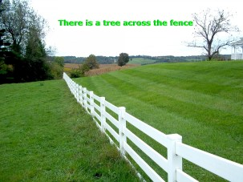
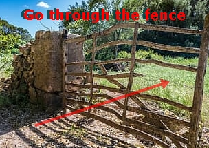

# 介词

[toc]

## Towards

In addition to the uses shown below, **towards** is used in phrasal verbs such as 'count towards' and 'lean towards'.

> [The Knowledge: Towards a Culture of Engineering Documentation](https://www.usenix.org/conference/srecon16europe/program/presentation/macnamara)

## Past vs across vs through

The sun light was coming in ________the window.

A.past
B.pass
C.through
D.across

> - **hi guys I’ve got a question regarding ‘past , across and through ‘ preposition can we say : I pass(get/go past) the fence or go/get through the fence or get/go across(cross) the fence?**
> - I would be glad if you tell me which one above is correct form of saying such questions.

**Prepositions**, (‘**`pre`**’- *before*, ‘**`position`**’-*place),* tell us the **relationship** between two **nouns**, with regard to position & movement, time and manner. In your example, the relationship is between position and movement.

Position and movement prepositions can be static, which is simply position without movement, or they can be dynamic, which is with movement.

In your example, it all depends on what you want to say. Here are the concepts of your three prepositions.

**past:** moving by the side of sth (**dynamic**-sense of motion)

 

 

**across:** from one side to the other (**static**-sense of position)

 

> There is a tree across the fence.

**through:** moving in one side and out the other (**dynamic**-sense of motion)

 

### Reference

1. [Past vs across vs through--insidersenglish.com](https://insidersenglish.com/question/past-vs-across-vs-through/)
2. [English (language): Do "walk across" and "cross" and "pass" have the same meaning? ](https://www.quora.com/English-language-Do-walk-across-and-cross-and-pass-have-the-same-meaning-The-man-walked-across-crossed-passed-the-border)

