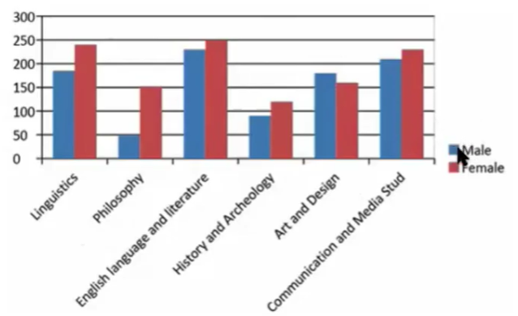

# IELTS-Academic Writing- Task 1 - Bar Charts Lesson 1
@(哦呵呵)[Toastmasters, Word of the Day, 旋元佑]

[toc]

## 1. Overview

## 2.  Processing

### 2.1  An example

The bar chart shows the distribution of students by gender across six art-based disciplines at a UK university in 2011.

Generally speaking, the chart shows that while females outnumber males in most disciplines, the gender gap for each subject was not significant with the notable exception of Philosophy, where females students outnumbered their male counterparts by almost three to one.

Regarding male enrollment, Art and Design was the only subject with more men than women at a ratio of 120 to 90. 

### 2.2 (S1:)  Analyze and group the information
> Analyze the chart and plan how to group the information

| Group |  DEetails   |  
| :-------- | :--------| 
| **First grouping** (Body paragraph 1) |   **Male enrollment[^1]:**   **Language-base**:   -  English lang. & lit:230;  - Comm. & Media:210   - Linguistics:180;    **Philosophy**:(the lowest)50|  
| **Second grouping**(Body paragraph 2) |   **Female entrollment**    **Language-base**:   -  English lang. & lit:250;  - Comm. & Media:220   - Linguistics:240;    **Hist. & Arch**:(the lowest)120|  

[^1]: Find information that stands out: The value is highest and lowest. And here, we are not going to talk about the **Art and Design**, **History and Archeology**, because those are midrange, they don't have anything to do with ***language learning*** and there aren't the lowest.

- Art & Design is the one that the male outnumber femail
- Philosophy is the largest gender gap in all items.
- We don't mention the things in the midrange,

###  2.3 (S2)  The recommended essay structure
> Write an essay using the recommended essay structure

#### 1.  Introduction
The bar chart shows the distribution of students by gender across six art-based disciplines at a UK un diversity in 2011.
	
### 2. Overview
Generally speaking, the chart shows that while females outnumber males in most disciplines, the gender gap for each subject was not significant while the notable exception of Philosophy, where female students outnumbered their male counterparts by almost three to one.

### 3. Body Paragraph 1
Regarding male enrollment, Art and Design was the only subject whit more men than women at a ratio of 210 to 90. Language-based subjects, namely Linguistics, English Language and Literature and Communication and Media Studies, were the most popular subjects for male students.  The least attractive subject for males was Philosophy with only 50 students enrolled.

### 4. Body Paragraph 2
Looking specifically at female enrolled numbers, a higher proportion of females enrolled more than males across five of the six subjects. Like men, female students are also drawn to Language-based subjects. 

## References & Connection

1.[IELTS Academic Writing Task 1 - Bar Charts Lesson 1](https://www.youtube.com/watch?v=oXPIEnjucMo)