# 神话学单词-古希腊与古罗马

[toc]

## 一、 创世神 Primordial

**背景**

古希腊罗马神话的第一部分是创世阶段，即以神话方式解释世界的来源。在这一阶段出 现的神祇通常称为“原始神”或“创世神”，他们分别是世界某一部分的拟人化，后来被第 二代的泰坦神族推翻。

**prim∙ord∙ial  [词根树]**

- **`prim-`**  = first, chief, 表示“第一，主要的”。
- **`ord-`** = order, 表示“命令，顺序”。
- **`-ial`** 表形容词，“…的”，一般缀于名词后。源自拉丁语 -alis, adjective suffix.

### 1. Chronos  时间之神 

**背景**

在古希腊神话中，柯罗诺斯（**Chronos**）是时间的神格化，象征着永远存在、无始无终、 自有永有的时间。古希腊神话中的俄耳甫斯密教（Orpheus）认为，柯罗诺斯是最初的神灵， 是宇宙的第一因，是混沌和秩序的来源，并从中诞生了定数女神阿南刻，成为他的配偶。 柯罗诺斯是无形无象的超神，又或者化身为蛇的形象出现——拥有三颗头：人头、牛头 及狮子头，除此之外还有无数的形象，如有翅膀的青须老者、环绕着混沌的龙……等等。他 与配偶阿南刻围著原始世界卵盘绕，然后将混沌分开，形成了天堂、大地、海与天空。

**词根**

在希腊语中，柯罗诺斯的名字 Chronos 就是时间的意思，由词干 chron-（

时间）和名词 后缀-us 构成。英语中表示“时间”的词根 chron-就来源于此。

- chron- 时间
- us 名词性质

**相关单词**

-  chronic ['krɒnɪk] 慢性的，长期的，习惯性的
- chronicle ：['krɒnɪk(ə)l] n. 编年史，年代史
- chronology : [krə'nɒlədʒɪ]  n.年代学，年表
- synchronous ['sɪŋkrənəs]adj. 同步的；同时的

#### 两个容易混淆的人物

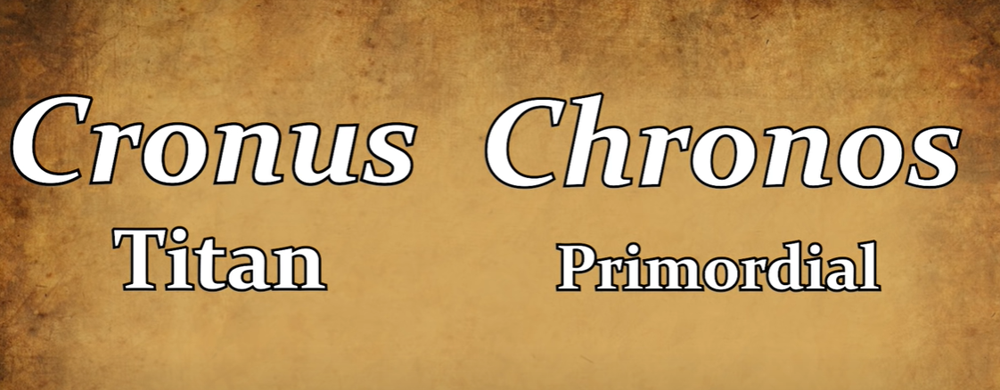

- 柯罗诺斯【Chronos】 时间之神

- 克洛诺斯 Cronus【ˈkrəʊnəs】

他是第一代神王天神乌拉诺斯和大地女神所生的最小的儿子，最为精明能干，率领自己的兄弟姐妹阉割了父亲，成为第二代神王乌拉诺斯在逃离时预言克洛诺斯也将和他一样被自己的儿子推翻。  为了避免重蹈老爸的覆辙，把妻子瑞亚（Rhea）所生的子女全部吞进自己的肚子里，只有最小的宙斯由于母亲用石头代替才得以逃脱

由于克洛诺斯就像无情的时间一样吞噬一切，所以后来很多人把他和希腊神话中代表时间的原始神克罗诺斯（Chronus）合为一人。

**References**:

1. [Cronus vs Chronos: Who is the God of Time? (Greek Mythology Explained)--Youtube](https://www.youtube.com/watch?v=-0lm5VQPKs0)

### 2.  Chaos  混沌之神

**背景**

卡俄斯（Chaos）是希腊神话中最早的的神灵，代表宇宙形成之前模糊一团的景象。根 据古希腊著名历史学家赫西奥德（Hesiod）的《神谱》和早期希腊神话记载：宇宙之初只有 卡俄斯，祂是一个无边无际、一无所有的虚空。随后祂依靠无性繁殖从自身内部诞生了大地 女神、深渊神、黑暗神、黑夜女神和爱神等五大原始神，世界由此开始。

卡俄斯（Chaos）在希腊语中拼写为 khaos，本意是“虚空、裂开”，由词干 kha（空洞） 和名词词尾-os 构成。该词在拉丁语中拼写变为 chaos，并经由法语进入英语，形成了英语单 词 chaos。现在，chaos 常常被用来表示“混乱、混沌”，该含义源自赫西奥德的说法。他 将 chaos 描述秩序诞生之前的宇宙，与秩序诞生之后的宇宙 cosmos（希腊语为 Kosmos）相 对应。从 chaos 衍生出形容词 chaotic 就是“混乱的”之意。

与 chaos 同源的单词还有 chasm（裂口、深坑），它源自希腊语 khasma。另外，常见单 词 gas（气体）也与 chaos 同源。它来自荷兰语，而在荷兰语中，字母 g 的发音十分接近希 腊语中的 kh。

**词根**

- chaos- “混乱、混沌
-  kha- （空洞)
- os 名词词性
- chasm- 裂口、深坑
-  它源自希腊语 khasma
-  gas 气体
- 也与 chaos 同源,来自荷兰语

而在荷兰语中，字母 g 的发音十分接近希腊语中的 kh。

**相关单词**

- cosmos [ˈkɑːzmoʊs]  秩序的宇宙

- chaos： ['keɪɒs]n.混沌、混乱

- chaotic： [keɪ'ɒtɪk]  adj.混乱的、无秩序的

- chasm ：['kæzəm] n. 峡谷；裂口；分歧；深坑

- chasmal: ['kæzml] adj. 似裂罅的；深陷的

- gas：[ɡæs]  n. 气体；瓦斯；汽油；毒气

### 3. 大地女神

####  Gaia / Gaea (古希腊)

**背景**

在古希腊神话中，掌管地球的女神称为“盖亚”（Gaia 或 Gaea），通常被翻译为“大地 女神”。她由混沌之神卡俄斯所生。盖亚通过自我繁殖诞生了天神（表示天）、海神蓬托斯 （Pontus，表示大地之凹陷）和山神乌瑞亚（Ourea，表示大地之凸起），并与天神结合生了 六男六女十二个泰坦巨神及三个独眼巨人和三个百臂巨神。并且，她还不断地与自己的子孙 们交配，繁衍出越来越多的子孙。

《神谱》中这样描述盖亚：冲突与混乱来自于万神之母盖亚，也正是这位大母神生出了 所有光明宇宙的天神。在她的身上，我们既看到了创造，又看到了毁灭，既看到了秩序，又 看到了混乱，而总的说来，黑暗和混乱是她的本质。盖亚是世界的开始，所有的神都是她的 子孙后代。在后来三代神灵之间的争斗中，她都起到了非常重要的作用，其角色宛如宫廷戏中的老太后。

- Ourea，表示大地之凸起

**词跟**

在希腊语中，盖亚的名字 Gaia 或 Gaea 的含义就是“地球、大地”，来自 ge（地球）。 英语中表示“地球、大地”的词根 ge-或 geo-就来源于此，并由此产生了许多与地球、大地 有关的单词。

**相关单词**

-  ge- / geo-“地球、大地

-  geography：[dʒɪ'ɒgrəfɪ] n. 地理学

-  geology：[dʒɪ'ɒlədʒɪ]  n. 地质学

-  geometry：[dʒɪ'ɒmɪtrɪ]  n. 几何学

-  George：[dʒɔ:dʒ]  n.（人名）乔治，意为“农夫、地里干活者”

#### Tellus / Terra 古罗马

 Tellus (忒勒斯) / Terra (（特拉)

**背景**

在罗马神话中，大地女神被称为 Tellus（忒勒斯）或 Terra（特拉）。在一些与农业、丰 产有关的祭祀活动中，大地女神常常被人和谷物女神刻瑞斯（Ceres）联系到一起甚至混为 一谈。在拉丁语中，tellus 或 terra 的意思就是“陆地”、“干地”（与“海洋”相对），源 自原始印欧语词根 ters-（干），等于英语单词 land（陆地）。

**词根**

英语词根 terr-/tellu-/tellur-就来源 于此，表示陆地（land），与表示“地球”的词根 geo-略有差异。在天文学专业领域中，人 们一般用专业单词 Tellus 来表示“地球”，而非通俗单词 earth。

- **terr/-tellu-/tellur-   陆地，大地，干地**

**相关单词：**

- territory ：['terɪt(ə)rɪ] n.领土、领地
- terrain：[təˈreɪn] n.地形、地势
- terrace：[ˈterəs] n. 平台；梯田；阳台
- terrestrial ：[tə'restrɪəl]  
  - adj.地球的，陆地的，人间的
  - n.陆地生物，地球上的人
- subterranean ：[,sʌbtə'renɪən] 
  -  adj. 地下的；秘密的；隐蔽的 
  -  n. 地下工作者
- Mediterranean：[,mɛdətə'renɪən]  
  - n. 地中海  
  - adj. 地中海的
- tellurian ：[te'ljʊərɪən]  
  - adj.地球上的  
  - n.地球人
- Tellurium ：[te'ljʊərɪəm] 碲（元素符号 Te）

另一个词根 **`terr-` = frighten**, 表示“恐，怕”。源自拉丁语 terrere "to frighten."

- terr-or n. 恐怖、可怕的人

- de-ter  vt. 制住、吓住、威慑

  >  de: 不； deter=> 吓的不能动弹

- terr-ible   adj. 可怕的，极坏的

  >  -ible: 能....de 

- terror-ist

- terror-ism

- terri-ify  vt. 使恐惧、恐吓

  >  -ify: 使成.... 化作....

### 4. Tartaros 深渊之神

**背景**

在希腊神话中，塔耳塔洛斯（拉丁语 ***Tartarus***，希腊语 ***Tartaros***）是一个无穷深渊，位于 世界的最低层，祂是世界创始之初的创世五神之一。

在赫西俄德《神谱》中这样描写：“道路通阔的大地之下幽暗的塔耳塔洛斯”，“其到地面的距离，等于地面到天穹的距离,周围包裹着三重黑幕和三道铜墙，其铜门由波塞冬所 造，在泰坦之战中战败的泰坦被囚禁于此，由百臂巨人把守。”另外，第一代乌拉诺斯和第 二代神王克洛诺斯也曾将百臂巨人和独目巨人关入塔耳塔洛斯，因为担心他们可能会推翻自 己的统治。

在古希腊俄耳甫斯密教的祷歌中，塔耳塔洛斯和冥界混淆，但在荷马史诗中它们被严格 区分，冥界为死者魂魄的居住处，塔耳塔洛斯为战败的泰坦囚禁处，由百臂巨人把守。

在罗马神话里，被判有罪的魂魄被打入塔耳塔洛斯。在古罗马诗人维吉尔笔下，塔耳塔 洛斯是巨大的，四周被燃烧的炎河和三重铁墙团团围住，由有 50 个脑袋张着血盆大口的海 德拉把守。

**词根** 

在英语中， **Tartarus**（塔耳塔洛斯）常常被用来比喻极度可怕的地方，相当于“地狱”， 并由此衍生形容词 **tartarean**（地狱的）。中世纪时，成吉思汗所率领的蒙古和突厥铁骑横扫 欧洲大陆，令欧洲人闻风丧胆。这些人自称为 ***Tata***，欧洲人则根据**Tartarus** 一词将其称为**Tartar** （鞑靼人），意思是“来自地狱的人”。1270 年法国人圣路易斯的一封书信中就写到：“面 对穷凶极恶的鞑靼人，我们要么将他们赶回他们的老家——塔耳塔洛斯，要么统统被他们送 上天堂。”

古人见乌龟长相丑陋怪异，认为是来自地狱的生物，因此将其称为 tortoise，也来自 Tartarus 一词。

**相关单词**

- Tartarus：['tɑ:tərəs] n. 塔耳塔洛斯，深渊，地狱
- tatarean： [tɑ:'tεəriən]  adj.地狱的，冥界的，阴间的
- Tartar： ['tɑːtə]  
  - n.鞑靼人（蒙古人和突厥人），凶悍的人  
  - adj.鞑靼的
- tortoise ：['tɔrtəs]  n.乌龟

### 5. Erebus 黑暗神

在希腊神话中，厄瑞玻斯（**Erebus**）是另一位原始神，是混沌之神的儿子，是另一位原 始神[黑夜女神](#6. Nyx 黑夜女神  )倪克斯的兄弟，并和她生了：

- 太空之神埃忒耳
- 白昼女神赫墨拉。

厄瑞玻斯是永 恒黑暗的象征，组成宇宙的基本元素之一，位于大地女神和深渊神之间。希腊神话里人死去 后，先要穿越厄瑞玻斯的黑暗来到冥间，也许这就代表了人濒死时感受到的黑暗吧。

厄瑞玻斯的名字 ***Erebus*** 来自希腊语 ***Erebos***，在希腊语中的含义就是“黑暗、玄冥”。 它的词干 ***ereb*** 有人认为来自闪族词，如希伯来语 ***erebh***（日落、西方）。英语中与它有关的单词很少。

### 6. Nyx 黑夜女神 

在希腊神话中，倪克斯（Nyx）是黑夜女神，五大原始神之一，是黑夜的象征。她是混 沌之神的女儿，黑暗神厄瑞玻斯的妹妹。她不仅诞生了光辉之神和白昼女神，还诞生了

- 睡、 梦、死、命运、复仇、不和、争斗等等暗黑系列神祇。

这一神族虽然还不能与奥林匹斯神族 平起平坐，但却是一股不容小觑的势力。

在古典艺术造型中，倪克斯是穿黑色星花纱衣的少妇，怀抱幼年的睡神或死神，在每天 傍晚乘黑马拉的车飞上天穹。

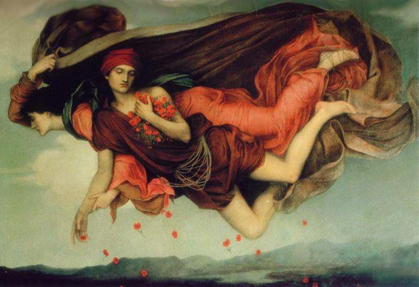

**词根**

英语词根 **`nycto-`**（黑夜）来自希腊语词根 ***nykto-***，就是倪克斯（（**Nyx**）的词根形式。同 源单词还有 **night**（夜晚）、**nocturnal**（夜的）等。

**相关单词**

- Nyx：[niks]  n.倪克斯，黑夜女神，黑夜
- nyctophobia：[,nɪktə'fobɪə]  n. 黑夜恐怖症
- night： [naɪt]   
  - n. 夜晚；黑暗，黑夜  
  - adj. 夜晚的，夜间的
- nocturnal：[nɑk'tɝnl] adj. 夜的；夜曲的；夜间发生的

### 7. 爱神Eros(2位)

 **背景**

- 早期希腊神话

  在希腊神话中，爱神厄洛斯（Eros）是一位重要的原始神，因为祂代表了世界的动力—— 性欲。有了厄洛斯，神灵才从单性繁殖变为双性繁殖，世界才会变得丰富多彩、生生不息。

  值得注意的是，希腊神话中有两个神灵都叫做厄洛斯（Eros），一位是这里说的原始神， 出现于早期希腊神话，在赫西俄德的《神谱》中及俄耳甫斯密教中均有记载；

- 晚期希腊神话

  另一个是爱与 美之神阿芙洛狄忒与战神私通生下的小爱神，通常被人格化为一个身披双翼，手持弓箭的胖 娃娃或英俊少年，出现于较晚期的希腊神话。

  在柏拉图之后，古希腊（主要是雅典）开始把 厄洛斯分离成两位，即原始神厄洛斯和阿佛洛狄忒之子厄洛斯，分别进行崇拜，而阿佛洛狄 忒的地位逐渐取代了原始神厄洛斯。这种崇拜影响到后来的希腊化时代和古罗马。

**词根**

厄洛斯的名字 **Eros** 在希腊语中就是“性爱、爱欲”的意思，复数形式为 **erotes**。从祂的 名字中产生了一些与性爱有关的单词。

**相关单词**

- **Eros**: [ˈɪrɑːs,ˈerɑːs]  n.性爱，性欲，愿望
- **erotic**: [ɪ'rɒtɪk]  
  - adj.色情的，性欲的，性爱的 
  - n.好色之徒
- **erotical** ：[i'rɔtikəl]
  - adj. 性爱的；色情的
  - n. 好色之徒
- **erotology**：[,erə'tɒlədʒɪ] n.色情文学，色情艺术
- **eroticism** [ɪ'rɑtə,sɪzəm] n. 色情；性的兴奋，性欲亢进
- **eroticist**：[i'rɔtisist] n.色鬼，好色之徒；色情文学作者

### 8. 第一代神王-天神

#### Uranus (古希腊)

**背景：**

希腊神话中，天神乌拉诺斯（**Uranus**）是[大地女神盖亚](#3. 大地女神)通过单性繁殖所生，诞生于盖亚的指尖，掌管天空。后来，在[爱神厄洛斯](#7. 爱神Eros(2位))的影响下，盖亚与乌拉诺斯进行两性繁殖，生出了 众多神灵。所以乌拉诺斯既是盖亚的儿子，又是她的丈夫，他们的后代主要包括十二泰坦神 以及数名独眼巨人与百臂巨人。因为这些神灵都是乌拉诺斯的子女，所以乌拉诺斯就自然成 为了第一代神王。

希腊神话有个规律，那就是儿子推翻老子上位，而老子则相反设法避免此事发生。乌拉诺斯的做法非常简单粗暴，直接把盖亚与他所生的所有孩子都塞回盖亚体内，不让他们来到 这个世界。时间长了，盖亚实在受不了了，就号召孩子们起来反抗。其他孩子慑于父亲淫威，不敢有所表示，只有最小也是最强壮的儿子[克洛诺斯](# Cronus(古希腊))答应帮助母亲推翻父亲。盖亚交给克洛诺斯一把锋利的石镰刀，让他埋伏好。等到乌拉诺斯在盖亚身上发泄淫威时，克洛诺斯手持镰刀，一刀就隔断了乌拉诺斯的命根子。乌拉诺斯惨叫一声，逃到天上，从此再不敢靠近大 地女神。天和地从此就实现了分离。

**词根：**

乌拉诺斯的名字 **Uranus** 在希腊语中的含义是“天”，由词干

-  **`uran-`**（天）
- 名词后缀**`-us`** 构成。

英语中表示“天”的词根 **`uran-`**就来源于此。

1781 年，英籍德国天文学家赫瑟尔首次 发现一颗新行星，便用 **Uranus** 命名，中文译为“天王星”。8 年后，德国化学家克拉普罗 特首次从沥青中分离出一种新的化学元素。为了纪念赫瑟尔及其发现的新行星，便以 Uranus 来命名，称为 **uranium**，这便是用于制造核裂变的常用元素铀

**相关单词：**

- **uran**-： 天，天体
- **Uranus**:  ['juərənəs]    n.天王星，天神乌拉诺斯
- **uranium** ：[jʊ'reɪnɪəm] n.铀元素
- **uranology** ：[,jʊərə'nɒlədʒɪ]   n.天体学
- **uranometry**：[,jʊərə'nɒmɪtrɪ] n.天体测量学
- **uranography**：[jʊrə'nɒgrəfɪ] n.天象图学
- **uranoscopy**：[jʊ'rɑ:nəskəpɪ] n.天体观察

#### Caelus /  Coelus （古罗马）

**词根：**

在古罗马神话中，与天神乌拉诺斯对应的是凯路斯（Caelus 或 Coelus）。凯路斯的名字 源自拉丁语 Caelum（天），与其同源的英语单词有 **celestial**（天上的）、**Selina**（赛琳娜）、**cerulean** (蔚蓝色的)等。

**相关单词：**

- celestial [sə'lestʃl]  adj. 天空的;天上的 / n. 神仙;天人;（指封建时代的）中国人;天朝之人

   - Celestial is used to describe things relating to heaven or to the sky.

   - Gravity governs the motions of celestial bodies

   - If you describe something as celestial, you mean that it is wonderful.

- Selina n.（女子名）赛琳娜，意为“天国的、神圣的”

- cerulean [sɪ'ruːliən] 天蓝色的;蔚蓝色的;深蓝色的

### 9. Pontos  海神蓬托斯

蓬托斯（**Pontos**）在希腊神话中是象征“大地之凹陷”的男神，山神乌瑞亚（[Ourea](#10. Ourea  山神乌瑞亚)） 的兄弟，大地女神盖亚之子。因大地的运动，于平坦之中生出凹凸，深不可测的凹陷即为 “海”。所以蓬托斯实质乃指容纳海洋的“大坑”，是一位地质意义上的海神。

蓬托斯与母亲盖亚结合，生下了表征海的各种属性的诸多儿女：

- 海之友善——涅柔斯 （**Nereus**）
- 海之奇观——陶玛斯（**Thaumas**）
- 海之愤怒——福耳库斯（**Phorcys**）
- 海之危险——刻托（**Ceto**）
- 海之力量——欧律比亚（**Eurybia**）。

蓬托斯的妻子是[海面女神塔拉萨](#13. Thalassa  海面神塔拉萨)（**Thalassa**），他们俩生下了九位术神忒尔喀涅斯 （Telchines）、海水女神哈利亚（Halia）——海面之下装满这个大海坑的海水，一位水质意 义上的海神——以及成千上万遨游其中的海鱼。

蓬托斯在希腊语中的含义是“波涛”。在希腊人的生活中，他的影响力较小。英语中与 他相关的单词很少。

### 10. Ourea  山神乌瑞亚

乌瑞亚（Ourea）在希腊神话中是象征“大地之凸起”的男神，海神蓬托斯的兄弟，大 地女神盖亚之子。他象征着地球表面上的所有山脉。实际上，地球上的每一座山脉都有一位 小山神，这些小山神全都是山神乌瑞亚的子孙后代。在希腊语中，乌瑞亚的含义就是“山脉”。 英语中与他相关的单词很少。

### 11.  Aither 太空神埃忒耳

**背景:**

太空神埃忒耳（希腊语 ***Aither***、拉丁语 ***Aether***、英语 ***Ether***，亦可译为“以太”），是黑 暗神厄瑞玻斯和黑夜女神倪克斯的儿子，是太空的人格化。

古希腊人认为，地球上的万物均 由土火水风四种元素构成，而太空则由地球上不存在的另一种神秘元素构成，日月星辰便是 由这种元素生成的。在神话中，古希腊人将这种神秘的第五元素人格化为太空神埃忒耳（***Aether***），是天神所呼吸的纯净的天堂空气，迥异于凡人所呼吸的凡间空气。也有人说他 是光辉之神，代表天堂的光线，是光的传播媒介。

西塞罗的《论神性》认为他是世界的灵魂， 所有的生命自他而出。他还被看作宙斯的保护墙，将塔尔塔罗斯拦在宇宙之外。

**词根：**

在希腊语中，埃忒耳（***Aither***）就是“上层空气、明亮”的意思。英语单词 **ether**（以太、 苍天）便来源于此。

在哲学及科学史上，“以太”（ether）曾经是一个非常重要的概念，是 某些历史时期物理学家赖以思考的假想物质。古希腊哲学家亚里士多德就曾经设想过这种物 质。

17 世纪的笛卡尔最先将以太引入科学，并赋予它某种力学性质，作为传播力的媒介。 当今通用的局域网通信协议标准就被称为“以太网”（**Ethernet**）。

**相关单词：**

- **ether**：['iθɚ]  n. 以太；苍天；天空醚；乙醚

- **Ethernet** n. 以太网，通用局域网通信协议标准

### 12.  白昼女神   

#### Hemera （古希腊）

**背景：**

赫墨拉（**Hemera**）是希腊神话中的白昼女神，是[黑暗神厄瑞玻斯](#5. Erebus 黑暗神)和[黑夜女神倪克斯](#6. Nyx 黑夜女神 )的 女儿，白昼的人格化。她与母亲同住在[塔尔塔洛斯](#4. Tartaros 深渊之神)，轮流进出，形成了昼夜交替。每当[黎明女神厄俄斯](#28. Eos 黎明女神厄俄斯)出现，她便离开塔尔塔洛斯，驾驶战车飞上天空，驱散黑夜。赫墨拉与[太空神埃忒耳](11.  Aither 太空神埃忒耳)结 合，生下波光粼粼的[海面女神塔拉萨](#13. Thalassa  海面神塔拉萨)。

**词根：**

在希腊语中，hemera 就是“白昼”的意思。含有 hemera 的英语单词有 **ephemera**（蜉蝣）， 由前缀 **`epi-`**（on）和 **`hemera`**（白昼）构成，字面意思就是“一日”，因为这种昆虫成虫寿命 极其短暂，传说只有一日之久。它的形容词是 **ephemeral**（短暂的、朝生暮死的）。

**相关单词：**

- **ephemera：**[ɪ'fɛmərə]  n. 蜉蝣
- ephemeral：[ə'fɛmərəl] 
  - adj. 短暂的；朝生暮死的
  - n. 只生存一天的事物

#### Dies（古罗马）

**词根：**

在罗马神话中白昼女神叫做狄厄斯（**Dies**），在拉丁语中的含义就是“日”，英语词根 **`di-`**（日）便来源于此。

**相关单词：**

- **`di-`**（日）

- **diary**：['daɪəri]  n. 日志，日记；日记簿

- **dial**: ['daɪəl]

   - n. 日晷；转盘；刻度盘；钟面

   - v. 拨号；拨号呼叫

- **diurnal**：[daɪ'ɝnl] 

   - adj. 白天的；每日的，一日间的

     > Instead, we are diurnal creatures, with eyes adapted to living in the sun's light.
     > (相反,我们是白天活动的生物,眼睛已经适应了阳光。) 高考真题- 2015 浙江 阅读C

   - n. 日记账；日报，日刊

### 13. Thalassa  海面神塔拉萨

**背景:**

塔拉萨（Thalassa）是希腊神话中代表“海面”的原始女神，可能是来源于史前的神灵。 她是埃忒耳和赫墨拉的女儿，地中海的化身。她同蓬托斯育有九位术神泰勒刻辛或称忒尔喀 涅斯（***Telchines***）和海水女神哈利亚（***Halia***）。天文学中，海卫四以她的名字命名。

**词根：**

在希腊语中，塔拉萨（Thalassa）就是“海洋”的意思。英语词根 thalass-/thalasson-（海 洋）便来源于此。

**相关单词:**

- **thalassemia**：[,θælə'si:miə] n. 地中海贫血；库利氏贫血
- **thalassic**：[θə'læsɪk] adj. 海的；海湾的；内海的

## 二、  泰坦神族 Titan

**背景：**

在希腊神话中，[天神乌拉诺斯](#8. 第一代神王-天神)和[大地女神盖亚](#3. 大地女神)结合后，生下十二位身材巨大的神祇，被 称为“泰坦”（**Titan**，或译为“提坦”）。依据赫西俄德《神谱》，十二位泰坦神分别是： 

1. 大洋神俄刻阿洛斯（Oceanus）
2. 大洋女神忒堤斯（Tethys）
3. 智力神科俄斯（Coeus）
4. 月亮 女神福柏
5. 光亮神许珀里翁（Hyperion）
6. 视力女神忒伊亚（Theia）
7. 灵魂神伊阿珀托斯（Iapetus）
8. 生长神克利俄斯（Crius）
9. 时光女神瑞亚（Rhea）
10. 正义女神忒弥斯（Themis）
11. 记忆女神莫 涅摩绪涅
12. 以及后来的神王克洛诺斯。

他们曾应母亲盖亚的要求，在最小的泰坦[神克罗诺斯](#14. 第二代神王 )的率领下，阉割了天神乌拉诺斯，推翻了他的统治，成为新一代统治者。但他们被同样克洛诺斯的儿子、奥林匹斯诸神的领袖宙斯推翻。

依据赫西俄德《神谱》的说法，“泰坦”（Titan）一词是天神乌拉诺斯对这些子女所 起的诨名，意思是“紧张者”：“伟大的乌拉诺斯父神在责骂自己生的这些孩子时，常常用 浑名称他们为泰坦（紧张者）。他说他们曾在紧张中犯过一个可怕的罪恶，将来要受到报应 的。”

**词根：**

航海史上最出名的邮轮“泰坦尼克号”（**Titanic**）的名字就来源于 **Titan**，意思是“巨大的”。此外，极其坚固、可耐高温、强酸强碱的金属钛（**titanium**）以及身形庞大的雷龙 （**titanosaur**）的名字也来源于此。

**相关单词：**

- **Titan**：['taitən]  n.泰坦神，提坦神，巨人

- **titanic**：[taɪ'tænɪk]

  - adj.巨大的 

  - n.泰坦尼克号

- **titanium**：[taɪ'teɪnɪəm; tɪ-] n.金属元素钛

- **titanosaur**：['taɪtənəsɔː] n.雷龙（白垩纪一种两栖食草大恐龙）

### 14. 第二代神王 

####  Cronus(古希腊)

**背景：**

希腊神话中，克洛诺斯（**Cronus**）是[第一代神王-天神乌拉诺斯](#8. 第一代神王-天神)和[大地女神](#3. 大地女神)所生的最小的儿子，最为精明能干，率领自己的兄弟姐妹阉割了父亲，成为第二代神王。乌拉诺斯在逃离时预言克洛诺斯也将和他一样被自己的儿子推翻。为了避免重蹈老爸的覆辙，克洛诺斯采取了看似更保险的做法——老婆的肚子不保险，那就放在自己的肚子里吧。于是他把妻子瑞亚（[Rhea](#3. 大地女神)）所生的子女全部吞进自己的肚子里，只有最小的宙斯由于母亲用石头代替才得以逃脱。

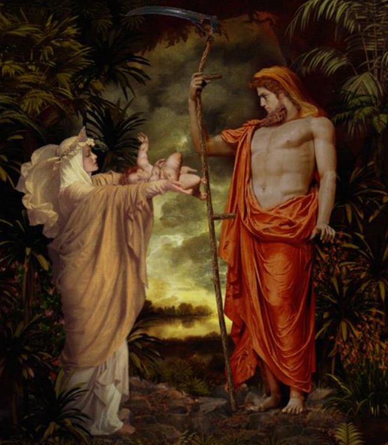

> 由于克洛诺斯就像无情的时间一样吞噬一切，所以后来很多人把他和希腊神话中代表时 间的原始神克罗诺斯（Chronus）合为一人。

####  Saturn(古罗马)

**背景:**

在罗马神话中，与克洛诺斯对应的是萨图恩（**Saturn**，拉丁语 ***Saturnus***）。他原本是罗马 神话中的农神，继承希腊神话后，罗马人就将农神萨图恩和希腊神话中的第二代神王克洛诺斯合二为一了，原因也许是因为克洛诺斯用石镰刀阉割了自己的父亲，而镰刀也是农神的武 器。根据罗马神话，萨图恩在被[朱庇特](#42. 第三代神王宙斯/朱庇特)（即宙斯）推翻后逃到了拉丁姆，并教会了那里的人 民耕种土地，因此被罗马人尊为农神。

**词根：**

- 罗马人将星期六以农神命名，所以表示“星期六”的英语单词就是 Saturday，字面意思 就是 Saturn’s day。
- 天文学上，土星（Saturn）就是以农神萨图恩的名字命名的，因为它排在木星（Jupiter）的外侧。太阳系中，土星距离太阳远，运行速度最慢。因此，占星学中认为，土星座的人性 情阴郁冷漠，从而产生了 saturinine（阴郁的）这个单词。
- 农神节（saturnalia）是古罗马的一个大型的祭祀活动，是为了祭祀农神萨图恩，时间在 12 月中旬，相当于中国的庙会。古罗马人们在这一天向农神祈福，保佑一年风调雨顺，国 泰民安。

**相关单词：**

- **Saturn**：['sæt(ə)n] n.土星，农神
- **Saturday**：['sætədɪ; -de] n.星期六
- **saturnine**：['sætənaɪn] adj.土星宫的，忧郁的，阴沉的
- **saturnalia** ：[,sætɚ'nelɪə] n.古罗马的农神节，狂欢喧闹

### 15. 时光女神

#### Rhea(古希腊)

**背景：**

希腊神话中，第二代神王克洛诺斯的妻子是瑞亚（**Rhea**）。她是[大地女神盖亚](#3. 大地女神)与[天空之神乌拉诺斯](#8. 第一代神王-天神)所生的女儿，十二泰坦神之一，是掌管时光流逝的女神。

她和自己的弟弟克洛诺斯结合，生下了三男三女六个孩子，与他生育了三女三男六个孩子，分别是：

| 女       | 男     | 备注 |
| -------- | ------ | ---- |
| 赫斯提亚 | 哈迪斯 |      |
| 得墨忒耳 | 波塞冬 |      |
| 赫拉     | 宙斯   |      |

其中最小的宙斯推翻了克洛诺斯的统治，成为第三代 神王。

瑞亚的名字被用来命名土星的第五颗卫星。英语中与她相关的单词很少。

#### Ops(古罗马)

**背景：**

在罗马神话中，与瑞亚对应的女神是俄普斯（Ops），是农神萨图恩的妻子，大地女神 的助手，负责保佑农产品的丰收，人们常常把她与掌管谷物的谷物女神刻瑞斯搞混。在古罗 马神庙中，俄普斯往往和农神萨图恩一道接受人们的祭祀。每年 8 月 25 日是俄普斯的节日， 人们在收获完毕后举行感恩庆祝。

**词根：**

在拉丁语中，俄普斯的名字 **ops** 的意思是“丰产、丰富”，来自原始印欧语词根 **`op-`**（工作、丰产）。英语单词 opus、opera、operate、opulence、opulent 都与 ops 同源。

**相关单词：**

- **opus**：[ˈoʊpəs] n. 作品
- **opera**： ['ɑprə] n. 歌剧；歌剧院；歌剧团
- **operate**： ['ɑpə'ret] v. 运转，经营；动手术；起作用
- **opulence**：['ɑpjələns] n.富裕，丰富
- **opulent**：['ɒpjʊl(ə)nt] adj.丰富的，富裕的，大量的

### 16. Oceanus  大洋神俄刻阿诺斯

**背景：**

大洋神俄刻阿诺斯（**Oceanus**）是希腊神话中十二泰坦中的老大，是希腊人想象中环绕 整个大地的巨大河流，象征着地球表面所有的海洋和水系。他是大地女神盖亚与天神乌拉诺 斯的儿子，第二代神王克洛诺斯的哥哥。俄刻阿诺斯和他妻子忒堤斯一个生下了 3000 个儿 子和 3000 个女儿，这就是世界各地的河神与大洋神女。

在泰坦战争爆发时，俄刻阿诺斯明智地置身事外，因此在奥林匹斯神推翻泰坦的统治后 仍得以保有自己的全部权利。俄刻阿诺斯还把自己的一个女儿、智慧女神墨提斯嫁给了宙斯， 成为宙斯的第一位妻子。

**词根:**

俄刻阿诺斯的名字 **Oceanus** 在希腊语中拼写为 ***Okeanos***，英语中表示“海洋”的单词 ocean 就来自俄刻阿诺斯的名字 Oceanus。泰坦神族被奥林匹斯神族推翻后，俄刻阿诺斯作为海洋主宰的地位逐渐被奥林匹斯神族中的海神波塞冬取代。

**相关单词:**

- Oceanus [əu'siənəs] n.俄刻阿诺斯，海洋之神
- ocean ['əʊʃ(ə)n] n.海洋
- oceanic ['oʃɪ'ænɪk] adj. 海洋的；海洋产出的；在海洋中生活的
- Oceania [,oʃɪ'ænɪə]  n. 大洋洲

**比较**：

 **Sea**单词sea来自英国人的本族语日耳曼语,泛指一般的海洋，比如travel by sea（海上旅行），at the sea（在海上）。在表示具体一片海域时，sea常表示比较小的海洋

- the Red Sea（红海）

- the Black Sea（黑海）

- the North Sea（北海）

- the Mediterranean Sea（地中海）

### 17. Hyperion 光亮神

**背景：**

希腊神话中的许珀里翁（**Hyperion**）是[大地女神盖亚](##3. 大地女神)和[天神乌拉诺斯](## 8. 第一代神王-天神)之子，十二泰坦之 一，掌管光亮，是

- 太阳神赫利俄斯
- 月亮女神塞勒涅
- 黎明女神厄俄斯的父亲。

当天神乌拉诺斯要再次降临地表时，大地之母要他的儿子们到世界四周阻挡天空，而许珀里翁就被分配到支撑东边。日后他的孩子太阳、月亮和黎明总是从东部升起，便是为了纪念其父镇守的 东边。天文学家用他的名字来命名**土卫七**。

**词根：**

许珀里翁的名字 Hyperion 在希腊语中的含义是“***穿越高空者、从高空往下俯视者***”， 来自希腊语 hyper，后者来自原始印欧语词根 **`uper-`**（=super），表示“超过、高于”。英语 词根 **`hyper-`**（超过、高于、过多）就来源于此。

**相关单词：**

- **`hyper-`**：超过，高于，过多
- **Hyperion**：[haɪ'pɪriən] n.许珀里翁，土卫七
- **hyperactive**：[haɪpər'æktɪv] adj.过度活跃
- **hypersensitive**：[haɪpə'sensɪtɪv] adj.过度敏感的
- **hypercritical**：[haɪpə'krɪtɪk(ə)l] adj.吹毛求疵的
- **hypertension**：[haɪpə'tenʃ(ə)n] n.高血压，过度紧张

### 18. Theia 视力女神

**背景：**

忒伊亚（**Theia** 或 **Thea**）是希腊神话中的视力女神，十二泰坦之一，光亮神许珀里翁的妹妹和妻子，太阳神赫利俄斯、月亮女神塞勒涅以及黎明女神厄俄斯的母亲，有时也称艾利 帕耶沙（Euryphaessa），意为“璨烂”。

**词根：**

**相关单词：**

### 19.正义女神

#### Themis (古希腊)

**背景：**

**词根：**

**相关单词：**

#### Justitia (古罗马)

**背景：**

**词根：**

**相关单词：**

### 20. Mnemosyne 记忆女神

**背景：**

**词根：**

**相关单词：**

### 21. Tethys 大洋女神

**背景：**

**词根：**

**相关单词：**

### 22. Coeus 智力神

**背景：**

科俄斯（Coeus）是大地女神盖亚和天神乌拉诺斯之子，十二泰坦之一，掌管“暗、智力与提问”，月亮女神福柏（Phoebe）的丈夫。他们生有暗夜女神勒托（Leto）与星夜女神 阿斯忒瑞亚（Asteria）。科俄斯的名字在希腊语中就是疑问词“什么、什么样”，代表了充 满好奇的智力。

科俄斯在希腊神话中故事不多，通常只是在罗列十二泰坦时才被提及。他的女儿、暗夜 女神勒托（Leto）比他更有名，因为她嫁给了宙斯，生育了太阳神阿波罗和月亮女神阿尔忒 弥斯，所以按辈分论的话，科俄斯是奥林匹斯神族中的太阳神和月亮女神的外公。英语中与 他相关的单词很少。

**词根：**

**相关单词：**

### 23 Phoebe 预言女神

**背景：**

福柏（**Phoebe**）是泰坦神族中的预言女神，是智力之神科俄斯的妹妹和妻子，奥林匹斯神族中的太阳神和月亮女神的外婆。

在希腊语中，福柏的含义是“***光辉、预言***”。与象征着理性和思辨的老公科俄斯不同，福柏象征着非理性的灵感和预言，通常被认为与神谕有关联据埃斯库罗斯说，著名的德尔斐神谕曾是属于福柏的。福柏从忒弥斯那里获得了神谕的发布权，但她最终把德尔斐的神庙送给了自己的外孙阿波罗。

在天文学上，科学家用福柏来命名 **土卫九**。在美剧《老友记》中，菲比（**Phoebe**）就是一个特别迷信各种灵感和征兆的女孩。

**词根：**

**相关单词：**

### 24. Iapetus 灵魂神

**背景：**

**词根：**

**相关单词：**

### 25. Crius 生机神

**背景：**

**词根：**

**相关单词：**

### 26. Helios 太阳神

**背景：**

**词根：**

**相关单词：**

### 27. Selene 月亮女神塞勒涅

**背景：**

**词根：**

**相关单词：**

### 28. Eos 黎明女神厄俄斯

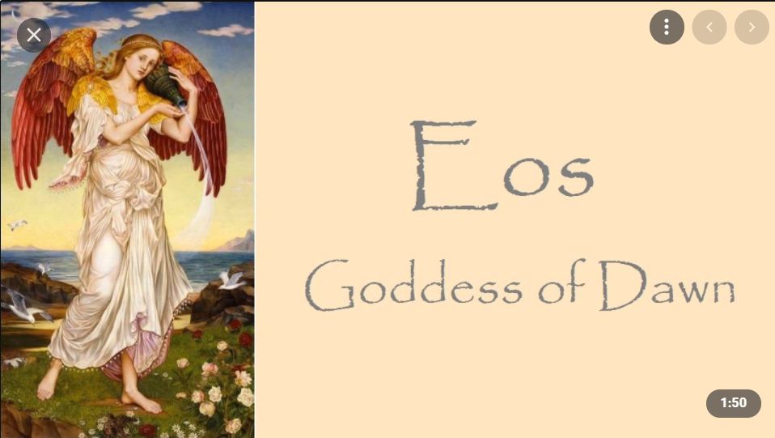

厄俄斯（**Eos**）是希腊神话中的黎明女神或曙光女神。她是泰坦神许珀里翁与忒伊亚的 第二个女儿，是太阳神和月亮女神的妹妹。厄俄斯的形象为手指玫红、衣着藏红的美女，每 天黎明乘坐着由双翼天马拉驶的金车，用曙光遍染天空。

厄俄斯以风流韵事闻名，她与星空之神阿斯特赖俄斯（***Astraeus***）结合生下四大风神、 星辰诸神以及公道女神阿斯特赖亚，与众神之主宙斯生下露水女神厄耳萨。而她与战神阿瑞 斯的恋爱则招致了美神阿芙洛狄忒的诅咒，变成迷恋凡人的花痴。从此她陷入对凡人无休无 止的情欲当中，先后与众多凡间帅哥发生风流韵事。

据说，厄俄斯爱上了人间的美少年提托诺斯（***Tithonus***），但苦于他是凡人而她却是不死 女神。她再三恳求宙斯，要他让提托诺斯也永远不死，宙斯终于答应了她。厄俄斯高兴之极， 匆匆前去跟她所爱的人重聚，却忘了要求宙斯让提托诺斯永远保持青春。后来她只能看着自 己的爱人慢慢老去，日渐衰缩，最终竟缩成一只蟋蟀，只会用蟋蟀的鸣声终天唧唧唧唧地陪 伴她。

### 29. Leto 暗夜女神

**背景：**

**词根：**

**相关单词：**

### 30. Asteria 星夜女神

**背景：**

**词根：**

**相关单词：**

### 31. Atlas 擎天神

**背景：**

**词根：**

**相关单词：**

### 32. Prometheus 盗火者普罗米修斯

**背景：**

**词根：**

**相关单词：**

### 33. Epimetheus 后知后觉者埃庇米修斯

**背景：**

**词根：**

**相关单词：**

### 34. Pallas 战神帕拉斯

**背景：**

**词根：**

**相关单词：**

### 35. Cratos 强力神

**背景:**

克拉托斯（**Cratos** 或 **Cratus**）是希腊神话中的强力之神，是“力量”的***拟人化***。他是泰坦神帕拉斯（Pallas）和斯梯克斯（Styx）的儿子，也是胜利女神尼克、竞争女神泽洛斯、 暴力神比亚的兄弟。

他曾经按照宙斯的安排，和兄弟暴力神比亚以及火神赫淮斯托斯一起， 用铁链将普罗米修斯锁在高加索山上。由于他曾经剥夺过普罗米修斯的人身自由，所以在普 罗米修斯恢复自由之后，也被忒弥斯下令悬梁自杀。

**词根：**

克拉托斯的名字 **cratos** 在希腊语中写作 ***kratos***，意为“强力、武力”的意思，其衍生词 ***kratia***（统治、管理）就是英语词根**`-cracy`**（统治、政治）的来源。

**相关单词：**

- **`-cracy`**：统治，政治
- **democracy**：[dɪˈmɑkrəsi]  n. 民主，民主主义；民主政治
- **monocracy**：[mə'nɒkrəsɪ]  n. 独裁政治
- **bureaucracy**：[bjʊ'rɑkrəsi] n. 官僚主义；官僚机构；官僚政治
- **aristocracy**：[,ærɪ'stɑkrəsi] n. 贵族；贵族统治；贵族政治

### 36. 胜利女神

#### Nike (古希腊)

**背景：**

**词根：**

**相关单词：**

#### Victoria(古罗马)

**背景：**

**词根：**

**相关单词：**

### 37. Zelos 竞争女神

**背景：**

**词根：**

**相关单词：**

### 38. Astraeus 星空之神

**背景：**

**词根：**

**相关单词：**

### 39. Boreas 北风神

**背景：**

**词根：**

**相关单词：**

### 40. Zephyrus 西风神

**背景：**

**词根：**

**相关单词：**

### 41. Auster 南风神

**背景：**

奥斯忒耳（**Auster**）是罗马神话中的南风神，相当于希腊神话中的诺托斯（**Notus**）。他 的形象为长有翅膀留有胡子的男人。在罗马神话中，朱庇特用大洪水毁灭人类时，派去降下暴雨的就是南风神奥斯忒耳。奥斯忒耳的名字 Auster 在拉丁语中的含义是“南风、南国”。 英语单词 **austral**（南边的）就来源于此。

荷兰殖民者发现澳大利亚时，将其称为 **New Holland**（新荷兰）。1814 年，曾经环澳大利亚航行并确认澳大利亚为一块新大陆的英国航海家 Matthew Flinders 建议用罗马神话中的南 风神奥斯忒耳的名字 Auster 为澳大利亚命名，将其称为 Australia，意思就是“南边大陆”。

**词根：**

奥斯忒耳的名字 Auster 在拉丁语中的含义是“南风、南国”。 英语单词 **austral**（南边的）就来源于此。

**相关单词：**

- **Auster**： ['ɔstɚ] n. [气象] 奥斯特风；热南风；南风
- **austral**：['ɔstrəl] adj. 南的，南国的；南方的，南部的
- **Australia**：[ɔ'streljə] n. 澳大利亚，澳洲
- **Australian**： [ɑ'strelɪən] 
  - adj. 澳大利亚的，澳大利亚人的 
  - n. 澳大利亚人

### Copy

**背景：**

**词根：**

**相关单词：**

## 三、 奥林匹斯神族

#### 背景

第三代神王宙斯及其兄弟姐妹居住在希腊的最高山峰奥林匹斯山（Olympus）上，所以他们被称为“奥林匹斯神族” 奥林匹斯神族的主神共有 12 位：

| 神祇       | 希腊神话名称          | 罗马神话名称   | 血缘关系                     |
| ---------- | --------------------- | -------------- | ---------------------------- |
| 天神、神王 | 宙斯 Zeus             | 朱庇特 Jupiter | 第二代神王克洛诺斯的小儿子   |
| 天后       | 赫拉 hera             | 朱诺 Juno      | 宙斯的姐姐和妻子             |
| 海神       | 波塞冬 Poseidon       | 尼普顿 Neptune | 宙斯的哥                     |
| 谷物女神   | 得墨忒耳 Demeter      | 刻瑞斯 Ceres   | 宙斯的姐姐，冥后的母亲       |
| 战神       | 阿瑞斯 Ares           | 马尔斯 Mars    | 宙斯与赫拉的儿子，爱神的情人 |
| 火神       | 赫淮斯托斯 Hephaestus | 伏尔甘 Vulcan  | 宙斯与赫拉的儿子             |
| 太阳神     | 阿波罗 Apollo         | 阿波罗 Apollo  | 宙斯与暗夜女神勒托的儿子     |
| 月亮女神   | 阿尔忒弥斯 Artemis    | 戴安娜 Diana   | 阿波罗的孪生姐姐             |
| 爱神       | 阿芙洛狄忒 Aphrodite  | 维纳斯 Venus   | 乌拉诺斯精血所生             |
| 智慧女神   | 雅典娜 Athena         | 密涅瓦 Minerva | 宙斯与聪慧女神墨提斯的女儿   |
| 神使       | 赫尔墨斯 Hermes       | 墨丘利 Mercury | 宙斯与女神迈亚的儿子         |
| 酒神       | 狄俄尼索斯 Dionysus   | 巴克斯 Bacchus | 宙斯与忒拜公主塞墨勒的儿子   |

在希腊伯罗奔尼撒半岛西部有个地方叫“奥林匹亚”（Olympia），古代希腊每隔四年一 次在这个地方举办运动会，以此来纪念奥林匹斯神族。这个运动会就叫做“奥林匹克运动会” （Olympic game）。值得注意的是，奥林匹斯山位于希腊北部，而举行古代奥林匹亚运动会 的奥林匹亚位于希腊南部，相隔千里，并不在一起。

- Olympus：[əu'limpəs] n.奥林匹斯山，希腊最高山
- Olympia：[əu'limpiə] n.奥林匹亚，希腊地名
- Olympic：[əˈlɪmpɪk] adj.奥林匹克，奥林匹斯山的，奥林匹亚的
- Olympian：[əu'limpiən] adj.威严的，奥运会的 n.奥运会选手

### 42. 第三代神王宙斯/朱庇特

#### Zeus (古希腊)

**背景：**

希腊神话中，第二代神王克洛诺斯把妻子瑞亚所生的孩子一个接一个地吞进自己的肚子。 瑞亚为了拯救自己的孩子，在请教了大地女神盖亚后，在生下宙斯（Zeus）时，用布裹住一块石头谎称是所生的婴儿。克洛诺斯接过石头一口吞下。小宙斯逃过一劫，被偷偷地送到克 里特岛被仙女抚养大。

成年后的宙斯决心拯救自己的哥哥和姐姐。他娶了聪慧女神墨提斯（**Metis**）为妻，在 她的帮助下，诱使克洛诺斯误食催吐剂，吐出以前吞下的子女。以宙斯为首的奥林匹斯神与 以克洛诺斯为首的泰坦神展开了战争，最终在三位百臂巨人和三位独目巨人的帮助下，奥林 匹斯神族取得了胜利，将泰坦神族禁锢在地狱深渊。宙斯成了第三代神王，具体分管天空， 尊为天神。宙斯的武器是雷电，因此有时候也被称为雷神。因为他没有像他爷爷和爸爸那样 被人推翻，所以他一直是希腊神话中的众神之王。宙斯的标志是公牛和鹰。

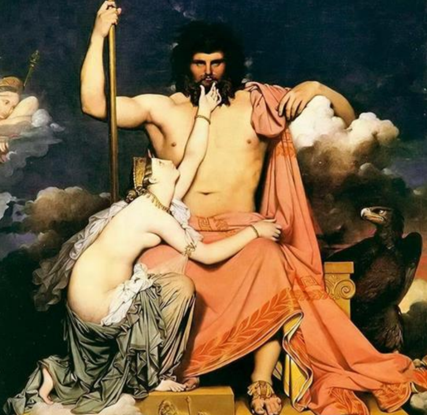

宙斯的最大特点是妻妾成群，光《神谱》中确认的就有 7 个，分别是聪慧女神墨提斯、 正义女神忒弥斯、大洋河流神女儿欧律诺墨、谷物女神德墨忒尔、记忆女神摩涅莫绪涅、暗 夜女神勒托和最后的天后赫拉。宙斯娶前几任妻子时都没有大操大办，唯独娶赫拉时，赫拉多留了个心眼，坚持要大操大办、昭示天下。所以赫拉才拥有了“天后”的称号。虽然宙斯 娶了赫拉以后依然风流不改，但后面的女人都不再被看作是宙斯的妻子了。

为了避免重蹈爷爷和父亲的覆辙，宙斯直接将怀孕的聪慧女神墨提斯吞进了腹中，从此 拥有了墨提斯的智慧。但后来，墨提斯和宙斯的女儿雅典娜延续了他们家小孩从父亲体内诞 生的传统，穿戴整齐地从宙斯的头颅中跳了出来。

在希腊奥林匹亚城的宙斯神殿中有一座巨大的宙斯神像，是当时世界上最大的室内雕像， 被誉为“世界七大奇迹”之一。

**词根：**

宙斯的名字 Zeus 来自希腊语，属格形式为 dios。它和拉丁语 deus（神）都来自原始印 欧语 dewos-（神）。与它们同源的还有英语词根 de-/div-（神）和英语单词还有 deity（神）、 deify（神化）、divine（神圣的）等。

**相关单词：**

- **Zeus**： [zju:s] n. 宙斯（希腊神话中的主神）
- **`de-`**/**`div-`**：神
- **deity**：['deəti] n. 神；神性
- **deify**：['deɪfaɪ] vt. 把…奉若神明；把…神化；崇拜
- **divine**： [dɪ'vaɪn] 
  - adj. 神圣的；非凡的；天赐的 
  - v. 占卜；预言；用占卜勘探

#### Jupiter(古罗马)

**背景：**

在罗马神话中，天神宙斯（Zeus）被称为 Jove。

**词根：**

- 为了表示尊重，罗马人又称其为 **Jupiter** （朱庇特），由 **`Jove`**+**`peter`**（父亲）组合而成，意思就是“*诸神之父 Jove*”。
- 从朱庇特的名 字 **Jove** 中产生了英语单词 ***jovian***，表示“像朱庇特那样的”。
- 木星（**Jupiter**）以朱庇特的名字命名。
- 由于朱庇特天性风流快活，与无数仙女、凡人美女有染，因此占星学认为出生于木星宫的人天性快活，所以单词 **jovial**（木星宫的）也含有“天性快活的”的含义。
- 一个常见 的英语单词 **joke**（玩笑）也来自 **Jove**，因为他天性快活，喜欢开玩笑。

**相关单词：**

- **Jupiter**：['dʒuːpɪtə] n.朱庇特，木星
- **Jove**：[dʒəuv] n.朱庇特，木星（等于 Jupiter）
- **jovian**： ['dʒəuviən] adj.威风凛凛的，朱庇特的
- **jovial**：['dʒəʊvɪəl; -vj(ə)l] adj.天性快活的，木星宫的。
- **joke**：[dʒəʊk] 
  - n.玩笑，笑话 
  - vt.开……的玩笑 
  - vi.开玩笑
- **Julius**：['dʒuljəs] n. 朱利叶斯（男子名）

### 43. 天后赫拉/朱诺

#### Hera (古希腊)

**背景:**

赫拉（**Hera**）是是古希腊神话中的天后，奥林匹斯十二主神之一，奥林匹斯众神中地位及权力为最高的女神，掌管婚姻和生育，捍卫家庭。赫拉是[第二代神王克洛诺斯](#14. 第二代神王 )和[瑞亚](##3. 大地女神)的女儿，宙斯的姐姐，后来与宙斯结婚，成为宙斯唯一的合法妻子。她的标志是孔雀。

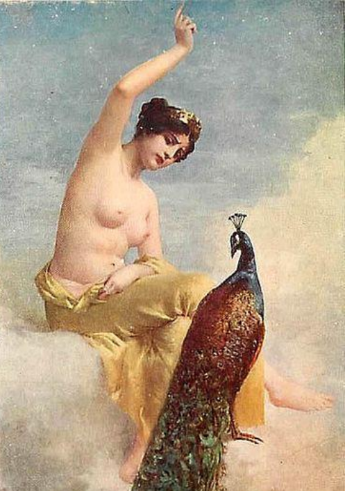

虽然风流成性的宙斯不断地背着他合法的妻子们勾引别的女人或女神，众神之母赫拉也从没有背叛过她的丈夫。

在忠于爱情的同时，赫拉是一个嫉妒心极强的女人，她憎恨每一个与她丈夫有亲密关系的人，她利用她的权力和地位惩罚那些女人。

如宙斯为了瞒过赫拉而把 情人伊俄变成了母牛，后被赫拉所识破，对她加以迫害。赫拉命令百眼巨人阿耳戈斯负责看守着她，不但不能让她逃跑，更不许宙斯找到她。后来宙斯为了解救伊俄，派赫耳墨斯将阿 耳戈斯杀死，释放了伊俄。

为了褒奖阿耳戈斯的忠诚，赫拉将阿耳戈斯的眼睛全部点缀在她的圣鸟孔雀的羽毛上。随后赫拉还派出大牛虻去叮咬伊俄，使她被迫逃离希腊。

**词根：**

赫拉的名字 **hera** 在希腊语中的含义是“女主人、女保护者”，是 **heros**（**hero**，保护者） 的阴性名词形式。与英语单词 **hero**（英雄）同源。

**相关单词:**

- **Hera**：['hiərə]   n. 赫拉（主神宙斯之妻）
- **hero**：['hɪro]  n. 英雄；保护者；男主角，男主人公

#### Juno (古罗马)

**背景：**

在罗马神话中，天后叫做朱诺（**Juno**）。在拉丁语中，**Juno** 的意思是“年轻的”，与单 词 **junior**（年少的、下级的）同源。

六月正值初夏之际，莺飞草长、百花盛开，是婚嫁的绝好时机，罗马人常常选择在此月 内结婚，于是就用婚姻女神朱诺为其命名，称为 ***Junius mensis***（Juno’s month）。英语中的六 月 **June** 就是从此而来。

由于朱诺贵为天后，集美貌和高贵气质于一身，因此人们常常用 **junoesque** 一词（像朱诺一样）来赞美女性高贵优美。

**词性：**

在拉丁语中，**Juno** 的意思是“年轻的”，与单 词 **junior**（年少的、下级的）同源。

**相关单词：**

- **Juno**： ['dʒu:nəu] n. 朱诺（主神朱庇特的妻子）
- **June**：[dʒu:n] n.六月，琼
- **junoesque**：[,dʒʊno'ɛsk]  adj.高贵优美的，端庄的，像朱诺那样的
- **junior**：['dʒunɪɚ]
  - adj.年轻的，下级的
  - n.年少者，晚辈，后进入者，大三学生

**Juno Moneta:**

在罗马神话中，天后朱诺（Juno）曾多次警告罗马人即将出现的危险，帮助他们渡过难 关。因此罗马人把她看作是罗马的警告女神，尊称她为“**Juno Moneta**”（警告者朱诺），单 词 **`moneta`** 就是“警告者”、“监视者”的意思，来自拉丁语动词 ***monere***（警告）。

罗马人为 **Juno Moneta** 建了一座神庙，后来又把第一个造币厂设在了神庙里，希望女神 能守护他们的财富。因为货币最早是在 Juno Moneta神庙铸造出来的，所以罗马人就用 **`moneta`** 来表示货币，英语中的 **money**（钱）和 **mint**（造币厂）都是源自“**`moneta`**”这个单词，而单 词 **monetary**（货币的）更是保留了 **`moneta`** 的拼写形式。

同源的英语单词还有：**monitor**（监视器）、**monitory**（训诫的）、**monition**（忠告）、**monument** （纪念碑）等。

- **money**：['mʌnɪ]  n.钱，货币，财富

- **mint**： [mɪnt]

  - n.薄荷，造币厂

  - 厂 vt.铸造，铸币

- **monetary**： ['mʌnɪt(ə)rɪ]  adj.货币的，财政的

- **monitor**： ['mɔnɪtɚ]

  - n. 监视器；监听器；监控器；显示屏；班长

  - vt. 监控

- **monitory**： ['mɑnə,tori]

  - adj. 训戒的

  - n. 告诫书

- **monition**：[mə'nɪʃ(ə)n]

  - n. 忠告；法庭传票；

  - 宗教法庭的诫谕

- **monument**： ['mɑnjumənt]

  - n. 纪念碑；历史遗迹；不朽的作品 

  - vt. 为…树碑

### 44.  海神波塞冬/尼普顿

#### Poseidon (古希腊) 

**背景:**

希腊神话中，海神波塞冬（**Poseidon**）是[众神之主宙斯](#42. 第三代神王宙斯/朱庇特)的哥哥，地位仅次于宙斯。他与宙斯及其他兄弟姐妹推翻父亲[克洛诺斯](#14. 第二代神王 )的统治后，分得了大海的统治权。

波塞冬住在海底金碧辉煌的大宫殿里，所有海洋生物都受他差遣。每天，他驾着马车，手持三叉戟出来巡海。 当他心情好的时候，大海就会风平浪静。当他心情不好时，就会挥舞三叉戟，掀起滔天巨浪， 摧毁渔船。波塞冬法力强大，还能制造海啸和地震，袭击海岸。他的形象通常是手持三叉戟 的肌肉猛男。

波塞冬的妻子是海中仙女**安菲特里忒**（**Amphitrite**）。据说安菲特里忒并不想嫁给波塞冬， 所以躲藏起来。但一只海豚发现了她的藏身之处，帮助波塞冬找到了她。为了表示感谢，波 塞冬把这只海豚变成了海豚星座。

波塞冬还喜欢上了美貌的仙女[美杜莎](#105. Gorgon 尖牙蛇发戈耳工)，在雅典娜的神殿里强奸了美杜莎。雅典娜十分生 气，就把美杜莎的头发变成蛇发，使她的目光具有魔力，凡是被她看到的男人都会变成石头。

波塞冬曾经帮忙修建了特洛伊的城墙，但特洛伊国王拉俄墨冬拒绝支付报酬。因此，波塞冬便召来巨大的海怪毁坏大地。

参加特洛伊战争的希腊英雄[奥德修斯](#*Odyssey*《奥德赛》)在回国途中，杀死了波塞冬的儿子、独目巨人[波吕斐摩斯](#98. Cyclops 独眼巨人)。波塞冬便在海上兴风作浪，摧毁了奥德修斯的舰队。

<figure>
  
  <figcaption>名画：《海神的凯旋》 作者：普桑.</figcaption>
</figure>

**词根：**

- 波塞冬的名字 **Poseidon** 与希腊语词根 **`posis-`**（强大的）有关，以示其威力强大。
- 该词根与原始印欧语词根 **`poti-`**同源。
  - 英语中表示“能力”的词根 **`pos-`**/**`pot-`**也源自于此。

**相关单词:**

- **`pos-`**/**`pot-`**：能力，强大
- **Poseidon**：[pɔ'saidən] n.波塞冬，海神
- **possible**: ['pɒsɪb(ə)l] adj.可能的 n.可能性
- **potent**：['pəʊt(ə)nt] adj.有效的，强有力的
- **impotent**：['ɪmpət(ə)nt] adj.无效的，虚弱无力的，阳痿的。前缀 im 表示否定
- **potential**：[pəˈtenʃl] adj.潜在的，可能的 n.可能性，潜能

#### Neptunus (古罗马) 

**背景：**

在罗马神话中，海神叫做尼普顿（**Neptunus**），在英语中拼写为 **Neptune**

**词性：**

- 在***天文学***上， 海王星就是以海神 **Neptune** 命名的，因为它的颜色为海洋一样的蓝色。
- 在***化学领域***，93号元素以海神命名，称为 **Neptunium**（镎），因为它排在 92 号元素 **Uranium**（铀）的后面，而 **Uranium** 就是以天神乌拉诺斯命名的。

**相关单词：**

- **Neptune**：['nɛptjun] n.海王星，海神尼普顿
- **Neptunian**：[nɛp'tjʊnɪən] adj.海神的，海王星的，水成论的
- **Neptunium**：[nɛp'tjunɪəm] n.（化学元素）镎

### 45.  谷物女神得墨忒耳/刻瑞斯

#### Demeter 古希腊

**背景：**

得墨忒耳（**Demeter**）是希腊神话中奥林匹斯十二主神之一，宙斯的姐姐和第四任妻子， 掌管农业生产，亦被称为丰饶女神。

她给予大地生机，教授人类耕种。她与宙斯生的女儿叫做 **珀尔塞福涅**（**Persephone**），后来被[冥王哈迪斯](#54 冥王哈迪斯/普鲁托)抢去做了冥后。因为失去女儿，得墨忒耳无心过问农事，导致大地失去生机，庄稼死亡，饥馑遍地，人们再也没有祭品来供奉神灵。

于是[众神之王宙斯](#42. 第三代神王宙斯/朱庇特)命令冥王释放珀尔塞福涅。冥王不敢违命，但又不甘心，就在珀尔塞福涅离开之际，偷偷让她吃下石榴籽，使得她无法断绝与冥府的联系。因此，珀尔塞福涅每年有 8 个月时间在人间陪伴母亲，4 个月时间重返冥府陪伴冥王。

在有女儿陪伴的时期，谷物女神心情愉快，世间万物蓬勃生长；而在女儿离开的4个月中，谷物女神心情低落，万物枯竭， 这就是人间的冬天。就这样，人间出现枯荣轮回，人类也不能再像黄金时代那样不劳而获， 坐等庄稼自己长出来，而是需要去播种耕耘。

<figure>
 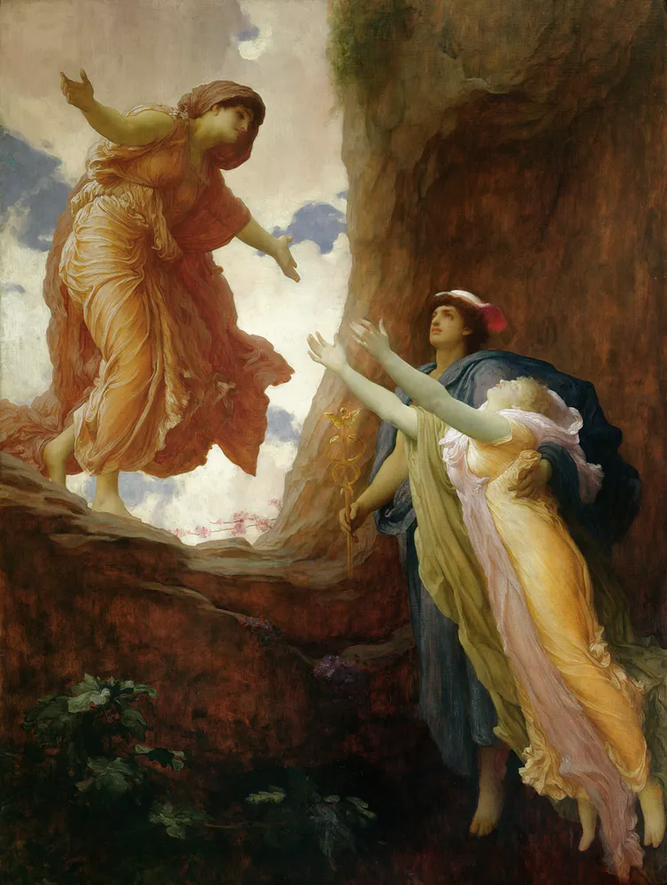
  <figcaption>Frederic Leighton, The Return of Persephone, 1891. Wikimedia Commons</figcaption>
</figure>

1. [**Explainer: the story of Demeter and Persephone**](https://theconversation.com/explainer-the-story-of-demeter-and-persephone-110898)

**词根：**

- 得墨忒耳的名字 Demeter 来自希腊语，前一部分很可能来自希腊词根 **`ge-`**（大地）的*多利安变体* **`da-`**，后一部分通常被看作是 ***mater***（mother）的变体，因此 **Demeter** 的字面含义就 是“大地母亲”。
- 英语词根 **`mater-`**（母亲）便来自希腊语 ***mater***（母亲）。

**相关单词:**

- **`mater-`**/**`matr-`**/**`matri-`**： 母亲
- **maternal**：[mə'tɝnl] adj. 母亲的；母性的；母系的；母体遗传的
- **matter**：['mætɚ]  
  - n. 物质（世界之母体）
  - vi. 有关系；要紧
- **material**：[mə'tɪrɪəl]  
  - adj. 物质的，实质性的；重要的 
  - n. 材料，原料；物资

#### Ceres (古罗马)

**背景：**

- 罗马神话中，谷物女神被称作刻瑞斯（Ceres）。

**词根：**

- 英语单词 **cereal** 就来自谷物女神*刻瑞斯* 的名字，表示“谷物”。
- 化学元素铈（**cerium**）也是以谷物女神的名字命名的。

**相关单词：**

- **Ceres**：['siəri:z]  n. 刻瑞斯（谷物女神）
- **cereal**：['sɪərɪəl]  
  - n.谷物，谷类植物，谷类食物，麦片 
  - adj.谷物的，谷类的
- **cerium**：['sɪərɪəm] n.（化学元素）铈

### 54 冥王哈迪斯/普鲁托

#### Hades (古希腊)

 背景

- 宙斯的大哥叫做哈迪斯（Hades）,掌管冥界。

- 妻子： 珀尔塞福涅(Persephone)（谷物女神的女儿）

·    词性

- Pluto-

- 拉丁名字 Pluto 就来自希腊语 plouton，意思是“财富、富有”

- 由于地下埋藏着各种各样的宝藏，所以冥王拥有大量财富，成为了西方的财神爷

·    相关单词

- Hades： ['heidi:z]
- n. 冥王，阎王；冥府，地狱
- hadal： ['heɪdəl]
- ] adj.超深渊的，超过 6000 以下深水的，海沟的
- 人们认为超过这个深度就应该到达哈迪斯所管辖的冥府了

#### Pluto (古罗马)

- pluto-
- 财富，富有
- Pluto： ['plʊto]
- n.冥王星，冥王
- plutonic：[plʊ'tɑnɪk]
- adj.冥王星的，深成的，深成岩的
- plutonium：[plu'tonɪəm]
- n. [化学] 钚（94 号元素）
- 源自 Pluto（冥王星），因为这种元素在元素周期表中排名 94 号，位于 Neptunium（镎）之后，恰如冥王星位于海王星之后

### 55. 小爱神

### 56. 灶神赫斯提亚/维斯塔

### 57. 青春女神

### 58. 毁城女神厄倪俄/贝罗纳

### 59. 战神之子福波斯

### 60. 文艺女神缪斯

### 61. 缪斯女神克利俄

### 62. 缪斯女神卡利俄佩

### 63. 和谐女神

### 64. Asclepius  医术之神

·    背景

- 希腊语 Asclepius，拉丁语 Aesculapius。是希腊神话中的医术之神，
 是太阳神阿波罗和塞萨利公主科洛尼斯（Coronis）结合所生的儿子。

- Asclepius死后被宙斯升上天空，化为蛇夫座。从此人们将阿斯克勒庇俄斯奉为医神

- 阿斯克勒庇俄斯经常拿着有巨蛇盘缠的手杖。手杖象征知识、权威，蛇象征医学。所以蛇与手杖已成为国际通行的医药卫生标志。

·    词性

·    相关单词

- aesculapian：[,i:skju'leipiən]

- n.医生

- adj.医术的，医学的，阿斯克勒庇俄斯的

### 65. 健康女神

·    古希腊

- 背景

- Hygieia是医药神阿斯克勒庇俄斯的女儿，医药女神帕那刻亚的姐妹。

- 她掌管清洁卫生和健康，其形象通常是一个用碗喂蛇的少女。许癸厄亚的碗跟其父亲阿斯克勒庇俄斯(Rod of Asclepius)的蛇杖一样，有一条蛇盘旋在上，两者同样具备医学、健康的象征意义，是现今世界常用的符号之一。

- All of Europe

- Austria

- Germany

- Hungary

- 目前，许癸厄亚之杯已成为了欧美国家药店的标志。在几乎所有药店的入口，都会悬挂一个这样的记号。

- 词性

-  Hygieia 来自希腊语 hygies（健康）。英语单词 hygiene（卫生保健）就来源于此。

- 相关单词

- hygiene： ['haɪdʒiːn]

- n.卫生，保健

- hygienic：[,haɪdʒɪ'ɛnɪk]

-  adj. 卫生的，保健的；卫生学的

- hygienist：[haɪ'dʒinɪst]

-  n. 卫生学者；保健专家

·    古罗马

- 背景

- 在罗马神话中，对应的健康女神叫做萨卢斯（Salus）。萨卢斯得到古罗马人广泛崇拜与供奉，并于每年八月五日进行相关活动。

- 词性

-  Salus 在拉丁语中就是“身体健康”的意思，与形容词 salvus（safe，安全）有关

- 英语单词 salute 就来自 Salus，本意是“祝身
 体健康”，引申为“致敬，行礼”。

- 同源的单词还有 salutary（有益的）。

- 相关单词

- salute：[sə'lut] 

- v.n.行礼，致敬，欢迎

- salutation：['sæljʊ'teʃən]

- n.称呼，致敬，问候，招呼

- salutatory：[sə'ljuːtət(ə)rɪ]

- adj. 致敬意的；表示欢迎的

- n. 祝词；开幕词

- salutary：['sæljə'tɛri]

- adj.有益的，有用的，有益健康的

- salubrious：[sə'lubrɪəs]

- adj. 清爽的；气候有益健康的

### 66. Panakeia 医药女神

·    背景

- 帕那刻亚（Panakeia）是医药神阿斯克勒庇俄斯的女儿，光明神阿波罗的孙女。

- 阿斯克勒庇俄斯共有 5 个女儿，分别代表了阿波罗的一种医药能力，其中以帕那刻亚和许癸厄亚最为有名。

- 古代医生在开始正式从业前，要宣读著名的希波克拉底誓词，宣誓对象除了阿波罗与阿斯克勒庇俄斯外，还包括许癸厄亚和帕那刻亚姐妹俩。

·    词性

- 帕那刻亚的名字 Panakeia 在希腊语中是“治疗一切”的意思，由 pan（全部）和 akos （治愈）构成，相当于英语中的 all+cure。

·    相关单词

- panacea：[,pænə'siə]

- n.包治百病的灵丹妙药

### 67.  美惠三女神

### 68. Horae 时序女神

### 69. Irene 和平女神

### 70. Hymen 婚礼之神

### 71. Iris 彩虹女神

## 四、 暗黑神族

### 背景

希腊神话中，五大原始神当中的[黑暗之神厄瑞玻斯](#5. Erebus 黑暗神)（Erebus）和[黑夜女神倪克斯](#6. Nyx 黑夜女神)（Nyx） 结合衍生出了一系列神祇，被称为“暗黑神族”。

泰坦神族衰败后，暗黑神族成为一支能对 奥林波斯神族构成威胁的族系。经过时间的推移，他们中间慢慢开始分化瓦解，其中一部分成为了奥林波斯的居民。譬如命运三女神、双子神桑纳托斯和许普诺斯成为了冥王的亲信； 还有一些黑暗系神族不知所踪，有传言说他们被宙斯秘密封印。

### 72. 命运三女神

### 73. 纷争女神厄里斯/狄斯科耳狄亚

### 74. Nemesis  报应女神

·    背景

- 因被宙斯OOXX生下倾国倾城的美女海伦，从此走上惩罚报应之路。希腊神话中的涅墨西斯（Nemesis）一般被译为“报应女神”，黑夜神倪克斯之女，代表着神对凡人的奖惩，她对好人给予奖赏，对坏人则会施加惩罚

·    词性

- 涅墨西斯的名字 Nemesis 在希腊语中表示“义愤”，字面意思是“分配（应得的奖惩）”，源自希腊语动词 nemein（分配）。

- 英语词根-nomo-/-nomy（治理、法则）与其同源，也来自希腊语动词 nemein（分配）。

·    相关单词

- nemesis：【nɛməsɪs】

- -nomo-/-nomy：

- 治理，管理，法则，秩序

- economy：：[ɪ'kɒnəmɪ]

- n.经济，节约，理财

- astronomy：[ə'strɒnəmɪ]

- n.天文学

- agronomy：[ə'grɒnəmɪ]

-  n.农学

- autonomy：[ɔː'tɒnəmɪ]

-  n.自治

### 75. 死神

·    古希腊

- 背景

- 在希腊神话中，掌管死亡的是死神桑纳托斯（Thanatos）。他是黑夜女神倪克斯的儿子，睡神许普诺斯的孪生兄弟。

- 词性

- 从桑纳托斯的名字 Thanatos 产生了英语词根 thanato，表示“死亡”。单词 euthanasia （安乐死）、thanatology（死亡学）等就来源于此。 

- 相关单词

- thanato-/thana-：死亡

- Thanatos： ['θænətɔs]

- n. 死的愿望；自我毁灭的本能；桑纳托斯

- euthanasia：[,juːθə'neɪzɪə]

- n.安乐死，安乐死术

- euthanatize：[ju'θænətaiz]

- vt. 对…施无痛致死术；使安乐死

- thanatology：[,θænə'tɒlədʒɪ]

- n.死亡学

- athanasy：[ə'θænəsɪ]

- n. 不死；不灭；不朽（等于 athanasia）

·    古罗马

- 背景

- 在罗马神话中，死神叫做墨尓斯（Mors），对应于希腊神话中的桑纳托斯。在西方文化中，墨尓斯常被描绘为身着黑色长袍，手持长柄镰刀的阴森老人。

- 词性

- 墨尓斯的名字 Mors 在拉丁语中就是“死亡”的意思，英语中表示“死亡”的词根 mor-/mort-就来源于此。

- 相关单词

- mor-/mort-：死亡

- mortal：['mɔːt(ə)l]

- adj.凡人的，致死的，总有一死的

- n.人类，凡人

- mortality: [mɔː'tælɪtɪ]

- n.死亡数，死亡率，必死性

- immortal:[ɪ'mɔːt(ə)l]

- adj.不朽的，长生不死的，神仙的

- n.神仙，不朽人物

- immortality: [,ɪmɔr'tæləti]

- n. 不朽；不朽的声名；不灭

- morbid：['mɔrbɪd]

- adj. 病态的；由病引起的；恐怖的；病变部位的

- moribund：['mɒrɪbʌnd]

- adj.垂死的，停滞不前的 

- n.垂死的人

- mortician：[mɔː'tɪʃ(ə)n]

- n.殡葬业者，丧事承办人

- mortuary：['mɔːtjʊərɪ; -tʃʊ-] 

- n.太平间

- adj.死的，悲哀的

- mortify： ['mɔrtɪfaɪ]

- vt. 抑制；苦修；使…感屈辱

- vi. 禁欲；苦行；约束

### 76.  睡神

###  77. 梦神

## 5. 旁系神祇

### 78. 复仇三女神

·    背景

- 第一代神王乌拉诺斯被其子克洛诺斯阉割时，溅出的精血使大地女神盖亚受孕，诞生了三位复仇女神

- 她们的形象为三个身材高大的妇女，头上长着蛇发，眼中流出血泪，双肩生有翅膀，手执火把和蝮蛇鞭。她们永不停息地追逐杀人凶手，尤其是谋杀血亲的人，使他们受到良心的煎熬，直到丧失理智。

- 为了避免激怒她们，凡人不敢直呼她们的名字，只能称她们为“温和的人”（the kindly ones）。 

·    词性

- 在罗马神话中，复仇三女神被称为孚里埃（Furia），意为“狂怒”。英语单词 怒）与其同源。fury（狂怒）与其同源

·    相关单词

- fury：['fjʊərɪ]

- n.狂怒，暴怒，激怒者

- furor：['fjʊrrɔr]

- n. 狂热；激怒；喧闹；感动

- furious：['fjʊərɪəs]

- adj.狂怒的，激烈的，热烈兴奋的，喧闹的

- infuriate：[ɪn'fjʊrɪet]

- vt. 激怒；使大怒

- 怒 adj. 狂怒

- infuriation

- [in,fjuəri'eiʃən]

- n. 激怒；激昂

### 79. 喜欢吓唬人的牧神

#### Pan (古希腊)

**背景**

希腊神话中有一个叫做潘（**Pan**）的牧神，掌管山林、田园和羊群。他长相奇特，上半 身是人，下半身是羊，头顶还长着羊角。据说，他刚出生时，母亲看见他这副怪模样，吓得 大叫一声就逃走了。神使赫尔墨斯收养了他，还经常带他到诸神所在的奥林匹斯山上玩。潘 虽然长得丑陋，但性格很好，诸神都很喜欢他，因而得名为 **Pan**，在希腊语中就是“所有” 的意思。他和其它的森林之神及仙女在山林之间闲游，过着逍遥自在、无拘无束的生活。因 此，英语习语 **a freedom of Pan** 表示“无拘无束、逍遥自在”的意思。

潘神喜欢搞恶作剧。他常常躲在隐蔽处，蓦地跳出，用丑陋的面目把路人吓得魂不附体。 他还会发出怪异的叫声，令人感到毛骨悚然，胆战心惊。这种恐惧感就称为“潘神之惧” （**Panic fear**）。传说希波战争中，希腊人在马拉松战役中取得胜利就是因为潘神把波斯军队 吓得惶恐而逃的。英语单词 panic 就源自“潘神之惧”，原本是个形容词，后来逐渐变成名 词和动词。

**词性**

- 英语单词 panic 就源自“潘神之惧”，原本是个形容词，后来逐渐变成名词和动词。

**相关单词**

- Pan：[pæn]   n.潘神

- panic：['pænɪk]

  - n.恐慌，惊慌

  - vt.惊吓，使恐慌

  - vi.惊慌，感到恐慌

- panicky：[ˈpænɪki]  adj.惊慌失措的

#### Faunus （古罗马）

**背景**

在罗马神话中，与潘神对应的神祇叫做法乌努斯（**Faunus**），掌管农林畜牧。在拉丁语 中，法乌努斯（***Faunus***）的阴性形式是 Fauna，她被视为 Faunus 的妻子或姐妹，是女牧神。

**词根**

- 18 世纪时，瑞典著名博物学家林奈用 fauna 一词来表示“动物区系”，与 flora（植物区系）相对应

**相关单词**

- fauna：['fɔːnə] n.某区域的动物群，动物区系
- faunal：['fɔnl] adj. 动物区系的
- Megafauna [me'ɡæfɔ:nə]:the component of the [fauna](https://www.collinsdictionary.com/zh/dictionary/english/fauna) of a region or period that [comprises](https://www.collinsdictionary.com/zh/dictionary/english/comprise) the larger [terrestrial](https://www.collinsdictionary.com/zh/dictionary/english/terrestrial) animals
  - Megafauna include elephants, wild horses, big cats, camels, large animals.

### 80. 幸运女神

### 81. Ploutos  财神普鲁托斯

·    背景

- 希腊神话中的财神名叫普鲁托斯（拉丁语Plutus，希腊语 Ploutos），在希腊语中的含义就是“财富”。

- 德墨忒耳【45】，光辉的女神，在富饶的克里特岛的一块犁过三遍的耕地上，与英雄伊阿西翁（Iasion）陶醉在甜蜜的爱情中，生下普鲁托斯，一位友善的神。他在陆地和海洋的宽阔背脊上四处漫游，让找到他的人或抓住他的人发财，把巨大的财富赋予他们

- 作为德墨忒耳的儿子，普鲁托斯代表大地蕴藏的财富与丰产。这也反映了古希腊人的观念：人类的一切财富均源于大地，无论果实还是矿藏。

- Poutos是古希腊的财神爷，是古罗马的（超级有钱的）阎王爷（由于地下埋藏着各种各样的宝藏，所以冥王拥有大量财富，成为了西方的财神爷。）

- 蚌埠住了

·    词性

- 英语词根 pluto-（财富）便来自希腊语 ploutos，并产生了不少与财富相关的单词。

·    相关单词

- pluto-：财富

- plutolatry：[paɪ'rɑlətri]

- n. 拜金主义；财富崇拜

- plutocracy y：[plu'tɑkrəsi]

- n. 富豪统治，富豪统治集团

- plutocrat：['pluːtəkræt]

- n. 财阀；富豪

### 82. 真理女神

**背景：**

**词根：**

**相关单词：**

### 83. 春与花神

根据[维基百科](https://en.wikipedia.org/wiki/Chloris_(nymph))，Chloris是属于宁芙仙女的一个。

In [Greek mythology](https://en.wikipedia.org/wiki/Greek_mythology), **Chloris** was a [nymph](https://en.wikipedia.org/wiki/Nymph) or [goddess](https://en.wikipedia.org/wiki/Goddess) who was associated with spring, flowers and new growth, believed to have dwelt in the [Elysian Fields](https://en.wikipedia.org/wiki/Elysium).

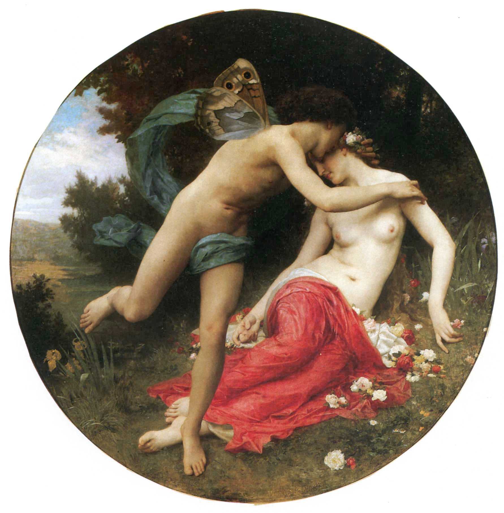

#### Cloris (古希腊)

**背景：**

希腊神话中，掌管春和花的女神叫做克罗丽丝（**Cloris**，拉丁语 ***Chloris***、希腊语 ***Khloris***）。她是春天的化身，依照赫拉的指示使得植物生长。她的助手们是时序女神们，掌管季节和生 长的周期。

据说，[西风神泽费罗斯](#40. Zephyrus 西风神)爱上了花神，在她身后紧追不舍。花神拼命奔跑，但最终 没能逃脱，被西风神揽入怀中，从她口中溢出美丽的鲜花，大地上也鲜花盛开。花神最后嫁 给了西风神。

结婚以后，西风神送给花神一座满是奇花异草的园子。春天到来的时候，花神和西风神亲密地手挽着手在园子里漫步，他们一路上走过的地方百花齐放，代表着春天的到来。

**词根：**

在希腊语中，***Khloris*** 来自 ***khloe***（春天最初长出的黄绿色嫩芽）。英语词根 **`chlor-`**（黄绿 色）便来源于此，并衍生出大量与“黄绿色”有关的单词，如化学元素氯 **chlorine**（黄绿色 物质），因为氯气呈黄绿色；人的胆汁呈黄绿色，因此胆汁被称为 **chole**。

**相关单词：**

- **`chlor-`**：黄绿色
- **chlorine**：['klɔrin] n. [化学] 氯（17 号化学元素）
- **chole**： ['koʊl] n.胆汁
- **chloromycetin**：[,klorəmaɪ'sitɪn] n. 绿霉素
- **Chloe**：['kləui] n. 克洛伊（女子名），意为“绿色”
- **chlorosis** [klə'rəʊsɪs] n. 萎黄病, 短绿病
  - **`chlor-`** = green, 表示“绿”。用在化学领域表示"氯"源自希腊语 khloros "green, greenish yellow;" khloos "greenish color."
  - **`-osis`** 医学词根，表示“病理状况”，复数形式 -oses。

#### Flora (古罗马)

**背景：**

在罗马神话中，对应的花神叫做芙罗拉（Flora）。她是女性祥和、青春、健康、性感、美好的代名词。

世上对她女性之美的赞颂一直可以追溯到荷马史诗里。早在古罗马时花神就受到萨宾人的崇拜。后来意大利人把每年4月28 日至5月3日定为“花神节”。节日期间 人民有非常放纵的竞技会，常用玫瑰花来装饰自己和动物。花神这个形象也一直以年轻美女 手持花束的姿态出现。

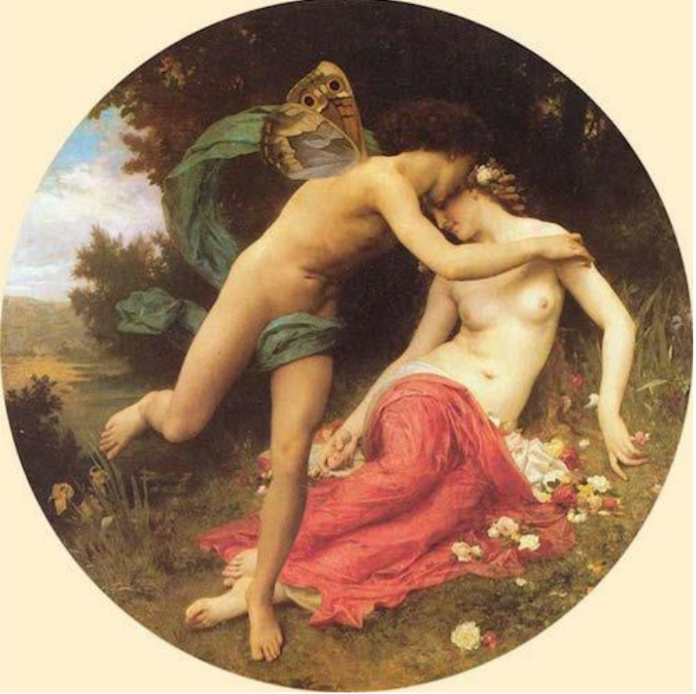

**词根：**

花神芙罗拉的名字 **Flora** 来自拉丁语名词 ***flos***（花）。英语单词 **flora** 就来自芙罗拉的名 字，表示“植物群”。英语词根 **`flo-`**（花、植物）也来源于此。

**相关单词：**

- **`flo-`**：花，植物
- **flora**：['flɔrə] n.植物群，植物区系
- **floral**：['flɔːr(ə)l; 'flɒ-] adj.植物的，花的
- **florid**：['flɔrɪd] adj. 绚丽的；气色好的
- **florist**： ['flɔrɪst] n. 花商，种花人；花卉研究者
- **flower**：['flaʊɚ] n.花，精华 v. 开花
- **flour**：['flaʊɚ] n.面
- **flourish**：[ˈflɜːrɪʃ] n.v.繁荣、兴旺

**References**

1. [**Goddess of the Week:** Chloris *(Flora)*, transformation](https://eclecticlight.co/2021/02/08/goddess-of-the-week-chloris-flora-transformation/)

### 84. Proteus  海中老人普罗透斯

·    背景

- 普罗透斯（Proteus）是希腊神话中的一个早期海神，荷马史诗中所说的“海中老人”之一。他有预测未来的神通，但只向能逮住他的人透露预言。为了避免被人逮住，他拥有随意改变自己形状的神力。他居住在尼罗河三角洲海岸外的法罗斯岛上，以放牧海兽为生。

- 参加特洛伊战争的斯巴达国王墨涅拉奥斯（Menelaus）从特洛伊启程回国前触犯了神灵，被困在法罗斯岛上。在这里他遇到了普罗透斯的女儿。

·    词性

- 普罗透斯的名字 Proteus 非常有意思，它来自希腊语 protos（第一）。古话说，一生二，二生四，四生万物，Proteus 这个名字就暗示着他能够千变万化。

- 英语词根 proto-（第一、最初）就来源于此。由 Proteus 衍生出形容词 protean，意思是“千变万化的”。

·    相关单词

- proto-：第一，最初

- Proteus：['prəʊtɪəs]

- 多变的人

- 普罗透斯（希腊海神）；

- 变形杆菌属

- protean： ['prəʊtɪən; prəʊ'tiːən]

- 千变万化的，一人分饰多角的，变形虫的

- protocol：['protə'kɔl]

- n. 协议；草案；礼仪

-  v. 拟定。本意为“第一页”

- proton：['protɑn]

- n. 质子

- protein： ['protin] 

- n. 蛋白质；朊

- ruǎn

- 蛋白质的旧称

- adj. 蛋白质的

- protoplasm：['protəplæzəm]

- n. 原生质；原浆；细胞质

- prototype： ['protə'taɪp]

- n. 原型；标准，模范

- prototypical：[,protə'tɪpɪkl]

- adj. 原型的；典型的

- protagonist：[prə'tæɡənɪst]

protagonist - 古希腊人每逢庆祝活动时，总爱举行希腊语称之为agōn的有奖竞技比赛，而此类奖项总是要经过艰难的搏斗才能争得。他们又根据agōn造出agōniā一词来表示“艰难的搏斗”，该词以后转指“极度痛苦”。古罗马人从希腊语借用了这两个词，并且保留了原义。英语agony一词即源于此。14世纪时英格兰神学家、宗教改革先驱者之一威克里夫（John Wycliffe, 1330? -1384）在翻译《圣经》时首次将它用于英语。《圣经》中有一段是描述耶稣在客西马尼花园（Garden of Gethsemane）蒙难时所遭受的精神上的极度痛苦。威克里夫也将agony用于“极度痛苦”一义，此义一直用至今日。但在日常口语中，agony也可用以指一般的艰辛。1863年英国的《谐趣杂志》（Fun）首次设了一个名为agony column的广告栏，登载寻人、寻物、离婚等启事，其作用相当于personal column，汉译可作“私事广告栏”。另一个词antagonize（使对抗，招怨）及其派生词antagonism（对抗），antagonist（对手），protagonist（主人公）等也源自希腊语agōn，其词根就是agōn。

 例　I could see that she was in agony but there was nothing I could do. 我看得出她非常痛苦，但我帮不了她。

 In an agony of suspense and fear, I waited for the verdict. (CCE) 我在焦虑和恐惧的痛苦之中等候着判决。

 We've both suffered agonies of guilt at what has happened. 我们俩为所发生之事深感内疚。

- n. 主角，主演；主要人物，领导者

- Summary

- proto-原始的，最早的 + col-胶。即最早粘上去的，引申词义协议，草案，后引申词义官方文件，特别用于指政府外交部的官方文件，外交礼仪。

### 85. Pallas 被雅典娜误杀的小伙伴

### 86. Janus 双面门神

### 87. Maia  春天女神玛雅

·    背景

- 古罗马神话中，Maia（玛雅）是专门掌管春天和生命的女神，她的名字的含义就是“能使万物生长者”。
 为了纪念这位女神，罗马人就用它的名字来命名 5 月（罗马历中的 3 月）。

- 在拉丁语中称为 Maius, 意思就是 month of Maia。英语中表示“5 月”的单词 May 就源自拉丁语 Maius。

·    词性

·    相关单词

### 88. Genius 守护神

### 89. Terminus 掌管边界的界神

## 六 nymph：[nɪmf]  宁芙仙女

**背景：**

宁芙（**Nymph**）是希腊神话中一类具有不完全神性的生物，有时也被翻译成精灵和仙女， 常出没于山林、原野、泉水、大海等地，喜欢歌舞。她们是自然幻化的精灵，一般以美丽而 多情的少女形象出现。

Nymph 一词在希腊语中来自 nymphe（新娘、年轻媳妇）。在英语中，nymph 被用来比喻美丽多情的少女。

在希腊神话中，美丽多情的宁芙仙女对男人具有一种魔力，任何男人只要和她四目相对， 立刻就会陷入对其不可抑制的强烈爱慕中。18世纪，旅行家理查德·钱德勒（Richard Chandler） 在其作品《希腊游记》中，根据这个传说创造了 nympholepsy 一词，由 nymph（宁芙）和 lepsy （抓住、捕获）组成，字面意思就是“被宁芙仙女迷住”。

希腊神话中有许多关于宁芙仙女的魅力传说。据说，大英雄赫拉克勒斯的同伴海拉斯在山泉中打水时，遇到一群宁芙仙女，被她们引诱而成亲。该传说被西方画家描绘下来，成为不朽的作品。

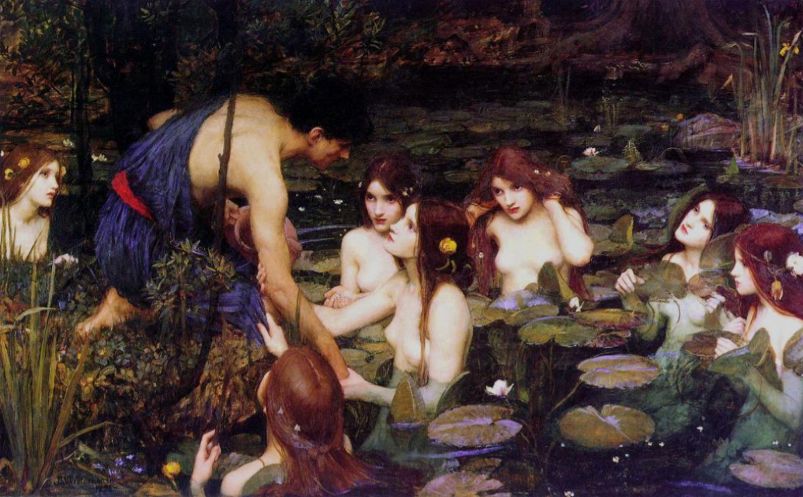

**词根：**

**Nymph** 一词在希腊语中来自 **nymphe**（新娘、年轻媳妇）。在英语中，**nymph** 被用来比喻美丽多情的少女。

**相关单词：**

-  nymph：[nɪmf] n.宁芙仙女，山林水泽仙女，美丽的少女，蛹

- nymphaea： [nim'fi:ə]   n.睡莲属

- nymphaeaceous：[,nɪmfɪ'eʃəs]  adj. 莲科植物的

- nymphomania：[,nɪmfə'meɪnɪə]  n.女色情狂，慕男狂，花痴

- nymphomaniac：[,nimfəu'meiniæk] n. 女色情狂；花痴 adj. 女子淫狂的

- nympholepsy：['nɪmfə(ʊ),lepsɪ] n.狂热，着迷，狂乱

  > 18世纪，旅行家理查德·钱德勒（Richard Chandler）在其作品《希腊游记》中，根据这个传说创造了 nympholepsy 一词，由 nymph（宁芙）和 lepsy （抓住、捕获）组成，字面意思就是“被宁芙仙女迷住”

### 90. Daphne 化为月桂树的达芙妮

·    因此，在希腊语中，月桂树就被称为 daphne。

·    daphne：['dæfni]

- n.月桂树，达芙妮（女子名）

·    laurel： ['lɒr(ə)l] 

- n.桂冠，殊荣，月桂树 
- vt.使戴桂冠，授予荣誉

### 91. Echo 爱你在心口难开

### 92. Syrinx 化为芦苇做成笛

### 93. Callisto 化为母熊成星座

## 7. 妖魔鬼怪

### 94. Typhon  巨怪提丰

·    背景

- 对泰坦神的严厉惩罚引发了老祖宗大地女神盖亚【3】的不满。因此，盖亚与深渊神塔尔塔罗斯【4】交配，生下了一个体格无比庞大的怪物提丰（Typhon），前来挑战奥林匹斯诸神

- 提丰虽然被制服了，但他生出了许多怪物，如看守地狱的三头犬、九头蛇、奇美拉、斯芬克斯等，可算是希腊神话中的妖魔鬼怪的老祖宗

·    词性

- 提丰的名字 Typhon 在希腊语中就是“狂风、旋风”的意思，英语单词 typhoon（台风）便来源于此

·    相关单词

- typhoon：[taɪ'fuːn]

- n.台风

-  typhonic：[taɪ'fɑnɪk]

- adj.台风的，台风似的

### 95. Gigantes 蛇足巨人族

### 96. Antaios 从大地汲取力量的巨人

在希腊神话中，大地女神盖亚和海神波塞冬生下了一个巨人，名叫安泰俄斯（**Antaios**）， 含义就是“***对立的***”，源自表示“***对立***”的前缀 **`anti-`**。

安泰俄斯力大无穷，并且只要接触地面即可从大地女神那里获得源源不穷的力量。安泰俄斯居住在利比亚，强迫所有经过他的 土地的人与他摔跤，并把他们杀死。他这么做的目的是收集死者的头骨好为他的父亲波塞冬 建立一座神庙。

当希腊神话中最伟大的英雄赫拉克勒斯（Heracles）经过利比亚时，安泰俄 斯也要求他与自己摔跤。赫拉克勒斯发现了安泰俄斯的秘密，于是将安泰俄斯举到空中使其 无法从大地女神那里获取力量，这样才把他扼死了。

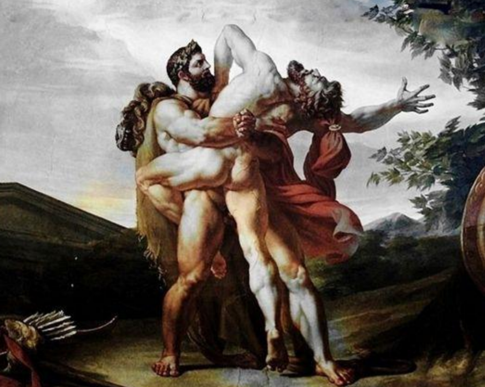

安泰俄斯的名字进入英文后拼写变为 Antaeus。形容词 antaean（巨大的）就来自它的名字。

- **antaean**：[ænˈti:ən] adj.巨大的，安泰俄斯的

### 97. Argos 百眼巨人阿尔戈斯

### 98. Cyclops 独眼巨人

**背景：**

在赫西奥德的[《神谱》](#*Theogony*《神谱》)中，天神乌拉诺斯和大地女神盖亚所生的子女中，除了十二泰坦 神外，还有三位独眼巨人（**Cyclops**）。他们额头中只有一只圆眼睛。乌拉诺斯惧怕他们的力 量，把他们囚禁在黑暗深渊之中。后来宙斯为了对抗泰坦，将他们从黑暗深渊之中释放出来。 他们为宙斯锻造了雷电，为哈迪斯锻造了隐形头盔，为波塞冬锻造了三叉戟，为阿耳特弥斯 锻造了弓和月光箭，为阿波罗锻造了弓和太阳箭。

而在荷马的[《奥德赛》](#*Odyssey*《奥德赛》)里，独眼巨人是波塞冬的孩子，居住在遥远国度里。这个种族的 特点是粗野，喜食人。特洛伊战争结束后，奥德修斯在返航途中迷途，在岛屿上遭遇了独眼 巨人波吕斐摩（**Polyphemus**）。独目巨人把他们关在洞穴里并吃他的同伴。奥德修斯用葡萄酒灌醉了波吕斐摩并用烧红的木桩戳瞎了他的独眼，然后躲在绵羊的肚子下逃出了洞穴。

**词根：**

- 在希腊语中，独眼巨人被称为 **kyklops**，由 **`kyklos`**（=cycle，圆）和**`-ops`**（眼睛）构成， 字面意思就是“圆眼睛”。

- 英语词根 **`cycl-`**（圆）就来自希腊语词根 kyklos。

**相关单词：**

- **`cycl-`**：圆，环，圈
- **Cyclops**：['saɪklɑps] n. 库克罗普斯（独眼巨人）
- **cyclopean**：[sai'kləupjən] adj.独眼巨人的，巨大的，巨石式的 n.蛮石，乱石堆
- **cycle**：['saɪkl] n. 循环；周期 v. （使）循环；（使）轮转；骑自行车
- **cyclic**： ['saɪklɪk] adj. 环的；循环的；周期的
- **cyclist**： ['saɪklɪst] n. 骑自行车的人
- **recycle**：[,ri'saɪkl] vt. 使再循环；使…重新利用 vi. 重复利用 n. 再循环；重复利用
- **bicycle**： ['baɪsɪkl] n. 自行车 vi. 骑脚踏车 vt. 骑自行车运送
- **motorcycle**： ['motɚ'saɪkl] n. 摩托车；机动车 vi. 骑摩托车

### 99. Centaur 狂野马人肯陶洛斯

### 100. Satyr 好色的羊人萨堤尔

### 101. Chimera 猎人宝宝奇美拉

### 102. Hippocampus 马头鱼尾海中怪

### 103. Hydra 九头蛇怪海德拉

### 104. Python 巨蟒皮同会编程

**背景**

在希腊神话中，当天后赫拉听说勒托（Leto）怀上了宙斯的孩子后，大为恼火，想方设法阻扰勒托的生产，并派出一条名叫“皮同“（Python）的巨蟒来袭击勒托。

勒托被巨蟒追得无处栖身，后来逃到海中一个荒岛上才找到一个生产之地。勒托花了九天九夜才生下一对孪生子，即月亮女神阿尔忒弥斯和光明神阿波罗。

阿波罗长大后，替母复仇，在德尔斐（Delphi）附近的海湾杀死了巨蟒皮同。人们在德尔斐修建了一座阿波罗神殿作为纪念。因为阿波罗拥有强大的预言能力，所以该神殿以其准确的“神谕”（Oracle）而闻名。

 **词性**

- 英语单词 python（巨蟒）就源自被阿波罗杀死的巨蟒的希腊语名字 Python。在希腊语中，Python 的来源可能与德尔菲的旧称 Pytho 有关

- Delphi

 **相关单词**

- python：['paɪθɑn]  巨蟒，大蟒
- pythonic：[pai'θɔnik, pi-]     adj.巨蟒似的；预言的，神谕的

**[What is the difference between a serpent, cobra and a python?](https://www.quora.com/What-is-the-difference-between-a-serpent-cobra-and-a-python)**

The word “**Serpent**” is a generic, and rather old-fashioned, term referring to snakelike animals. It is rather more fanciful than an actual technical term, so you might for example see the phrase “sea serpent” - which, in terms of real animals, may refer more correctly to a giant Oarfish and not to a snake at all.

The word “**Cobra**” is typically applied to venomous snakes which have some sort of mechanism for spreading out their neck horizontally to look like a “hood” and typically a vertical defensive stance when disturbed - particularly animals of the genus Naja (true cobras) and Ophiophagus (King cobras). There is a venomous colubrid of genus Hydrodynastes that is known as a “False Water Cobra” and is also able to spread its neck ribs in such a way as to form a hood, although they do not have the defensive upright stance of the true cobras.

The word “**Python**” refers to egg-laying non-venomous constricting snakes in the family *Pythonidae* - including animals like royal (ball) pythons, green tree pythons, reticulated pythons and carpet pythons. It specifically excludes the livebearing (ovoviviparous) Boas.

### 105. Gorgon 尖牙蛇发戈耳工

在希腊神话中，戈耳工（**gorgon**）是三个长有尖牙、头生毒蛇的恐怖女妖，她们是[海神福耳库斯](#9. Pontos  海神蓬托斯)(海之愤怒)与[刻托](#9. Pontos  海神蓬托斯)(海之危险)的三个女儿，其中最有名的是最小的美杜萨（**Medusa**）。

传说美杜莎原本是个满头金发的美女。[海神波塞冬](#44.  海神波塞冬/尼普顿)被美杜莎所吸引，在雅典娜的神殿内强行奸污了美杜莎。雅典娜却迁怒于美杜莎，将其变为面目狰狞的女妖，满头金发也变成了毒蛇。

传说美杜莎的双眼具有魔力，任何人一旦与她的眼神交汇都会石化。[英雄玻耳修斯](#120. Perseus 英仙座珀尔修斯)知道 这个奥秘后，不敢正视美杜莎，只能通过镜子里的倒像来观察，杀死了睡梦中的美杜莎，带走了她的首级。后来，玻耳修斯将美杜莎的首级献给了雅典娜。雅典娜将其嵌入自己的盾牌 中间。

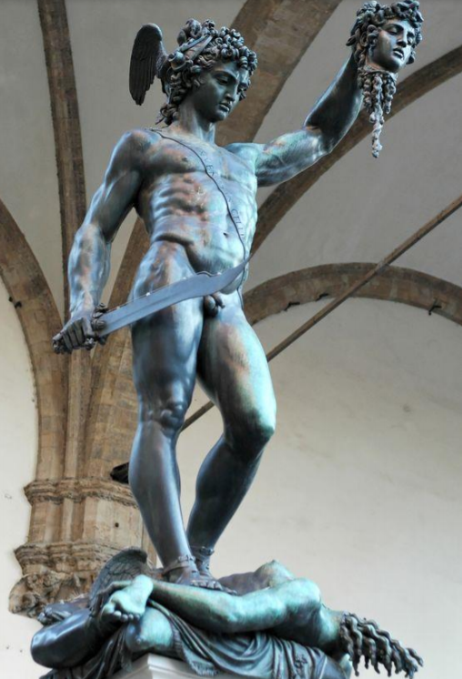

戈耳工三姐妹的头像常被艺术家描绘在徽章、建筑物甚至雅典的钱币上，也曾用于士兵 的盾牌上，用来恐吓敌人。

- **gorgon**：['ɡɔrɡən] n. 戈耳工，蛇发女妖，丑陋女人
- **gorgonian**：[gɔː'gəʊnɪən] adj.可怕的，如蛇发女妖的
- **gorgonize**：['gɔrgən,aɪz] vt.使吓呆，使变成石头

### 106. Harpy 鹰身女面嗨皮妖

### 107. Siren 天籁歌声食人妖

### 108. Pandora  众神礼物潘多拉

**背景**

宙斯发现人类掌握了火的使用方法后，下决心要惩罚人类，就让火神仿造女神的模样，用水和土创造了一个美女，再让爱与美神阿芙洛狄忒为她喷上令男人心醉神迷的香气，让雅典娜为她披上华丽的衣服，神使赫尔墨斯赋予她言语的天赋。

宙斯给她起名为 Pandora（潘多拉），让她带着一个宝盒来到人间，并欲擒故纵地警告她不要打开盒子。埃庇米修斯不顾普罗米修斯的警告，娶了潘多拉为妻。

潘多拉果然禁不起好奇心，打开了宝盒，放出了里面的各种灾难，仅仅保留了希望在里面。

 **词性**

- 潘多拉的名字 Pandora 是“众神的礼物”的意思。

- 在希腊语中，pan 表示“所有”，英语词根 pan-（全部）便来源于此；

- dora 的意思是“礼物”，源自原始印欧语词根 do-（给），英语词根 do-/don-与此同源。

 **相关单词**

- pan-：所有
- pandemic： [pæn'demɪk]
- panorama：[pænə'rɑːmə]
- pansophic：
- do-/don-：给，赠送，捐赠
- donor： ['dəʊnə; -nɔː] n.捐赠者
- donate：[də(ʊ)'neɪt]  n.v.捐献，捐赠
- pardon：['pɑːd(ə)n]  n.vt.原谅
- dose：[dos]  
  - n. 剂量；一剂，一服  
  - v. 服药；给药
- dowry：['daʊri]

**dowry（嫁妆）：女子出嫁时娘家赠送的礼物**

 女子出嫁时，女方家庭向男方或新婚夫妇赠送一定的陪嫁礼物，这是全世界范围内通行的一项古老习俗。这种陪嫁礼物就是“嫁妆”，在英文中称为dowry。它源自拉丁语dotare，其中的do就是“赠送”的意思，如英语单词donate（捐赠）、endow（捐赠）。
 娘家赠送嫁妆的原因，一方面是为新婚夫妇提供一定资助，帮助他们成家立业，另一方面还有比较深厚的社会历史原因。我们知道，古代社会是父权和夫权社会，女性地位低下，嫁入男方后就成了婆家的人，与娘家不再有瓜葛，也不能继承娘家的遗产，所以女性成家后几乎再也无法从娘家获得任何帮助。在这种背景下，娘家向出嫁女儿提供帮助的唯一途径就是结婚时的嫁妆了。
 嫁妆的丰厚与否，与女儿日后在婆家的地位息息相关。在印度和孟加拉等地方，人们对嫁妆异常看重，甚至经常发生“索奁焚妻”这样的暴行。“索奁焚妻”指的是因为女方家庭拒绝男方的要求，不肯提供更多嫁妆，男方便杀害新婚妻子作为报复的事件，通常采取浇上汽油活活烧死的残忍手段。在印度，这一恶习屡禁不止，每年造成了大量女性的死亡。dowry一词在印度已经违背了“自愿捐赠”的本意，变成了女方家庭的一项沉重负担。

- dowry：['daʊ(ə)rɪ] n.嫁妆，天资，亡夫的遗产
- dower：['daʊə] n. 天赋；嫁妆；亡夫遗产vt. 给以嫁妆；给以产业
- donate：['donet] n.v.捐赠
- endow： [ɪn'daʊ; en-] 
  - vt.赋予，捐赠，天生拥有 
  - n. 嫁妆；天资；亡夫遗产

- Dorothy：['dɒrəθɪ]  n. 桃乐茜，女子名字，意为“神的礼物”，缩写为 Dora。

## 8. 神之物品或场所

### 109. Aegis 威力强大宙斯盾

### 110. Clue 走出迷宫线团引(Theseus)

克里特国王[米诺斯](#115. Labyrinth 克里特岛迷宫 (Minos))的儿子被雅典人杀害。米诺斯替儿子报仇，打败了雅典人，强迫他们每年给公牛怪米诺陶洛斯进贡七对童男童女。

[雅典国王埃勾斯](#136. Aegeus 跳海自尽的雅典国王埃勾斯)（**Aegeus**）的儿子、英雄忒修斯（**Theseus**）为了替民除害，自愿作为贡品前往克里特岛。

克里特国王的女儿阿里阿德涅 （**Ariadne**）爱上了忒修斯，送给他一把利剑和一个线团。忒修斯进入迷宫，手持利剑杀死 了公牛怪，然后顺着线团原路返回，顺利逃离迷宫。

英语单词 **clue** 的来源就与这个故事有关。**clue** 在古英语中拼作 ***clew***，原意是“线团”。 因为忒修斯是凭借线团逃出迷宫的，所以线团成了他破解迷宫的线索。由此，单词 **clue** 就 从“线团”引申出“线索”的含义。

- **clue**：[kluː] n.线索，情节
- **clueless**： ['kluləs] adj. 无线索的；愚蠢的

### 111. Elysium 极乐世界极乐堡

### 112. Lethe 忘川河边忘情水

### 113. Styx 憎恨之河斯堤克斯

### 114. Galaxy 乳汁洒落成银河

### 115. Labyrinth 克里特岛迷宫 (Minos)

传说，克里特岛的国王米诺斯（**Minos**）是宙斯和欧罗巴公主的儿子。在他与兄弟争夺王位时，曾请求海神波塞冬降下神迹来支持他。波塞冬答应了他，从海中升出一头俊美的白色公牛，并要求事后把公牛献祭给他。

没想到米诺斯当上国王后，舍不得宰杀这头俊美的白 牛，就用另一头牛代替献祭给了波塞冬。波塞冬特别生气，想严惩这个欺骗神灵的国王，就施展法力，**使王后爱上了这头白牛**。王后后来生下了一个牛头人身的怪物米诺陶洛斯。为了遮羞，米诺斯请当时著名的工匠代达罗斯（**Daedalus**）建造了一座名叫 **labyrinth** 的迷宫，把弥诺陶洛斯关在里面。

**labyrinth** 迷宫设计得如此巧妙，以至于他的设计者代达罗斯本人进去后都差点出不来。 它和埃及迷宫、萨摩斯岛迷宫、意大利迷宫等并列为世界四大迷宫。其中又以它最为出名。 米诺斯将米诺陶洛斯关在迷宫中，每年要求被自己降伏的国家供奉童男童女给它享用。后来， 希腊英雄忒修斯在米诺斯女儿的帮助下，在迷宫中杀死了米诺陶洛斯。

- labyrinth：['læb(ə)rɪnθ] n.迷宫
- labyrinthic：[,læbə'rinθik,-kəl] adj.迷宫的，错综复杂的
- labyrinthian：[,læbə'rɪnθɪən]adj.迷宫的，错综复杂的
- labyrinthine：[,læbə'rɪnθaɪn]adj.迷宫的，错综复杂的

### 116. Cornucopia 丰饶之兆山羊角

### 117. Lyre 众神乐器里拉琴

### 118. Stamina 命运之线

### 119. Nektar Ambrosia  琼浆玉液永葆青春

## 9. 英雄传说

**背景：**

在古希腊神话中，神和凡人一样生性风流，经常和凡人发生关系。他们所生下的后代一 半是神，一半是人。在希腊语中，神和凡人结合所生的儿子被称为 heros，本意是“保护者”。 这就是英语单词 hero 的来源。其实在现实生活中，这些被誉为“hero”的人其实就是勇气 和能力超群的英雄，因此，hero 一词自然常常用来表示“英雄”。

**相关单词：**

- hero：['hɪərəʊ] n.英雄，男主角，男主人公 
-  heroine：['herəʊɪn] n.女英雄，女主角，女主人公 
-  heroic： [hə'roɪk] adj. 英雄的；英勇的 n. 史诗；英勇行为 
- heroism：['hɛroɪzəm] n. 英勇，英雄气概；英雄行为；勇敢的事迹

### 120. Perseus 英仙座珀尔修斯

珀尔修斯（**Perseus**）是希腊神话中的英雄，同时也是英仙座的来源。

珀尔修斯的外祖父是阿尔戈斯的国王阿克里西奥斯，他从神谕那里得知自己将被女儿[达那厄](#145. Danae 达那厄和金雨)（Danae）所生之子杀死，便把女儿囚禁在铜塔中。宙斯化成金雨和达那厄相会，生下珀尔修斯。阿克里西奥斯将女儿达那厄和刚出生的珀尔修斯装在一只箱子里，投入大海。

宙斯保佑着在大海中漂 流的母子，引导这只箱子穿过风浪，最后箱子一直漂到塞里福斯岛。岛上有两位兄弟发现了箱子，收留了他们。

珀尔修斯长大后，出门远行冒险。他夺走了福耳库斯的三个女儿共用的一颗牙齿和眼睛， 迫使她们给他指明前往仙女那里的路。珀尔修斯从仙女那里获得了三件宝物：一双飞鞋，一 只神袋，一顶狗皮盔。凭着这些宝物，珀尔修斯杀死了蛇发女妖戈耳工之一的美杜莎，并在埃塞俄比亚杀死了海怪，救下了[公主安德洛墨达](#141. Andromeda 因美貌而遭殃的公主安德洛墨达)，并与公主结婚。

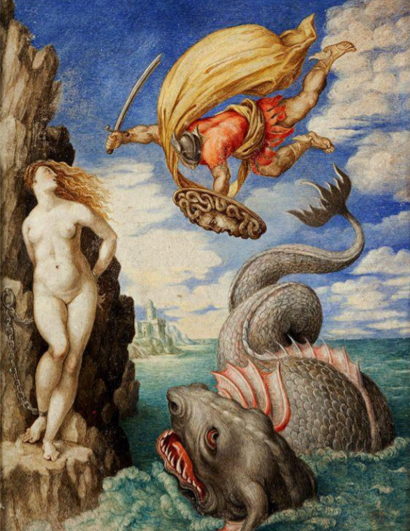

在一次比赛中，珀尔修斯掷出的铁饼不幸砸死了一位老人，而这位老人就是外出避祸的阿克里西奥斯，珀尔修斯的外祖父。珀尔修斯继承了外祖父的国家，和安德洛墨达生下了 6 个儿子和两个女儿。他的几个儿子都建立了丰功伟绩，使得珀尔修斯成为伯罗奔尼撒最有名望的人，最伟大的英雄，也是最有权势的国王。珀尔修斯去世后，

宙斯送他到天上成为“英仙星座”，他的妻子安德洛墨达则成为“仙女星座”。

- **Perseus**：['pə:sju:s; -siəs] n.英仙座，珀尔修斯

### 121. Hercules 大力神赫拉克勒斯

### 122. Cadmus 屠龙英雄卡德摩斯

### 123. Hector 特洛伊第一勇士赫克托耳

在希腊神话中，赫克托耳 **Hector** 是特洛伊（Troy）的大王子及第一勇士，被称为“特 洛伊的城墙”，最后和阿喀琉斯（**Achilles**）决斗时死在对方手里。在与阿喀琉斯决斗之前 他已经杀了多名希腊勇士，其名令敌人闻风丧胆，所以从其名字产生了小写的 **hector** 一词， 表示“令人恐惧的人”。

17 世纪时英国伦敦的街头小混混们将自己称为“**hector**”，玷污了赫克托耳的名声。所 有后来 **hector** 的含义急转直下，变成贬义，用来表示“威吓、欺凌，恃强凌弱者”。

- **hector**： ['hektə] 
  - v.威吓，虚张声势，欺凌 
  - n.威吓者，虚张声势的人，恃强凌弱者

### 124. Jason 夺宝英雄伊阿宋

### 125. 夺取金羊毛的阿耳戈号船员

## 10. 凡人故事

### 126. Adonis 因帅被战神妒忌死的阿多尼斯

### 127. Hyacinthus 因帅被砸死的美少年海辛瑟斯

### 128. Ganymede 因帅被掳美少年伽倪墨得斯

### 129. Narcissus 被自己帅死的纳西索斯

### 130. Cypress 爱上神鹿的美少年赛帕里西亚斯

### 131. Orion 因帅被射死的俄里翁

### 132. Hermaphrodite 因帅被变阴阳人

在希腊神话中，神使赫尔墨斯（Hermes）和爱与美神阿芙洛狄忒（Aphrodite）私通， 生了一个孩子，叫做赫马佛洛狄忒斯（hermaphrodite），这个名字其实就是两人名字的合并。 据说这个孩子是个阴阳人，所以后来他的名字就成了阴阳人的代名词。

还有一种说法，赫马佛洛狄忒斯原本是个俊美男子，有一次经过一个湖泊时，水中的一 个宁芙仙女萨耳玛西斯疯狂地爱上了他。为了逃避萨耳玛西斯的追求，赫马佛洛狄忒斯跳进 了一条河中。但是藏在树后的宁芙仙女也跟他跳了下去，并将其抱住，开始亲吻他。萨耳玛 西斯向诸神祈求要永远与赫马佛洛狄忒斯结合在一起。诸神满足其心愿。于是赫马佛洛狄忒 斯变成了雌雄同体。

- hermaphrodite：[hɜː'mæfrədaɪt] n.阴阳人，雌雄同一体 adj.雌雄同株的
- hermaphroditic：[hɜː,mæfrə'dɪtɪk] adj.两性的，雌雄同体的

### 133. Psyche 爱神看见也情窦初开的女人

**Reference**:

1. [Eros In Greek Mythology — The God Of Love & The Story Of Eros And Psyche](https://mythologyexplained.com/eros-and-psyche-in-greek-mythology/)

### 134. [Arachne 心灵手巧蜘蛛女](https://mythologyexplained.com/the-myth-of-arachne-spider/)

**背景：**

在希腊神话中，据说有一位心灵手巧的凡人少女，名叫阿拉喀涅（**Arachne**）。她特别擅长刺绣，并骄傲地宣称就连智慧女神雅典娜的手艺也比不上她。

雅典娜知道了非常生气，化身为一个老太婆下凡，找到阿拉喀涅，劝告她要对神保持谦卑之心。心高气傲的阿拉喀涅不肯听取雅典娜的劝告。于是雅典娜现出原形，要与阿拉喀涅比赛刺绣手艺。

雅典娜绣的内容是自己和波塞冬争夺雅典城的故事，四个角上还绣了四个凡人因为不敬重神灵而被神严惩的故事。阿拉喀涅绣的则是神灵撒谎行恶的丑事，如宙斯勾引诸多凡间女子的风流故事。

两人的手艺不相上下，但阿拉喀涅绣的内容大大激怒了雅典娜。她愤怒地毁掉了阿拉喀涅的作品， 并用梭子在她额头上连敲三下，将其变成了一只蜘蛛，罚她永远都要织网。

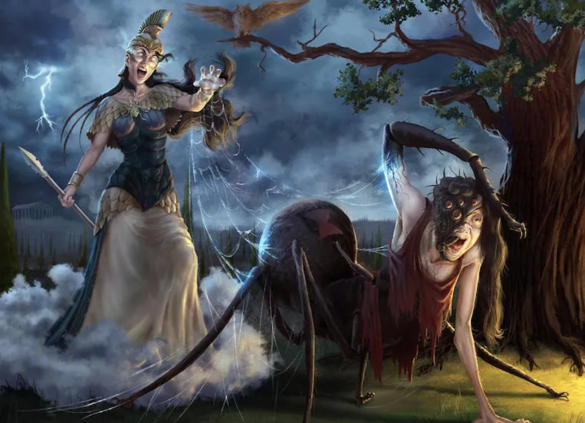

**词根：**

阿拉喀涅的名字 **Arachne** 在希腊语中就是“蜘蛛”的意思。英语中表示“蜘蛛”的词根 **`arach-`**就来源于此。

**相关单词:**

- **`arachn-`**：蜘蛛
- **arachnid**：[ə'ræknɪd] 
  - n.蛛形纲动物 
  - adj.蛛形纲动物的
- **arachnoid**：[ə'ræknɒɪd] 
  - n.蛛网膜 
  - adj.蛛网状的，蛛网膜的

### 135. Amethystos 拒绝酒神追求的少女艾莫西施

### 136. Aegeus 跳海自尽的雅典国王埃勾斯

希腊传说中，著名英雄忒修斯王子自告奋勇前往克里特岛猎杀公牛怪。出发前，他与父 亲、雅典国王埃勾斯（**Aegeus**）约好，如果他平安回来，就将船的黑帆换成白帆。

忒修斯在[克里特公主阿里阿德涅](#110. Clue 走出迷宫线团引)的帮助下，成功地杀死了公牛怪，带着公主阿里阿德涅逃离了克里特岛。在途中， 忒修斯梦见神的告诫，告知他和阿里阿德涅不是命中注定的夫妻。忒修斯不敢违抗神的旨意， 就将阿里阿德涅抛弃，独自返回雅典。

受此事影响，他心神不定，忘记了出发前的约定，没 有将黑帆换成白帆。国王埃勾斯远远地看到忒修斯的船只挂着黑帆而来，以为他已经遇害， 万念俱灰，于是投海自尽。为了纪念他，人们就用他的名字来命名这片海。从此这片海就被 叫做 Aegean（爱琴海）。

- Aegean：[i:'dʒi:ən] 
  - n.爱琴海 
  - adj.爱琴海的

### 137. Pygmalion 爱上自己雕塑的国王

### 138. Augeas 牛粪堆积如山的国王奥吉亚斯

### 139. Sisyphos 欺骗冥王的国王西绪福斯

### 140. Tantalos 滔天大罪的坦塔罗斯

### 141. Andromeda 因美貌而遭殃的公主安德洛墨达

在古希腊神话中，安德罗墨达（**Andromeda**）是埃塞俄比亚国王刻甫斯（Cepheus）与 王后卡西奥佩娅（Cassiopeia）之女，长得美丽非凡。王后因此不断炫耀女儿的美丽，甚至口出狂言，说女儿的美貌超过了海神波塞冬之妻安菲特里忒。

安菲特里忒大怒，央求波塞冬为她报仇。于是波塞冬派来巨大海怪刻托（Ceto）前来摧毁埃塞俄比亚。国王前往神殿请求神谕，神谕说只有把安德罗墨达献给海怪才能消灾。国王无奈，只得把公主捆绑在海边供奉 给海怪。

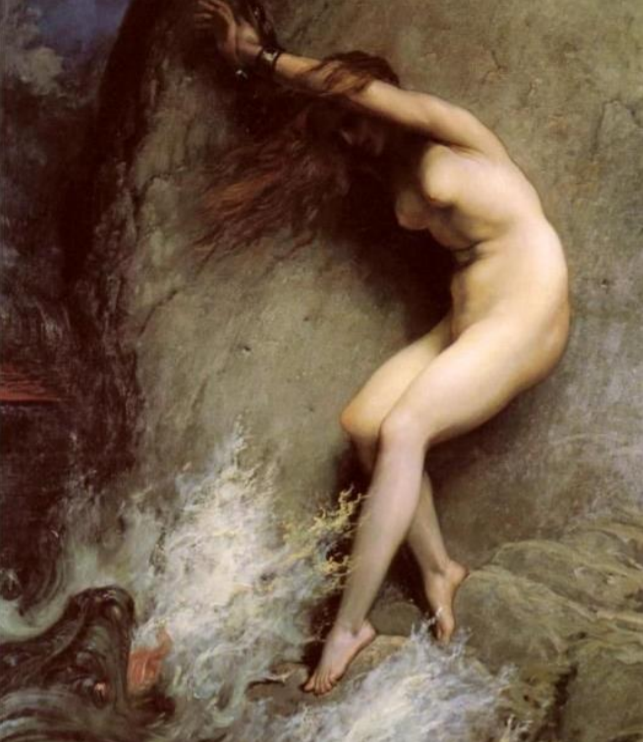

此时，大英雄[玻耳修斯](#120. Perseus 英仙座珀尔修斯)（Perseus）正好路过此地，见此情景自告奋勇愿意杀死海怪。 国王夫妇十分高兴，答应事成之后将公主许配给他。于是玻耳修斯骑着飞马，力战海怪，将 其杀死，救下了公主。

在婚礼上，曾经追求公主不成的国王之弟率人企图劫走公主，被玻耳修斯用蛇发女妖美杜萨的首级化为石头。安德罗墨达与珀耳修斯结婚后，为他生下七子二女， 其中珀耳塞斯是波斯的建国者。

### 142. Europa 被宙斯拐骗的公主欧罗巴

### 143. Io 被化为白牛的美女伊娥

### 144. Leda 勒达和天鹅

勒达（**Leda**）原本是斯巴达国王廷达瑞俄斯的妻子，长得异常美貌。宙斯为其美貌所打动，昼思夜想不能抑制，于是趁国王廷达瑞俄斯远征期间化身天鹅来到勒达洗澡的河中。美丽的王后和这只健壮迷人的天鹅进行了亲密嬉戏之后怀孕了，生下美人海伦。

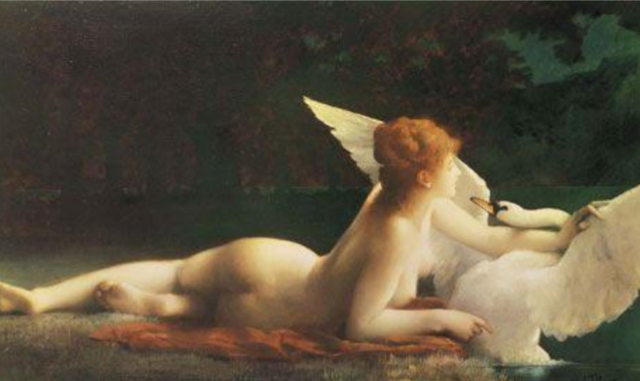

### 145. Danae 达那厄和金雨

达那厄（**Danae**）是阿尔戈斯国王阿克里西俄斯与欧律狄刻之女。

神谕说阿克里西俄斯女儿的一个儿子将对他不利，因此阿克里西俄斯将达那厄与她的保姆一起关在宫殿下面的一个地窖里（一说关在一个铜塔内）。

宙斯看到了达那厄后，被其美貌打动，乘她睡觉的时候化做一阵金雨与其交配并生育了后来的[大英雄珀耳修斯](#120. Perseus 英仙座珀尔修斯)。

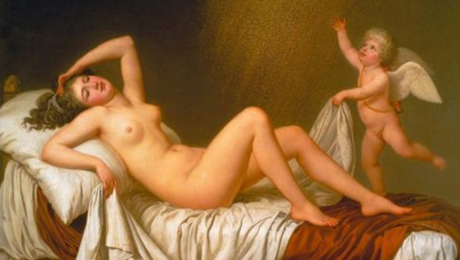

### 146. Cassandra 不为人信的特洛伊女祭司

### 147. Medea 复仇女巫美狄亚

### 148. Sibylla 长生不死的女预言家西比尔

### 149. Amazon 彪悍的亚马逊女战士

### 150.  Akademos 帮助寻回海伦的农夫阿卡德摩斯

### 151. Myrmidon 蚁人密耳弥多涅

### 152. Halcyon 在天愿作比翼鸟

### 153. Daedalus 能工巧匠代达罗斯

### 155. Mentor 良师益友馒头

### 156. Nestor 睿智长者涅斯托尔

### 157. Pandaros 战地红娘潘达罗斯

### 158. Stentor 大嗓门传令官斯屯托耳

### 159. Peony 医治众神的医生派恩

### 160. Orpheus 杰出音乐家俄耳甫斯

### 161. Procrustes 铁床匪普罗克斯泰斯

## 其他

### Achilles 阿基琉斯

In [Greek mythology](https://en.wikipedia.org/wiki/Greek_mythology), **Achilles** or **Achilleus** was a hero of the [Trojan War](https://en.wikipedia.org/wiki/Trojan_War), the greatest of all the Greek warriors, and is the central character of [Homer](https://en.wikipedia.org/wiki/Homer)'s *[Iliad](https://en.wikipedia.org/wiki/Iliad)*. He was the son of the [Nereid](https://en.wikipedia.org/wiki/Nereid) [Thetis](https://en.wikipedia.org/wiki/Thetis) and [Peleus](https://en.wikipedia.org/wiki/Peleus), king of [Phthia](https://en.wikipedia.org/wiki/Phthia).

### *Theogony*《神谱》

**Etymology【ˌetɪˈmɑːlədʒi】**

> n. 诸神的系谱, 神统纪
> 【复数：theogonies】
>
> 
>
> **theo-神 + gon-种子 + -y**

**theo∙gon∙y**  [词根树]

- **`theo-`**  = god， 表示“神”。源自希腊语 theos "god."
- **`gon-`** = seed, 表示“种子”，和 gen (产生) 同源。源自希腊语 gonos "child, procreation, seed."

The ***[Theogony](https://en.wikipedia.org/wiki/Theogony#The_genealogies)*** is a [poem](https://en.wikipedia.org/wiki/Poem) by [Hesiod](https://en.wikipedia.org/wiki/Hesiod) (8th – 7th century BC) describing the origins and [genealogies](https://en.wikipedia.org/wiki/Genealogy) of the [Greek gods](https://en.wikipedia.org/wiki/Greek_gods), composed c. 730–700 BC. It is written in the [Epic dialect](https://en.wikipedia.org/wiki/Epic_dialect) of [Ancient Greek](https://en.wikipedia.org/wiki/Ancient_Greek) and contains 1022 lines.

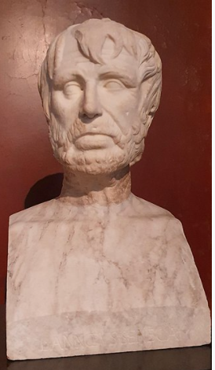

神谱（Theogony），作者为[赫西俄德](https://baike.baidu.com/item/赫西俄德/4610011)（希腊语：Ἡσίοδος），[古希腊](https://baike.baidu.com/item/古希腊/14206)诗人，大约生活在前8世纪。《神谱》描写的是宇宙和神的诞生，讲述从地神[盖亚](https://baike.baidu.com/item/盖亚/33005)诞生一直到[奥林匹亚诸神](https://baike.baidu.com/item/奥林匹亚诸神/17593096)[统治世界](https://baike.baidu.com/item/统治世界/1577608)这段时间的历史。内容大部分是神之间的争斗和权利的更替。对[家谱学](https://baike.baidu.com/item/家谱学/7396519)来说它是一部很有意思的作品。一些古典作家认为《[列女传](https://baike.baidu.com/item/列女传/869659)》也是赫西俄德的晚期作品。这部长诗大多数已经失传，只有少数章节留存。其内容是传说时代国王和英雄的家谱。一般学者将它规入赫西俄德时代诗歌作品晚期的作品。另一个被规为赫西俄德的作品的长诗是《赫拉克勒斯之盾》，它显然是上述作品的续集。

[赫西俄德](https://baike.baidu.com/item/赫西俄德/4610011)（希腊语：Ἡσίοδος）[古希腊](https://baike.baidu.com/item/古希腊)诗人，他可能生活在前8世纪。从前5世纪开始有很多文学史家就开始争论赫西俄德和[荷马](https://baike.baidu.com/item/荷马)谁生活得更早，当今大多数史学家认为赫西俄德比荷马更早，称他为“希腊教训诗之父”。

赫西俄德的详细生活年代并不可考，但对《神谱》和他的另一作品《[工作与时日](https://baike.baidu.com/item/工作与时日)》中的线索推算，《神谱》大约写作于公元前730年至前700年间。早于一般认为的《[伊利亚特](https://baike.baidu.com/item/伊利亚特)》和《[奥德赛](https://baike.baidu.com/item/奥德赛)》的成文时间，为现存最古老的古希腊诗歌之一。

神谱分为三部分：

**第一部分：序曲**

序曲，原诗1—115行，述说缪斯的诞生，缪斯九神的名字，她们的性情品格特点，她们给两位诗人——赫西俄德和《神谱》作者的引导。104—115行作者祈求缪斯述说诸神的诞生，转入正题。

**第二部分：主体**

116—1020行是全诗的主体部分。“从头开始”述说宇宙诸神和奥林波斯诸神的诞生，即他们之间的亲缘世系，描绘他们的形相性情等等。“最先产生的确实是卡俄斯（混沌），其次便产生该亚——宽胸的大地，……”大地母亲的后裔以天神乌兰诺斯系为主系，最为繁盛，一传至克洛诺斯，二传至宙斯。宙斯打败了提坦和提丰，确立和保住了对全宇宙的统治权，给诸神分配职司。此后便是宙斯的子女雅典娜、阿波罗等的出世，女神和凡间男子生了半神半人的英雄们。旁系有塔耳塔罗斯（地渊或地狱）系诸恶物和蓬托斯（大海）系的神与怪。

**第三部分：尾声**

尾声，原诗1021—1022行。话题转向另一方面，预示另一诗篇的创作，另一批半神半人的英雄的产生。他们是一群凡间淑女和男神相爱所生的子女，是一些部落或氏族的祖先

### *Odyssey*《奥德赛》

The ***Odyssey*** is one of two major [ancient Greek](https://en.wikipedia.org/wiki/Ancient_Greek_literature) [epic poems](https://en.wikipedia.org/wiki/Epic_poetry) attributed to [Homer](https://en.wikipedia.org/wiki/Homer). It is one of the oldest extant works of literature still read by contemporary audiences. 

As with the *[Iliad](https://en.wikipedia.org/wiki/Iliad)*, the poem is divided into 24 books. It follows the [Greek hero](https://en.wikipedia.org/wiki/Greek_hero_cult) [Odysseus](https://en.wikipedia.org/wiki/Odysseus), king of [Ithaca](https://en.wikipedia.org/wiki/Homer's_Ithaca), and his journey home after the [Trojan War](https://en.wikipedia.org/wiki/Trojan_War). 

《奥德赛》（希腊语：ΟΔΥΣΣΕΙΑ，转写：Odýsseia，又译《奥狄赛》、《奥德修纪》或《奥德赛飘流记》）是古希腊最重要的两部史诗之一（另一部是《伊利亚特》，统称《荷马史诗》）。《奥德赛》延续了《伊利亚特》的故事情节，相传为盲诗人荷马所作。

《奥德赛》共12000多行，也分为24卷。诗人把**奥德修斯**的10年海上历险，用倒叙的手法放在他临到家前40多天的时间里来描述。这10年惊心动魄的经历，包含了许多远古的神话，反映出经幻想加工过的自然现象以及古希腊人同自然的斗争和胜利。第9卷中所写的俄底修斯用计制胜巨人族波吕斐摩斯的故事，突出地表现了他的机智和勇敢。

这部史诗是西方文学的奠基之作，是除《吉尔伽美什史诗》和《伊利亚特》外现存最古老的西方文学作品。

### *Iliad*《伊利亚特》

《伊利亚特相传是由盲诗人[荷马](https://baike.baidu.com/item/荷马/84187)（Homer，[公元前800年](https://baike.baidu.com/item/公元前800年/3263517)-[公元前600年](https://baike.baidu.com/item/公元前600年/3471805)）所作史诗。全诗共15,693行，分为24卷，主要内容是叙述希腊人远征[特洛伊城](https://baike.baidu.com/item/特洛伊城/16012276)的故事。它通过对[特洛伊战争](https://baike.baidu.com/item/特洛伊战争/520)的描写，歌颂英勇善战、维护集体利益、为集体建立功勋的英雄。

《伊利亚特》主要写战争，重点描写[特洛伊战争](https://baike.baidu.com/item/特洛伊战争/520)第十年中51天内发生的故事。史诗开头就点出“[阿喀琉斯](https://baike.baidu.com/item/阿喀琉斯/2204883)的愤怒是我的主题”。战争虽然进行了九年多，但双方依然相持不下。希腊联军统帅[阿伽门农](https://baike.baidu.com/item/阿伽门农/852562)和将领[阿喀琉斯](https://baike.baidu.com/item/阿喀琉斯/2204883)因为一个女俘起了纷争，[阿喀琉斯](https://baike.baidu.com/item/阿喀琉斯/2204883)愤而退出战场。他的退出导致希腊方面连连失败，情况危急。[阿喀琉斯](https://baike.baidu.com/item/阿喀琉斯/2204883)的好友帕特罗克洛斯穿上[阿喀琉斯](https://baike.baidu.com/item/阿喀琉斯/2204883)的盔甲冲上战场，挽救了希腊军队，但被特洛伊统帅[赫克托尔](https://baike.baidu.com/item/赫克托尔/3948145)杀死。[阿喀琉斯](https://baike.baidu.com/item/阿喀琉斯/2204883)再次愤怒，重返战场为好友报仇，最终杀死了[赫克托尔](https://baike.baidu.com/item/赫克托尔/3948145)。赫克托尔的父亲、特洛亚老国王[普里阿摩斯](https://baike.baidu.com/item/普里阿摩斯/10471816)找到[阿喀琉斯](https://baike.baidu.com/item/阿喀琉斯/2204883)，希望他归还儿子的尸体。[阿喀琉斯](https://baike.baidu.com/item/阿喀琉斯/2204883)被打动了，将尸体交还老国王。《伊利亚特》就在[赫克托尔](https://baike.baidu.com/item/赫克托尔/3948145)的盛大葬礼中结束。

《伊利亚特》是重要的[古希腊](https://baike.baidu.com/item/古希腊/14206)文学作品，也是整个西方的经典之一。

**References:**

1. [https://theconversation.com/guide-to-the-classics-homers-iliad-80968](https://theconversation.com/guide-to-the-classics-homers-iliad-80968)

## References

1. [Mythology Explained【精华】](https://mythologyexplained.com/)
1. [Greek Mythology Family Tree: Primordials, Titans & Olympians](https://www.youtube.com/watch?v=O7F16sC860s&t=159s)

<figure>
 
  <figcaption>Frederic Leighton, The Return of Persephone, 1891. Wikimedia Commons</figcaption>
</figure>

## 文档修订记录

| 版本号 | 变化状态 | 简要说明                               | 日期      |
| ------ | -------- | -------------------------------------- | --------- |
| v0.1   | 初稿     | 从思维导图转化到MD。早该用MD了。       | 2021-11-2 |
| v0.2   | 新增     | 调整文档结构，开始新增文档内的超链接等 | 2021-11-6 |
| v0.3   | 新增     | 大幅调整结构，新增神话人物的框架结构   | 2021-11-8 |
| v0.4   | 新增     | 新增Theogony 和 Odyssey 两本书的背景   | 2021-11-9 |

