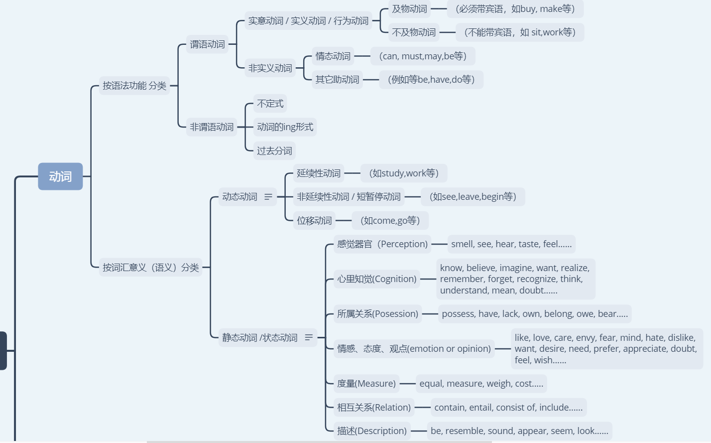
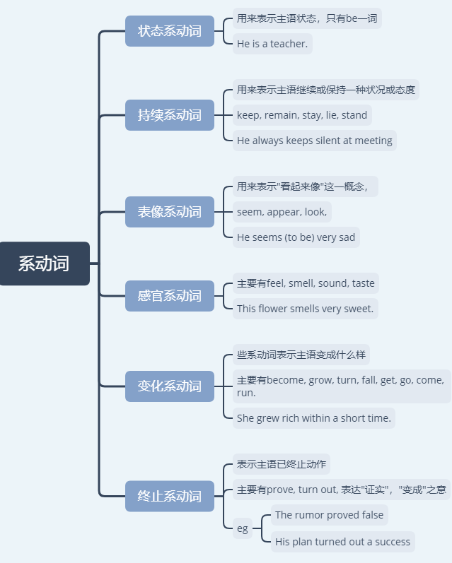
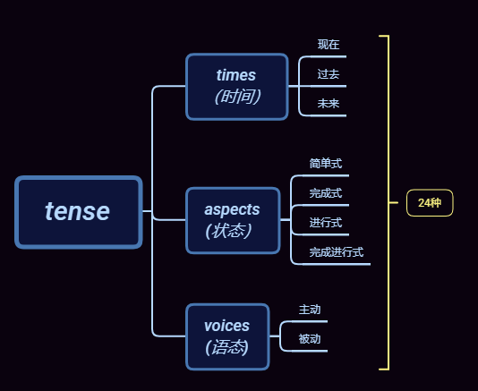
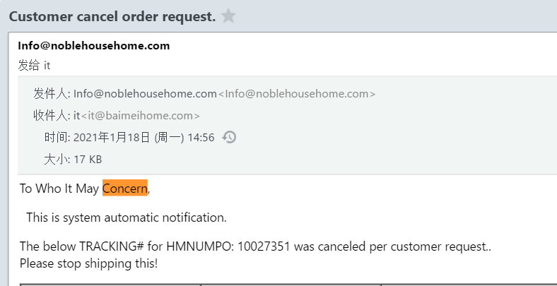
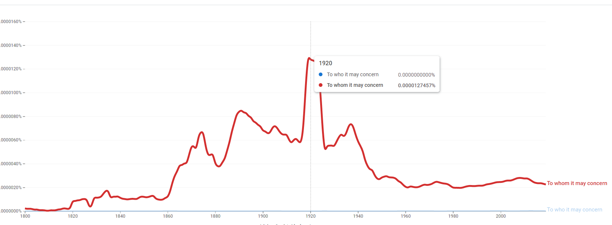

# 文法俱乐部1 - 基础

* [文法俱乐部1 \- 基础](#文法俱乐部1---基础)
  * [1\. Overview](#1-overview)
    * [1\.1 术语与概念](#11-术语与概念)
  * [2\. 词性分类](#2-词性分类)
    * [2\.1 动词](#21-动词)
      * [2\.1\.1 系动词（联系动词，Linking verb）](#211-系动词联系动词linking-verb)
    * [2\.2 介词](#22-介词)
    * [2\.2\.1 形容词 \+ Of \+ 介词](#221-形容词--of--介词)
  * [3\.  时态分类](#3--时态分类)
  * [4\.  Information v\.s  Yes\-No Question](#4--information-vs--yes-no-question)
    * [Information Question](#information-question)
    * [Yes/No Question](#yesno-question)
  * [5\. 基本句型](#5-基本句型)
    * [S \+ V \+ C](#s--v--c)
  * [6\. 从句](#6-从句)
    * [6\.2  Who v\.s Whom](#62--who-vs-whom)
  * [7\. References &amp; Connections](#7-references--connections)
  * [8\. 文档修订记录](#8-文档修订记录)


## 1. Overview

### 1.1 术语与概念

| 术语      |     定义 |   解释   |
| :-------- | :--------| :------ |
| **Adverb** (副词)   |  英文的修饰语有形容词和副词这两种。形容词是用来修饰名词的修饰语，副词通常是用来修饰动词、形容词与副词的修饰语。[^1]  |  **`ad-`** pref. （表示运动，方向，变化，添加或加强语气）向；在，与； <br> **`verb`**:动词。  <br> 字面上即 修饰动词的词，引申词义**副词**  |
|**Prepositions**（介系词）| 介系词的用法就是放在名词前面、与名词（称为它的受词（宾语））共同构成一个意义单元、称为介系词词组，当作修饰语使用。介系词词组这种修饰语可以当形容词或副词使用，是最有弹性、使用频率最高的一种修饰语。|介系词（prepositions），从造字来看是pre-加上position，意思是「放在前面的东西」。 |
|**Particles**([介副词](https://www.evernote.com/l/ALqIa0bSt0RDcZ2NHFg70hAdYQl3qlfQ2B4/))|有一种词类，看起来和介系词一模一样，但是后面却没有受词（宾语），而是直接当做副词使用。这种词类称为介副词（particles），应该当作副词看待[^2]。<br><br> In grammar, a particle is a preposition such as 'into' or and adverb such as 'out' which can combine with a verb to form a phrasal verb.|小品词(与动词构成短语动词的副词或介词)|
|**Tens**(时态) | Any of the forms of a verb that may be used to show the time of the expressed by the verb[^3].  |The past/present/future tense(过去 / 现在 / 将来时态) |
|**Aspects**(状态) |In grammar, aspect is the way that a verb group shows whether an activity is continuing, is repeated, or is completed. <br><br> For example, in 'They were laughing', the verb is in the progressive aspect and shows that the action was continuing.|简单式、完成式、进行式、完成进行式等四种状态（aspects） |
| **Voice**(语态)| the form of a verb that shows whether the subject of a sentence performs the action ( the active voice) or is affected by it ( the passive voice )| 主动、被动两种语态|


[^1]:  但是，有几种副词也可以用来修饰名词，例如：I like Beijing food, <u>especially roast duck.</u> 句中的especially这个副词是个强调范围的副词（focusing adverb），可以直接用来修饰名词词组roast duck。

[^2]:   【Come in.】句中的in看起来像介系词，后面却没有受词（宾语），而是直接当地方副词使用，修饰动词come，称为介副词。<br><br>【The soldier stood up.】up也是介副词，直接修饰动词stood。<br><br>介副词还经常和介系词共同使用，例如：【The plumber <u>went down to </u> the basement】

[^3]: 英文动词的时态，可以分成现在、过去、未来等三种时间（times），简单式、完成式、进行式、完成进行式等四种状态（aspects）。如果再加上主动、被动两种语态（voices），那么动词时态变化多达24种。扣掉一、两种很少使用的，实际上经常用到的时态也有22至23种之多。


## 2. 词性分类

### 2.1 动词




- 非谓语动词，[又称作动状词](https://www.zhihu.com/question/49311081/answer/255054419)（Verbals）
- [Gerund（动名词） v.s Verbals（动状词）](https://webapps.towson.edu/ows/verbals.html)
> A verbal is a word formed from a verb but functioning as a different part of speech. A gerund is a verbal ending in -ing that functions as a noun. 
>  动状词包含了 不定式、过去分词、现在分词（V-ing）、动名词（V-ing）；所以Verbals是包含了Gerund的。


#### 2.1.1 系动词（联系动词，Linking verb）

系动词，也称[连系动词](https://baike.baidu.com/item/%E8%BF%9E%E7%B3%BB%E5%8A%A8%E8%AF%8D/4292467)（Linking verb），是用来辅助[主语](https://baike.baidu.com/item/%E4%B8%BB%E8%AF%AD/105797)的[动词](https://baike.baidu.com/item/%E5%8A%A8%E8%AF%8D/502192)。它本身有词义，但不能单独用作[谓语](https://baike.baidu.com/item/%E8%B0%93%E8%AF%AD/2016328)，其后必须跟[表语](https://baike.baidu.com/item/%E8%A1%A8%E8%AF%AD/2017501)，构成[系表结构](https://baike.baidu.com/item/%E7%B3%BB%E8%A1%A8%E7%BB%93%E6%9E%84/2345197)说明主语的状况、性质、特征等情况。

> 外文名Linking verbs, copula




### 2.2 介词

### 2.2.1 形容词 + Of + 介词

起因是今天（2021-2-2）看到一个形容词后面可以跟上of, 感到很新奇，因为我印象中 **of** 都是 A of B，表示B**的**A,其中A、B都是名词。

**indicative** /**`ɪnˈdɪkətɪv`**/: 

adj.
1. [not usually before noun]: indicative of sth: (formal) 表明；标示；显示；暗示 (showing or suggesting sth)
> Their failure to act **is indicative of** their lack of interest.
>  &nbsp;
> The result **was indicative of** a strong retail market. 

2. [only before noun] (grammar 语法) 陈述的；指示的
> stating a fact


----------------------

- **[形容词+OF+名词](https://www.cnblogs.com/wildness-priest/p/12024524.html)**: 这种结构中, **名词作介词of的`宾语`**.

- **形容词直接+名词**：这种结构中的形容词作名词的**定语**.

比如：

> - afraid of my teacher: (怕老师)这里的名词“teacher”作of的宾语. (如果去掉of了是不是就表示 害怕/胆小的老师？)
>  &nbsp; 
> - a good teacher: (好老师)这里的形容词“good”作名词“teacher”的定语.

skeptical of conclusion 对结论持怀疑态度（如果去掉了of是不是就表示可疑的结论）

- 形容词+of，一般都是固定搭配；
- 形容词+of后面跟的一般是形容人的品质的词

[eg](https://wenku.baidu.com/view/d8212cfc5e0e7cd184254b35eefdc8d377ee144a.html):

- [x]  be sure of
- [x] be afraid of 
- [x] be full of
- [x] be careful of
- [x] be tired of
- [x] be aware of:  He was not aware of having done wrong.
- [x] be ashamed of: He is ashamed of himself for being poor.
- [x] be capable of: You are capable of better work than this. | Show me what you are capable of.
- [x] be certain of/about: You should be certain of your facts before you rush into print.
- [x] be characteristic of (有....的特质)： Sympathy is the feeling which is characteristic of mankind.(同情心是人类特有的情感特质)
- [x] be confident of: He is confident of vitory. | You are confident of our success.
- [x] be conscious of: I have not conscious of having offended him. | Was he conscious of what he was saying at the time?
- [x] be considerate of(为....着想/体谅/体贴) He is considerate of other people's `feelings`/whishes  | It was considerate of you not to play the piano while I was asleep
- [x] be critcal of: The inquery was critical of her work. | He is critical of grammar in the speech of other person.
- [x] be deserving of: He is deserving of great credit.| Such people will never be deserving of trust.
- [x] be fond of: He is very fond of Chinese food. | She is fond of reading love story.
 > 英语习惯上可以说 be fond of doing sth. 但不说 be fond to do sth.
- [x] be full of: The future seems to be full of hope.
- [x] be glad of: I'm glad of it's being over.
- [x] be guilty of(犯有...罪/错): What crime was he guilty of ? | You have been guilty of a serious blunder
 > blunder /blʌndə(r)/
- [x] be hopeful of: He is hopeful of attaining his object.
- [x] be indenpendent of (与...无关,不依赖....): The two accidents are independent of each others.  |  If you have a motocycel, you are idependent of trams and buses.
- [x] be nervous of/about: I was slightly nervous of him | I'm neverous of (being in) large crowds. | I'm very nevous about taking that exam.
- [x] be proud of:They were pround of their success.
- [x] be scared of: Jim was scared of failing the math exam.
- [x] be sensible of: He is sensible of his faults | He was sensible of your kindness.
- [x] be short of： We're a bit short of money at the moment | The hospital is getting short of clean linen.
> linen [`ˈlɪnɪn`]: n. 要不；亚麻织品. wash your dirty linen in public: 家丑外扬
- [x] be shy of (害怕； 对...有所顾忌): I'm shy of buying shares, in case I lose money.
- [x] be sick of(厌倦): I'm sick of waiting around like this. | Get out! I'm sick of the sight of you.
- [x] be sure of: If you go and see them you can be sure of a warm welcome.
- [x] be typical of: As a historian, he was most typical of the times which he lived.
- [x] **be worthy of**: The scheme is worthy of our support. | His dded is worthy of praise. | The book is well worthy of his reputations.

## 3.  时态分类




## 4.  Information v.s  Yes-No Question 

由疑问句改造出来的名词从句，又可分成两种：
- Information Question
- Yes/No Question。
> 《旋元佑进阶文法》第十七章：名词从句-名词从句的种类。

### Information Question 
> A question in English to which an appropriate answer is to give information rather than to answer "yes" or "no": typically introduced by the word who, which, what, where, when, or how
> 
> Also called: [information question](https://www.collinsdictionary.com/dictionary/english/information-question)

有疑问词（如who, which, what, when, why, how, where等）引导的疑问句，称为Information Question。

这种疑问句，里头的疑问词可以充当现成的从属连接词，所以只要把问号拿掉，不必加任何东西就可以直接成为名词从句。例如：
1. What happened at his party?
2.  I never asked him the question.

第1句有疑问词what引导，这个疑问词可以充当从属连接词，只要把问号拿掉就可以变成名词从句。

而**因为what这个疑问词本身就是这个疑问句的主词，所以拿掉问号改成名词从句的时候并不需要更动动词顺序**，因此名词从句就是what happened at his party。

这个名词从句直接放进第2句（主要从句）里面当受词（宾语）使用，就会变成下面这个复句：

**I never asked him <u>what happened at his party.</u>（名词/宾语从句，S+V+O+O结构)**

下面这个例子，情况稍有不同：
1. Where did he keep the money?
2. He never revealed the question.

第1句中有where这个疑问词、是个Information Question。疑问词本身可以充当从属连接词，只要把问号拿掉、独立的疑问句改成从属从句即可。

但是，**疑问词where并非这个疑问句的主词，拿掉问号时还需要把疑问句的动词顺序还原，成为where he kept the money**。

接下来就可以把这个名词从句放进第2句（主要从句）中的受词（宾语）位置，成为这个复句：

**He never revealed <u>where he kept the money</u>(名词/宾语从句).**


### Yes/No Question

如果疑问句中并没有疑问词，这种疑问句称为Yes/No Question。它要改成名词从句的话必须加上从属连接词**whether**或**if**。例如：

1. Is it going to rain soon?
> 第1句没有疑问词引导，这种疑问句称为Yes/No Question。
2. By looking at the sky, I can tell the question.

要改成名词从句，第一步还是要把问号拿掉使它从独立的疑问句变成从属从句。但是因为缺乏疑问词，光是拿掉问号的话会变成it is going to rain soon「很快就要下雨了」**这个肯定的叙述。为了维持「疑问」的语气**，可以借助对等连接词的关联词`either … or`，先改写为合句如下：

Either it is going to rain soon or it is not.


再把开头的either进一步改为从属连接词whether「是否」，就会成为whether it is going to rain soon (or not)这个名词从句，可以放进第2句中扮演受词（宾语）的角色，成为这个复句：

**By looking at the sky, I can tell <u>whether it is going to rain (or not).</u>(名词从句/宾语从句)**


个从属连接词除了whether之外还可以用if（解释为「是否」），所以上面这个复句也可以写成I can tell if it is going to rain。

**不过，在写作时最好尽量使用whether来表示「是否」、避免使用if**。有几个原因：

1. Whether解释为「是否」，if则有「是否」和「如果」两种解释。所以，用whether来表达通常会比用if更清楚。
2. 首位置只能用whether、不能用if来表示「是否」。例如： 
> <u>Whether we can win the big prize (名词/主语从句)</u> will be decided soon.
> 
> 这个复句，主要从句的主词就是开头那个名词从句。因为从属连接词位于句首位置，假如用的连接词是if，读者看到If we can win the big prize获得的印象是「『如果』我们能够赢得大奖」，**这样就会错意了**。所以，在句首位置要表示「是否」，只能用whether这个连接词而不能用if。

3. 介系词后面可以用whether不能用if。例如：
>  The manager hinted at whether(介系词) he would sign the contract.（名词从句）（经理暗示了一下他是否要签署合约。）
>   
> 这个复句中有个介系词at，它后面的受词（宾语）位置可以放由whether引导的名词从句，但是这个位置不能用if，否则就是文法错误。

基于上述三种原因，**写作时最好养成习惯：要表示「是否」时，最好选择用whether来表示比较不会出错**。

-------------------------------------

- **参考：**
1. [Definition of 'information question' -- collinsdictionary](https://www.collinsdictionary.com/dictionary/english/information-question)


## 5. 基本句型

一个完整的句子，必须能够表达完整的意思。这至少需要两个部分：主部（**subject**）和述部（**predicate**）。主部，是介绍这个句子主词的部分，以主词为核心，告诉读者这个句子「主角是谁」。述部，则是句子中担任叙述工作的部分，以限定动词（finite verb）为核心，告诉读者这个主角「怎么样」。

| 缩写|     全写 |   解释   |
| :-------- | --------:| :------: |
| S |   subject|  主语/主部 |
| V |   verb |  谓语/述部 |
|O |object | 宾语|
|C| complement| 补语|


### S + V + C

「及物动词」需要有受词（宾语），「不完全动词」则需要有补语。但是何谓不完全动词、何谓补语，传统文法一直没有说明清楚。最简单的理解方式是：如果动词解释为「是」，这种动词就是不完全、后面需要补语。

在句子的述部，一般都是由动词来承担最主要的叙述工作、由动词来交代主词「怎么样」。但是，如果动词只解释为「是」，这种动词完全是空的、没有任何叙述能力。所有的叙述都往后转移、在「是」的后面才真正开始叙述主词「怎么样」，那就是「补语」的部分。请看两个例子：

> The dog {S} was {V} a bulldog{C}. 

## 6. 从句

|<span style="display:block; width:80px;"> 奇怪</span>|  <span style="display:block;width:150px;">  的知识</span>| 又增加了|
| :-------- | :-------- |--------:| 
|补语|表语||
|名词从句 | 宾语从句| 补语的类型，分为名词补语、形容词补语、时间副词补语、地方副词补语和介词补语，按照大陆习惯都应该翻译为表语。 
| 形容词从句|   定语从句|又成为**关系从句**|
| 副词从句|   状语从句|  |
|简化从句| reduced clauses| 简化从句 涵盖了传统文法中所谓的非限定从句、分词结构、独立词组、同位格，以及非限定动词、动状词、动名词词组、动词不定式、现在分词词组、过去分词词组等各式各样的用语。|


---------------------------

| <span style="display:block; width:50px;"> 奇怪的</span>|     知识又增加了| 
| :-------- | :--------| 
| 定语|  定语英语里为**attribute**，表示词所具备的属性，汉语里的定是“限定”的意思，汉语语法有同样的句法成分，其实定语这一叫法的由来也是经历了很长的一段时间，以前曾叫“修饰语”，这就不难理解了。<br><br> 定就是限定，表就是表示|  
|表语 |表语英语为**predicative**，有表示判断的意思，是英语特有的句法成分，在早期汉语语法著作里曾被引入过，叫做表词，表是“表态”的意思，特指来描述主语的特征和性质，后来发现台湾地区的汉语句法里仍然保留了改称谓。|
|状语| 状语**adverbial**（**`ad ——>add. verbial——>verb.`**），说明地点、时间、原因、目的、结果、条件、方向、程度、方式，你可以理解为状语是为你的**语言增加状态的**一个部分。起到了让你的内容更加丰富清晰的作用。但能够做状语的太多了，副词、从句都可以....|


### 6.2  Who v.s Whom

> 170+ alert emails have been sent to the oms_support email group within 2 minutes on Feb 6, 2021. It occurred again on Feb 10, 2021. Dean and his teammate **~~whom~~** **`who`** has been included the mail group didn't receive those email on Gmail.


代表「人」的关系代名词，主格是who、受格是whom。但是大部分情况下都可以选择忽略主格受格的差别、一律采用who来表示。


只有在关系代名词直接放在介系词后面的时候（如to whom, with whom之类）才必须采用宾格whom，因为这个位置是非常明显的受词（宾语）位置。

关系代名词在关系从句中如果扮演受词（宾语）的角色，**必须先移到句首让它发挥连接词的功能**。这时候，虽然它仍是受词（宾语），但是已经脱离了原来的受词（宾语）位置，可以自由选择拼成who或whom。


只有一种情况必须拼成受格的whom：**整个介系词词组（如with whom, to whom等）一起移到句首时**。反之，如果把介系词词组拆开，只移动关系代名词到句首、介系词留在句尾，这时候拼成主格的who与受格的whom都可以。

例如：

1. Jasmine is a woman.
2. I trust the woman completely.


这两个句子中，第2句 the woman是动词trust的宾语，如果改成普通代名词的话应该是宾格的**her**； 

若要再改成关系代词，第一步需要把宾格改成关系代名词**whom**,接着必须把**whom**转移到句首成为**关系从句** whom I trust completely, 放在第1句的先行词 a woman 后面当做形容词从句来修饰她，结果就成为这个复句：

```
Jasmine is a woman [ whom I trust completely].
```

- a woman:先行词
- whom:宾语


中括号内是关系从句，请注意关系代名词的部分。它虽然是宾语，但是宾语位置、移到句首之后，就可以选择忽略宾格,拼成who，因此所以也可以这样说：


```
Jasmine is a woman who I trust completely.
```

另外，这个关系从句具有指示功能、指出先行词是「**哪一种**」人，所以关系代名词也可以用来自指示代名词的`that`来取代，如下：

```
Jasmine is a woman that I trust completely.
```

最后，关系代名词who、whom或that在关系从句内扮演宾语的角色，如果选择把它省略掉以避免重复，句子仍然够清楚，如下：

```
Jasmine is a woman I trust completely.
```

因此，关系代名词在关系从句中扮演宾语角色时可以选择省略。


- **小结：**

因此，这里的 To who it may concern, 需要调整为 To whom it may concern. 




最后，也可以参考[Google Ngram Viewer](https://books.google.com/ngrams/graph?content=To%20who%20it%20may%20concern,%20To%20whom%20it%20may%20concern&year_start=1800&year_end=2019&corpus=26&smoothing=3&direct_url=t1;,To%20who%20it%20may%20concern;,c0;.t1;,To%20whom%20it%20may%20concern;,c0#t1;,To%20who%20it%20may%20concern;,c0;.t1;,To%20whom%20it%20may%20concern;,c0)关于这两个词组的用法统计：




##  7. References & Connections
1. 《旋元佑进阶文法V101-B5print.docx》
2. 
3. 


##  8. 文档修订记录

| 版本号|     变化状态|   简要说明|  日期	|   变更人/参与者   |
| :-------- | :--------| :------ |:------ |:------ |
| V1.0|   建立| 新建文档 |2020-9-2  | Lee|
| V2.0|   修改| 把动词时态这个章节拆分出去 |2020-11-16  | Lee|
|V2.1|增加| 添加`系统词`章节描述|2021-1-28|Lee|

*变化状态：建立，修改，增加，删除


