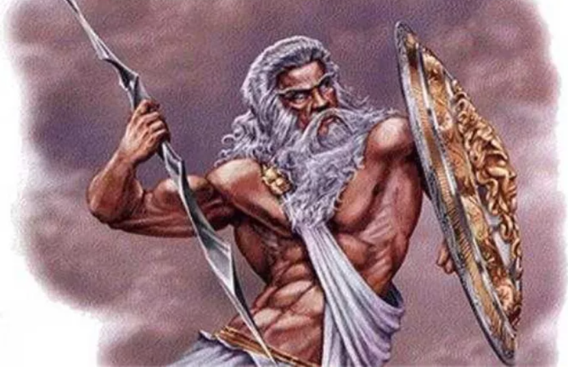
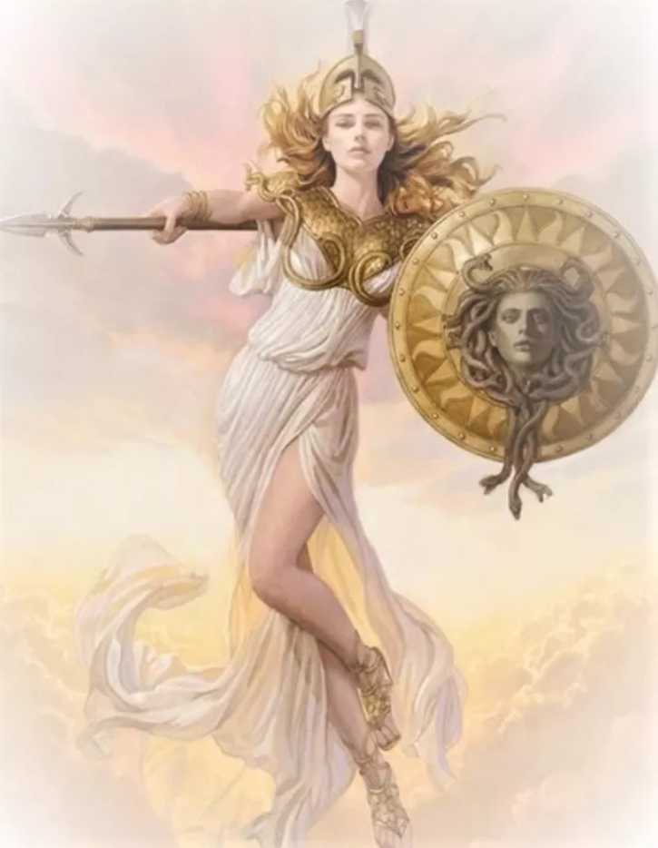
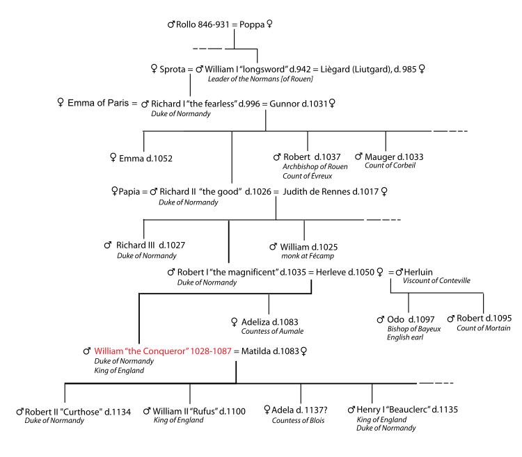
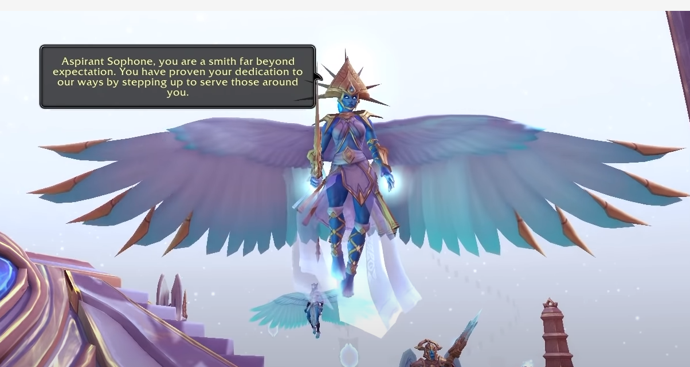
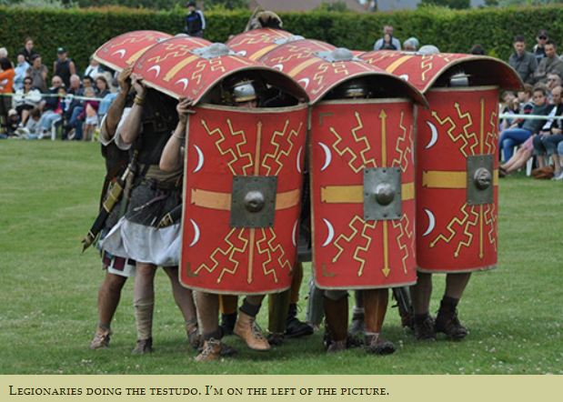
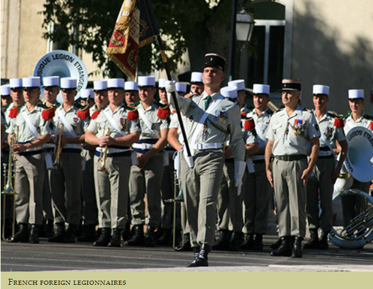
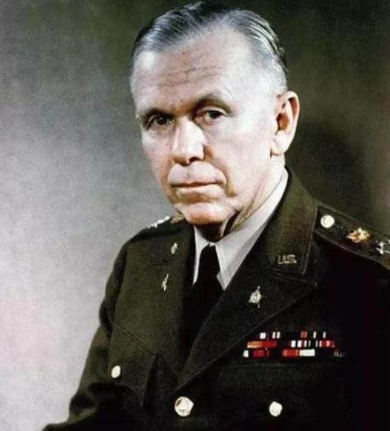

# 咬文嚼字-Part 1 
@(TOEFL)[托福, TOEFL, 词根词缀,咬文嚼字]

[toc]

## [Aegis](https://mp.weixin.qq.com/s?__biz=MzA4NTQ4NzIzNg==&mid=2651800934&idx=1&sn=35ceebf8622625188190dad1cec81bbf&chksm=842cde8db35b579bbf0b3a20050a3517ebcd0efecdcf6932711b453aa4825f91d474fc4a66b3&scene=178&cur_album_id=1297162942844207107#rd) （宙斯盾）

在古希腊神话中，神王宙斯拥有一块神盾。它是火神赫菲斯托斯特地为宙斯锻造的，上面还蒙有一块曾经哺育过宙斯的母山羊阿玛尔忒亚的毛皮。这块盾牌拥有巨大的魔力，只要摇晃一下，就会天摇地动，电闪雷鸣。

后来，宙斯因为宠爱女儿雅典娜，就把这块盾牌送给了雅典娜。雅典娜在盾牌中间安上了蛇发女妖美杜莎的头，进一步增强了神盾的魔力，任何被其光芒照到的人都会化为石头。从此以后雅典娜战无不胜、所向披靡。

这块神奇的盾牌在希腊语中叫做**aigis**，可能源自名词**aigos（山羊）**，因为它上面蒙有一块山羊皮。

这个单词进入拉丁语后拼写为**aegis**，后来进入英语，常常翻译为“宙斯盾”。

美国海军的防御作战系统就被称为**AEGIS（宙斯盾）**，因为它可以有效地防御敌人从各个方向发起的攻击，构成了海军舰队的防护盾牌。

单词**aigis**常常被用来比喻“保护、庇护”或“支持、赞助”，常见短语**under the aegis of**意思就是“在……的保护下”，比如:

- The space programwill continue under the aegis of the armed forces.

  > 这项太空计划将在武装力量保护下继续进行。

它还可以表示“由……主办或赞助”，比如

- A conference underthe aegis of the United Nations. 

  > 一个联合国主办的会议。

**aegis**：['iːdʒɪs] n.保护，庇护，支持，赞助

## lieutenant [luːˈtenənt]

（中尉）：代理指挥官职位的军官

英语单词**lieutenant**来自法语短语**lieu tenant**，由:

- **lieu**（代替）
- **tenant**（持有人）

组成，字面意思就是“代替行使指挥权的人”，指的是在战场上当指挥官牺牲或受伤而无法指挥时，代替行使指挥权的人。

16世纪70年代后用来表示中尉军衔，仅次于上尉（**captain**）。

- **lieutenant：[lef'tenənt]** n.中尉，副官，助理人员
- **lieutenancy：[lef'tenənsɪ]** n. 代理官员；中尉之军衔
- **tenant：['tɛnənt]** n. 承租人；房客；佃户；居住者vt. 租借

## [admiral](https://mp.weixin.qq.com/s?__biz=MzA4NTQ4NzIzNg==&mid=2651800919&idx=1&sn=4c88c003130ce5a91517adc4b9f599e1&chksm=842cdebcb35b57aada37b62afe3e5390cf6908392e0888c42ca1f972937c54e01b755b57d9e6&scene=178&cur_album_id=1297162942844207107#rd) （海军上将）

英语单词**admiral**（海军上将）和**emir**（埃米尔，穆斯林酋长）同源，都源自阿拉伯语单词**amir**。**amir**是某些穆斯林国家的酋长、首领的称号，它在16世纪90年代进入英语，演变为英语单词**emir**，中文音译为“埃米尔”。

中世纪时，阿拉伯商船在出海时，常常结队行动，以对抗海盗。在阿拉伯语中，指挥整个船队的首领叫作**`amir-al-bahr`**，末尾的**bahr**表示“船队”，中间的al原本是阿拉伯语中的定冠词，相当于英语中的**the**。这个词组流传至欧洲后，欧洲人把中间那个定冠词**al**也当成了单词的一部分，把这个词组简写为**amiral**，用来表示船队首领。

后来，受到单词**admirable**（令人敬佩的）的影响，单词**amiral**的拼写方式逐渐变成**admiral**，中间插入了一个字母`d`。现在，这个单词被用来表示海军舰队的最高指挥官，即舰队司令。admiral还可以表示海军中的高级军衔，常常翻译为“海军上将”。

在记单词时，我们可以利用**admirable**（令人敬佩的）来帮助记忆单词**admiral**（海军上将、舰队司令）。海军上将（**admiral**）这样的人，自然是令人敬佩的（**admirable**）。

- **admiral**：['ædmərəl] n.海军上将，舰队司令

- **admirable**：[ˈædmərəbl] adj.令人敬佩的

- **emir**：[eˈmɪə(r); ˈeɪmɪə(r)] n.埃米尔，穆斯林酋长

## meritocracy / -cracy

- meritocracy: n, 精英领导阶级
- meritocratic: adj.  评功论赏的，任人唯才的，以功绩定地位的；

## Aspirant /əˈspaɪərənt/

A person with a strong desire to achieve a position of importance or to win a competition.

## Ascendant [əˈsendənt] 运星

**ascendant**（运星）：西方占星术中的上升星座。

在西方占星术中，影响人的性格和命运的除了

- “太阳星座”（出生时太阳所处的黄道十二宫位置）
- “月亮星座”（出生时月亮所处的黄道十二宫位置）外，还有一个重要的星座，那就是
- “上升星座”（ascendant sign）。

所谓“上升星座”，指的是出生时东方地平线上升起的第一个星座。单词**ascendant**是动词**ascend**（上升）的形容词，字面意思就是“上升的”。

由于占星术认为，出生时上升的这个星座对人的性格和命运具有支配性影响，它的地位比其他星座更加优越，因此单词**ascendant**一词便从“上升的”衍生出“优越的、支配性的”等含义。

- **ascend**：[ə'send] v.上升，攀爬
- **ascendant**：[ə'send(ə)nt] adj.上升的，优越的，支配性的n.优势，支配地位，运星
- **ascendancy**：[ə'sɛndənsi] n.优势，支配地位

| a.scend /əˈsend/ | v. 上升;升高;登高 |      |
| ---------------- | ----------------- | ---- |
| a.scent          |                   |      |
| con.de.scens.ion |                   |      |
| de.scend         |                   |      |
| de.scent         |                   |      |
| tran.scend       |                   |      |
| ascens.ion       |                   |      |
| a.scens.ive      |                   |      |

# [Peerage of England](https://en.wikipedia.org/wiki/Peerage_of_England) 

### [Do men ever visit Boston](https://www.quora.com/What-is-the-difference-between-a-duke-an-earl-a-lord-a-marquis-a-baron-and-a-count)

You can keep the ranking straight with this mnemonic: "Do men ever visit Boston?" Thus: duke, marquis, earl, viscount, baron.

**Duke** is the highest, most powerful rank. There are but a handful of dukes. William the Conqueror was a duke.

**Marquis** (pronounced markwiss in England) is next, but we'll come back to it.

**Counts and Earls are equivalent ranks**, so equivalent that the wives of earls have always been called countesses. ***(I assume that William the Conqueror brought/made counts, and the native English equivalent rank was Earl.*** But if that's true, then how can it be true that the wives of earls have always been countesses?) What is a count? He is the ruler of a county. And now we can go back to consider the marquises.

**Marquis**: Some counties are border counties. A border county is where the action is. This is where the enemy starts their invasions. This is the jumping off point for your invasion of the enemy kingdom.

If a border count doesn't wind up dead, it's probably because he's rich enough to keep an unusually large military force. So, the border count is rich and well armed. Plus, he's a war hero, right? Surviving all those battles? Plus he captures all that loot?

So a border count tends to be more prominent, powerful, and respected than other counts. And a border (and by extension, a border county) is called a "mark" or a "march." It's not called that because that's where the armies march; that's just coincidence, though often enough you have to send out for new peasants since the armies of both sides marched thru there enough times to dispose of or drive out the old peasants.

So, eventually, border count became a rank above regular count. Thus: marquis.

**Viscount** is below count, the same as the vice president is below the president.

And then **baron** is the bottom of the totem pole[^1]. But these are all barons, to hear some people tell it. When the king is at odds with his barons, and they're making him sign the **[Magna Carta](https://en.wikipedia.org/wiki/Magna_Carta)**, you can bet that the dukes, marqueses, earls, counts, and viscounts are standing with the barons, not with the king.

But, to hear some tell it, a baron is anybody who holds directly from the king. So the dukes and such are literally barons. They just don't call themselves that because they have more impressive titles.

Expect all of this to be wrong: Things can switch up on you every time you cross into a new country or a new century.

[^1]: totem pole【ˈtoʊtəm poʊl】 图腾柱;(机构等内的)等级，级别。 a range of different levels in an organization, etc.

### peer（贵族）：与查理曼大帝平起平坐的十二骑士

英语单词**peer**原本是“同等的人”之意，来自拉丁语par（equal，相等）。它还可以表示“贵族”，这是为什么呢？原来，在中世纪，法兰克王国的著名国王查理曼大帝身边有十二个武艺高强的骑士，一直追随查理曼大帝南征北战，立下赫赫战功。为了犒赏他们，查理曼大帝借鉴亚瑟王和十二圆桌骑士的故事，和这十二位骑士平起平坐，将他们称为**peer**，意思就是“平起平坐的人”。***由于这些骑士都是贵族，因此peer就衍生了“贵族”的含义***。

- peer：[pɪə] n.贵族，同等的人vt.封……为贵族，与……同等
- peerage：['pɪərɪdʒ] n.（全体）贵族，贵族地位，贵族阶级
- peerless：['pɪrləs] adj. 无与伦比的；出类拔萃的；无比的
- compeer：[kəm'pɪr] n. 同辈；同伴；地位相等的人

### duke（公爵）：罗马帝国时期的蛮族军事统帅

在古罗马时代，出身为日耳曼或凯尔特蛮族而作为雇佣军为罗马军队所用的将帅，由于没有正式的罗马军衔而统称为***Dux***，是“***军队首领***”的意思。该词来自拉丁语动词***ducere***（领导、引导），这就是英语单词**Duke**（公爵）的来源。英语词根**`duc-`**（引导）与此同源。

罗马帝国灭亡之后，各部族的军事领袖成为欧洲各小国的国君，其中许多就以***Dux***为称号，他们统治的小国就被称为“***公国***”（**duchy**）或“***大公国***”（**Archduchy【ˈɑːtʃˈdʌtʃɪ 】**）。直到近代，意大利和德国统一之前的很多小国都以此为称号。这些小国的国君一般翻译为“***大公***”。

欧洲现存的独立公国是卢森堡和安道尔公国。历史上的其它公国经过合并和并吞，逐渐丧失独立性，成为国家的一部分，其统治者也演变成了由国王授予的爵位，即“公爵”（**Duke**）。在欧洲各国，公爵都是最高爵位之一。

英国的公爵爵位出现很晚。1337年，爱德华三世把康沃尔郡升为公国，将公爵爵号授予年方7岁的“黑太子”爱德华([the Black Prince](https://en.wikipedia.org/wiki/Edward_the_Black_Prince))。为突出公爵特殊地位，以后多年里除女王配偶和王子外，其他王亲国戚均不许称王，最高可获公爵爵位。自从1483年建立诺福克公国以后，公爵爵位开始授予王亲以外者，但很少建立公国。而且能获此最高爵位者多是军功显赫的统帅。

- **`duc-`**：引导，领导
- duct： [dʌkt] n. 输送管，导管vt. 用导管输送；以导管封住
- duke：[djuːk] n.公爵
- duchy：['dʌtʃɪ] n.公国，公爵领地
- duchess：['dʌtʃɪs; -es] n.公爵夫人，女公爵
- archduke： [,ɑrtʃ'duk] n. 大公，（奥地利）皇太子
- ducal：['dukl] adj. 公爵的；公爵领地的；象公爵的
- duce： ['duːtʃɪ] n.（意）领袖；首领

###  marquis（侯爵）：镇守边疆的诸侯

**marquis** 【ˈmɑːrkwɪs】（ (除英国外一些欧洲国家的) 侯爵）是欧洲贵族爵位中的一种，在公爵（**duke**）之下、伯爵（**count**）之上，也可拼写为**marquess**。该词来自法语***marchis***，字面意思是“镇守边疆的诸侯”，来自***marche***（边疆），与英语单词**march**（行军）都来自拉丁语***marca***（边疆）。欧洲中世纪边疆与内陆的概念区别源自于古罗马帝国时期对帝国行省的划分，比较稳定的内陆省份归于元老院管理，而不稳定的边疆省份归于皇帝管理。中世纪以后，则把封疆贵族按照相似的概念分为最受君主信赖、管理边疆的“侯爵”，和地位较低、管理内地一方领土的“伯爵”。

- marquis：['mɑːkwɪs] n.侯爵
- march： [mɑrtʃ] v.（使）前进，（使）行军，进军；游行示威；进展n. 前进；行军；游行示威；进行曲
- marchioness：[,mɑrʃə'nɛs] n. 女侯爵，侯爵夫人

### count（伯爵）：罗马皇帝的侍从

在古罗马帝国时期，罗马皇帝身边的亲信往往能得到皇帝的宠爱，掌管帝国的军政大权，有时还会出任地方官吏，最常见的是担任某个行省的总督。欧洲大陆部分国家的伯爵爵位名称就出自拉丁文的***comes***，意为“***侍从***”。例如，法语中表示“伯爵”的单词为***counte*** ，出自拉丁文***comitem***，即***comes***的宾格，意思就是“伙伴，侍从”，进入英语后演变为英语单词**count**，表示“伯爵”，但通常指的是欧洲大陆地区的伯爵。

英语单词**county**是英国的行政区划单位，通常被翻译为“郡”或“县”，其实，它在历史上指的就是[诺曼底公爵](https://en.wikipedia.org/wiki/Duke_of_Normandy)征服英国后，封给手下各伯爵（**count**）的封地，从拼写上我们可以明显地看出它们之间的关系。

- count：[kaʊnt] n.（法、德、南非）地区的伯爵
- countess： ['kaʊntəs] n. 伯爵夫人；女伯爵
- county： ['kaʊntɪ] n.郡，县

### earl（伯爵）：北欧地区的“部落首领”

欧洲国家贵族爵位中，从最低级以上的第三级一般在中文里译作“伯爵”，处在侯爵之下，在子爵之上。

英国的“伯爵”**earl**源自古英语***eorl***，与北欧国家的“伯爵”Jarl同源，原意是“***部落首领***”。11世纪，丹麦国王克努特统治英国后，把伯爵（**earl**）爵位引进英国，以丹麦方式把英国划分为许多伯爵领地（**earldom**）。每个伯爵均是镇守一方的诸侯，相当于现在的总督职位。在英国，**earl**（伯爵）的历史最悠久。在1237年黑太子爱德华被封为公爵之前，它是英国最高的爵位。同时，**earl**还是欧洲五种爵位中唯一一个源自古英语的爵位。

- earl： [ɜːl] n.伯爵
- earldom：['ɜːldəm] n.伯爵领地

### viscount（子爵）：法国的副伯爵

英语单词**visecount**（子爵）来自法语，由**`vice`**（副的）+**`count`**（伯爵）构成，字面意思就是“副伯爵”。**visecount**常为郡守，地位在掌管一方的诸侯（伯爵）之下，在普通贵族男爵之上，但有时也可能是实力强大的诸侯。在英国，1440年比奥芒特的约翰被封为子爵，位居所有男爵之上。

**`vis-`** 表示“改变、交流”，引申为“副职”或“代理牧师”。源自拉丁语 *vux (属格 vicis) "turn, situation, change."

- viscount：['vaɪkaʊnt] n.子爵
- vice：[vaɪs] adj. 副的；代替的

###  baron（男爵）直接从国王那里获得封地的贵族

男爵（**baron**）是贵族爵位中最低的一级。盎格鲁一撒克逊时代英语中已有“男爵”（**baron**）一词，但无男爵爵位，而且词义不够确定，似有“自由者”或“国王的臣仆”之意，并无尊贵之意。当时，所有那些直接从国王那儿得到封地的贵族都可称为“男爵”。当时男爵在世俗贵族中占了很高比例，以至于“男爵”一词长期作为贵族的集合名词使用。11-14世纪，男爵的封号和封地可通过血缘和婚姻关系传递，但不得随意出售和转让，历代国王也不随意增加或褫夺贵族封号。

1387年，理查二世封约翰•比彻姆为基德敏斯特男爵后，男爵才成为英国贵族的正式爵位，并且始终是人数最多的爵位。

- baron：['bær(ə)n] n.男爵
- baroness：['bær(ə)nɪs; -nes] n.男爵夫人，女男爵
- barony：['bærəni] n. 男爵领地；男爵爵位
- baronet： ['bærənət] n. 从男爵；准男爵vt. 封…为准男爵

## Archon  ['ɑrkɑn]

> n.	执政官；古希腊雅典九人执政官之一；主要官员
> Web	光明执政官；统治者；神族的执政官

N (in ancient Athens) one of the nine chief magistrates (古雅典)九个执政官之一;

archive（档案）：古希腊执政官的办公室。

档案指的是政府保存下来的公文资料。很多国家很早就有将重要的公文资料保存到特定场所的做法，最初保管档案的场所其实就是政府的办公室。

英语中表示“档案”的单词archive来自希腊语arkheia，源自词根arkhe（统治），原本指的是城邦统治者（archon，执政官）居住或办公的场所。因为最初的档案都存放在政府的办公场所，所以原本表示“办公场所”的archive一词演变为“档案馆、档案”之意。

archive：n.档案馆，档案vt.将……存档
archon：['ɑrkɑn] n. 执政官（古代雅典九名统治者之一）；统治者

## paragon /ˈpærəɡɑːn/

**paragon**（模范）：用来检验金子纯度的试金石。

古代西方人为了检验金子的纯度，常常使用一种用纹理细密的深色玉石做成的试金石（touchstone）。将要检验的金子在试金石上摩擦，就可以根据划痕颜色来判断金子的纯度。

这种试金石在意大利语中被称为paragone，它来自希腊语parakonan，由:

- para（并列、对抗）
-  akone（磨石）构成。

英语单词**paragon**就来源于此，本意就是这种试金石。因为试金石是衡量价值的标准，因此衍生出“完美之物、模范”之意。

- paragon： ['pærəg(ə)n]  n. 完美之物，模范，试金石 adj. 完美的

##  centurion /sen'tʊriən/

**centurion（百夫长）：古罗马军队中的百人队队长**（an officer in the army of ancient Rome who was responsible for 100 soldiers）

单词centurion来自拉丁语，本意是古罗马军队中一个百人队（Centuria）的领导，一般译为“百夫长”。其中**cent**表示“一百”，如century（世纪、百年）、percent（百分比）。

百人队在罗马军队一直是一个很重要的编制。如同其名称一样，百人队最初大约由100人组成。在马略改革后，标准的百人队编制又变为80人，并成为罗马军团战术的核心。

标准的百人队分为十个8人小组。8人小组（**Contubernium**）是罗马军队中最小的组织单位，由8名士兵组成，类似于现代军队中的步兵班，由一名伍长指挥。他们在战地居住在同一帐篷内，而在营房中则居住在同一房间内，可能被一起嘉奖或处罚。

此外每个8人小组配有两名辅助的“仆人”。他们负责照料为8人小组驼行李的骡子，保证士兵在长距离行军中的饮水供应。**这些“仆人”通常具有铁匠或木匠的技能**。由于加上了这些非战斗人员，一个满员的百人队人数依然在一百人左右。

> you are a smith far beyond expectation.

- centurion： [sen'tjʊərɪən] n.百夫长，百人队队长
- century：['sɛntʃəri] n. 世纪，百年
- percent：[pɚ'sɛnt] n. 百分比；百分数

## Final Verdict

 **ver-/verit-（真实）：真理女神维瑞塔斯。**

在罗马神话中有一位真理女神，叫做维瑞塔斯（**Veritas**）。她是农神萨图恩的女儿，美德女神（Virtue）的母亲，对应于希腊神话中的真理女神阿莱西娅（Aletheia）。有人认为,她藏於圣井的底部，因为她很难以捉摸。她的形象通常呈现为一个身著白衣的年轻处子。

在拉丁语中，veritas就是“真理、真相”的意思，来自形容词verus（真实的）。拉丁语谚语in vino veritas（in wine truth）就是“酒后吐真言”的意思。

哈佛大学的校训就是**veritas（真理）**，醒目地摆放在校徽中。很多大学的校训中也能找到**veritas**一词，如耶鲁大学的校训就是**Lux et Veritas** (Light and Truth，光明和真理)。

英语词根`ver-/verit-`就来源于拉丁语**verus**和**veritas**，由此衍生出不少与“真实、真理”相关的单词：

- ver-/verit-：真实、真理
- veritas：[,verɪ'tæs] n. （拉）真理；真相；真实
- very：['vɛri] adj. 恰好是，正是；甚至；十足的；特有的adv. 非常，很；完全
- verify：['vɛrɪfaɪ] vt. 核实；查证
- verification：[,vɛrɪfɪ'keʃən] n. 确认，查证；核实
- verdict： ['vɝdɪkt] n. 结论；裁定
- veridical：[vɪ'rɪdɪk(ə)l] adj. 不虚伪的；诚实的
- veracity：[və'ræsəti] n. 诚实；精确性；老实；说真实话
- veracious：[və'reʃəs] adj. 诚实的；真实的
- verism：['viərizəm] n. 真实主义，写实主义
- aver：[ə'vɜː] vt. 断言，极力声明；主张

## gothic

gothic（野蛮的）：灭亡西罗马帝国的哥特人。

4、5世纪时，居住在古罗马帝国东部、北部的以日耳曼人为主体的各蛮族部落大举迁徙、入侵罗马。曾经无比强大的罗马帝国在蛮族势力的反复冲击下四分五裂。蛮族中的东、西哥特人（Goth）曾经多次入侵意大利，直接导致了西罗马帝国的灭亡。欧洲从此进入了长达千年之久的黑暗时期，即“中世纪”。

因此，哥特人的名字就与“野蛮”等负面含义产生了关联，由哥特人（Goth）一词衍生的英语单词gothic（哥特人的）也产生了“野蛮的”之意。

文艺复兴期间，由于意大利人对于哥特族摧毁罗马帝国的这段历史情仇难以释怀，因此为了与这段时期有所区分，他们便将中世纪时期的欧洲建筑及艺术风格称为gothic，即“哥特式”。尽管gothic这个词多少有些负面意味，但事实上为数众多的哥特风格作品拥有非常高的艺术价值。

gothic：['ɡɔθik] adj.哥特式的，野蛮的，中世纪的，粗鄙的
Goth：[ɡɔθ] n. 野蛮人；粗野的人；哥特人

--------------

在WOW里面，Revendreth（瑞文德斯）是一个充满阴暗气息的地方，哥特式的建筑上（**the gothic spires of Revendreth**），一直都是阴森森的天空，居民也都是看起来让人很不愉快有点吸血鬼的那种气息，最让我大跌眼镜的是里面有一个人很怕圣光，都快要嗝屁了还要下午茶的贵族。

-----------------------------------

 1. 哥特人的，哥特族的，哥特语的（指反对罗马帝国的一支日耳曼民族）
> connected with the Goths (= a Germanic people who fought against the Roman Empire)

******************

2. (architecture 建) 哥特式的，哥特风格的（12至16世纪流行于西欧的建筑风格，以尖拱、尖窗和细长柱为特色）
> built in the style that was popular in western Europe from the 12th to the 16th centuries, and which has pointed arches and windows and tall thin pillars

3. (of a novel, etc. 小说等) 哥特派的，哥特风格的（流行于18至19世纪**，描述神秘或恐怖气氛中的爱情故事**）
> written in the style popular in the 18th and 19th centuries, which described romantic adventures in **mysterious or frightening surroundings**

4. (of type and printing 字体和印刷字体) 哥特体黑体字的（旧时德语书籍常用）
> having pointed letters with thick lines and sharp angles. German books used to be printed in this style.

5. 哥特派的
> connected with goths

## sabotage /ˈsæbətɑːʒ/

> Lysonia: The ward has been sabotaged, as we agreed.

来自法语 sabotage,捣乱，破坏，
- 来自 `sabot`,木鞋，
- 来自中古法语 savate,旧鞋子，
- 词源同 sabaton,护脚甲，
- savate,法国腿踢，
- ciabatta,拖鞋面包。

现词义据说是来自 18，19 世纪机器工业刚兴起时，手工业者担心机器会抢走他们的饭碗，愤而把木鞋扔进机器里面破坏机器运转。

## hubris /hjuːbrɪs/
> She must pay for her hubris

hubris ['hjuːbrɪs] n.狂妄自大。来自希腊语hybris,对神的放肆无礼。引申词义傲慢，狂妄。

原指对神的放肆和傲慢。比如公元前480年，波斯王薛西斯带领大军进军希腊，可是在达达尼尔海峡，波斯人刚搭建的两座浮桥都被狂风吹垮，愤怒的薛西斯令人把铁索抛进海里，想要锁住大海，并派人鞭打大海300下，以报复大海阻止他前进。神怒了，后果是薛西斯输掉了战争。

## mor- / mort- (死亡) ：死神墨尔斯

在罗马神话中，死神叫做墨尓斯（Mors），对应于希腊神话中的桑纳托斯。在西方文化中，墨尓斯常被描绘为身着黑色长袍，手持长柄镰刀的阴森老人。墨尓斯的名字Mors在拉丁语中就是“死亡”的意思，英语中表示“死亡”的词根mor-/mort-就来源于此。

mor-/mort-：死亡

- **mortal**：['mɔːt(ə)l] adj.凡人的，致死的，总有一死的n.人类，凡人
- **mortality**：[mɔː'tælɪtɪ] n.死亡数，死亡率，必死性
- **immortal：[ɪ'mɔːt(ə)l]** adj.不朽的，长生不死的，神仙的n.神仙，不朽人物
- **immortality： [,ɪmɔr'tæləti]** n. 不朽；不朽的声名；不灭
- **morbid：['mɔrbɪd]** adj. 病态的；由病引起的；恐怖的；病变部位的
- **moribund：['mɒrɪbʌnd]** adj.垂死的，停滞不前的n.垂死的人
- **mortician：[mɔː'tɪʃ(ə)n]** n.殡葬业者，丧事承办人
- **mortuary：['mɔːtjʊərɪ; -tʃʊ-]** n.太平间adj.死的，悲哀的
- **mortify： ['mɔrtɪfaɪ]** vt. 抑制；苦修；使…感屈辱 vi. 禁欲；苦行；约束

### moral- 道德的
- moral n/a.道德
- morality n. 道德、教训、品行
- unmoral a. 不属于道德范畴的，无道德观念的 
- nonmoral a. 与道德无关的
- morals n. 道德、士气、品德、品行
- moralist
- moralisim
- moralize vt. 教化，使有德行

## arbiter （仲裁者）

古罗马时期的审判员制度
古罗马时期，国家的司法权力掌握在“裁判官”手中。这个职位最早设立于公元前376年，是从执政官的职权中分离出来的，地位仅次于执政官，享有在其职责范围内的法律方面的最高权威。但裁判官并不参与具体案件的审判，而是交给审判员去审理。审判员不是国家官吏，他是由裁判官从预定名单中选定并授权处理特定案件的公断人，因此在拉丁语中被称为arbiter

arbiter，由ad（to）和baetere（来、去）构成，字面意思就是“去某地（审案）的人”。

arbiter和arbitrator同源，在现代都能表示“仲裁人”，区别在于：

- **arbiter**一词更为古老，是书面用语，通常应用于文学领域，“审判”的意味胜过“仲裁”；
- **arbitrator**比较通俗，通常表示受争议双方所托，居中仲裁，拥有较大的自由裁量权，甚至可以是**arbitrary**（独断的）。

相关单词：
- arbiter：['ɑːbɪtə] n.仲裁者，裁决人
- arbitrator：['ɑːbɪtreɪtə] n.仲裁者，公断人
- arbitrate：['ɑrbɪtret] vt.仲裁，公断
- arbitrary：['ɑrbətrɛri] adj.独断的，武断的，任意的，专制的

## arsenal（兵工厂 / 军械库）

威尼斯的一个著名造船厂。英语单词**arsenal**的初始源头是阿拉伯语 ***dar-as-sina***，意思是“**制造车间**”。

在15世纪时，该词广泛流传于地中海周边多个国家中，西班牙语和意大利语都借用了它，拼写为darsena，用来表示“船坞”、“码头”。

当时在威尼斯有一个规模巨大的造船厂，威尼斯人将darsena改头换尾，改写为arzenale，用来表示这个造船厂。该词进入英语后，拼写改为arsenal，含义也发生了变化，用来表示船坞中用来存放海军装备和武器的仓库，后来又泛化为任何各种军械库和兵工厂。

1886年，一群来自伦敦市伍尔维奇区的皇家兵工厂（Royal Arsenal）的工人组建了一支足球俱乐部，这就是后来著名的英超俱乐部“阿森纳”（Arsenal）。所以人们常称阿森纳队为“兵工厂”，称其队员“枪手”。

## weird

weird（怪异的）：莎士比亚笔下长相怪异的命运三女神。

英语单词weird（怪异的）来自古英语wyrd，本意是“命运”。从8世纪后期开始，英国人开始使用weird来表示古罗马神话中的“命运三女神”。这三位女神是三姐妹，分别负责纺织、丈量和剪断代表人的生命的纱线。15和16世纪时，苏格兰人开始使用“weird sisters”来表示“命运三女神”。英国大文豪莎士比亚在其名著《麦克白》中采纳了这种用法。在这部戏剧中，莎士比亚将命运三女神描绘成了三位长相怪异骇人的女巫，因此weird一词便衍生出“怪异的”之意。

weird：[wɪəd] adj.怪异的，不可思议的n.命运，预言

### [weird / old / strange](https://www.sohu.com/a/236908806_340366)

- 在英式英语中“odd”更为普遍，而美国人则更多地使用“weird”；
- 词语表述的感情色彩和语气程度来看, “odd”体现的惊讶程度最低，“strange”较为中立，而“weird”的语气最强，它强调“事物奇怪的地方会给人带来不适”

**Examples**
>  A: My phone just died at 20%.
>  B: That’s odd.
>  
> C: I felt like **the odd one out** (不合群的人)– I had nothing in common with those people.
>   
>  A: We’ve run out of eggs.
>  B: That’s strange! I bought a dozen only yesterday.
>   
>  D: You’ve been acting weird all day. What's going on?

​	

## [Legionary v.s Legionnaire](https://inaciem.com/diary/legionary-vs-legionnaire)

While I was creating this website, a question came to my mind : is it “legionnaire” or “legionary” in english? For a non native english speaker, it’s not obvious. In french, it’s the same word for both. I searched the web, and it was not easy to understand the subtle difference between them.

After some good research, I discovered that :

**Legionary**:

It’s the ancient roman soldier. He served in the legion. They were, in my opinion, probably the best warriors of all time. Our modern western civilization is mainly based on the ancient Roman Empire they have created.
The legionary wears:

- a sword or “gladius”
- a shield or “scutum”
- a helmet
- a tunic or “tunica”
- caligae
- an armour or “lorica”… :)

**Legionnaire**:

It’s a “modern” legionary. He is a member of, for instance, the french foreign legion.

Hope that helps you!

As I said, in french we do not have the distinction, they both are members of a legion.
To distinguish them, we say in french :

- “légionnaire romain”: roman legionary
- or “légionnaire de la légion étrangère”: foreign legion legionnaire

所以: 超时空军团是：[Chrono Legionnaire](https://cnc.fandom.com/wiki/Chrono_legionnaire).

古罗马军团（legion）在历史上赫赫有名，但从词源上看，legion原本居然是一帮临时工！真是让人大跌眼镜！

英语单词**legion**来自拉丁语，由拉丁词根**`leg-`**（采集、挑选）派生出，字面意思就是“征集来的一群人”。古罗马最初没有常备军队，所有市民都有服兵役的义务。发生战争时，就从符合条件的市民中挑选一部分人临时组建军队。通过这种方式组建的一支军队就是**legion**。

马略军事改革后，古罗马创建了常备军队，legion成为军队的建制单位之一，常常翻译为“军团”。一个军团的总人数在6000人左右，以步兵为主，辅以少量骑兵。在罗马共和国初期，一名执政官可以指挥两个军团。

词根**`leg-`**的过去分词形式是**`lect-`**，后面加了一个过去分词后缀**`-t`**，末尾的字母**g**在t前面音变为**c**以便发音。常见单词**collect**（收集）、**select**（挑选）都派生自这个词根。

- **legion**：[ˈliːdʒən]n.（古罗马）军团；众多；军队adj. 众多的；大量的
- **collect**：[kəˈlekt] v.收集，聚集，募捐
- **select**：[sɪˈlekt] v.选择，挑选

**参考**:

1. [词源趣谈：赫赫有名的古罗马军团（legion）原来不过是一群临时工？！](https://mp.weixin.qq.com/s/5s3DAl-SChixvMqvMixLcg)

## Marshal v.s Marshall (司马氏)

美国上世纪著名的军事家，陆军五星上将，曾任陆军参谋长、国防部长的马歇尔（Marshall）将军，曾经因为功勋卓绝而被国会计划授予“元帅”军衔。然而，马歇尔将军却断然拒绝了。这是为什么呢？

原来，英语中表示“元帅”的单词是**marshal**，跟马歇尔将军的姓氏**Marshall**只少了一个字母。如果马歇尔将军变成了“马歇尔元帅”，在英语中就应该被称为“**Marshal Marshall**”，读起来是不是很别扭？。

单词**marshal**（元帅）源自古日耳曼语，由**mar**（=mare，马）和**shal**（仆人）组成，字面意思就是“马夫，伺候马的人”。随着骑兵在军事历史上的日益重要，“**marshal**”这样一个职务变得越来越重要，逐渐升级，先后演变为“御马总管”、“骑兵队长”、“王室军务总管”等诸多职务，最终升级为最高军衔“元帅”也就不足为奇了。二战期间英国著名将军蒙哥马利的头衔就是**marshal**（元帅）。

马歇尔将军的姓氏**Marshall**其实就来自单词**marshal**，只不过拼写稍微变了一点。显然是因为他家老祖宗是个**marshal**，所以就以此作为自己的姓氏。也是因为这个原因，马歇尔将军对于**marshal**（元帅）这个头衔不感冒，毕竟人家老祖宗就是干这个的。

出于对马歇尔将军的尊重，以及其他一些原因，美国军队没有设置**marshal**（元帅）这个西方军队常见的最高军衔。现在，美国军队中最高的军衔就是五星上将，并且仅限于战争时期才授予。

巧合的是，我们中国也有一个“司马”，它既是一个官职名称，又是一个常见的姓氏。作为官职的“司马”相当于英语中的**marshal**（元帅），原本是负责马匹的小吏，逐渐升级为掌管全国军队的高级官职。作为姓氏的“司马”相当于英语中的**Marshall**（马歇尔），在中国历史上也涌现出了不少名人，比如著名军事家司马懿。 

- **marshal**：['mɑːʃ(ə)l] n.元帅，陆军元帅

- **Marshall**：[ˈmɑ:ʃəl] n.（姓氏）马歇尔

**参考：**

1. [词源趣谈：震惊！马歇尔将军拒绝元帅头衔，居然是因为这件小事！](https://mp.weixin.qq.com/s/lduUgE4HL7bfGiNQkVi3Og)
