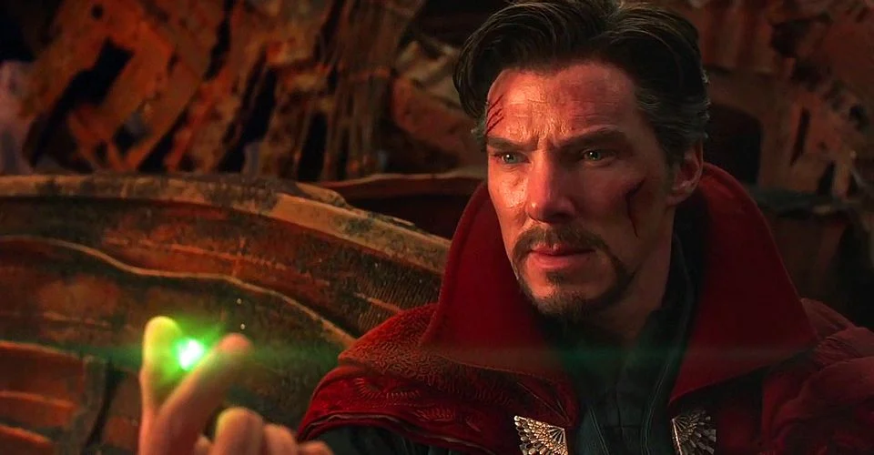
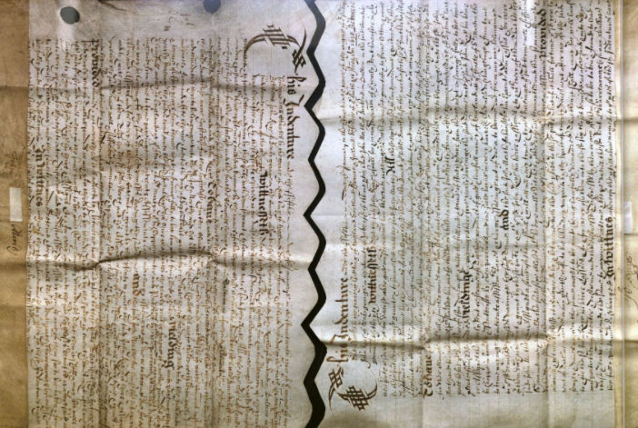
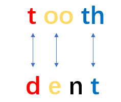
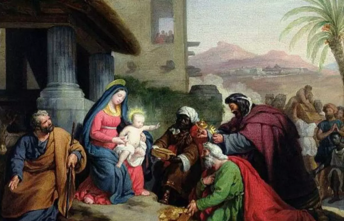
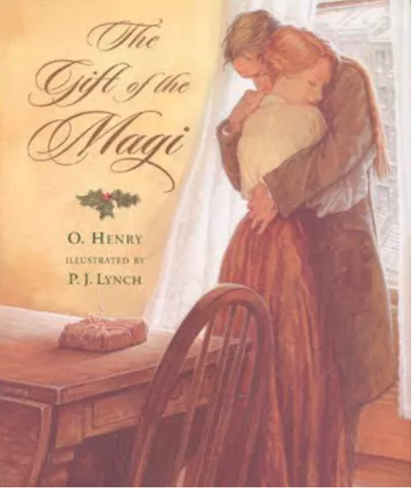
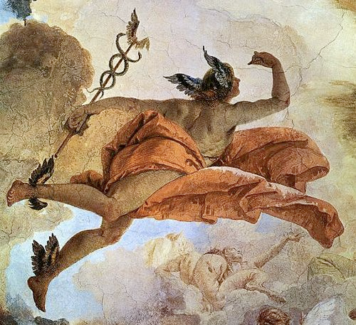

# 咬文嚼字-Part 3 
@(星瑞格)[翻译, 公司, 公司业务, dbAudit翻译]

[toc]

 

## Villain /ˈvɪlən/

`villain -` 今指“坏蛋”或“恶棍”的**villain**一词原先并不含贬义。它源自中世纪拉丁语**vīllānus 'farmhand'**，通过法语***vilain***于14世纪进入英语的。

从终极词源来看，**villain**和另一个词**villa**（别墅）都源于拉丁语***vīlla 'country house'***。在中世纪封建时代，这两个词是密切相关的，villa原指“农庄住宅”或“庄园”，而villain则指为villa的主人工作的“农奴”或“农民”。

后来，贵族由于阶级优越感以及他们对农民的阶级偏见，往往把意指农民、乡下人的词语同“愚昧”、“粗野”、“邪恶”等概念联系起来。这样，**villain**的词义就逐渐发生贬降。19世纪出现了一个戏谑性短语**villain of the piece**，指“剧中反面人物”或“首恶”，被德莱塞（***Theodore Dreiser***）、墨多克（***Iris Murdoch***）等作家乃至普通人广泛使用。

但**villa**和出自同一拉丁词源的**village**（乡村）一词至今却仍保留了原拉丁词中的含义。

例:

- The villain cheated the old lady out of her life's savings. (FWF) 这个恶棍骗走了老太太一生的积蓄。
- He made his reputation as an actor playing villains. (CID) 他以演反派角色而出名。
- A faulty fuse was the villain of the piece. 毛病就出在保险丝上。
- The whole village turned out to watch the parade. 全村的人都出来看游行

**villain**（恶棍）：在古罗马农场干活的奴隶。

英语单词**villain**源自拉丁语***villanus***，本意为在villa（古罗马农场）干活的人，通常是奴隶或隶农。**villa**是古罗马贵族在乡村的房地产，包括居所和农场。英语单词**village**（农村）、**villager**（村民）等都源自拉丁语***villa***。

由于在***villa***里面干活的奴隶或隶农地位很低，常常遭到贵族老爷的鄙视和呵斥，因此表示他的拉丁语villanus及其衍生的英语单词villain就不可避免地含有了强烈的贬义，并从表示社会地位的卑贱延伸至表示人品的卑贱，逐渐发展出“坏人、恶棍、反派”等负面含义。可以说，这个单词体现了一种强烈的阶级偏见。

- villain：['vɪlən] n.坏人，恶棍，反派，罪犯
- villainous：['vɪlənəs] adj.邪恶的，缺德的，恶毒的，堕落的
- villa：['vɪlə] 乡村别墅，农场
- village：['vɪlɪdʒ] n.农村，乡村，郊外
- villager：['vɪlɪdʒə] n.村民，乡村居民

*Avengers: Infinity War* depicts the beginning of the Avengers' attempt to protect the Infinity Stones from the **[villainous](https://www.cbr.com/were-in-endgame-now-infinity-war-meme/)** Thanos who wants to use them to erase half of humanity from existence. Thanks to his mystical training, [Doctor Strange](https://www.cbr.com/doctor-strange-2-prepares-filming-in-london/) is able to see each of the 14 million possible outcomes from their fight against Thanos. **All but one end in failure.** Much to Tony Stark's dismay, Doctor Strange gives up the Time Stone to Thanos. When Stark questions his motives, Doctor Strange simply states, "We're in the endgame now."

## [Minister](https://mp.weixin.qq.com/s/YqjWyrjx1h9L0b62NYp6rg) (大臣、部长)

在中国历史上，再大的官见了皇帝也得自称“奴才”、“小的”。西方也一样，大臣在国王面前自称**minister**，字面意思就是“小人、奴仆”。

**minister**可以分解为两部分:

- 前面的**minis**表示“小”，和单词minus（减去，负的）、minor（较小的、次要的）同源
- 后面的-ter是个比较级后缀。

合起来整个单词的字面意思就是“较小的人，地位较低的人”，引申为“奴仆”。

在英语中，**minister**原本表示:

- 牧师（上帝的奴仆）
- 大臣（国王的奴仆）。

------------------

**prime minister**就是首相、主要的大臣。后来英国实行了君主立宪制，国王的大臣变成了政府的部长，但**minister**的称呼并没有变化，只是一般翻译为“部长”而不再是“大臣”。

**minister**派生出单词**ministry**：

- 前面的**`ministr-`**等于**minister**，
- 后面附加了一个抽象名词后缀-y。

**ministry**原本是一个抽象名词，表示“*牧师或部长的身份和职责*”，后来转用做**具体名词**，***表示部长履行职责的场所和机构***，也就是政府下面的一个部，比如**the ministry of education**（教育部）。

-------------------------

单词**administrate**也来自**`minister`**:

- 前缀**`ad-`**表示“去、趋近”，
- 中间的**`ministr-`**等于**minister**，
- 末尾的**`-ate`**来自***拉丁语动词的过去分词后缀***，在此用作**动词后缀**。

整个单词的字面意思就是“*去当大臣、去辅助国王*”，***引申为“管理、行政”***。

它还派生出名词**administration**（管理、行政、行政机构）和**administrator**（管理员、行政人员）。

------------------------

- **minus**：[ˈmaɪnəs] adj.负的，零下的，稍差的prep.减去，零下n.减号，负号；不足
- **minor**：[ˈmaɪnə(r)] adj.较小的，未成年的，次要的，小调的n.未成年人，小调，辅修科目
- **minister**：[ˈmɪnɪstə(r)] n.部长，大臣，牧师vi.执行牧师职务，照料，伺候
- **ministry**：[ˈmɪnɪstri] n.（政府）部门；牧师职务和任期
- **administrate**：[ədˈmɪnɪstreɪt] vt.管理，行政，经营
- **administration**：[ədˌmɪnɪˈstreɪʃn] n.管理，行政，行政机构，经营
- **administrator**：[ədˈmɪnɪstreɪtə(r)] n.管理员，行政人员

Reference: [词源趣谈：再大的minister（大臣、部长），其实也只是一个小“奴仆”。--钱磊博士](https://mp.weixin.qq.com/s/YqjWyrjx1h9L0b62NYp6rg)

## Indenture(契约)

在中世纪的欧洲，人们在签订契约时，往往会把两份内容相同的契约写在同一张羊皮纸上，然后在中间以锯齿状边缘分割开，双方各持一份。以后需要比对契约真伪，只需要查看两份契约的锯齿状边缘能否对上即可。

英语中，这种以锯齿状边缘分割的契约就被称为**`indenture`**。这个单词来自拉丁语，由前缀`in-`（进入）加词根`dent-`（齿）及名词后缀-ure构成，字面意思为“缩进成锯齿状之物”。

**indenture**对应的动词是**indent**，意思是“缩进，使成锯齿状”。比如：
- We usually indent the first line of a paragraph.
> 我们通常使每个段落的第一行缩进。

从词源上看，拉丁词根`dent-`（齿）其实和来自英国人本族语的常见单词`tooth`（牙齿）源自同一个老祖宗，只不过发生了音变，导致拼写差异比较大。具体来说，开头的辅音字母`t`和`d`相通，末尾的`th`和`t`相通，中间的双元音字母`oo`和单元音字母`e`相通，然后`dent-`中的鼻音字母`n`在单词`tooth`中脱落了。

只要我们熟悉了这些常见的音变规律，就能轻松地看出词根dent-和单词tooth之间的亲缘关系，可以利用常见单词tooth来帮助记忆词根`dent-`。

来自词根`dent-`（齿）的常见单词还有**dental**（牙齿的），**dentist**（牙科医生），**trident**（三叉戟、三齿鱼叉）等等。

**词根dent-（齿）**

- indenture：[ɪnˈdentʃə(r)] n.契约，合同
- indent：[ɪnˈdent] v.缩进，使成锯齿状
- dental：[ˈdentl] adj.牙齿的
- dentist：[ˈdentɪst] n.牙科医生
- trident：[ˈtraɪdnt] n.三叉戟，三齿鱼叉
- tooth：[tuːθ] n.牙齿

### References & Conncection
1. [词源趣谈：以锯齿状边缘分割开的indenture（契约）-- 钱博士英语(钱磊博士)](https://mp.weixin.qq.com/s/UQMLNulL__EF6u6lqMuNDw)

## magic （拜火教祭司）

拜火教是流行于古代波斯（今伊朗）及中亚等地的宗教，中国史称祆教，正式名称是琐罗亚斯德教，其创始人为伊朗先知琐罗亚斯德（**Zarathushtra**，又译查拉图斯特拉）。拜火教是基督教诞生之前中东和西亚最有影响的宗教，古代波斯帝国的国教，该教认为阿胡拉·马兹达（意为“智慧之主”）是最高主神，马兹达创造了物质世界，也创造了火，即“无限的光明”。该教以崇拜火而闻名，故得名“拜火教”。

拜火教的出现，对后来的犹太教、基督教、伊斯兰教，都有深远的影响。在基督教尚未成为罗马国教之前，罗马国内流行的摩尼教就是该教的一个分支。佛祖释迦牟尼悟道后招收的第一批弟子就有拜火教教徒。

拜火教的祭司在古波斯语被称为magush，希腊语中被称为magos，拉丁语中被称为magus，复数形式为magi，意思是“哲人”、“贤人”、“知晓神之奥秘的人”。据《圣经》记载，耶稣出生时，三位magi在东方看见伯利恒方向的天空上有一颗大星，于是便跟着它来到了耶稣基督的出生地，并给耶稣带来了礼物，这就是圣诞礼物的由来。

美国著名文学家欧·亨利写的短篇小说《麦琪的礼物》（*The Gift of the Magi*）中，就用了这个典故。里面的Magi并非小说中的人物，而是拜火教祭司。*The Gift of the Magi*意思就是“圣诞礼物”。

英语单词**magic**（不可思议的，神奇的；魔术、魔法）就派生自**magi**（拜火教祭司），字面意思是“**magi**的”。古人认为**magi**（拜火教祭司）拥有深奥秘密和超能力，所以就用magic来形容巫术、魔法等神奇的事情。

>  比如：What magic drug have you taken to recover so quickly? 你吃什么灵丹妙药，好得这样快？

单词magical衍生自**magic**（魔术、魔法），后面多了一个形容词后缀，意思是“魔术的，魔法的”。做形容词时，**magic**和**magical**的含义差不多，都可以表示“有魔力的，神奇的”，区别在于，magic通常取其本意，而magical常取其引申含义，形容某人某物是“迷人的、美妙的”。如**a magic bed**的意思是“魔法床”，而**a magical bed**的意思则是“神奇的床”。

>  再比如，The beautiful island of Cyprus is a magical place to get married. 美丽的塞浦路斯岛是缔结良缘的美妙之地。

衍生自magic（魔术、魔法）的单词还有magician，后缀-ian表示某种人，所以magician的意思就是魔术师或魔法师。

- **magic**：['mædʒɪk] adj.不可思议的，神奇的，有魔力的，魔术的n.魔法，巫术，魔
- **magical**：['mædʒɪk(ə)l] adj.魔术的，有魔力的，神奇的
- **magician**：[mə'dʒɪʃ(ə)n] n.魔术师，魔法师，巫师

引用： [词源趣谈：magic——神奇的拜火教祭司--钱磊博士](https://mp.weixin.qq.com/s/4U8Py1gjj_yIkYF4ujrqUQ)

## Actuary（精算师）

在保险行业有一种非常专业的人员叫做“精算师”，他们的主要职责就是收集并分析各种统计信息，在此基础上计算出各种事件发生的概率，为各种保险业务的定价提供数学支持。

在英语中，精算师被称为**actuary**。这个单词来自拉丁语，由：

- 词根**`act-`**（活动、行动）
- 后缀**`-ary`**组成，
- 中间的那个字母u可以简单地看作是一个连接字母。

词根**`act-`**和单词**act**（活动、行动）同源，在这里表示“***公共事务、社会中发生的各种事件***”。

后面的**`-ary`**是个常见的形容词及名词后缀，在这里表示“***从事与……相关工作的人***”。

整个单词的字面意思就是“从事与公共事务相关工作的人”。

在古罗马时期，**actuary**是元老院中的一个职务，相当于书记官，负责信息的采集、整理和发布。他需要收集整理各地上报的各种社会重大事件、各地方法官的裁决，参加元老院会议，负责记录会议中形成的决议，最后汇总各方面的信息编写成公报并对外发表。

到了中世纪，**actuary**这个单词的含义变得更加广泛，可以表示抄写员、速记员、法院书记、公证员、记账员、会计师等等。这些职务都涉及到信息的收集整理。

到了近代，**actuary**开始被用来特指保险公司中进行保险精算业务的数学家，也就是所谓的“精算师”。

**actuary**的形容词形式是**actuarial**，后面加了一个形容词后缀**`-al`**，意思是“保险精算的”。与它同源的单词还有**actual**（实际的），字面意思就是“与实践活动相关的”。

- **actuary**：['æktʃuəri] n.保险精算师
- **actuarial**：[ˌæktʃuˈeəriəl] adj.保险精算的
- **actual**：[ˈæktʃuəl] adj.实际的，真实的，现实的

**参考：**

[英语词源趣谈](https://mp.weixin.qq.com/mp/appmsgalbum?__biz=MzA4NTQ4NzIzNg==&action=getalbum&album_id=1297162942844207107&scene=173&from_msgid=2651803449&from_itemidx=1&count=3&nolastread=1#wechat_redirect)

## Mercury：商业、火星与水银

英语中，水星被称为**Mercury**。奇怪的是，表示水银的英文单词也是**mercury**。这是为什么呢？原来，这两个单词都源自古罗马神话中的神使**墨丘利（Mercury）**的名字。

墨丘利（***Mercury***）是古罗马神话中主神朱庇特的儿子，等同于古希腊神话的赫耳墨斯（***Hermes***），负责为众神传递信息。他的形象一般是头戴一顶插有双翅的帽子，脚穿飞行鞋，手握魔杖，行走如飞。

墨丘利手脚利索，机智狡猾。他曾经偷走了太阳神阿波罗的50头牛，阿波罗上门来索赔，墨丘利答应还牛，却在阿波罗牵牛时用自己发明的竖琴奏出了美妙的音乐。阿波罗听得如痴如醉，竟然同意用牛群换取墨丘利的竖琴，还把自己的魔杖倒贴给他。所以墨丘利就成了小偷、骗子和商人的保护神，因为他偷了阿波罗的牛，然后还引诱他与自己进行交易。

在拉丁语中，墨丘利被称为***Mercurius***，进入英语后改写***Mercury***。

前面的词根**`merc-`**表示“商业、贸易、交换”。常见单词**commerce**（商业）、**commercial**（商业的）就派生自这个词根。

水星是太阳系中离太阳最近、体积最小的行星。因为距离最近，受到太阳的引力也最大，因此它跑得比其他行星都要快。古希腊人用希腊神话中跑得最快的神使赫尔墨斯来命名水星，古罗马人则用古罗马神话中对应的神使墨丘利（**Mercury**）来命名。英国人沿用了古罗马人的做法，所以首字母大写的**Mercury**既表示古罗马神话中的神使墨丘利，又表示水星。

汞又叫水银，是古代西方人很早就认识的少数化学物质之一。如同中国文化中的金木水火土一样，古代西方人将最常见的七种物质与七大天体对应起来，如金对应太阳，银对应月亮，铁对应火星，铅对应土星，锡对应木星，铜对应金星，而活性最大，常温下呈液态的金属汞则对应跑得最快的水星。所以汞的英文名称与水星相同，是小写的**mercury**。

- **Mercury**：['mɜːkjərɪ] n.水星，墨丘利
- **mercury**：['mɜːkjərɪ] n.汞，水银
- **commerce**：[ˈkɒmɜːs] n.商业，贸易
- **commercial**：[kəˈmɜːʃl] adj.商业的，贸易的

**参考：**

1. [词源趣谈：古罗马神话中最狡猾的神仙，小偷、骗子和商人的保护神，水星和水银的名字都来源于他。](https://mp.weixin.qq.com/s/bYlIVGI57VQIIkRh2_zb9g)

