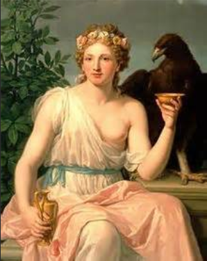
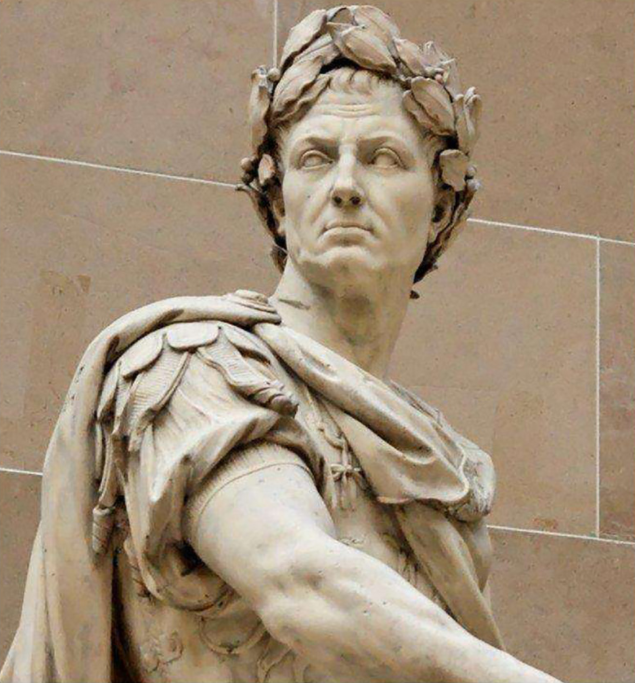

# 咬文嚼字-Part 4 

@(星瑞格)[翻译, 公司, 公司业务, dbAudit翻译]

## January 双面门神雅努斯

在古罗马传说中，有一位名叫“雅努斯”（Janus）的古老神灵。他的名字Janus在拉丁语中就是“门”的意思，所以雅努斯是门神，主要职责就是看守天宫的大门。每天早上，雅努斯打开天门，让太阳神驾着金色马车出来，使阳光普照大地；到了晚上他关上天门，让黑夜笼罩大地。

雅努斯的长相非常有特点。他的头部前后有两张面孔，一张年老，一张年轻。年老的面孔在回顾过去，年轻的面孔在展望未来。所以雅努斯象征着一切事物的开始和结束。

雅努斯还是战争与和平之神。古罗马人在战争期间，会打开雅努斯神殿的大门，等到战争结束后才会关闭神殿大门。

古罗马人在正月里祭祀雅努斯，罗马的执政官也在正月的第一天就职，并向雅努斯献祭。公元前46年，古罗马凯撒把正月第一天定为罗马历新年的开始，用雅努斯的名字Janus来命名第一个月，在拉丁语中拼写为***Januarius***，在英语中演变为单词**January**（一月）。它由Janus去掉末尾的字母s后再加上一个常见的形容词和名词后缀-ary组成，字面意思就是“雅努斯的月份”。

英语单词**Janitor**也源自雅努斯的名字Janus。它最早表示“看门人”、“门房”，现在常表示公寓的管理员，其主要职责是公寓的清洁卫生，有些还负责公寓的维护和保安工作。

​	

- **Janus**：['dʒeinəs] n.雅努斯，两面神
- **Janus-faced**：伪善的，口是心非的，有双面孔的
- **January**：[ˈdʒænjuəri] n.一月
- **janitor**：[ˈdʒænɪtə(r)] n.看门人，门房，清洁工

摘自：[词源趣谈：献给门神雅努斯（Janus）的一月（January）](https://mp.weixin.qq.com/s/OsM09L_5CI15YClA4WwPYA)

## May 春天女神玛雅

和一月（**January**，以双面门神 Janus 命名）一样，五月也是以一位地道的罗马神祇命名 的。在远古罗马神话中，**Maia**（玛雅）是专门掌管春天和生命的女神，她的名字的含义就 是“能使万物生长者”。每年春天，她为世界带来温暖，使世间万物蓬勃生长。为了纪念这 位女神，罗马人就用它的名字来命名 5 月（罗马历中的 3 月），在拉丁语中称为 ***Maius***，意 思就是 ***month of Maia***。英语中表示“5 月”的单词 **May** 就源自拉丁语 ***Maius***。

摘自：《读神话故事 学英语单词--钱磊博士》

## June 天后朱诺（Juno）

	

六月正值初夏之际，莺飞草长、百花盛开，是婚嫁的绝好时机，罗马人常常选择在这个季节结婚，于是就用掌管婚姻的天后朱诺（***Juno***）为其命名，英语中的六月June就来源于此。

***Juno***（朱诺）是古罗马神话中的天后，是众神之父***Jupiter***（朱庇特）的姐姐和妻子，对应古希腊神话中的赫拉，是成年女子和婚姻的保护神。

***Juno***这个名字在拉丁语中意思就是“年轻人”，词根`Jun-`意思就是“年轻的”。比如单词**junior**（年轻的、资历浅的）就派生自这个词根，后面加了一个比较级后缀`-ior`，字面意思就是“更加年轻的”。

从词源上看，拉丁词根`jun-`（年轻的）和日耳曼词根`you(n)-`（年轻的）来自同一个老祖宗，***辅音字母j和y相通***。后者派生出了常见单词**young**（年轻的）和抽象名词后缀**youth**（年轻，青春）。

另外，同源的还有拉丁词根`juven-`（年轻的）。常见单词**juvenile**（青少年的、青少年）就来自这个词根，后面加了一个常见的形容词后缀`-ile`。

### 不老青春女神 尤文图斯

古罗马神话中的青春女神尤文图斯（**Juventus**）也来自词根`juven-`（年轻的），后面加的***抽象名词后缀***`-tus`和后缀`-th`同源。所以***Juventus***相当于单词**youth**（年轻，青春）。

***尤文图斯（Juventus）***是朱庇特和朱诺的女儿，掌管青春，拥有少女般的青春和活力，她的双耳壶中盛有的长生不老酒拥有恢复青春美貌的神力。她是诸神的斟酒官，在奥林匹斯圣山的神宴上侍候诸神，专门给他们斟酒。当凡人英雄升天成仙时，第一个出来迎接的就是青春女神。她为他们奉上神酒，使他们立刻恢复青春年少并长生不老。

尤文图斯是青少年的守护神，所有罗马少年在即将成年之时都要前往尤文图斯的神庙祈求女神的庇佑。1896年，意大利都灵市的一群中学生成立了一支足球俱乐部，起名就叫做Juventus，寓意像青春女神那样永远蓬勃向上，充满年轻活力。这就是大名鼎鼎的尤文图斯队队名的由来。

### 相关词根与单词

#### 词根：**jun-**（年轻的）

- **June**：[dʒuːn] n.六月，（人名）琼
- **Juno**：[ˈdʒuːnəʊ] n.朱诺（主神朱庇特的妻子）
- **junior**：[ˈdʒuːniə(r)] adj.年轻的，资历浅的，下级的n.年少者，职务和地位较低的人

#### 词根：**y**ou(n)-（年轻的）

- **young**：[jʌŋ]n.年轻的
- **youth**：[juːθ]n.年轻，青春

#### 词根：**juven-**（年轻的）

- **juvenile**：[ˈdʒuːvənaɪl] adj.青少年的n.青少年
- **Juventus**：[ˈdʒuːvəntəs]n.尤文图斯

摘自：[词源趣谈：奉献给天后朱诺（Juno）的“六月”（June） --钱磊博士](https://mp.weixin.qq.com/s/admI963qvVAcxZpcYStdHg)

## July 凯撒大帝

**盖乌斯·尤利乌斯·恺撒（Gaius [Julius Caesar](https://en.wikipedia.org/wiki/Julius_Caesar)）**常被人尊称为“凯撒大帝”。他是古罗马最著名的军事家和政治家，罗马帝国的奠基人。公元前44年3月15日，恺撒遭元老院反对派议员暗杀身亡，享年56岁。

凯撒大帝被刺身亡后，他手下的罗马将军安东尼向元老院提议，用凯撒的家族名Julius来命名凯撒诞辰所在月份七月，以表达对凯撒的崇敬。元老院同意了，于是七月的名称就改成了**Julius**。

英语单词**July**（七月）便来源于拉丁语单词***Julius***，只不过按照英文的拼写习惯，去掉了末尾的词尾`-us`，变成了`Juli`，然后末尾的字母i改写为`y`，最终演变为单词**July**。

那么，***Julius（尤利乌斯，或朱利乌斯）***这个单词，到底有什么含义呢？从词源上看，它的含义尚未有定论，最常被人接受的解释有两种：

- 一种认为它来自希腊语，意思是“刚长出来的胡须绒毛”，所以与“年轻”有关。
- 另一种解释认为，这个名字源自古罗马神话中众神之父朱庇特的本名Jove，意思是“Jove的后裔”。

我个人更喜欢第二种解释。

Julius对应的阴性形式就是Julia（茱莉亚），词尾-us改成了对应的阴性形式-a。Julia（茱莉亚）是一个很常见的女子名，有很多女性名人就叫做Julia（茱莉亚），比如著名女演员茱莉亚·罗伯茨（Julia Roberts）。

有些中国人取英文名字时，会考虑Julius或Julia。大家觉得这两个名字好不好？快来留言发表你的看法吧。

- **July**：[dʒʊˈlaɪ] n.七月
- **Julius**：[ˈdʒuːliəs] n.（男子名）尤利乌斯，朱利乌斯
- **Julia**：[ˈdʒuːljə] n.（女子名）茱莉亚

​	

摘自：[词源趣谈：以凯撒大帝命名的July（七月）--钱磊博士](https://mp.weixin.qq.com/s/EnMCWrUU7ZrJACCl0gkadw)	

## August 奥古斯都大帝

