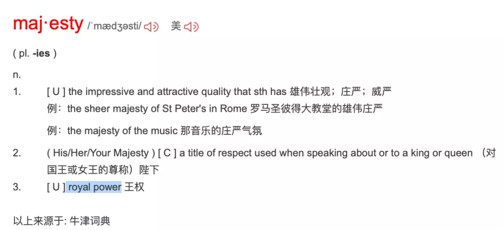
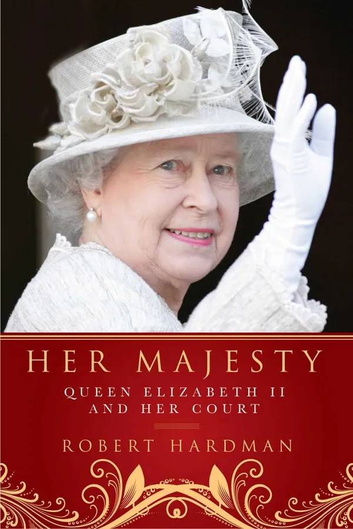
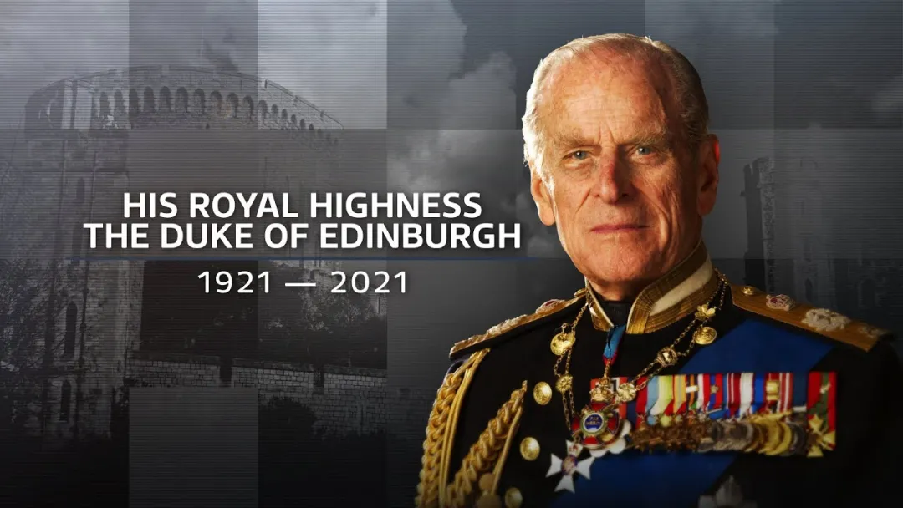
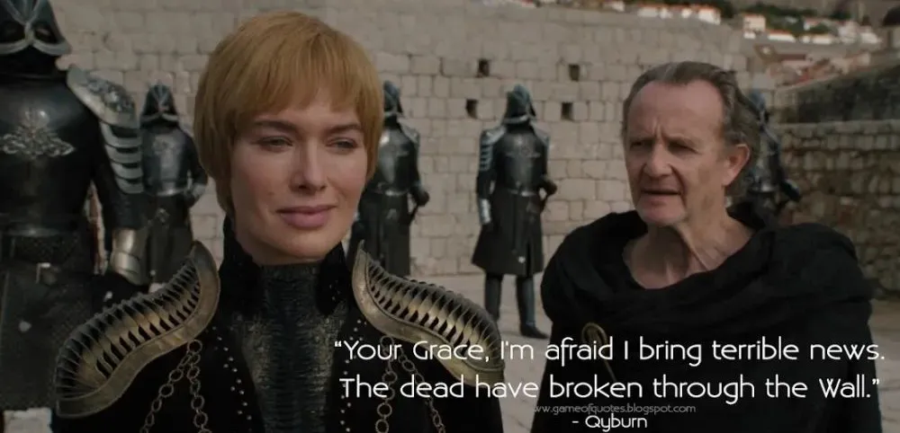

# 咬文嚼字-Part 5 贵族相关词语 

@(TOEFL)[托福, TOEFL, 词根词缀,咬文嚼字]

## [Do men ever visit Boston](https://www.quora.com/What-is-the-difference-between-a-duke-an-earl-a-lord-a-marquis-a-baron-and-a-count)

You can keep the ranking straight with this mnemonic: "Do men ever visit Boston?" Thus: duke, marquis, earl, viscount, baron.

**Duke** is the highest, most powerful rank. There are but a handful of dukes. William the Conqueror was a duke.

**Marquis** (pronounced markwiss in England) is next, but we'll come back to it.

**Counts and Earls are equivalent ranks**, so equivalent that the wives of earls have always been called countesses. ***(I assume that William the Conqueror brought/made counts, and the native English equivalent rank was Earl.*** But if that's true, then how can it be true that the wives of earls have always been countesses?) What is a count? He is the ruler of a county. And now we can go back to consider the marquises.

**Marquis**: Some counties are border counties. A border county is where the action is. This is where the enemy starts their invasions. This is the jumping off point for your invasion of the enemy kingdom.

If a border count doesn't wind up dead, it's probably because he's rich enough to keep an unusually large military force. So, the border count is rich and well armed. Plus, he's a war hero, right? Surviving all those battles? Plus he captures all that loot?

So a border count tends to be more prominent, powerful, and respected than other counts. And a border (and by extension, a border county) is called a "mark" or a "march." It's not called that because that's where the armies march; that's just coincidence, though often enough you have to send out for new peasants since the armies of both sides marched thru there enough times to dispose of or drive out the old peasants.

So, eventually, border count became a rank above regular count. Thus: marquis.

**Viscount** is below count, the same as the vice president is below the president.

And then **baron** is the bottom of the totem pole[^1]. But these are all barons, to hear some people tell it. When the king is at odds with his barons, and they're making him sign the **[Magna Carta](https://en.wikipedia.org/wiki/Magna_Carta)**, you can bet that the dukes, marqueses, earls, counts, and viscounts are standing with the barons, not with the king.

But, to hear some tell it, a baron is anybody who holds directly from the king. So the dukes and such are literally barons. They just don't call themselves that because they have more impressive titles.

Expect all of this to be wrong: Things can switch up on you every time you cross into a new country or a new century.

[^1]: totem pole【ˈtoʊtəm poʊl】 图腾柱;(机构等内的)等级，级别。 a range of different levels in an organization, etc.

### peer（贵族）：与查理曼大帝平起平坐的十二骑士

英语单词**peer**原本是“同等的人”之意，来自拉丁语par（equal，相等）。它还可以表示“贵族”，这是为什么呢？原来，在中世纪，法兰克王国的著名国王查理曼大帝身边有十二个武艺高强的骑士，一直追随查理曼大帝南征北战，立下赫赫战功。为了犒赏他们，查理曼大帝借鉴亚瑟王和十二圆桌骑士的故事，和这十二位骑士平起平坐，将他们称为**peer**，意思就是“平起平坐的人”。***由于这些骑士都是贵族，因此peer就衍生了“贵族”的含义***。

- peer：[pɪə] n.贵族，同等的人vt.封……为贵族，与……同等
- peerage：['pɪərɪdʒ] n.（全体）贵族，贵族地位，贵族阶级
- peerless：['pɪrləs] adj. 无与伦比的；出类拔萃的；无比的
- compeer：[kəm'pɪr] n. 同辈；同伴；地位相等的人

### duke（公爵）：罗马帝国时期的蛮族军事统帅

在古罗马时代，出身为日耳曼或凯尔特蛮族而作为雇佣军为罗马军队所用的将帅，由于没有正式的罗马军衔而统称为***Dux***，是“***军队首领***”的意思。该词来自拉丁语动词***ducere***（领导、引导），这就是英语单词**Duke**（公爵）的来源。英语词根**`duc-`**（引导）与此同源。

罗马帝国灭亡之后，各部族的军事领袖成为欧洲各小国的国君，其中许多就以***Dux***为称号，他们统治的小国就被称为“***公国***”（**duchy**）或“***大公国***”（**Archduchy【ˈɑːtʃˈdʌtʃɪ 】**）。直到近代，意大利和德国统一之前的很多小国都以此为称号。这些小国的国君一般翻译为“***大公***”。

欧洲现存的独立公国是卢森堡和安道尔公国。历史上的其它公国经过合并和并吞，逐渐丧失独立性，成为国家的一部分，其统治者也演变成了由国王授予的爵位，即“公爵”（**Duke**）。在欧洲各国，公爵都是最高爵位之一。

英国的公爵爵位出现很晚。1337年，爱德华三世把康沃尔郡升为公国，将公爵爵号授予年方7岁的“黑太子”爱德华([the Black Prince](https://en.wikipedia.org/wiki/Edward_the_Black_Prince))。为突出公爵特殊地位，以后多年里除女王配偶和王子外，其他王亲国戚均不许称王，最高可获公爵爵位。自从1483年建立诺福克公国以后，公爵爵位开始授予王亲以外者，但很少建立公国。而且能获此最高爵位者多是军功显赫的统帅。

- **`duc-`**：引导，领导
- duct： [dʌkt] n. 输送管，导管vt. 用导管输送；以导管封住
- duke：[djuːk] n.公爵
- duchy：['dʌtʃɪ] n.公国，公爵领地
- duchess：['dʌtʃɪs; -es] n.公爵夫人，女公爵
- archduke： [,ɑrtʃ'duk] n. 大公，（奥地利）皇太子
- ducal：['dukl] adj. 公爵的；公爵领地的；象公爵的
- duce： ['duːtʃɪ] n.（意）领袖；首领

###  marquis（侯爵）：镇守边疆的诸侯

**marquis** 【ˈmɑːrkwɪs】（ (除英国外一些欧洲国家的) 侯爵）是欧洲贵族爵位中的一种，在公爵（**duke**）之下、伯爵（**count**）之上，也可拼写为**marquess**。该词来自法语***marchis***，字面意思是“镇守边疆的诸侯”，来自***marche***（边疆），与英语单词**march**（行军）都来自拉丁语***marca***（边疆）。欧洲中世纪边疆与内陆的概念区别源自于古罗马帝国时期对帝国行省的划分，比较稳定的内陆省份归于元老院管理，而不稳定的边疆省份归于皇帝管理。中世纪以后，则把封疆贵族按照相似的概念分为最受君主信赖、管理边疆的“侯爵”，和地位较低、管理内地一方领土的“伯爵”。

- marquis：['mɑːkwɪs] n.侯爵
- march： [mɑrtʃ] v.（使）前进，（使）行军，进军；游行示威；进展n. 前进；行军；游行示威；进行曲
- marchioness：[,mɑrʃə'nɛs] n. 女侯爵，侯爵夫人

### count（伯爵）：罗马皇帝的侍从

在古罗马帝国时期，罗马皇帝身边的亲信往往能得到皇帝的宠爱，掌管帝国的军政大权，有时还会出任地方官吏，最常见的是担任某个行省的总督。欧洲大陆部分国家的伯爵爵位名称就出自拉丁文的***comes***，意为“***侍从***”。例如，法语中表示“伯爵”的单词为***counte*** ，出自拉丁文***comitem***，即***comes***的宾格，意思就是“伙伴，侍从”，进入英语后演变为英语单词**count**，表示“伯爵”，但通常指的是欧洲大陆地区的伯爵。

英语单词**county**是英国的行政区划单位，通常被翻译为“郡”或“县”，其实，它在历史上指的就是[诺曼底公爵](https://en.wikipedia.org/wiki/Duke_of_Normandy)征服英国后，封给手下各伯爵（**count**）的封地，从拼写上我们可以明显地看出它们之间的关系。

- count：[kaʊnt] n.（法、德、南非）地区的伯爵
- countess： ['kaʊntəs] n. 伯爵夫人；女伯爵
- county： ['kaʊntɪ] n.郡，县

### earl（伯爵）：北欧地区的“部落首领”

欧洲国家贵族爵位中，从最低级以上的第三级一般在中文里译作“伯爵”，处在侯爵之下，在子爵之上。

英国的“伯爵”**earl**源自古英语***eorl***，与北欧国家的“伯爵”Jarl同源，原意是“***部落首领***”。11世纪，丹麦国王克努特统治英国后，把伯爵（**earl**）爵位引进英国，以丹麦方式把英国划分为许多伯爵领地（**earldom**）。每个伯爵均是镇守一方的诸侯，相当于现在的总督职位。在英国，**earl**（伯爵）的历史最悠久。在1237年黑太子爱德华被封为公爵之前，它是英国最高的爵位。同时，**earl**还是欧洲五种爵位中唯一一个源自古英语的爵位。

- earl： [ɜːl] n.伯爵
- earldom：['ɜːldəm] n.伯爵领地

### viscount（子爵）：法国的副伯爵

英语单词**visecount**（子爵）来自法语，由**`vice`**（副的）+**`count`**（伯爵）构成，字面意思就是“副伯爵”。**visecount**常为郡守，地位在掌管一方的诸侯（伯爵）之下，在普通贵族男爵之上，但有时也可能是实力强大的诸侯。在英国，1440年比奥芒特的约翰被封为子爵，位居所有男爵之上。

**`vis-`** 表示“改变、交流”，引申为“副职”或“代理牧师”。源自拉丁语 *vux (属格 vicis) "turn, situation, change."

- viscount：['vaɪkaʊnt] n.子爵
- vice：[vaɪs] adj. 副的；代替的

###  baron（男爵）直接从国王那里获得封地的贵族

男爵（**baron**）是贵族爵位中最低的一级。盎格鲁一撒克逊时代英语中已有“男爵”（**baron**）一词，但无男爵爵位，而且词义不够确定，似有“自由者”或“国王的臣仆”之意，并无尊贵之意。当时，所有那些直接从国王那儿得到封地的贵族都可称为“男爵”。当时男爵在世俗贵族中占了很高比例，以至于“男爵”一词长期作为贵族的集合名词使用。11-14世纪，男爵的封号和封地可通过血缘和婚姻关系传递，但不得随意出售和转让，历代国王也不随意增加或褫夺贵族封号。

1387年，理查二世封约翰•比彻姆为基德敏斯特男爵后，男爵才成为英国贵族的正式爵位，并且始终是人数最多的爵位。

- baron：['bær(ə)n] n.男爵
- baroness：['bær(ə)nɪs; -nes] n.男爵夫人，女男爵
- barony：['bærəni] n. 男爵领地；男爵爵位
- baronet： ['bærənət] n. 从男爵；准男爵vt. 封…为准男爵

## Your Majesty

### 1. Your Majesty:(你的)王权

为什么称呼英女王时要说 Your Majesty，而不是 My Majesty 呢？影视剧里都把“Your Majesty”翻译为“陛下”，虽然这么翻没错，但会对我们造成思维定势，让我们无法理解 your 和 my 的问题。

是不是觉得 majesty 长得像 major？没错，它俩同源的，majesty 最本初的意思就是“伟大”，后来慢慢演变成“royal power”，即君权”、“王权”。

所以，面对一个君主，称其为“Your Majesty”（你的王权），这在逻辑是对的。但如果说“My Majesty”就变成“我的王权”了。怎么？想造反？

另外，Your Majesty 是面对君主的第二人称，但如果你跟别人谈论君主时要用到第三人称，就要根据其性别加上 his 或者 her。

比如谈论到英女王时，要说 Her Majesty；谈论西班牙国王时，就要说 His Majesty了。

>  例：Her Majesty delivered a speech prior to the dinner.（在晚宴前，女王陛下发表了演说）。

### 2. Your Royal Highness

值得注意的是，majesty 一词只限于国王或女王，就是一个君主国内的“一把手”，其他王室成员哪怕是女王的老公，都要降一级。

比如英女王已故老公菲利普亲王，第二人称是Your Royal Highness，第三人称是 His Royal Highness，相当于“殿下”

### 3. Your Grace v.s My Lady

英国的贵族体系比较复杂，简单来说，可以分为“公侯伯子男”不同等级。

有爵位的贵族，男性一般被称为 My Lord，女性被称为 My Lady，其中公爵夫人、侯爵夫人还称成为 Your Grace。

这里 lord 和 lady 表示“大人”、“夫人”，所以前面加“my”逻辑是对的，但 grace 一词用法跟 majesty 类似，就要说 Your Grace了。

### 4. Your Honor & the Hon.

贵族以外的社会上的高阶人士，也有不少尊称。

其中最著名的莫过于“法官”的尊称了，你可能听说过“Your Honor”的说法。

>  She was with the Hon. Joanna Southwood.这是尼罗河上的惨案里的一句话。 Hon.是Honourable的缩略形式，用(the Honourable)，意为阁下。 《英》用于对伯爵以下的贵族子女、高等法院的法官、下院议员等的尊称。 《美》用于对参众两院议员、州议员、州长、市长、法官等的尊称。

### 5.  Your Excellency 

对于外国的元首、大使，或者身居要职的到访贵客，会被称为“Your Excellency”，相当于“阁下”。

这里的 honor 和 excellency 用法跟前面的 majesty、grace 用法一样，都是某种荣誉、荣耀，前面都要加 your 的逻辑才对。

### 6. 精彩评论

- 陛下、殿下、阁下、麾下，暗指称呼者在被称呼者的建筑之下，表示人尊己卑。其实这里也有“您”之意：我在您之建筑之下。

- 公侯伯子男爵位体系是翻译时套用的中国周代的封建体系。

- Your Grace 指高阶贵族，当时欧洲很多国王其实就是大的封建领主变成的，跟春秋战国时代大大小小的“王”差不多，都是周天子的封建领主，都不敢称帝，帝王才是真正的 Your majesty

- 爵位的称谓，首先要区分hereditary peerage世袭爵位和life peerage授勋爵位两种情况。具体参看Debrett's Handbook

- 法语：(直接称呼)votre majesté，(间接称呼)sa majesté，陛下）。ma 我的（接阴性词），dame 女士，madame 女士。mon 我的接阳性词，monsieur 先生。当年学法语的时候，老师跟我们说这些词是当初贵族的遗留，也影响了现在的英语，还有de是贵族名字，比如戴高乐，de Gaulle ，并且最后说欧洲皇室是一家子，非常乱。依稀记得就这么多，不敢说一定对，如果您有兴趣可以查一下。

- She was with the Hon. Joanna Southwood.这是尼罗河上的惨案里的一句话。 Hon.是Honourable的缩略形式，用(the Honourable)，意为阁下。 《英》用于对伯爵以下的贵族子女、高等法院的法官、下院议员等的尊称。 《美》用于对参众两院议员、州议员、州长、市长、法官等的尊称。

- H.M.S. 女王的船，HM Government 女王的政府，HM Treasury 女王的财政部，HM Revenue & Customs 女王的海关总署，多没文化的翻译

- 英国军舰前缀HMS: Her/ His Majesty's Ship

  

Reference:

1. [“陛下”为啥是 Your Majesty 而不是 My Majesty？巨大思维差异！ 侃哥-侃英语](https://mp.weixin.qq.com/s/3Edlcc14KEyk3pZ3MZYPdg)

## 其他和贵族相关的单词

### [Minister](https://mp.weixin.qq.com/s/YqjWyrjx1h9L0b62NYp6rg) (大臣、部长)

在中国历史上，再大的官见了皇帝也得自称“奴才”、“小的”。西方也一样，大臣在国王面前自称**minister**，字面意思就是“小人、奴仆”。

**prime minister**就是首相、主要的大臣。后来英国实行了君主立宪制，国王的大臣变成了政府的部长，但**minister**的称呼并没有变化，只是一般翻译为“部长”而不再是“大臣”。

**minister**可以分解为两部分:

- 前面的**minis**表示“小”，和单词minus（减去，负的）、minor（较小的、次要的）同源
- 后面的-ter是个比较级后缀。

合起来整个单词的字面意思就是“较小的人，地位较低的人”，引申为“奴仆”。

在英语中，**minister**原本表示:

- 牧师（上帝的奴仆）
- 大臣（国王的奴仆）。

**minister**派生出单词**ministry**：

- 前面的**`ministr-`**等于**minister**，
- 后面附加了一个抽象名词后缀-y。

**ministry**原本是一个抽象名词，表示“*牧师或部长的身份和职责*”，后来转用做**具体名词**，***表示部长履行职责的场所和机构***，也就是政府下面的一个部，比如**the ministry of education**（教育部）。

单词**administrate**也来自**`minister`**:

- 前缀**`ad-`**表示“去、趋近”，
- 中间的**`ministr-`**等于**minister**，
- 末尾的**`-ate`**来自***拉丁语动词的过去分词后缀***，在此用作**动词后缀**。

整个单词的字面意思就是“*去当大臣、去辅助国王*”，***引申为“管理、行政”***。

它还派生出名词**administration**（管理、行政、行政机构）和**administrator**（管理员、行政人员）。

------------------------

- **minus**：[ˈmaɪnəs] adj.负的，零下的，稍差的prep.减去，零下n.减号，负号；不足
- **minor**：[ˈmaɪnə(r)] adj.较小的，未成年的，次要的，小调的n.未成年人，小调，辅修科目
- **minister**：[ˈmɪnɪstə(r)] n.部长，大臣，牧师vi.执行牧师职务，照料，伺候
- **ministry**：[ˈmɪnɪstri] n.（政府）部门；牧师职务和任期
- **administrate**：[ədˈmɪnɪstreɪt] vt.管理，行政，经营
- **administration**：[ədˌmɪnɪˈstreɪʃn] n.管理，行政，行政机构，经营
- **administrator**：[ədˈmɪnɪstreɪtə(r)] n.管理员，行政人员

Reference: [词源趣谈：再大的minister（大臣、部长），其实也只是一个小“奴仆”。--钱磊博士](https://mp.weixin.qq.com/s/YqjWyrjx1h9L0b62NYp6rg)

### minstrel（吟游诗人）：流落民间的宫廷歌手

英语单词**minstrel**常用来表示“吟游诗人”，然而，从词源上看，它原本指的是国王或贵族家中的歌手。单词**minstrel**源自拉丁语***ministralis***，与**minister**（大臣、部长）、**ministry**（部门）同源，含有“家臣、奴仆”之意，指的是宫廷里或王公贵族家中的歌手，他们并非科班出身，只是由于有一定的文艺才能而被主人看中，专门负责唱歌吟诗，为主人及客人提供娱乐，地位与弄臣相仿。

后来，越来越多科班出身的音乐人开始得到王公贵族的青睐，那些半路出家的minstrel在宫廷里越来越不吃香，只好流落至民间，靠街头卖艺为生，变成了流浪歌手或吟游诗人。

在英语中，**minstrel**一词在16世纪之前指的都是宫廷里或贵族家中负责娱乐的歌手、说书人、杂耍艺人、小丑等。直到18世纪该词的词义才开始缩小，专指中世纪的吟游诗人或流浪歌手。

- minstrel：['mɪnstr(ə)l] n.（中世纪）吟游诗人，歌手，艺人

### Silhouette /sɪlu'et/

**silhouette** - 18世纪中期有位法国作家，名叫**Étienne de Silhouette (1709-1767)**，他借助贵妇人**Madame de Pompadour**的影响于1759年当上了路易十五的财政大臣。他一上任便提出对贵族的房地产征收土地税，并实施财政紧缩政策，招致贵族的强烈反对，因而任职不到一年便遭罢免。

18世纪下半叶至19世纪初是剪影的黄金时代，当时剪影在巴黎也十分流行，Silhouette业余爱好剪影。剪影是一种最简单的艺术形式，而Silhouette曾试图以最简单的方式来改变法国的财政状况。有人便把此一廉价艺术品叫做portrait la silhouette，随后索性以silhouette简称之，意在揶揄嘲讽Silhouette短暂的政治生涯，奚落其小小剪影终不成巨画。殊不知他的大名却从此载入辞书，不仅在法语中占了一席之地，而且还进入了英语词汇行列。二百余年来，其拼写形式一直保持稳定，词义也无甚变化，至今仍然指“剪影”，有时也指“黑色轮廓像”或“侧面影像”。作动词用时，表示“衬托出……的轮廓”。

例:

- Her silhouette appeared on the curtain. 窗帘上映出她的侧影。

- She stood in front of the window, silhouetted against the dawn sky. 她站在窗前，黎明的天空衬托出她的轮廓。

- The trees on the top of the hill were silhouetted against the setting sun. 落日衬托出山顶上树木的轮廓。

- A silhouette of a deer on a road sign warns drivers that there may be wild animals on the road. 路标上鹿的剪影警告司机，野生动物可能会跑到路上来。

---------------------------------

**silhouette**（剪影）：厉行节俭的法国财务大臣西卢埃特。

英语单词silhouette（剪影）来自18世纪法国财务大臣**Etienne de Silhouette**的名字。在他担任财务大臣时，法国因为“七年战争”而陷入财务危机。他上任后厉行节俭政策，禁止铺张奢华，因此遭到很多人尤其是有钱人的憎恶。为了嘲笑他，人们把他的名字当成了各种便宜货的代名词。当时在法国出现了一种便宜的肖像方法，即在纸上剪出人物的外部轮廓。与常规的肖像画相比，这种剪影方式非常便宜。人们便沿用一贯的恶搞，将其称呼为silhouette。没想到后来这个词竟然长盛不衰，成为了对“剪影”的正式称呼。

- silhouette：[,sɪlʊ'et] n.剪影，轮廓

### Patron （主顾）：掏钱资助艺术家的贵族

**`patr-`** = father, 表示“父亲，祖国”。源自拉丁语 pater (属格 patris) "father.".

**`-on`** 表名词，指人，物和一些物理学上的名词。
在古代，艺术家的日子不好过。因为艺术品既不能拿来充饥，又不能拿来保暖，所以不能像普通商品那样能给艺术家带来稳定的收入。艺术家的收入主要来自上流人士的资助。那些达官贵人欣赏某位艺术家的才华，就会花大价钱购买他的作品。这种购买艺术家的作品、资助艺术家的人就被称为**patron**（赞助人、保护人）。这个单词来自拉丁语***patronus***（守护神、保护人），词根是**`pater-`**（father，父亲）。英语单词**`patrician`**（贵族）与此同源。

对于艺术家来说，这些人绝不仅仅是买家，而是他们的恩人和庇护人，故称之为**patron**。例如文艺复兴时期的意大利，在二百年的文艺复兴鼎盛时期，美第奇家族([The Medici Family](https://www.history.com/topics/renaissance/medici-family))是许多艺术大师们的**patron**。罗马和佛罗伦萨的许多名垂青史的建筑，雕塑，绘画和壁画，都是在美第奇家族的资助下，由波提切利，达芬奇，米开郎基罗，拉斐尔等艺术大师完成，因而创造了辉煌灿烂的文艺复兴文化。

在现代，**patron**一词的含义已经泛化，可以表示各种行业的大主顾，但依然含有“赞助、庇护”的含义，因此一般指的是那种经常惠顾的老主顾，而不是一般的顾客（**customer**）。

- patron：['peɪtr(ə)n] n.主顾、赞助人、庇护人
- patroness：[,petrən'ɛs] n. 女主顾；女资助人；女保护人
- patronage：['pætrənɪdʒ] n. 赞助；光顾；任免权
- patronize：[ˈpætrəˌnaɪz] vt. 以高人一等的态度对待；经常光顾，惠顾；资助；保护

### meritocracy 【ˌmerɪˈtɑːkrəsi】 精英领导体制;

**`merit`**  n. 优点, 价值; 功绩; 良好 v. 值得, 应得, 应受到。

**`cracy-`** = rule, ruler, 表示“统治或政体，统治者”，最初含义表示“力量”。也引申为“支持者，参加者”等。源自希腊语 kratos "strength, might, power."

- meritocracy: n, 精英领导阶级
- meritocratic: adj.  评功论赏的，任人唯才的，以功绩定地位的；

## References 

1. [Peerage of England](https://en.wikipedia.org/wiki/Peerage_of_England) 

