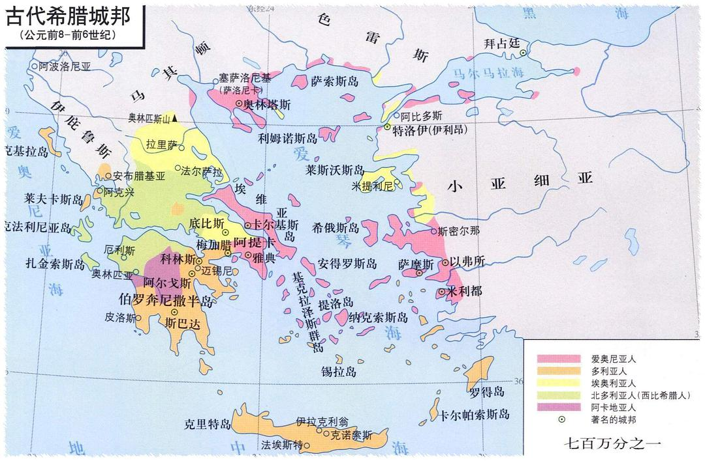
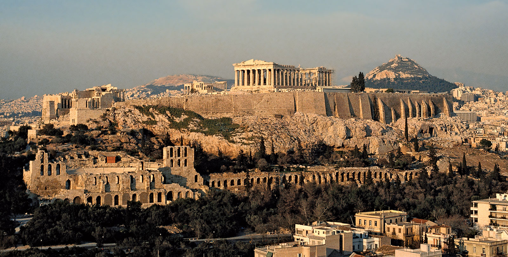
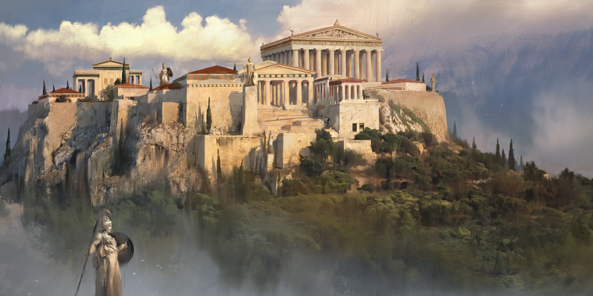
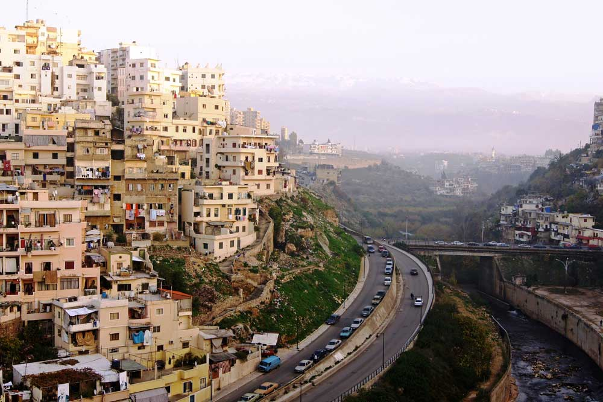
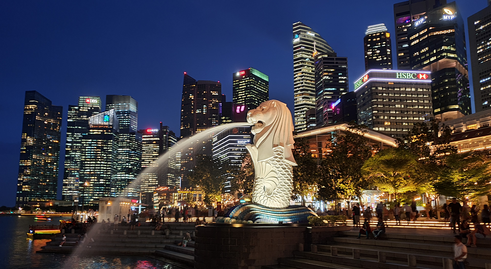
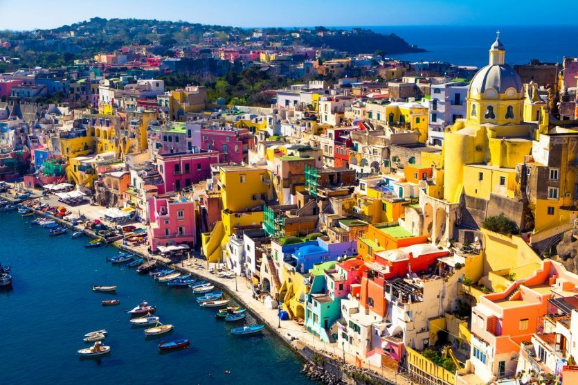
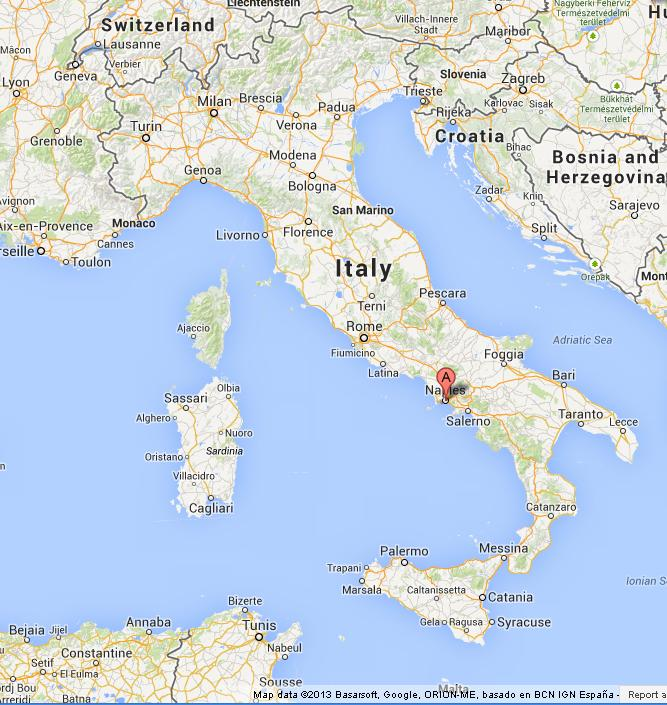
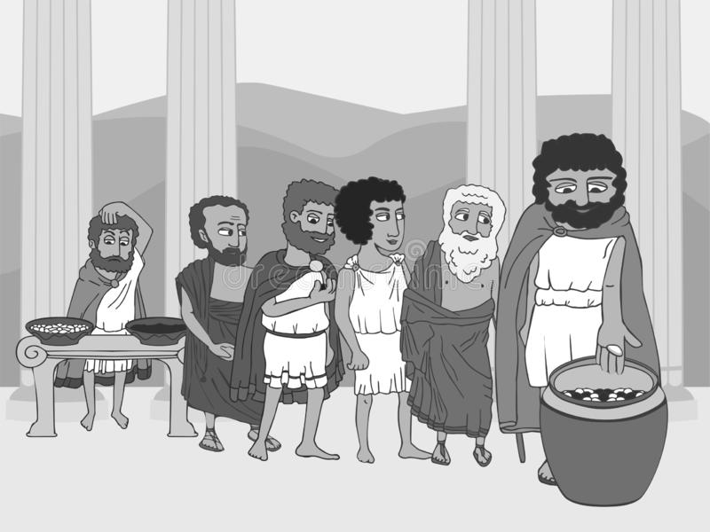
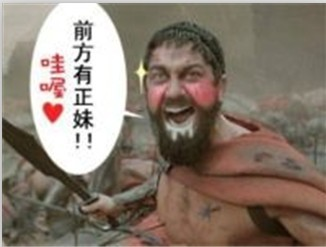
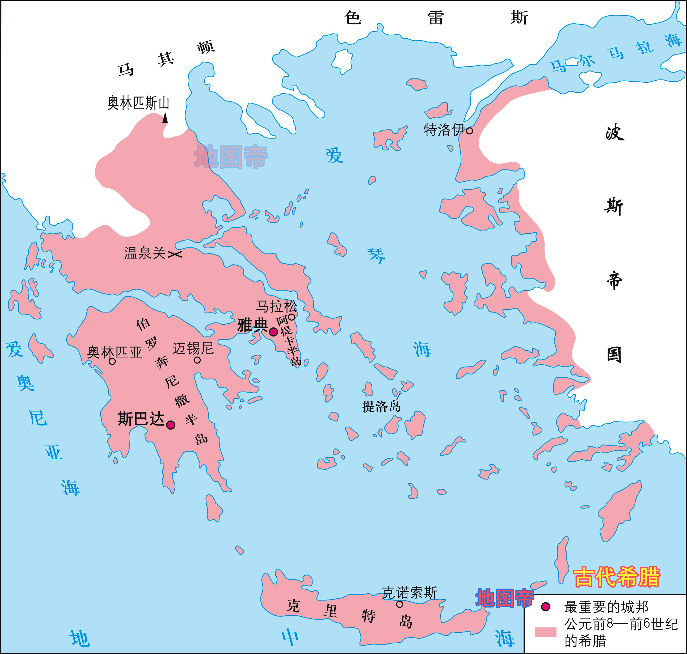

# 古希腊古罗马城邦地图

[toc]

## 古希腊城邦

### 1. **`archy-`** / `archi-` = ruler, rule, chief, 表示“统治者，统治，主要的”

| 单词                                              | 解释                                                         | 单词                             | 解释                                          |
| ------------------------------------------------- | ------------------------------------------------------------ | -------------------------------- | --------------------------------------------- |
| olig-arch                                         |                                                              | aut-archy                        |                                               |
| di-archy                                          |                                                              | tri-archy                        | 三头统治，实行三三政治征政府                  |
| tetr-archy                                        | 四头统治，四头统治集团（芈月）                               | **pent-archy** 【pentɑːkɪ】 | 五头统治，五国联盟                            |
| **hept-archy** 【heptɑːkɪ】                  | **`hept-`** 表示“七”。源自希腊语 hepta "seven." 七头统治，七国联盟（魔兽世界） | poly-archy                       | 多头统治                                      |
| an-archy                                          | 无政府状态;混乱;无法无天                                     | monarchy                         | 君主制;君主政体;君主国;君主及其家庭成员       |
| hier-archy 【ˈhaɪərɑːrki】                   |                                                              | monarch                          | 君主;帝王                                     |
| arch-tect                                         |                                                              | arch-ive                         | arch-ly                                       |
| **hagi-archy** 【hæɡi,ɑ:ki】【'heidʒi,ɑ:ki】 | **`hagi-`** = of a saint, saintly, holy, 表示“圣人，神圣的”。 n. 圣人政治；圣人之间的尊卑次序组织 | arch-duke                        | arch-ducal arch-duch-ess arch-duchy |
| plut-archy                                        |                                                              | arch-bishop                      |                                               |
| arch-di-ocese                                     |                                                              | arch-angel:                      | 天使长，第八级天使                            |
| arch-enemy                                        |                                                              | arch-fiend                       |                                               |
| arch-priest                                       |                                                              | arch- pelago                     |                                               |
| men-arche                                         |                                                              |                                  |                                               |
|                                                   |                                                              |                                  |                                               |
|                                                   |                                                              |                                  |                                               |

#### (1): archipelago 【ˌɑːrkɪˈpeləɡoʊ】希腊人的“主海”

**archipelago**（群岛）：希腊人的“主海”

英语单词**archipelago**源自希腊语***arkhipelagos***，由***arkhi***（**`=archi`**，chief，主的）+**`pilagos`**（sea，海）构成，意思就是“主海”，特指希腊人所处的爱琴海。

然而众所周知，爱琴海中遍布岛屿，所以希腊语***arkhipelagos***演变为意大利语***arcipelago***后，词义就变了，不再特指爱琴海，而是泛指各种分布有大量岛屿的海。进入英语后，拼写变成**archipelago**，词义进一步发生变化，除了表示“分布有大量岛屿的海”以外，还可以用来表示“群岛”。

- archipelago：[,ɑːkɪ'peləgəʊ] n.群岛，多岛的海
- monarch ：n.君主，帝王，最高统治者
- pelagic ：adj.深海的，浮游的，远洋的

#### (2): peninsula 【pəˈnɪnsələ】（半岛）：几乎与大陆隔离的陆地

> pen-接近 + insula岛 → 接近岛屿 → 象岛屿 → 半岛。

英语单词**peninsula**来自拉丁语，由pen+insula构成。其中，前缀**`pen`**（pene）表示almost（几乎），如peneplain（准平原）、penultimate（倒数第二）；**`insula`**表示“隔离”，英语词根insul-（隔离）就来源于此。所以**peninsula**的字面意思就是“几乎与大陆隔离”，中文译为“半岛”。

- insul-：隔离
- peninsula：[pɪ'nɪnsjʊlə] n.半岛
- insulate： ['ɪnsəlet] vt. 隔离，使孤立；使绝缘，使隔热
- insulation：[,ɪnsə'leʃən] n. 绝缘；隔离，孤立
- insulator：['ɪnsəletɚ] n. 绝缘体；从事绝缘工作的工人

####  (3): insulin【ˈɪnsəlɪn】（胰岛素）：胰腺周围岛状细胞团所分泌的激素

> **`insul-,isol-`** = island, 表示“岛屿”，来源于拉丁语。
> **`-in`** 表示名词，用于化学、生物学、医药

19世纪60年代，一位年轻的德国医学院学生兰格尔汉斯（Paul Langerhans）在显微镜下观察胰腺组织时，发现了胰腺周围分布有很多岛状的细胞团。兰格尔汉斯在自己的毕业论文中公布了自己的观察成果，并且推测说，这些岛状细胞团可能是分泌激素用的。

但是这项天才发现并没有受到重视，评委们认为这些岛状细胞团其实不过是淋巴结。兰格尔汉斯最后只能混个学位后卷铺盖走人，并在41岁时死于尿毒症。

然而，半个世纪过后，科学家们却发现这些岛状细胞团所分泌的物质确实是一种重要的激素，能够治疗当时的不治之症——糖尿病。为了纪念兰格尔汉斯，科学家们将这些岛状细胞团命名为***islets of Langerhans***（兰格尔汉斯岛），即“胰岛”，将其分泌物命名为**insulin**，该词源自拉丁文***insula***（岛屿），意思就是“岛素”，即所谓的“胰岛素”。

- insulin：['ɪnsəlɪn] n.胰岛素
- insula：['ɪnsəlɚ] n.岛屿，脑岛
- insulate：['ɪnsjʊleɪt] vt.隔离，孤立，使绝缘

#### (4) Sardo,撒丁岛，意大利岛屿

> Sardine 来自 Sardo,撒丁岛，意大利岛屿，旅游胜地。据说因这种鱼从该岛附近捕捉而得名。

**sardine** - 在地中海的**Sardinia**岛（撒丁岛）上生长一种有毒的植物，罗马人给它取了个拉丁文名字叫herba Sardonia（撒丁草）。古希腊人都认为，其毒之烈足以致命。Sardinia岛也因该植物而得名。

据传，误食而中毒者肌肉抽搐，狂笑不止，脸孔也因临死的痛苦而变形，状似嘲笑。古希腊吟游盲诗人荷马称这种笑为Sardónios gelos（撒丁式的笑容），法语作rire sardonique，英语则作sardonic laughter，我们至今仍在使用该短语，用以表示“嘲笑”或“冷笑”。**sardonic**一词也因此获得了“冷嘲的”和“讥讽的”等义。

另有一英语单词**sardine**（沙丁鱼,据说因这种鱼从该岛附近捕捉而得名。）亦源于此。沙丁鱼又延伸出：拥挤不堪、水泄不通的意思，因为沙丁鱼都都是成群出现。又因此延伸出：平庸，碌碌无为的意思。沙丁鱼出动如同挤地铁的你，在城市来来回回，女朋友都找不到，每天忙忙碌碌却又碌碌无为，使劲在海里内卷还自我欺骗我每天游了三千里，结果产出和我在群里摸鱼的效果一样。

例　

- Brett raised a sardonic eyebrow. (LDC) 布雷特嘲弄地竖了竖眉毛。
- There was a sardonic expression on her face. 她脸上有一种嘲讽的表情。
- She gave him a sardonic smile/look. (CID) 她朝他嘲弄地笑了一笑／看了一眼。

### 2. `cracy-`  **`cract-`** = rule, ruler, 表示“统治或政体，统治者” {48}

**`-cracy`**（统治、政治）：强力神克拉托斯。

克拉托斯（***Cratos***或***Cratus***）是希腊神话中的强力之神，是“力量”的拟人化。他是泰坦神帕拉斯（Pallas）和斯梯克斯（Styx）的儿子，也是胜利女神尼克、竞争女神泽洛斯、暴力神比亚的兄弟。他曾经按照宙斯的安排，和兄弟暴力神比亚以及火神赫淮斯托斯一起，用铁链将普罗米修斯锁在高加索山上。由于他曾经剥夺过普罗米修斯的人身自由，所以在普罗米修斯恢复自由之后，也被忒弥斯下令悬梁自杀。
克拉托斯的名字cratos在希腊语中写作kratos，意为“强力、武力”的意思，其衍生词kratia（统治、管理）就是英语词根-cracy（统治、政治）的来源。

- **-cracy**：统治，政治
- democracy：[dɪˈmɑkrəsi] n. 民主，民主主义；民主政治
- monocracy：[mə'nɒkrəsɪ] n. 独裁政治
- bureaucracy：[bjʊ'rɑkrəsi] n. 官僚主义；官僚机构；官僚政治
- aristocracy：[,ærɪ'stɑkrəsi] n. 贵族；贵族统治；贵族政治

***-carcy: 表示一个阶层，一个集团  V.S -cart:表示集团里面的人***

| 单词                                                         | 解释                                                         | 单词                                                         | 解释                                                         |
| ------------------------------------------------------------ | ------------------------------------------------------------ | ------------------------------------------------------------ | ------------------------------------------------------------ |
| **aristo-cracy** 【ˌærɪˈstɑːkrəsi】                     | **The aristocracy** is a class of people in some countries who have a high social rank and special titles.  贵族（阶层） | **aristo-cart** 【əˈrɪstəkræt】                         | a member of the aristocracy (一位)贵族                  |
| **bureau-cracy** 【bjʊˈrɑːkrəsi】                       | 官僚作风，官僚机构，官僚政治                                 | **bureau-crat** 【ˈbjʊrəkræt】                          | 官僚；官僚主义者                                             |
| **demo-cracy** 【dɪˈmɑːkrəsi】                          | a system of government in which all the people of a country can vote to elect their representatives 民主政体;民主制度;民主国家;民主精神;民主权利;民主 | **demo-crat** 【ˈdeməkræt】                             | a person who believes in or supports democracy 民主党人;民主主义者;(美国)民主党党员;民主党支持者 |
| **auto-cracy** 【ɔːˈtɑːkrəsi】                          | **`auto-`** 表示“自己”，来源于希腊语. 专制;专制制度;独裁国家;独裁政体;专制国家。 A system of government of a country in which one person has complete power. | **auto-crat** 【ˈɔːtəkræt】                             | 独裁者;专制统治者;专制君主;专横的人;独断专行的人。 An **autocrat** is a person in authority who has complete power. |
| **mono-cracy** 【mɒ'nɒkrəsɪ】                           | **`mono-`** 表示“单个，一个”。源自希腊语 monos "alone, single, sole." 独裁政治：A form of government in which the ruler is an absolute dictator(not restricted by a constitution or laws or opposition etc.) | **mono-crat** 【mɒnəkræt】                              | 独裁者；君主制度主义者 a person favoring monocracy      |
| **mob-o-cracy** 【mɒ'bɒkrəsɪ】                          | 暴民政治，暴徒统治；（总称）取得统治地位的暴民阶级: Government System in which decisions are taken by a (possibly angry) mob | **mob-i-crat** 【ˈmɒbəˌkræt】                           | 暴民领袖；支持暴民政治的人；惑众取宠的政治家  [rule](https://www.collinsdictionary.com/zh/dictionary/english/rule) or [domination](https://www.collinsdictionary.com/zh/dictionary/english/domination) by a [mob](https://www.collinsdictionary.com/zh/dictionary/english/mob) |
| **ochlo-cracy** 【ɑːkˈlɑːkrəsi】                        | **`ochlo-`** multitue, crowd. 表示“群众”。源自希腊语 okhlos "populace, mob."   暴民政治 government by a mob; | **iso-cracy** 【aɪˈsɑːkrəsi】                           | **`iso-`** 表示“相等，异构，同种”。 a form of government in which all people have equal powers 平等参政权 |
| **pant-iso-cracy**         【ˌpæntɪ'sɒkrəsɪ】           | **`pant-`** **`pan-`** 表示“全部的、广泛的”。 **`iso-`** 表示“相等，异构，同种”。 大同世界 | **iso-crat-ic** 【ˌaɪsəʊ'krætɪk】                       | 权力平等主义的：a form of [government](https://www.collinsdictionary.com/zh/dictionary/english/government) in which all people have [equal](https://www.collinsdictionary.com/zh/dictionary/english/equal) [powers](https://www.collinsdictionary.com/zh/dictionary/english/power) |
| **strato-cracy** 【strəˈtɑːkrəsi】                      | **`strato-`**层 军阀政治；军阀统治：government by military forces. | **timo-cracy** 【taɪˈmɑːkrəsi】                         | **`timo-`** = worth, 表示“价值”。源自希腊语 time "honor, worth." 金权政治；荣誉政治 A form of government in which possession of property is required in order to hold office. |
| **pluto-cracy**                        【pluːˈtɑːkrəsi】 | **`pluto-`** = wealth, 表示“财富”，希腊财神 Ploutos 被罗马人转写成 Pluto，都源自希腊语 ploutos 表示财富。另外冥王星也用 Pluto 命名。源自希腊语 ploutos  富豪（或财阀）统治的国家；富豪（或财阀）统治阶级 A **plutocracy** is a country which is ruled by its wealthiest people, or a class of wealthy people who rule a country. | **pluto-crat**                            【ˈpluːtəkræt】 | 富豪；财阀If you describe someone as a **plutocrat**, you disapprove of them because you believe they are powerful only because they are rich. |
| **Euro-crat** 【ˈjʊrəkræt】                             | 欧盟官员(尤指高级官员). An official of the European Union, especially a senior one. | **kakisto-cracy** 【kækəs'tɑkrəsi】                     | **`cac-,caco-`** 表示“恶，丑，不良”。源自希腊语 kakos "bad."  恶人政治: A government by the least able or worst citizens. |
| lando-cracy                                                  |                                                              | merit-o-cracy                                                |                                                              |
| geronto-cracy                                                |                                                              | juven-o-cracy                                                |                                                              |
| physio-cracy                                                 |                                                              | physio-crat                                                  |                                                              |
| slavo-cracy                                                  |                                                              | snobo-cracy                                                  |                                                              |
| fool-o-cracy                                                 |                                                              | heiro-cracy                                                  |                                                              |
| gynaeco-cracy                                                |                                                              | gyneco-cracy                                                 |                                                              |
| **hagio-cracy** 【hæɡɪ'ɒkrəsɪ】                         | **`hagi-`**= of a saint, saintly, holy, 表示“圣人，神圣的”。 government by holy men 。 圣徒统治；圣徒政治的政府；圣人政权 | theo-cracy                                                   |                                                              |
| techno-cracy                                                 |                                                              | techno-crat                                                  |                                                              |
| thlasso-cracy                                                |                                                              | thalasso-crat                                                |                                                              |
|                                                              |                                                              |                                                              |                                                              |

#### (1): aristocracy（贵族政治）：古代哲学家的精英治国论

古希腊时期的杰出哲学家苏格拉底主张专家治国论，认为国家应该由经过训练、有知识才干的人来治理，反对通过抽签选举方式实行的民主。后来，苏格拉底被雅典公民大会以崇拜新神和腐蚀青年思想的罪名判处死刑，死于雅典的民主政体下，使得苏格拉底的学生柏拉图进一步加强了对雅典民主政体的怀疑。

因此，柏拉图提出了“精英治国”的观点，即应该由最杰出的精英来治理国家，而不是普通百姓直接参与国家治理。这就是近代“**代议制民主**”思想的萌芽。

在希腊语中，“精英治国”称为*aristokratia*，由***aristos***（最好的）+***kratos***（统治）构成。这就是英语单词**aristocracy**的来源。后来在中古时期，由于贵族阶层（nobility）往往以社会精英自居，因此“贵族统治”也被称为**aristocracy**。

- aristocracy： [,ærɪ'stɒkrəsɪ] n.精英治国，贵族统治，贵族政治
- aristocrat：[ə'rɪstəkræt] n. 贵族
- aristocratic：[ə,rɪstə'krætɪk] adj. 贵族的；贵族政治的；有贵族气派的

#### (2) 总有mob想害朕

**`mob-`** 英国人常常指责美国人懒，把词的音节加以省略或简化，如把**fanatic**（狂热者）缩略成**fan**。可是英国人很久以前就已这么做了，**mob**一词往往被作为一个典型的例子。

17世纪初期英国一些拉丁语学者引进了拉丁文短语***mobile vulgus 'fickle crowd'***（感情变化无常的人们）。人们把它缩略为一个词**mobile**，然后又进一步把它缩短为**mob**。

语言纯正癖者（**purist**）对此甚为愤慨，认为这是语言粗俗化的一种表现。17和18世纪的一些著名作家，如艾迪生（[Joseph Addison](https://en.wikipedia.org/wiki/Joseph_Addison), 1672-1719）、斯威夫特（[Jonathan Swift](https://en.wikipedia.org/wiki/Jonathan_Swift), 1667-1745）、斯梯尔（[Richard Steele](https://en.wikipedia.org/wiki/Richard_Steele), 1672-1729）等也都极力反对使用像**mob**这样的缩约形式。

然而**mob**最终还是获得了承认，并在英语中立住了脚跟。1755年英国辞书编纂者约翰逊（[Samuel Johnson](https://en.wikipedia.org/wiki/Samuel_Johnson), 1709-1784）所编的《英语辞典》把**mob**作为标准英语收录其中。这个词现多指“乌合之众”、“暴民”，也指“一般民众”或“喧嚷的群众”，但常含贬义。在澳大利亚英语中mob可作中性词用，例如a mob of cattle。

- They found themselves surrounded by a mob of angry teenagers. 他们发现自己被一群愤怒的青少年包围住了。
- The mob ran through the main street, breaking windows and setting fire to cars. (LLA) 暴民奔跑着穿过大街，砸窗子，烧汽车。
- The angry mob outside the jail was/were ready to riot. (CID) 在监狱外愤怒的人群准备暴动。

**Mob： Mobile Object / Monster Or Beast**

在游戏界，[Mob](https://wowwiki-archive.fandom.com/wiki/Mob)特指用来刷怪升级的怪物和BOSS:

A **mob** (short for "Mobile objects" or "Mobile Object Blocks",[[1\]](https://wowwiki-archive.fandom.com/wiki/Mob#cite_note-1) or "Monster Or Beast"[[*citation needed*](https://wowwiki-archive.fandom.com/wiki/WoWWiki:Citation)] as a bacronym) is a generic term for any non-player entity whose primary purpose is to be killed for [experience](https://wowwiki-archive.fandom.com/wiki/Experience), [quest objective](https://wowwiki-archive.fandom.com/wiki/Quest_objective), or [loot](https://wowwiki-archive.fandom.com/wiki/Loot). They tend to be aggressive ([aggro](https://wowwiki-archive.fandom.com/wiki/Aggro): [Alliance](https://wowwiki-archive.fandom.com/wiki/Alliance) [Horde](https://wowwiki-archive.fandom.com/wiki/Horde)) to all players.

The gaming term "mob" is in widespread use in the [MMORPG](https://wowwiki-archive.fandom.com/wiki/MMORPG) genre. The term is not to be confused with its usual meaning in the English language, i.e. a large disorderly crowd or an organized gang of criminals.

**相关链接参考**:

- [Mob -WoWWiki ](https://wowwiki-archive.fandom.com/wiki/Mob)
- [为什么现代汉语不断向错误发音妥协？比如呆板、确凿等词，为什么都改成了以前的错读？](https://www.zhihu.com/question/21240445/answer/2179097189)

#### (3): bureau（局）用来覆盖写字台的桌布。

**bureau**（局）：用来覆盖写字台的桌布。

英语单词***bureau***来自法语，来自***burel***（糙羊毛布）。由于人们以前往往在写字台上铺上一层burel，因此这种桌布就被称为bureau。后来***bureau***被用来表示“办公桌”，再往后用来表示“办公室”，最后用来表示政府中的一个部门，即中文中的“局”或“处”。

由它衍生的单词**bureaucracy**表示“官僚作风、官僚机构”。

- bureau： ['bjʊərəʊ] n.局，处，办公室，办公桌
- **bureaucracy**： [,bjʊ(ə)'rɒkrəsɪ] n.官僚作风，官僚机构，官僚政治
  - [U] (often disapproving) 官僚主义；官僚作风： the system of official rules and ways of doing things that a government or an organization has, especially when these seem to ***be too complicated***.
  - [U, C] 官僚体制；实行官僚体制的国家：a system of government in which there are ***a large number of state officials*** who are not elected; a country with such a system.
- **bureaucrat**：['bjʊrəkræt] n. 官僚；官僚主义者
  - **Bureaucrats** are ***officials*** who work in a large administrative system. You can refer to officials as bureaucrats especially if you disapprove of them because they seem to follow rules and procedures too strictly.
- bureaucratic： [,bjʊrə'krætɪk] adj. 官僚的；官僚政治的

### reg- = rule, 表示“规则”。源自拉丁语

= rule, 表示“规则”。源自拉丁语 regula "straight piece of wood, rod."

| 单词                       | 解释                                                      | 单词 | 解释 |
| -------------------------- | --------------------------------------------------------- | ---- | ---- |
| reg∙ent 【ˈriːdʒənt】 | -ent 表名词，“…人” 摄政者;摄政王（用在名词后）摄政的 |      |      |
|                            |                                                           |      |      |
|                            |                                                           |      |      |

### 4. polis-/polic-/polit-（城市）

#### 以 polis结尾的城市

如果你去过世界上很多地方的话，也许你会注意到，世界上有很多城市名字都以-polis（波利斯）结尾，如美国的明尼阿波利斯（**Minneapolis**）、印第安纳波利斯（**Indianapolis**）、伊朗的波斯波利斯（**Persepolis**）等。这是怎么一回事呢？

原来，**`polis`**（波利斯）来自希腊语，意思就是“城市”。

- 明尼阿波利斯（**Minneapolis**）意思就是“河畔的城市”
- 印第安纳波利斯（Indianapolis）意思就是“印第安人的城市”
- 波斯波利斯（Persepolis）意思就是“波斯人的城市”。

#### acropolis： 雅典卫城

雅典著名旅游景点卫城在英语中叫做**acropolis**，源自希腊语**akropolis**，由**`acro-`**（高处）和**`polis`**（城市）构成，字面意思就是“高处的城市”。因为雅典卫城修筑在雅典市中心的高丘上，以便于防守。

####  Tripoli 古腓尼基人的三座城市

北非国家利比亚的首都的黎波里（**Tripoli**）的名字来自北非古国**Tripolis**（特里波利斯），源自希腊语，由**`tri-`**（三）和**`polis`**（城市）构成，字面意思就是“三座城市”。它原本是古代腓尼基人的殖民地，由三座殖民城市组成，其中的一座就发展为现在的的黎波里（**Tripoli**）。

#### Singapore 狮城

新加坡的英文名为Singapore，来自古印度的梵语，其中前半截singa-表示“狮子”，而后半截-pore则表示“城市”，和希腊语单词polis（城市）源自同一个老祖宗。所以Singapore的字面意思就是“狮城”。据说苏门答腊有位王子为了寻找合适的建都地点而来到此地，看到一头从未见过的猛兽经过。王子问当地人是什么动物。当地人随口说是狮子。王子十分高兴，认为这里是吉祥之地，便决定在此建都，并取名Singapore（狮城）。

#### Naples: 古希腊新城

意大利南部城市那不勒斯（**Naples**）拥有2600多年的悠久历史，它原本是古希腊人的殖民地，在希腊语中叫做**Neapolis**，由**`neo-`**（新的）的变体形式**`nea-`**和**polis**（城市）组成，字面意思就是“新建的城市”。

进入意大利语后拼写为**Napoli**，进入英语后变成了**Naples**（那不勒斯）。但表示“那不勒斯人”的英语单词Neapolitan依然保留了希腊语的拼写方式。

#### Polis 词根及其变体

希腊单词[polis](https://www.britannica.com/topic/polis)（城市）进入英语，变成了词根**`polis-`**，并产生了**`polic-`**/**`polit-`**等变体形式。英语单词police就来自这个词根，本意就是“城市管理”。最初的警察干的其实是城管的活，后来才聚焦至维护社会治安和打击犯罪上。

英语单词**policy**（政策）和**police**同源，原本是一个词，指的都是“城市管理”，后来才分离出“城市管理的方式、制度”之意，后来衍生出“政策”之意。

单词**political**（政治的）和**politics**（政治）都来自词根**`polit-`**（城市），本意就是“治理城邦的（学问）”。古希腊是城邦制度，一城一邦，

所以治理城邦就是“治国安邦”。 

来自词根**`polis-`**的单词还有**metropolis**（大都市），前面的**`metro-`**等于**mother**，表示“母亲”。**metropolis**的字面意思就是“母城”，用来表示孕育分化出众多小城市的大都市。

> **谷物女神得墨忒耳/刻瑞斯**:得墨忒耳的名字 **Demeter** 来自希腊语，前一部分很可能来自希腊词根 ge-（大地）的多 利安变体 da-，后一部分通常被看作是 mater（mother）的变体，因此 Demeter 的字面含义就 是“大地母亲”。英语词根 mater-（母亲）便来自希腊语 mater（母亲）。

它的派生出单词**metropolitan**，意思是“大都市的”，还可以转做名词，表示“大都市人”。

#### 相关单词

- **polis-/polic-/polit-**（城市）
- **Minneapolis**：[ˌmɪniˈæpəlɪs] n.明尼阿波利斯
- **Indianapolis**：[ˌɪndɪəˈnæpəlɪs]n.印第安纳波利斯
- **Persepolis**：[pə:ˈsepəlis] n.波斯波利斯
- **acropolis**：[əˈkrɒpəlɪs] n.雅典卫城
- **Tripoli**：[ˈtrɪpəli] n.的黎波里（利比亚首都）
- **Singapore**：[ˌsɪŋəˈpɔː(r)] n.新加坡
- **Naples**：[ˈneɪplz] n.那不勒斯
- **Neapolitan**：[nɪəˈpɒlɪtən] 
  - adj.那不勒斯的，那不勒斯人的
  - n.那不勒斯人
- **police**：[pəˈliːs]n.警察
- **policy**：[ˈpɒləsi] n.政策，方针，保险单
- **political**：[ˈpɒləsi] adj.政治的
- **politics**：[ˈpɒləsi] n.政治学
- **metropolis**：[ˈpɒləsi] n.大都市，首府
- **metropolitan**：[ˌmetrəˈpɒlɪtən] 
  - adj.大都市的，宗主国的
  - n.大都市人

#### Reference

1. [词源趣谈：新加坡是“狮城”，那不勒斯是“新城”，学过词源才知道这些地名的含义 -- 钱磊博士](https://mp.weixin.qq.com/s/usgwxuVEAsuoLcp3iELgKA)
2. [Acropolis--worldhistory](https://www.worldhistory.org/Acropolis/)
3. [Naples' must-see attractions](https://www.petitfute.co.uk/v51354-naples/actualite/m4-idees-week-end-et-vacances/a16414-les-incontournables-de-naples.html)
4. [A Romantic Weekend in Naples, Italy](https://www.hotels.com/go/italy/romantic-weekend-naples)

## 斯巴达三百正妹

###  古希腊数字

| 词根          | 解释                                                         | 备注                        |
| ------------- | ------------------------------------------------------------ | --------------------------- |
| mono-         |                                                              |                             |
| di-           | **`di-`** 表示“两个，双”。源自希腊语 dis "twice;" dikha "in two." |                             |
| tri-          | **`tri-`** 表示“三”。源自希腊语 tri- "three."                |                             |
| tetr-         | **`tetr-`**  表示“四”。源自希腊语 tetra- "four."         | 而 **quadr** 则是拉丁词根。 |
| pent-         | **`pent-`**  表示“戊，五”。源自希腊语 pente "five."      |                             |
| hex-          | **`hex-`** = six, 表示“六”。源自希腊语 hex "six."            |                             |
| hept- / sept- | **`hept-`** 表示“七”。源自希腊语 hepta "seven."              |                             |
| octo-         |                                                              |                             |

### 

- **octopus（章鱼）：八只足的海洋动物**

  18世纪时，科学家在海洋中发现有一类深海软体动物虽然外形大小相差很大，却都拥有一个共同特征，即都有八只腕足。因此，科学家便用希腊语将这类生物命名为oktopous，由词根**`okto-`**（八）和**`pous-`**（足）构成，意思就是“八只足的生物”。

  该词经过拉丁语进入英语后拼写变为**octopus**。英语词根**`octo-`**（八）就来自希腊词根okto-。同根字有**October**（十月），字面意思就是“八月”，因为在古罗马历法中，October指的是第八个月。
  octopus： ['ɑktəpəs] n. 章鱼，章鱼类
  October： [ɑk'tobɚ] n. 十月

### 相关单词

| mono- | di-   | tri-   | tetr-   | pent- | hex- | hept-   | octo- |
| ----- | ----- | ------ | ------- | ----- | ---- | ------- | ----- |
|       | diode | triode | tetrode |       |      | heptode |       |
|       |       |        |         |       |      |         |       |
|       |       |        |         |       |      |         |       |

## Reference

1. [The Greek polis](https://www.khanacademy.org/humanities/world-history/ancient-medieval/classical-greece/a/the-greek-polis)

