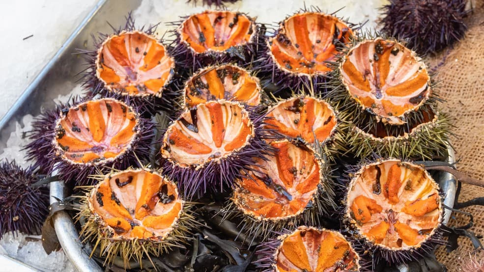
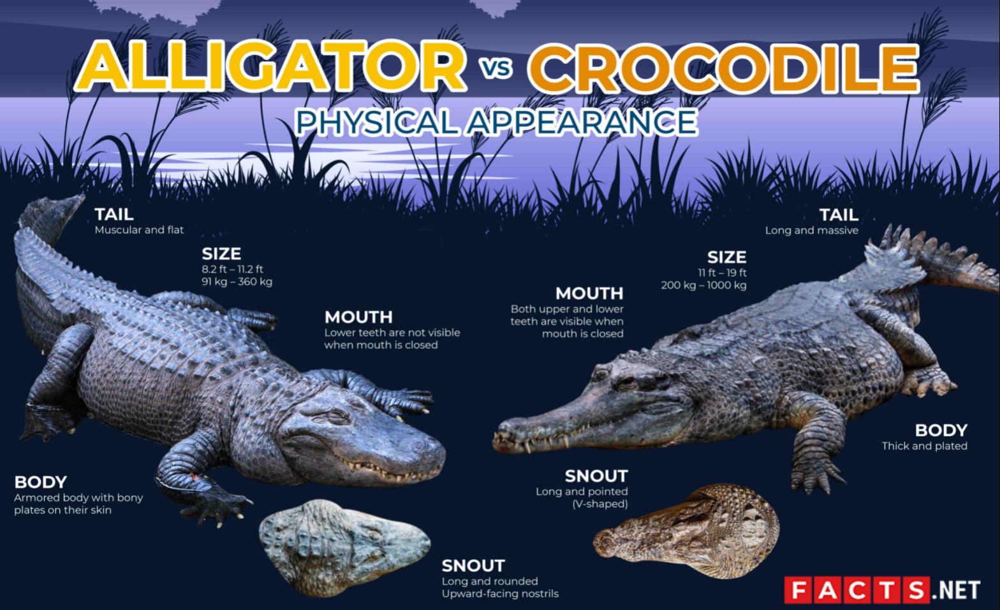
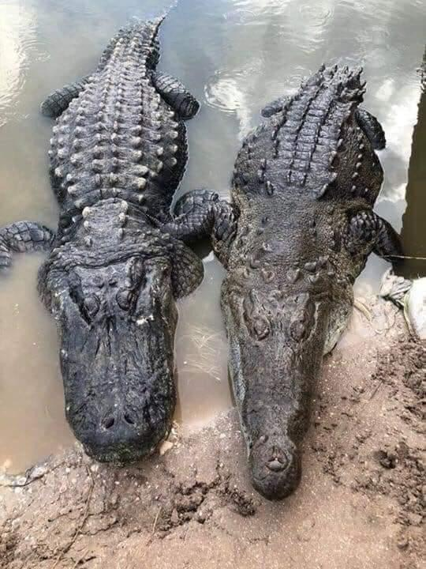
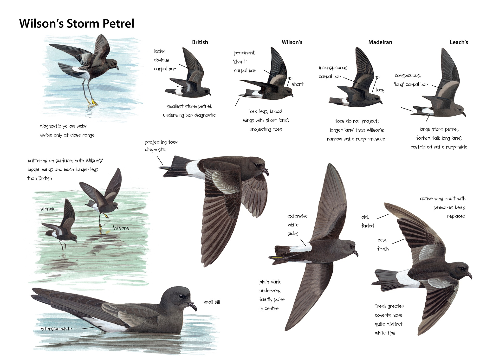
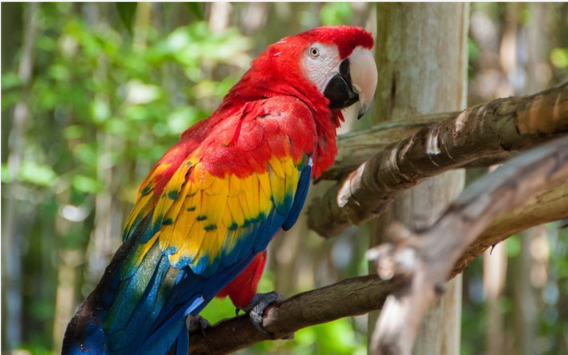
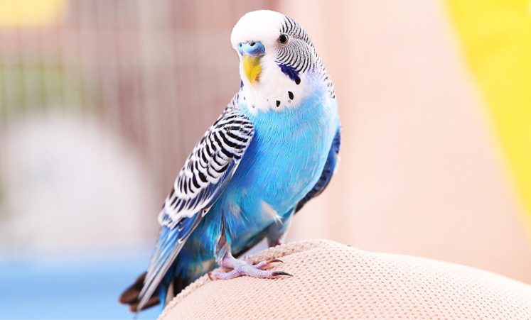

# 咬文嚼字-学科相关-Philosophy

@(TOEFL)[托福, TOEFL, 词根词缀,咬文爵字,学科相关]

## Urchin [ˈɜːrtʃɪn] 海胆

n. 小脏孩;贫穷肮脏的儿童;流浪儿

1. a young child who is poor and dirty, often one who has no home
2. = sea urchin (海胆)

**urchin** 

操法语的诺曼人在1066年征服了英国，此后数百年来法语借用词源源不断地涌入英语之中，**urchin**即为其中之一。它是13世纪时进入的，在古法语的原词形为***herichon***，原指***hedgehog***（刺猬），英国人按其发音曾拼出各种不同的词形，最后定为**urchin**。

在英国民间故事中，刺猬被认为是喜欢恶作剧的小妖精的化身，它昼伏夜出，四处寻觅食物，常常趁人不备时作弄人。因此，原义为“刺猬”的**urchin**常喻指“小妖精”。

到了16世纪初**urchin**又进而转义为“小淘气”或“顽童”。今天，它的原始词义虽然已被废弃，但我们仍能从海胆的英语名称**sea urchin**找到它的痕迹。海胆壳上能活动的棘刺和刺猬身上的硬刺极为相似，所以海胆一度被称作**sea hedgehog**，后来才改称**sea urchin**。另外，法语hérisson和urchin同出一源，但该词至今仍指“刺猬”。

例　You little urchin! 你这个小淘气！

## [alligator/crocodile（鳄鱼）](https://mp.weixin.qq.com/s/O1_wRK1OZQeP0ICRN6KtXw)

### alligator [ˈælɪɡeɪtər]  

=> **[ˈæ-lɪ-ɡeɪ-tər]**

当西班牙殖民者初次踏上美洲大陆，遇到美洲特有的短吻鳄时，就用西班牙语称其为***el lagarto***（**the lizard**，蜥蜴）。后来英国殖民者沿用了西班牙人对其的称谓，在英语中将其称作***lagarto***。但在16世纪末期，有些人误将西班牙语中的定冠词**`el`**也看作该词的一部分，因此就从西班牙语**`el lagarto`**中产生了英语单词**alligator**。

### crocodile

> The difference between an alligator (left) and a crocodile (right).

英语中表示鳄鱼的还有一个单词**crocodile**。它来自希腊语。根据词源大师Frisk的解释，前面的**`croco`**表示卵石，后面的`dile`表示爬虫，合起来字面意思就是“卵石上的爬虫”。鳄鱼得此名号显然是因为它们喜欢在卵石上晒太阳的生活习性。这个单词首先出现于古希腊著名历史学家希罗多德的名著《历史》中，用来表示埃及尼罗河中的鳄鱼。

**alligator**和**crocodile**的区别是：

- **alligator**特指短吻鳄，比如，**American alligator**（美洲鳄）和**Chinese alligator**（中国的扬子鳄）。
- 单词**crocodile**泛指各种鳄鱼，是鳄鱼的统称。习语**crocodile tears**（鳄鱼的眼泪）常用来比喻坏人的假仁假义。

相关单词：

- **alligator**：['ælɪgeɪtə]  n.短吻鳄，美洲鳄

- **crocodile**：[ˈkrɒkədaɪl] n.鳄鱼

## Petrel, Parrort, Parakeet

### **Petrel** /ˈpetrəl/

海燕在觅食时，像小海鸥一样自水面飞掠而过，偶尔降落水面，在海员看来，宛如圣彼得（**St. Peter**）之行于革尼撒勒湖（**Lake of Gennesareth**，即加利利海Sea of Galilee）上（见《圣经·马太福音》14:29）。

因此，在意大利语中这种海鸟被称作**petrello**，意思是**Little Peter**（小彼得），英语名称**petrel**很可能即源于此，它原作pitteral/pittrel，法语名称pétrel则借自英语。

英国海盗、探险家丹皮尔（William Dampier, 1652-1715）在他所写的《新荷兰之行》（Voyage to New Holland）一书的第一部分有关于海燕的一段记述：

>  “As they fly...they pat the Water alternately with their Feet, as if they walk upon it; tho' still upon the Wing. (当它们飞翔时……它们用脚交替拍打水面，仿佛在水面上行走；虽然仍在飞翔。)
>
> And from hence the Seamen give them the name of Petrels, in allusion to St. Peter's walking upon the Lake of Gennesareth.”(因此，海员们给他们起了海燕的名字，意指圣彼得在根尼萨雷斯湖上行走。)

丹皮尔是将海燕的英语名称与圣彼得相联系的第一人，可是他把原拼法**pitteral**改作**Petrel**。

**petrel**常常被称作**stormy petrel**，因为海员迷信，海燕掠过海面预示暴风雨即将来临，而且他们观察到，即使在暴风雨中海燕也爱在海面上低飞，故在其名称前冠以**stormy**。海员还把**petrel**叫做***Mother Carey's chicken***，据认为Mother Carey乃拉丁文Mater cara 'dear Mother'（圣母玛利亚）的讹误拼法。按迷信说法，在海面低飞而过的海燕是圣母玛利亚所派，向海员预告暴风雨的来临。

- stormy：有暴风雨(或暴风雪)的;群情激愤的;激烈争吵的

### **petrify**　　

/ˈpetrɪfaɪ/　v. 把……吓呆；使惊呆

借自法语pétrifier，源自拉丁语petra 'stone'和facere 'to make'，故字面原义为“使变成石头”、“使石化”，今多用于喻义，表示“把……吓呆”或“使惊呆”，常用被动语态。（参见petrol）

eg:

- As soon as she got on stage she was petrified with fright. 她一登台就吓呆了。
- He had the gun pointed at my head. I was absolutely petrified. (LLA) 他用枪指着我的头。我完全吓呆了。
- I stood petrified as the dog came bounding up to me. 当那条狗朝我扑过来的时候，我吓得呆站在那里。

**Parrot**

n. 鹦鹉, 应声虫
vt. 学舌, 机械地模仿
【复数：parrots；过去分词：parroted；现在分词：parroting】
1 - 词源不详，可能来自法语方言 Pierre,人名 Peter 的法语形式。比较 parakeet,petrel.由于该鸟学人说话的习惯，也用于形容人鹦鹉学舌。

### Parakeet（虎皮鹦鹉）

**Common name**: [Parakeet](https://worldbirds.com/parakeet/), Budgerigar, Budgie 

