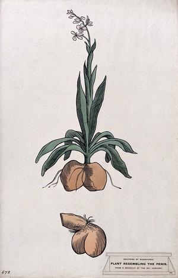
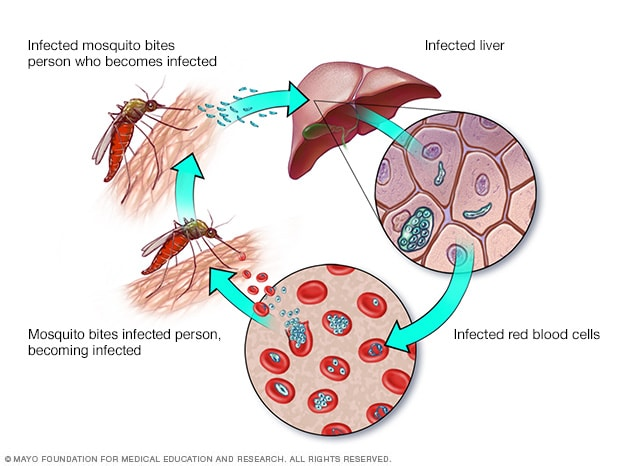

# 咬文嚼字-学科相关-Biology and Medicine

@(TOEFL)[托福, TOEFL, 词根词缀,咬文爵字,学科相关]

## Biology(生物学)

**biology** - 意为“生命”或“生物”的希腊语词根**`bíos`**被近代欧洲语言吸收，广泛用作前缀或构词成分，特别是在20世纪。

构词力强的英语组合语素**`bio-`**就是由此而来的。**biography**是最早出现于英语的**`bio-`**衍生词之一。英国桂冠诗人、剧作家、批评家德莱顿（John Dryden, 1631-1700）在1683年首次将该词用于其散文著作*Life of Plutarch*。

**biography**源自希腊语*`biographiā`*，由bíos 'life'加gráphein 'write'构成，从英语构词法来看，就是**`bio-`** 'life'和**`-grahy`** 'writing'的组合，意思是“传记”。若再将biography冠以源于希腊语的组合语素**`auto-`** 'of oneself'（自己的），就构成**autobiography**（自传）。

**biology**是另一个较早产生的bio-衍生词，始见于19世纪初，是仿德语biologie和法语biologie创造的，由bio-加-ology 'the study of'（……学）构成。到了20世纪bio-衍生词猛增了起来，诸如**bioengineering**（生物工程），**bionic**（仿生学的），**biotechnology**（生物技术），**biosphere**（生物圈），**biorhythm**（生物节律），**biochemistry**（生物化学）等等。

例

- Boswell wrote a famous biography of Dr. Johnson. 博斯韦尔为约翰逊博士写过一本著名的传记。

- Famous people often have several very different biographies written about them. (CID) 名人们通常都有几种内容大相径庭的传记。

- Every sophomore is required to take biology. 每一位二年级生必修生物学。

  

###  [Taxonomic rank](https://en.wikipedia.org/wiki/Taxonomic_rank)

### phyt- = plant, 表示“植物” {37}

> 源自希腊语 phutos, phuton "a plant."

| 单词                                         | 解释                                                         | 单词                                        | 解释                           |
| -------------------------------------------- | ------------------------------------------------------------ | ------------------------------------------- | ------------------------------ |
| **phyt-o-plankton** 【ˌfaɪtoʊˈplæŋtən】 | **`phyto-`** = plant, 表示“植物”。源自希腊语 phutos, phuton "a plant." **plankton** n. (总称)浮游生物 浮游藻;植物性浮游生物;浮游植物;浮游藻类;浮游植物群落 very small plants that float near the surface of water and on which sea creatures feed | **ceno-phyte**                         | 【植】新生代植物               |
| **epi-phyte**  【epɪfaɪt】         | **n.**(寄生于动物的)真菌；【植】附生植物 ； **`epi-`** 表示“在…上，在…周围，在…后面”。源自希腊语 epi "on, over, at." **`phyte-`** = plant, 表示“植物”。源自希腊语 phutos, phuton "a plant." | **phyt-o-bilogy** 【faɪtəʊbaɪ'ɒlədʒɪ】 | phyto-植物 + biology【生物学】 |
|                                              |                                                              |                                             |                                |

#### orchid（兰花）：根部像男人睾丸的花卉

> 词根分解  [词根树]
> orchid- 
> = testes, 表示“睾丸”。来自希腊语的 orcheome（舞蹈），古雅典运动员跑步是裸体的，这个时候 xx 就像在跳舞。源自希腊语 orkhis "testicle."

提起兰花，我们脑子里会涌现一种优雅脱俗的花朵。哇，淡紫色，好浪漫哦！慢着，地表之上这货确实漂亮，但地表之下的根很猥琐哦。怎讲？因为orchid这个单词的希腊词源本意是“睾丸”，因为其根上有两个睾丸状的东东。英国人也挺直白，把兰花叫做fool's ballocks，ballocks=ball+指小后缀-ock+复数s。

但在西方很多国家的文字里，有些墨守成规的礼法人士在女士面前却羞于提起兰花。英语中表示“兰花”的单词**orchid**来自希腊语**orchis**（睾丸）。因为兰花是孖根植物，根部与男子睾丸一样成双成对且形状相似。在古英语中“兰花”和“睾丸”都是**orchid**，后来为了避免误解和文雅，就用**testicle**来表示“睾丸”，而用**orchid** 专指兰花。

至今**orchid**作为词根在一些医学术语中还是指“睾丸”，如**orchiopexy**（睾丸固定术）。

- **orchid**：['ɔːkɪd] 
  - n.兰花，兰科植物，淡紫色
  - adj.淡紫色的
- **orchiopexy**：[,ɔ:ki'ɔpəksi] n. 睾丸固定术

### Celsius /selsiəs/

Celsius（摄氏度）：发明摄氏温标的瑞典科学家摄尔修斯。

我们常用的摄氏温标是由瑞典科学家**安德斯•摄尔修斯**（Anders Celsius，1701～1744）发明的。摄尔修斯是瑞典著名的物理学家和气象学家。1742年，他在总结前人经验的基础上创立了摄氏温标。他把水银温度计插人正在熔解的雪中，定出冰点作为一个标准温度点；然后又把温度计插入沸腾的水中，定出沸点作为另一个标准温度点。并把冰点和沸点之间等分100度，所以摄氏温标又叫百分温标。

1948年在巴黎召开的第九届国际计量大会把百分温标正式命名为“摄氏温标”，并用摄尔修斯的名字Celsius作为摄氏温标的单位，称为“摄氏度”，用℃表示。

最初，为了避免测量低温时出现负值，摄尔修斯把水的沸点定为零度，而冰点定为100度。摄尔修斯去世后，根据其他科学家的建议，人们把这种标度倒转过来，以冰点为零度，沸点为100度。

- Celsius：['selsɪəs] n.摄氏度adj.摄氏的

------------------------

### pupae /ˈpjuːpiː/  (pupa /ˈpjuːpə/)

**`pupa -`** 

 **pupa**本是拉丁语***pūpa***，意为“***女孩***”、“***洋娃娃***”，复数形式为***pupae***。1758年瑞典博物学家林奈（**[Carolus Linnaeus](https://en.wikipedia.org/wiki/Carl_Linnaeus)**, 1707-1778）把它当作术语来用，指“蛹”。林奈这一创造曾被誉为“天才诗人的手法”（**a stroke of poetic genius**）。一位作家这样写道：“只要你看一看蛾蛹的下侧，你就会发现它的脸、它的眼睛以及小臂状的双翅，有如襁褓中的婴儿，有如小洋娃娃。” 

英语另有两个词 **puppet**（木偶）和 **puppy**（小狗），从表面上看乃分别来自法语**poupette**（玩偶）和**poupée**（玩偶），实际上其终极词源同为拉丁语***pūpa***。

>  例　Female wasps lay their eggs in the pupae of various flies. 雌黄蜂在多种苍蝇的蛹中产卵。

因为如果你仔细观察蛾蛹，就会发现它的脸、眼睛以及小臂状的双翅，都像极了襁褓中的婴儿，犹如小洋娃娃。

与pupa同源的英语单词还有**pupil**（小学生）、**puppet**（木偶）和**puppy**（小狗）。

- pupa： ['pjupə] n. 蛹
- pupil：[ˈpjuːpl] n. 学生；瞳孔；未成年人
- puppet：['pʌpɪt] n. 木偶；傀儡；受他人操纵的人
- puppy：['pʌpi] n. 小狗，幼犬

### larvae /ˈlɑrvi/ (larva /ˈlɑːrvə/)

A **larva** is an insect at the stage of its life after it has developed from an egg and before it changes into its adult form.

### malaria 由脏空气引发的疾病

疟疾（**malaria【məˈleriə】**）是一种由于疟蚊叮咬引发的传染病。在古代罗马(该词源自意大利语短语mala aria) 城周围有许多沼泽，沼泽附件的空气又脏又臭，在沼泽附近待的时间一久，人就容易得疟疾。

当时的罗马人不知道疟疾是因为疟蚊叮咬引发的，还以为是脏空气引发的，所以将这种病称为malaria，由mal（bad）+aria（air）构成，字面意思就是“脏空气”。英语单词malaria就来自意大利语**malaria**。

该词始用于18世纪中期。到了19世纪后半期，当人们发现疟疾是由按蚊（**anopheles【ə'nɒfəˌlɪz】**）传布时，便给疟疾重新下了定义，但却保留了原有的名称。

- **malaria**：[mə'leərɪə] n.疟疾，痢疾，瘴气
- **malarial**：[mə'lɛrɪəl] adj.疟疾的，患疟疾的，毒气的

### mosquito  （蚊子）：小飞虫

> n. 蚊子

蚊子的体型通常很小，因此在古代***西班牙***语中被称为**mosquito**，是**`mosca`**（飞虫）的指小形式，字面意思就是“小飞虫”。英语单词mosquito就直接来自西班牙语。

(**anopheles【ə'nɒfəˌlɪz】**词根则是来自古希腊)

- mosquito：[mə'skito] n.蚊子

## Physiology 生理学

> he scientific study of the normal functions of living things

### Core- （心）：源自心脏的意识活动

我们中国人认为心脏是人的意识活动的场所，所以才有“心灵”、“心理”、“心思”等词汇。和我们东方人一样，古代西方人也有类似的观念，所以很多表示意识活动的单词都由表示心脏的词根**`cord-`**构成。该词根来自拉丁语**`cor/cordis`**（心脏）。词根**`card-/cardio-`**（心脏）来自希腊语***kardia***，但最终源头和**`cord-`**一样来自原始印欧语词根**`kerd-`**。

- **cord**-：心脏，心理，心灵
- **core**：[kɔː] n.核心，要点
- **cordial**：['kɔːdɪəl] adj. 衷心的，诚恳的；兴奋的
- **concord**：['kɒŋkɔːd] n.和谐；和睦；一致；协调
- **accord**： [ə'kɔːd]n. 符合；一致；协议；自愿vt. 使一致；给予vi. 符合；一致
- **accordance**：[ə'kɔrdns] n. 一致；和谐
- **discord**：['dɪskɔːd] n. 不和；不调和；嘈杂声vi. 不一致；刺耳
- **`card-`**/**`cardio-`**：心脏
- cardiac：['kɑrdɪæk] n. 强心剂；强胃剂adj. 心脏的；心脏病的；贲门的
- cardiology：[,kɑrdɪ'ɑlədʒi] n. 心脏病学
- cardiopathy： [,kɑrdɪ'ɑpəθi] n. 心脏病

### hormone  激素也叫荷尔蒙

**hormone** - 激素也叫荷尔蒙，是人或高等动物内分泌腺分泌的有机物质。它直接进入血液，对肌体的代谢、生长、发育和繁殖等起重要的调节作用，如甲状腺素、肾上腺素、胰岛素等都是激素。

激素的英语名称**hormone**（汉语的旧称荷尔蒙即由此音译而来）是英国科学家斯特林博士（E. H. Sterling）取自希腊语动词hormân 'stimulate, excite'（刺激，使兴奋）的现在分词hormôn，并在词尾加-e杜撰而成的。

他在1905年8月15日出版的《柳叶刀》（The Lancet）杂志的一篇文章中提及该物质时说，“这些化学信使（chemical messengers）我们可以称之为hormone。”

例

- We are governed by the hormones that circulate around our bodies. (CCE) 我们受在我们周身循环的荷尔蒙调节支配。
- Dairy cows are often given hormones to promote milk production. (CAE) 乳牛常常被注射荷尔蒙以增加奶产量。
- Those children do not produce enough growth hormone. 那些孩子缺乏生长激素。

### phlegm （粘液）：导致人性情冷淡的粘液

> 词根分解  [词根树]
> **`phlegm-**` 
> = flame, 表示“发炎”。源自希腊语 phlegein "to burn."

根据四体液学说，体内粘液占比较高的人性情冷淡、反应迟钝。因此，英语单词phlegm（粘液）的形容词phlegmatic就产生了“冷淡的、迟钝的”等含义。

古医学体液理论构成人体的血液，黏液，胆汁，黑胆汁四种体液之一。来自希腊语 phlegma,发热，由体热所致的多痰症，来自 phlegein,燃烧，发热，来自 PIE*bhel,照耀，燃烧，词源同 blaze,bleach.

后在中世纪医学理论认为体内多痰会致人**冷淡**，**迟钝**，但是，被误解为冷淡是**冷静**，**镇定**的表现，因此，产生模糊和矛盾的词义。

- **phlegm**：[flem] n. 痰；粘液
- **phlegmatic**：[fleg'mætɪk] adj. 冷淡的；迟钝的；冷漠的
- **phlegmy**：['flɛmi] adj. 痰的；生痰的；含痰的

1. the thick mucus secreted by the walls of the respiratory passages , especially during a cold 
2. calmness or composure that is not easily disturbed 
3. in medieval medicine , one of the four basic bodily fluids . Phlegm was believed to be cold and moist in nature and to cause sluggishness and apathy . 
4.  a thick yellow or green substance that you get in your nose and throat , especially when you have a cold 
5. the ability to be calm in a dangerous or frightening situation 

## Medicine [ˈmedɪsn]

### placebo（安慰剂）

#### 背景

英语单词**placebo**（安慰剂）来自拉丁语，原本指基督教葬礼中为死者念的祷词。

在基督教中，当人去世后要在教堂举行葬礼，在葬礼上要为他念祷词。祷词的第一句是“**I will please the Lord in the land of the living**”（我将愉悦尘世之主）。在拉丁语中，该祷词的第一个词是placebo，是拉丁语动词placere（使人愉悦，等于please）的未来陈述式，等于英语中的“I will please（我将愉悦）”。因此，人们就将这段祷词称为**placebo**。

由于人们所念的祷词往往会有意美化死者，因此人们就把那种阿谀奉承的话称为**placebo**，将阿谀奉承的行为称为sing placebos。

18世纪的英国名医William Cullen大力宣扬“安慰疗法”，并用placebo来表示“安慰剂”，即无特定疗效的方法或药物，仅仅用来舒缓患者情绪，使其心情愉悦。

现代医学已经证实安慰疗法的有效性，尤其是针对某些特定的疾病，安慰剂/疗法能够快速治愈或至少能极大地缓解病人的症状。从此后，安慰疗法得到广泛应用，而placebo（安慰剂）这一术语也得到广泛应用。

#### 词根

单词**placebo**中，**`plac-`**是个词根，意思就是“愉悦，满意，平静”，常见单词**please**就来自这个词根，只不过在法语中发生了音变，导致拼写发生较大变化。

**please**原本是个动词，表示“使人愉悦，使人满意”，比如

> I did it to please my parents. 我这么做是为了让父母高兴。

在日常生活中，**please**常常用作[插入语](https://baike.baidu.com/item/%E6%8F%92%E5%85%A5%E8%AF%AD/5391607?fr=aladdin)(**parenthesis**)，表示礼貌地请求或吩咐，比如：

> Please sit down. 请坐。Two coffees, please. 请来两杯咖啡。

**please**还派生出名词**pleasure**（快乐，愉悦，欣慰）和形容词**pleasant**（令人愉悦的，惬意的）。在这里，**please**都取其本意，表示“使愉悦，使满意”。

由词根**`plac-`**（愉悦，满意，平静）派生出的常见单词还有**placate**，后面加了一个常见动词后缀**`-ate`**，构成动词，表示“抚慰，安抚，使满意”，比如：

> ***The concessions did little to placate the students***. 让步根本未能平息学生的愤怒。

单词**placid**也来自词根**`plac-`**，后面加了一个形容词后缀**`-id`**，意思是“温和的，平静的”，比如：

> This horse has a placid nature.这匹马性情温和。
>
> The placid water of a small lake（小湖平静的水面）。

#### 相关单词

- 词根**plac**-：愉悦，满意，平静
- **placebo**：[plə'siːbəʊ] n.安慰剂，为死者念的祷词，阿谀奉承的话
- **please**：[pliːz] vt.使愉悦，使满意；int.请，拜托
- **pleasure**：[ˈpleʒə(r)] n.快乐，愉悦，欣慰
- **pleasant**：[ˈpleznt] adj.令人愉悦的，惬意的
- **placate**：[pləˈkeɪt] vt.抚慰，安抚，使满意
- **placid**：[ˈplæsɪd] adj.温和的，平静的

1. [词源趣谈 | 死人和活人都需要的placebo（安慰剂）](https://mp.weixin.qq.com/s/vrP08asSBbgq1MG1iQ69zg)
