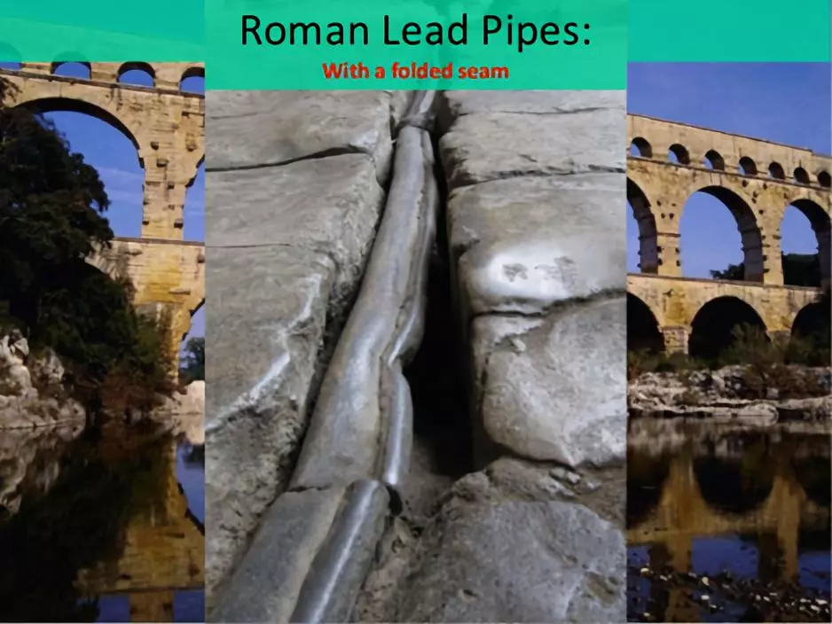

# 咬文嚼字-学科相关-Chemistry

@(TOEFL)[托福, TOEFL, 词根词缀,咬文爵字,学科相关]

### 1. -ium 

**`-ium`**表示金属元素。1811 年瑞典化学家 [Berzelius](https://en.wikipedia.org/wiki/J%C3%B6ns_Jacob_Berzelius) 建议，为统一化学元素的命名起见，凡金属元素一律用拉丁词根命名，用 **`-um`** 为词尾。以后所发现的新金属元素，都遵照了这个建议。

由于氕[piē]、氘[dāo]、氚[chuān] 都是氢元素的同位素。具有相同质子数，不同中子数（或不同质量数）同一元素的不同核素互为同位素；自然元素**表里只有质子数不同**才是两种元素,因此他们不会出现在元素周期表内。

| 元素单词                                                     | 解释                                                         | 元素单词                                             | 解释                                                         |
| ------------------------------------------------------------ | ------------------------------------------------------------ | ---------------------------------------------------- | ------------------------------------------------------------ |
| **uranium**    **[jʊ'reɪnɪəm]**                n.铀元素 | **Uranus**（乌拉诺斯）:古希腊神话第一代神王。uran-（天）- us (名词词性）。 **[Uranus](https://en.wikipedia.org/wiki/Uranus)**:   ['juərənəs] ：1781 年，英籍德国天文学家赫瑟尔(Sir [William Herschel](https://en.wikipedia.org/wiki/William_Herschel) )首次,发现一颗新行星，便用 Uranus 命名，中文译为“天王星”	。 **[uranium](https://en.wikipedia.org/wiki/Uranium)**: 8 年后，德国化学家克拉普罗特([Martin Heinrich Klaproth](https://en.wikipedia.org/wiki/Martin_Heinrich_Klaproth))首次从沥青中分离出一种新的化学元素。为了纪念赫瑟尔及其发现的新行星，便以 Uranus 来命名，称为 uranium，这便是用于制造核裂变的常用元素铀。 | **aluminium**                 【ˌæljəˈmɪniəm 】 | aluminium（铝）：从矾土中提炼出来的金属物质 19世纪，英国化学家戴维（Humphry Davy）从矾土中提炼出高纯度铝，因此将其命名为aluminum，最后被英国编辑修改为**aluminium**，以符合化学元素的命名习惯。矾土（alumina）是一种氧化铝矿石，是炼铝的主要原料，因为外形类似矾（alum）而被称为alumina。 |
| **tritium** 【ˈtrɪtiəm】 [氚[chuān]](https://baike.baidu.com/item/%E6%B0%95%E6%B0%98%E6%B0%9A/8757957) | 杜撰词，来自希腊语 tritos,第三，词源同 three,third.-ium,化学元素后缀。比较 deuterium. 称作超重氢。原子核中有一个质子和两个中子。并带有[放射性](https://baike.baidu.com/item/放射性)，会发生[β衰变](https://baike.baidu.com/item/β衰变)，其[半衰期](https://baike.baidu.com/item/半衰期)为12.43年。由于氚的β衰变只会放出高速移动的电子，不会穿透人体，因此只有大量吸入氚才会对人体有害。 | **Deuterium** 【djuːˈtɪriəm】 氘[dāo]      | 重氢,原子核中有一个质子和一个中子，氢中有0.02%的氘。 在大自然的含量约为一般氢的7000分之一 ，用于热核反应 |
| **Protium** 【prəʊtɪəm】 氕[piē]                   | 质子数1，它的原子由一个质子和一个电子组成，是氢的主要形式,，氕为氢的主要成分，约占普通氢的99.98%。 | **Neptun-ium** 【nepˈtjuːniəm】                 | 在***化学领域***，93号元素以海神命名，称为 **Neptunium**（镎），因为它排在 92 号元素 **Uranium**（铀）的后面，而 **Uranium** 就是以天神乌拉诺斯命名的。 镎(放射性化学元素) |
| **Plutonium** 【pluːˈtoʊniəm】                          | 在科学领域，科学家将一种新发现的超铀元素命名为 Plutonium（钚），源自 Pluto（冥 王星），因为这种元素在元素周期表中排名 94 号，位于 Neptunium（镎）之后，恰如冥王星位于海王星之后。 | **Titan-ium** 【tɪˈteɪniəm】                    | 极其坚固、可耐高温、强酸强碱的金属钛（titanium）             |
| **Ion-ium** 【aɪ'onɪəm】                                | 锾（Io）（钍的同位素，Th230） 词源来自古希腊神话美女伊娥 | **iso-tope**[^1] 【ˈaɪsətoʊp】                  | 表示“相等，异构，同种”。 tope-  表示“地方”，来源于希腊语 topos。医学上 ectopia (ec- = ex- + top- + -ia) 表示...异位。 |
| **Tellur-ium** 【teˈlʊriəm】                            | 碲。词源来自古罗马神话大地女神忒勒斯                         | **Selen-ium** 【səˈliːniəm】                    | 1817 瑞典化学家柏采利乌斯（**Berzelius**）在生产硫酸过程中发现一种红色粉末，发现它 是一种性质与碲相似的新元素。为了使之与罗马大地女神忒勒斯（**Tellus**）之意命名的碲 （**Tellurium**）相对应，便以希腊神话中的月亮女神塞勒涅的名字命名，称为 **Selenium**（硒）。 硒(化学元素，用于制造电气设备和有色玻璃，人体缺此元素可致抑郁等病) |
| **hel-ium** 【ˈhiːliəm】                                | 1868 年法国的**杨森**利用分光镜观察太阳表面，发现一条新的黄色谱线，并认为是属于太阳上的某个未知元素，故名氦（**helium**）。 a chemical element. Helium is a very light gas that does not burn, often used to fill balloons and to freeze food. | **cerium** 【ˈsɪriəm】                          | 化学元素铈（**cerium**）也是以谷物女神的名字命名的。 a chemical element. Cerium is a silver-white metal used in the production of glass and ceramics . |
| **lith-ium** 【ˈlɪθiəm】                                | **`lith-`** 表示化学元素“锂”，因锂元素发现于石头中而得名。源自希腊语 lithos "stone." a chemical element. Lithium is a soft, very light, silver-white metal used in batteries and alloys . | **cadm-ium** 【ˈkædmiəm】                       | 镉元素（**cadmium**）以卡德摩斯的名字命名。这是因为镉元素是从菱锌矿（**cadmia**）中发现的，而菱锌矿最早是在底比斯城附近发现的，故采用底比斯城的古名 **Cadmia**（卡德摩斯之城）来命名。 |
| german-ium 【dʒɜːrˈmeɪniəm】                            |                                                              |                                                      |                                                              |

[^1]: [同位素](https://www.zhihu.com/question/314301893)同属于某一化学元素，其原子具有相同数目的电子，原子核也具有相同数目的质子，但却有不同数目的中子。例如氕、氘和氚，它们原子核中都有1个质子，但是它们的原子核中分别有0个中子，1个中子及2个中子，所以它们互为同位素。

### 2. hydr- = water, 表示“水”

**hydr- = water**, 表示“水”，来源于希腊语。***表示化学元素“氢(hydrogen)”，因为氢燃烧后的产物是水***，法国化学家拉瓦锡便用拉丁文把它命名为“水的生成者”。源自希腊语 hudor "water."

海德拉（Hydra）是希腊神话中巨大的的九头蛇，是希腊神话中最强悍的怪物之父提丰 （Typhon）和女首蛇身怪爱克特娜（Echidina）交配所生。在希腊语中，海德拉的名字 Hydra 是 hydros（水蛇）的阴性形式，而后者来自名词 hydor （水）。希腊词根和英语词根 hydr-（水）就来源于此。英语中用 hydra 来命名水螅，因为它 头部拥有很多触手，形状与传说中的九头蛇很像。

### 3.  -ite1 名词后缀：和化学相关(源自法语) {54}

**`-ite`** 名词后缀，源自法语。和化学相关，如：矿物、岩石、炸药等。

| 单词                                              | 解释                                                         | 单词                                                       | 解释                                                         |
| ------------------------------------------------- | ------------------------------------------------------------ | ---------------------------------------------------------- | ------------------------------------------------------------ |
| **gran-ite**                     【ˈɡrænɪt】 | **`gran-`** = grain, 表示“颗粒”。源自拉丁语 granum "grain." gran-颗粒 + -ite, 表名词。因这种岩石颗粒状的纹理而得名。 花岗岩：I'm so hard, bitches call me granite | **pome-granate**                     【ˈpɑːmɪɡrænɪt】 | （石榴）：有许多颗粒的水果。英语单词pomegranate（石榴）来自拉丁语pomum granatum 字面意思就是“有许多颗粒的水果”，由pome（水果）+ grenate（颗粒、纹理）构成。 石榴得此名称是因为它切开后里面含有大量颗粒状的石榴籽。 |
| **celest-ite** 【selɪstaɪt】                 | **`celest-`** = heaven, 表示“天空”。 | **meteor-ite** 【ˈmiːtiəraɪt】                        | meteor【流星】 + -ite相关的。用于指陨石。 meteor  n. 流星, 大气现象 |
|                                                   |                                                              |                                                            |                                                              |

#### 3.1 grain / core / maize (颗粒)

**corn**乃本族词，来自古英语。在英国**corn**统指“谷类”，在英格兰指“小麦”，在苏格兰和爱尔兰则指“燕麦”。17世纪英国殖民者来到美洲大陆看见当地玉米，就把它称作**Indian corn**。由于当时玉米为新英格兰地区种植的唯一粮食作物，所以后来人们逐渐地把修饰性形容词Indian省略了，corn就这样成了玉米的美国名称，而英国英语则仍沿用**maize**。在美国英语口语中**corn**也指“威士忌酒”，因为美国威士忌酒多用玉米酿成。

**grain**（谷类，谷物）和**kernel**（果仁，核，谷粒）二词在词源上同**corn**有较密切的亲缘关系，三词均可溯源到同一印欧词根。**grain**源于拉丁语***grānum***，直接借自法语***grain***，而**kernel**系**corn**之指小形式，由**corn**加指小后缀**`-el`**所构成。

- Buy peanuts and corn chips for the party. (CID) 给晚会买些花生和玉米片。
- The chickens are raised on a diet of corn and other grains. (OCD) 这些鸡是用玉米和其他谷类饲养的。

#### 3.2 **pomegranate**（石榴）：有许多颗粒的水果。

英语单词pomegranate（石榴）来自拉丁语pomum granatum，字面意思就是“有许多颗粒的水果”，由pome（水果）+ grenate（颗粒、纹理）构成。石榴得此名称是因为它切开后里面含有大量颗粒状的石榴籽。

- pomegranate：['pɒmɪgrænɪt] n.石榴
- grain： [ɡren] n. 粮食；谷物；颗粒；纹理v. （使）成谷粒
- engrain：[ɪn'ɡreɪn] vt. 使根深蒂固；把…染成木纹色adj. 根深蒂固的
- granulate：['grænjə,let] v.（使）成颗粒状；（使）表面变粗糙
- granite： ['grænɪt] n. 花岗岩

### 4. -ite2 形容词、名词、动词后缀，表示“属于或和...相关”（来自古希腊语）{38}

> 来自拉丁语和希腊语。

| 单词          | 解释 | 单词         | 解释 |
| ------------- | ---- | ------------ | ---- |
| fin-ite       |      | in-fin-ite   |      |
| define-ite    |      | favor-ite    |      |
| ign-ite       |      | metabol-ite  |      |
| oppos-ite     |      | part-ite     |      |
| pol-ite       |      | re-quis-ite  |      |
| unite         |      | e-rud-ite    |      |
| urban-ite     |      | ex-urban-ite |      |
| sub-urban-ite |      | pre-adam-ite |      |
| decompos-ite  |      | gopl-ite     |      |
| mammon-ite    |      | re-cond-ite  |      |
| Sodomite      |      | term-ite     |      |
| tri-log-ite   |      | Gothma-ite   |      |
| tr-ite        |      |              |      |

### 5. -ase = enzyme【ˈenzaɪm】, 表示“...酶”。{31}

**enzyme**【ˈenzaɪm】: A substance, produced by all living things, which helps a chemical chang happen or happen more quickly, without being changed itself.

| 单词                                          | 解释                                                         | 单词                          | 解释                                                      |
| --------------------------------------------- | ------------------------------------------------------------ | ----------------------------- | --------------------------------------------------------- |
| in-vert-ase                【ɪnvəˌteɪs】 | 转化酶 an enzyme that catalyzes the hydrolysis of sucrose into **glucose** and fructose | hydr-ase                      | an enzyme that catalyzes the addition or removal of water |
| lact-ase 【ˈlækˌteɪs】                   | **`lact-`** = milk, 表示“奶，乳”，lact- 是 galact- 的 ga- 脱落后的形式。 any of a group of enzymes (trade name Lactaid) that hydrolyze lactose to **glucose** and galactose | integr-ase 【ɪntɪgreɪs】 | 整合酶                                                    |
|                                               |                                                              |                               |                                                           |

##### [Catalyst vs. Enzyme](https://www.diffen.com/difference/Catalyst_vs_Enzyme)

**`cata-`** 表示“向下，相反，离开”。源自希腊语 kata "down."

l**`yst-`** = break down, 表示“裂开，分解，溶解”。源自希腊语 luein "to loosen, release, untie."

|                   | Catalyst                                                     | Enzyme                                                       |
| ----------------: | :----------------------------------------------------------- | ------------------------------------------------------------ |
|          Function | Catalysts are substances that increase or decrease the rate of a chemical reaction but remain unchanged. | Enzymes are proteins that increase rate of chemical reactions converting substrate into product. |
|  Molecular weight | Low molecular weight compounds.                              | High molecular weight globular proteins.                     |
|             Types | There are two types of catalysts – positive and negative catalysts. | There are two types of enzymes - activation enzymes and inhibitory enzymes. |
|            Nature | Catalysts are simple inorganic molecules.                    | Enzymes are complex proteins.                                |
|   Alternate terms | Inorganic catalyst.                                          | Organic catalyst or bio catalyst.                            |
|    Reaction rates | Typically slower                                             | Several times faster                                         |
|       Specificity | They are not specific and therefore end up producing residues with errors | Enzymes are highly specific producing large amount of good residues |
|        Conditions | High temp, pressure                                          | Mild conditions, physiological pH and temperature            |
| C-C and C-H bonds | absent                                                       | present                                                      |
|           Example | vanadium oxide                                               | amylase, lipase                                              |
| Activation Energy | Lowers it                                                    | Lowers it                                                    |

##### agent

- 我推测 ~~agent是catalyst的口语化表达~~
- agent可以是任何产生（化学和生物）反应的溶剂
- 而catalyst是特质产生化学反应的催化剂。
- 实际上我在google上看到了 catalyst agent的表达

### 6. 其他元素

#### 1. [ammonia](https://mp.weixin.qq.com/s?__biz=MzA4NTQ4NzIzNg==&mid=2651801153&idx=1&sn=f3c49ec59712d9ff612cb1ed11980260&chksm=842cddaab35b54bcc04beb866207c8ef4a614d3bfe5d25a2b7d45a7806e3b77fa31fd3b66e35&scene=178&cur_album_id=1297162942844207107#rd)

氨是一种无色气体，含有强烈的刺激气味，极易溶于水，是许多食物和肥料的重要成分。英语中表示氨的单词是ammonia，源自古埃及神话中阿蒙神的名字Ammon。

18世纪时，化学家从“阿蒙神之盐”（**salt of Ammon**）中提取出一种新的化学元素，就将其命名为**ammonia**，中文译为“氨”。

- **ammonia**：[ə'məʊnɪə] n.（化学元素）氨，氨气，氨水，阿摩尼亚
- **ammoniac**：[ə'məʊnɪæk] adj.氨的，含氨的
- **ammonium**：[əˈməʊniəm] n.氨基，铵盐

#### 2. plumb 古罗马垂直的铅块

##### 古罗马的灭亡可能与铅(plumb)有关

在英语中，表示“水管工”的单词是**plumber**，由**`plumb`**（铅）+**`er`**（人）组成，字面意思就是“铅制品工人”。水管与铅制品有什么关系呢？原来，这是因为在古罗马时期，人们广泛用铅来制作水管。

古罗马人的冶金技术已经相当发达。在冶炼白银的过程中，他们得到了副产品铅。古罗马人发现金属铅具有很好的特性，用铅制成的日常器皿能保持持久光亮，不会像铜器那样产生绿绣。因此，古罗马人用铅做成水管，构建了四通八达的地下管道。这些管道中含有的金属铅逐步溶解之水中，被喝进罗马人的身体内，甚至是孕妇的体内。就这样，一代又一代的罗马人都受到了严重的铅中毒。很多科学家认为，铅中毒是古罗马帝国破落的重要原因之一。

##### 吃蘑菇超人的超级玛利亚是plumber

在拉丁语中，***plumbum***表示“铅”，由此衍生出英语单词**plumb**（铅）和词根**`plumb-`**（铅）。由于古罗马的上下水管道都是用铅制成的，因此安装、维修这些管道的工人在英语中就被称为**plumber**（铅制品工人）了，而单词**plumbing**既可以表示“铅工业”，也可以表示“水管工业”。

##### 铅锤plummet

古人还发现铅的比重较大，特别适合用来确定垂直线，不容易因为风、水流等偏离垂直方向，所以英语单词**plumb**除了表示“铅”以外，还可以表示“**垂直状态、垂直的、使垂直**”等含义。单词**plummet**指用来确定垂直线的铅锤或铅坠，是**plumb**的指小形式，字面意思就是“小铅块”。

##### 像铅块一样临风不动 aplomb

英语单词**aplomb**由**a**（on，位于，处于）和**plomb**（=plumb，垂直的）组成，字面意思就是“像铅垂那样处于垂直状态”。由于铅垂不易受外部因素影响而左右乱动，所以**aplomb**引申出“**沉着、泰然自若**”的含义。比如：

> Diana passed the test with aplomb. 戴安娜沉着地通过了考试。

##### 铅块投入湖水中 plunge

英语单词**plunge**（投入、跳入）其实也与**plumb**同源。它来自拉丁语，由词根**`plumb-`**（铅）和动词后缀组成，字面意思就是“将铅坠投入水中”。由于在法语中发生了音变，导致它的拼写发生了较多变化。

Reference:

1. [词源趣谈：对plumb（铅）的痴迷，居然导致了古罗马帝国的灭亡](https://mp.weixin.qq.com/s/DwOswolKpE04i1D446Cr9w)
