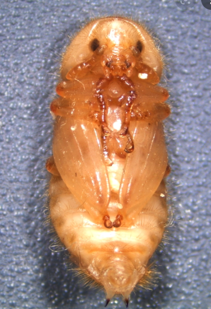
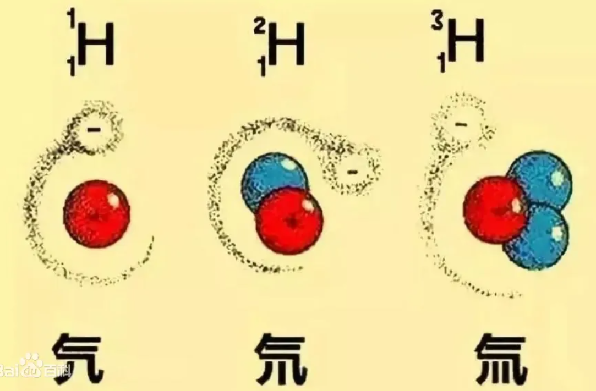
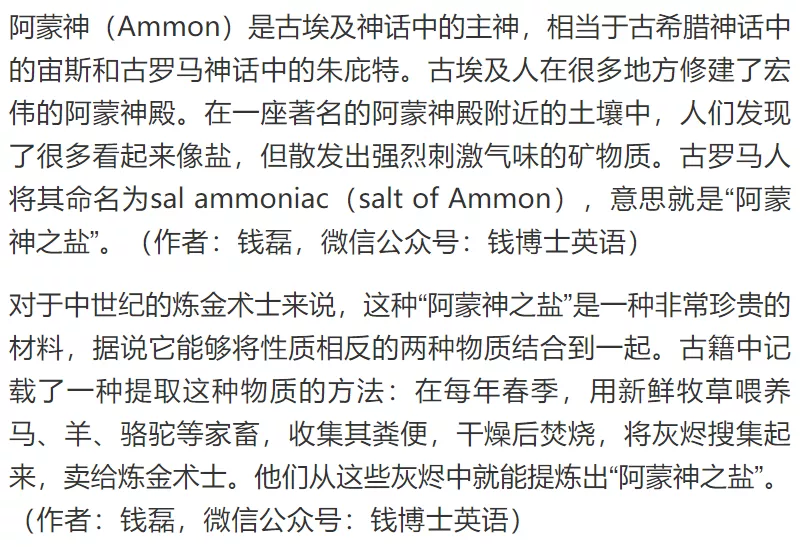
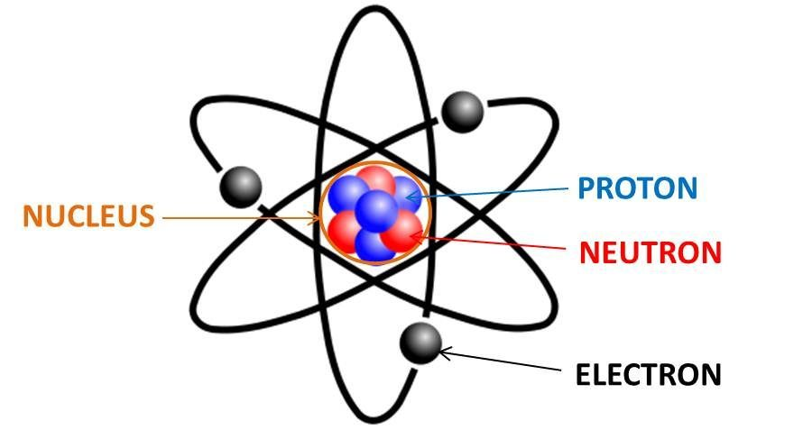
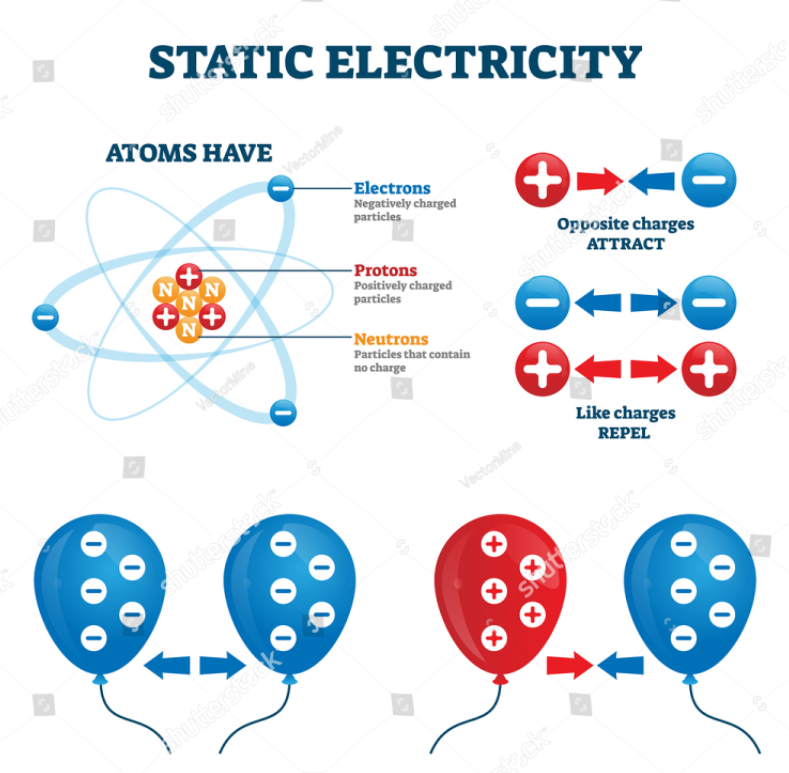
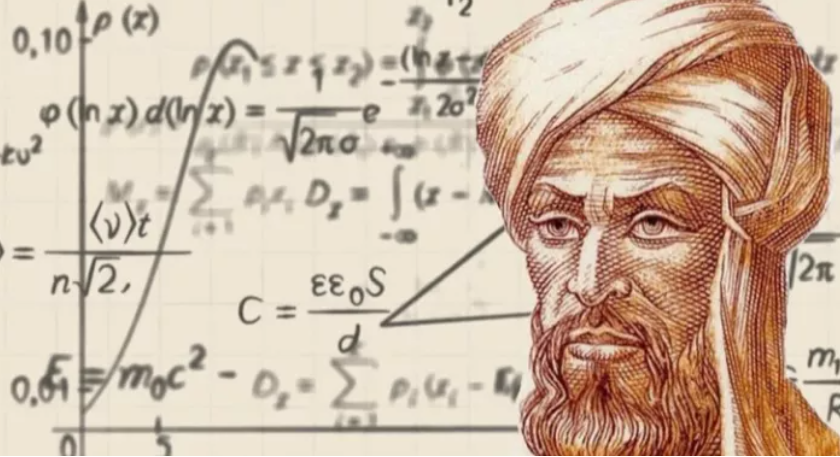
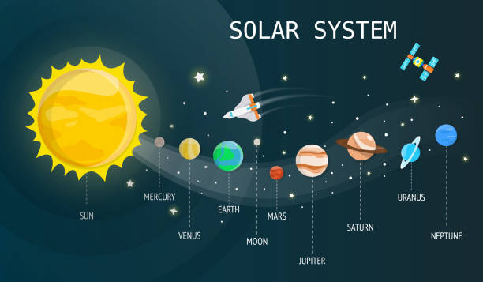

# 咬文嚼字-学科相关

@(星瑞格)[翻译, 公司, 公司业务, dbAudit翻译]

[toc]

## 学校

### academy  （学院): 帮助寻回海伦的农夫阿卡德摩斯

在希腊神话传说中有一位绝世美女海伦，是宙斯和斯巴达王后勒达所生。当她还是一名少女的时候，来自雅典的英雄忒修斯与朋友偶然在神庙中看见海伦跳舞。两人惊为天人，就闯进神庙将海伦劫走。两人决定扔骰子来确定海伦的归属，并约好赢的人要帮输的人再去抢个妻子。

结果忒修斯抽中了，于是忒修斯把海伦带回老家，嘱咐母亲好生照顾。然后，两个好朋友再次出发去作采花大盗。这回他们看上了冥王的妻子珀耳塞福涅，可惜行动失败，被冥王关押在冥府中。后来另一个英雄赫拉克勒斯在冥府遇到他们俩，救出了忒修斯一人。

海伦的两个哥哥率人四处寻找海伦。他们来到雅典，要求雅典人归还自己的妹妹。但雅典人说不知道海伦在哪里。两兄弟威胁要动用武力。

正在这危急时刻，一个名叫阿卡德摩斯（**Akademos**）的农夫站出来告诉了海伦的位置。两兄弟很快就夺回了自己的妹妹，而**Akademos**也因为使雅典避免了一场战争而成为英雄，得到神灵的庇佑，他的橄榄树林年年丰收。这片橄榄树林也因此得名**Akademeia**，意思是“Akademos的果园”。

后来，希腊大哲学家柏拉图在这片橄榄树林里创建了学园。人们将他的学园也称为**Akademeia**。英语单词`academy`就来源于柏拉图创建的**Akademeia**学园，原本专指柏拉图所创建的学园，但后来词义进一步扩充，泛指各种学术研究性机构。

- academy：[ə'kædəmɪ] n.学院，研究院，学会，专科院校
- academic：[ækə'demɪk] adj.学术的，学院的，理论的n.学者，大学教师，大学生

### [alumni](https://en.wikipedia.org/wiki/Alumnus) [əˈlʌmnaɪ]

> the former male and female students of a school, college or university. e.g: Harvard Alumni Association (哈佛大学校友会)

在中文中，从某个学校毕业的学生常常被称为该校的“校友”。那么，在英语中，该如何表示“校友”呢？是school friends吗？当然不是！在英语中，“校友”被称为**alumnus**。它直接来自拉丁语，由:

- 词根**`al-`**（滋养、抚养）
- 连接字母**`u`**
- 完成分词后缀**`mn`**
- 名词后缀**`us`**

组成字面意思就是被抚养的人，也就是“养子”。

为什么西方的“校友”被称为“养子”呢？原来，西方古时候没有学校。为了培养孩子，有些家长会把孩子送到各行业的大师那里，拜他为师。我们中国有句古话，一日为师终身为父。在西方也一样。拜了师傅后，就要住在师傅家里，作为徒弟在师父身边成长并接受教育。这些学徒在拉丁语中被称为**alumnus**（养子）。因此，**alumnus**一词就逐渐产生了“**学生、徒弟**”的含义。

现在虽然有了学校，学生无须住到老师家里去，但出于对母校的感激之情，学生毕业后依然自称为**alumnus**。可以翻译为“校友”或“毕业生”。比如

> Our school has received a large donation from a wealthy alumnus. 我们学校收到一位土豪校友的大笔捐款。
>
> President Kennedy was an alumnus of Harvard university. 肯尼迪总统是哈佛大学的毕业生。

#### 冷知识1：-us 在拉丁语中表示 阳性名称 后缀

**alumnus**末尾的**`-us`**是拉丁语中的***阳性名词***后缀，因此这个单词只能表示男校友，不能表示女校友。女校友应该称为**alumna**，末尾改用***阴性名词***后缀**`-a`**。

**alumnus**（男校友）的复数形式是**alumni**，而**alumna**（女校友）的复数形式是**alumnae**。如果既有男的又有女的，复数形式一般用**alumni**。

#### 冷知识2：-a 在拉丁语中表示 阴性名词 后缀

- [hydra](https://en.wikipedia.org/wiki/Lernaean_Hydra):九头蛇

Reference: [词源趣谈：如何低调地表示自己是某名校的毕业生？](https://mp.weixin.qq.com/s?__biz=MzA4NTQ4NzIzNg==&mid=2651801070&idx=1&sn=871a03c4e7e076d7025f2ffa125bf1a9&chksm=842cde05b35b5713efbe1742d596d74bb2b611608485355b8bad7da7068be8847a94cc200d09&scene=178&cur_album_id=1297162942844207107#rd)

####  Legacy admissions

[Legacy admission](https://en.wikipedia.org/wiki/Legacy_preferences) is giving an advantage to someone who has an arbitrary privilege of their parent having attended the university to which they're applying. （Alumni Status）

**Digested from [Wikipedia](https://en.wikipedia.org/wiki/Legacy_preferences):**

>  **Legacy preference** or **legacy admission** is a preference given by an institution or organization to certain applicants on the basis of their familial relationship to [alumni](https://en.wikipedia.org/wiki/Alumni) of that institution, with college admissions being the field in which legacy preferences are most controversially used. Students so admitted are referred to as legacies or legacy students. Legacy preferences in college and university admissions are particularly widespread in the [United States](https://en.wikipedia.org/wiki/United_States); almost three-quarters of research universities and nearly all liberal arts colleges grant legacy preferences in admissions.[[1\]](https://en.wikipedia.org/wiki/Legacy_preferences#cite_note-1)

## Taxonomy [tækˈsɑːnəmi] 分类学 分类系统

**`taxo-`**分类 + **`-nomy`**学科。分类学有广义与狭义之分。广义分类学就是系统学，指分门别类的科学。 狭义分类学特指生物分类学，研究活着的和已灭绝的动植物分类的科学，即研究动物、植物的鉴定、命名和描述，把物种科学地划分到一种等级系统以此反映对其系统发育的了解情况。

**taxonomy [tæk'sɒnəmɪ]** n.分类学。词根tax-表安排、处置，如syntax ['sɪntæks] n.句法；语法就是句子的成分（单词）如何“安排”“在一起（前缀syn-）。词根nom-表规则、管理，如economy [ɪ'kɒnəmɪ] n.经济是the management of the household(词根eco-)。瑞典生物学家林奈创立了生物命名学。

### taxo-

**= arrangement**, 表示“排列”，后缀 **`-taxis`** 表示...趋向性。源自希腊语 ***tassein, tattein "to arrange," taxis "arrangement."***

| 单词                                                         | 句子                                                         |
| :----------------------------------------------------------- | ------------------------------------------------------------ |
| **chemotaxis**  【ˌkemoʊ'tæksɪs】    chemo.taxis  | **`chemo-`** = chemistry n. movement by a cell or organism in reaction to a chemical stimulus（（趋化性、趋药性） Development on Bacterial Chemotaxis Optimization Theory and its Application. |
| **hypotaxis** 【ˌhaɪpoʊˈtæksɪs】 hypo.taxis        | **`hypo-`** 在下面 n. the use of subordinate clauses (从属关系;主从结构)  **Hypotaxis and parataxis** are the most important features which help us distinguish English（**形合与意合**是英汉语之间最重要的区别。） |
| **parataxis** 【ˌpærəˈtæksɪs】 para.taxis          | **para-** 表示“半，类似，辅助，旁，超，异常”，用于化学，意为“对（位），聚，仲，副”，用于医学意为“对，副，衍”，在元音前演变成 par-。源自希腊语 para "beside, alongside of, beyond."  [U] the placing of clauses and phrases one after the other, without words to link them or show their relationship（语法：**无连词并列；意合连接**）  Affected by Chinese, the parataxis means is obvious.(因为受汉语影响，其意合手段明显。) |
| **phototaxis** 【ˌfoʊtə'tæksɪs】 photo.taxis       | **photo-** = **light**, 表示“光”。源自希腊语 **`phos`** (词干 **`phot-`**) "light."  n. the movement of an entire organism in response to light 趋光性。  Advances in research on phototaxis of insects and mechanism. |
| **rheotaxis** 【riːə'tæksɪs】                           | **rheo= to flow, 表示“流”**。古希腊人认为风湿病是由多余的液体流入关节引起韧带肿胀，所以命名为 ***rheumatism***。源自希腊语 rhein "to flow," rheuma "stream, humor of the body." 走流性;趋流性： movement of an organism towards or away from a current of water  |
| **thermotaxis** 【ˌθɜːmə(ʊ)ˈtæksɪs  】                  | 趋温性;趋热性：the directional movement of an organism in response to the stimulus of a source of heat |
| **paratactic** 【pærə'tæktɪk】                          | and Chinese, as a paratactic language, depends on the logical connection of the meaning to achieve the coherence of the text.（而汉语属于“**意合**”的语言，其语篇的连贯则更多依靠意义间的逻辑衔接。） |
| **ataxia** 【əˈtæksiə】                                 | 共济失调，运动失调(表现为动作不稳、不协调)：a loss of full control of body movements caused by a problem with the nervous system |
| **ataxic** 【ə'tæksɪk】                                 | 混乱的；运动失调的:lack of muscular coordination             |
| **syntax** 【ˈsɪntæks】                                 | **`syn-`**:表示“共同，相同，对称”。源自希腊语 sun, xun "together, with." **`syn-`**一起 + **`-tax`**,接触，安排，用于语法格指句法，句法规则。 句法;句法规则;语构；the way that words and phrases are put together to form sentences in a language; the rules of grammar for this |
| **taxidermal** 【[,tæksə'dɜːrml]】                      | **`derm-`** = skin, 表示“皮肤”。源自希腊语 derma "skin." **Taxidermy** is the craft of preparing the skins of dead animals and birds and filling them with a special material to make them look as if they are alive. |
| **taxidermist** 【ˈtæksɪdɜːrmɪst】                      | 动物标本剥制师：a person whose job is taxidermy              |

### - nomy  /nam- / nom- （某一领域的知识）

**= law**，表示“法则”，引申为“管理”，用于后缀 **`-nomy`** = ***a field of knowledge***, 表示“某一领域的知识”。源自希腊语 nomos "portion, usage, custom, law, division, district."

### 单词背后的神话故事(Nemesis:报应女神)

> 百因必有果，你的报应就是我，Muuuuuuua！

**nemesis**（报应）：报应女神涅墨西斯。

希腊神话中的涅墨西斯（***Nemesis***）一般被译为“报应女神”，黑夜神倪克斯之女，**代表着神对凡人的奖惩，她对好人给予奖赏，对坏人则会施加惩罚**。

据说天神宙斯爱上了涅墨西斯，想尽一切办法想占有她。又羞又怒的女神一直躲避，不断变成不同动物。但宙斯穷追不舍。当女神变成一只天鹅时，宙斯也变成一只天鹅与其交配。后来，女神下了一个蛋，从蛋中诞生了倾国倾城的美女**海伦**。

由于受到了宙斯的奸污，女神心理失衡，把主要精力都放到了惩罚坏人上面。美少年那喀索斯因为过分自恋，无情地拒绝了爱慕他的宁芙仙女艾柯，也遭到了涅墨西斯的惩罚，变成了水仙花。

涅墨西斯的名字***Nemesis***在希腊语中表示“义愤”，字面意思是“***分配（应得的奖惩）***”，源自希腊语动词***nemein***（分配）。英语词根-**`nomo-/-nomy`**（治理、法则）与其同源，也来自希腊语动词***nemein***（分配）。

- nemesis：['nɛməsɪs] n.报应，天罚；主要敌人，强大对手
- **`-nomo-/-nomy`**：治理，管理，法则，秩序
- economy：[ɪ'kɒnəmɪ] n.经济，节约，理财
- astronomy：[ə'strɒnəmɪ] n.天文学
- agronomy：[ə'grɒnəmɪ] n.农学
- autonomy：[ɔː'tɒnəmɪ] n.自治

| 单词                                           | 句子                                                         |
| ---------------------------------------------- | ------------------------------------------------------------ |
| aeronomy 【eˈrɑːnəmi】 aero.nomy     | **`aero-` = air**, 表示“空气，充气”等。源自希腊语 aer "air."  高层大气物理（学）（研究地球或其他太空星球高层大气的科学） the science of the upper atmosphere, especially those regions where there is significant ionization of gases. ions: Ions are electrically charged atoms.离子是带电的原子。 |
| agronomy 【əˈɡrɑnəmi】               | 农学;农（艺）学；作物栽培学： the application of soil and plant sciences to land management and crop production.  |
| anomy 【ænəmɪ】                           | **`- an-,无，不`**，+ **`-nomy,规范，管理`**，词源同 astronomy. (社会)反常状态；混乱；(不顾准则和法纪的)无法无天行为 ：lack of moral standards in a society |
| antinomy 【æn'tɪnəmɪ】                    | 二律背反；自相矛盾；悖论： a contradiction between two statements that seem equally reasonable  |
| astronomy 【əˈstrɑːnəmi】 astro.nomy | **`astro-`** = **star or celestial body; outer space**, 表示“星星，天体或外太空”。源自希腊语 **aster** "star." 天文学:the scientific study of the sun, moon, stars, planets, etc. |
| autonomy                                       |                                                              |
| bionomy                                        |                                                              |
| economy 【ɪˈkɑːnəmi】 eco.nom.y      | **`eco-`，`ecu-`,`oce-` = house**, 表示“家”，引申为环境。源自希腊语 ***oikos*** "house."  经济;经济情况;经济结构;(就经济体制而言)国家;经济制度;节约;节省;节俭  An **economy** is the system according to which the money, industry, and trade of a country or region are organized. (国家或地区的）经济，经济体制{可数})  **Economy** is the use of the minimum amount of money, time, or other resources needed to achieve something, so that nothing is wasted.（节约;节俭{不可数}） |
| heterinomy                                     |                                                              |
| plutonomy                                      |                                                              |
| taphonomy                                      |                                                              |
| taxonomy                                       |                                                              |
| zoonomy                                        |                                                              |
| astronomer                                     |                                                              |
| bionomics                                      |                                                              |
| ergonomics                                     |                                                              |
| ergonomist                                     |                                                              |
| gastronome                                     |                                                              |
| metronome                                      |                                                              |
| nomogram                                       |                                                              |
| nomograph                                      |                                                              |
| plutonomist                                    |                                                              |
| Deuteronomic                                   |                                                              |
| Deuteronomy                                    |                                                              |
| ergonomic                                      |                                                              |

### -logy （科学、学科）

####  -logy v.s -nomy：

| -logy                             | 解释                             | -nomy                            | 解释   |
| --------------------------------- | -------------------------------- | -------------------------------- | ------ |
| **Astrology** [əˈstrɑːlədʒi] | 星语人生;星座;占星术;占星学;占星 | **Astronomy** [əˈstrɑːnəmi] | 天文学 |
|                                   |                                  |                                  |        |

**= science**, 表示“***科学，学科***”，由词根 **`log-`**, 说，引申而来；

- **`-logy`** 作为词缀表示**...学**，
- **`-logist`** 作为词缀表示**...学家**, 
- **`-logical`** 作为词缀表示**...学的**。

源自希腊语 **logos "speech, word, reason."**

## Biology(生物学)

###  [Taxonomic rank](https://en.wikipedia.org/wiki/Taxonomic_rank)

### Core- （心）：源自心脏的意识活动

我们中国人认为心脏是人的意识活动的场所，所以才有“心灵”、“心理”、“心思”等词汇。和我们东方人一样，古代西方人也有类似的观念，所以很多表示意识活动的单词都由表示心脏的词根**`cord-`**构成。该词根来自拉丁语**`cor/cordis`**（心脏）。词根**`card-/cardio-`**（心脏）来自希腊语***kardia***，但最终源头和**`cord-`**一样来自原始印欧语词根**`kerd-`**。

- cord-：心脏，心理，心灵
- core：[kɔː] n.核心，要点
- cordial：['kɔːdɪəl] adj. 衷心的，诚恳的；兴奋的
- concord：['kɒŋkɔːd] n.和谐；和睦；一致；协调
- accord： [ə'kɔːd]n. 符合；一致；协议；自愿vt. 使一致；给予vi. 符合；一致
- accordance：[ə'kɔrdns] n. 一致；和谐
- discord：['dɪskɔːd] n. 不和；不调和；嘈杂声vi. 不一致；刺耳
- card-/cardio-：心脏
- cardiac：['kɑrdɪæk] n. 强心剂；强胃剂adj. 心脏的；心脏病的；贲门的
- cardiology：[,kɑrdɪ'ɑlədʒi] n. 心脏病学
- cardiopathy： [,kɑrdɪ'ɑpəθi] n. 心脏病

### Celsius /selsiəs/

Celsius（摄氏度）：发明摄氏温标的瑞典科学家摄尔修斯。

我们常用的摄氏温标是由瑞典科学家**安德斯•摄尔修斯**（Anders Celsius，1701～1744）发明的。摄尔修斯是瑞典著名的物理学家和气象学家。1742年，他在总结前人经验的基础上创立了摄氏温标。他把水银温度计插人正在熔解的雪中，定出冰点作为一个标准温度点；然后又把温度计插入沸腾的水中，定出沸点作为另一个标准温度点。并把冰点和沸点之间等分100度，所以摄氏温标又叫百分温标。

1948年在巴黎召开的第九届国际计量大会把百分温标正式命名为“摄氏温标”，并用摄尔修斯的名字Celsius作为摄氏温标的单位，称为“摄氏度”，用℃表示。

最初，为了避免测量低温时出现负值，摄尔修斯把水的沸点定为零度，而冰点定为100度。摄尔修斯去世后，根据其他科学家的建议，人们把这种标度倒转过来，以冰点为零度，沸点为100度。

- Celsius：['selsɪəs] n.摄氏度adj.摄氏的

------------------------

### pupae /ˈpjuːpiː/  (pupa /ˈpjuːpə/)

**`pupa -`** 

 **pupa**本是拉丁语***pūpa***，意为“***女孩***”、“***洋娃娃***”，复数形式为***pupae***。1758年瑞典博物学家林奈（**[Carolus Linnaeus](https://en.wikipedia.org/wiki/Carl_Linnaeus)**, 1707-1778）把它当作术语来用，指“蛹”。林奈这一创造曾被誉为“天才诗人的手法”（**a stroke of poetic genius**）。一位作家这样写道：“只要你看一看蛾蛹的下侧，你就会发现它的脸、它的眼睛以及小臂状的双翅，有如襁褓中的婴儿，有如小洋娃娃。” 

英语另有两个词 **puppet**（木偶）和 **puppy**（小狗），从表面上看乃分别来自法语**poupette**（玩偶）和**poupée**（玩偶），实际上其终极词源同为拉丁语***pūpa***。

>  例　Female wasps lay their eggs in the pupae of various flies. 雌黄蜂在多种苍蝇的蛹中产卵。

因为如果你仔细观察蛾蛹，就会发现它的脸、眼睛以及小臂状的双翅，都像极了襁褓中的婴儿，犹如小洋娃娃。

与pupa同源的英语单词还有**pupil**（小学生）、**puppet**（木偶）和**puppy**（小狗）。

- pupa： ['pjupə] n. 蛹
- pupil：[ˈpjuːpl] n. 学生；瞳孔；未成年人
- puppet：['pʌpɪt] n. 木偶；傀儡；受他人操纵的人
- puppy：['pʌpi] n. 小狗，幼犬

### larvae /ˈlɑrvi/ (larva /ˈlɑːrvə/)

A **larva** is an insect at the stage of its life after it has developed from an egg and before it changes into its adult form.

## Chemistry ~~Chemestry~~

### -ium 
**`-ium`**表示金属元素。1811 年瑞典化学家 [Berzelius](https://en.wikipedia.org/wiki/J%C3%B6ns_Jacob_Berzelius) 建议，为统一化学元素的命名起见，凡金属元素一律用拉丁词根命名，用 **`-um`** 为词尾。以后所发现的新金属元素，都遵照了这个建议。

由于氕[piē]、氘[dāo]、氚[chuān] 都是氢元素的同位素。具有相同质子数，不同中子数（或不同质量数）同一元素的不同核素互为同位素；自然元素**表里只有质子数不同**才是两种元素,因此他们不会出现在元素周期表内。

|                                                              |                                                              |      |
| ------------------------------------------------------------ | ------------------------------------------------------------ | ---- |
| **uranium**  **[jʊ'reɪnɪəm]** n.铀元素             | **Uranus**（乌拉诺斯）:古希腊神话第一代神王。uran-（天）- us (名词词性）。 **[Uranus](https://en.wikipedia.org/wiki/Uranus)**:   ['juərənəs] ：1781 年，英籍德国天文学家赫瑟尔(Sir [William Herschel](https://en.wikipedia.org/wiki/William_Herschel) )首次,发现一颗新行星，便用 Uranus 命名，中文译为“天王星”	。 **[uranium](https://en.wikipedia.org/wiki/Uranium)**: 8 年后，德国化学家克拉普罗特([Martin Heinrich Klaproth](https://en.wikipedia.org/wiki/Martin_Heinrich_Klaproth))首次从沥青中分离出一种新的化学元素。为了纪念赫瑟尔及其发现的新行星，便以 Uranus 来命名，称为 uranium，这便是用于制造核裂变的常用元素铀。 |      |
| **tritium** 【ˈtrɪtiəm】 [氚[chuān]](https://baike.baidu.com/item/%E6%B0%95%E6%B0%98%E6%B0%9A/8757957) | - 杜撰词，来自希腊语 tritos,第三，词源同 three,third.-ium,化学元素后缀。比较 deuterium. 称作超重氢。原子核中有一个质子和两个中子。并带有[放射性](https://baike.baidu.com/item/放射性)，会发生[β衰变](https://baike.baidu.com/item/β衰变)，其[半衰期](https://baike.baidu.com/item/半衰期)为12.43年。由于氚的β衰变只会放出高速移动的电子，不会穿透人体，因此只有大量吸入氚才会对人体有害。 |      |
| **Deuterium** 【djuːˈtɪriəm】 氘[dāo]              | 重氢,原子核中有一个质子和一个中子，氢中有0.02%的氘。 在大自然的含量约为一般氢的7000分之一 ，用于热核反应 |      |
| **Protium** 【prəʊtɪəm】 氕[piē]                   | 质子数1，它的原子由一个质子和一个电子组成，是氢的主要形式,，氕为氢的主要成分，约占普通氢的99.98%。 |      |

### [ammonia](https://mp.weixin.qq.com/s?__biz=MzA4NTQ4NzIzNg==&mid=2651801153&idx=1&sn=f3c49ec59712d9ff612cb1ed11980260&chksm=842cddaab35b54bcc04beb866207c8ef4a614d3bfe5d25a2b7d45a7806e3b77fa31fd3b66e35&scene=178&cur_album_id=1297162942844207107#rd)

氨是一种无色气体，含有强烈的刺激气味，极易溶于水，是许多食物和肥料的重要成分。英语中表示氨的单词是ammonia，源自古埃及神话中阿蒙神的名字Ammon。

18世纪时，化学家从“阿蒙神之盐”（**salt of Ammon**）中提取出一种新的化学元素，就将其命名为**ammonia**，中文译为“氨”。

- **ammonia**：[ə'məʊnɪə] n.（化学元素）氨，氨气，氨水，阿摩尼亚
- **ammoniac**：[ə'məʊnɪæk] adj.氨的，含氨的
- **ammonium**：[əˈməʊniəm] n.氨基，铵盐

## Autonomy

**ions**: Ions are electrically charged atoms.离子是带电的原子。

| 英文                            | 中文                                                         | 备注 |
| ------------------------------- | ------------------------------------------------------------ | ---- |
| Nucleus 【ˈnuːkliəs】      | 细胞核;原子核;核心;胞核： (physics 物) 核；原子核： the part of an atom that contains most of its mass and that carries a positive electric charge； (biology 生) 细胞核： the central part of some cells, containing the genetic material |      |
| Proton 【ˈproʊtɑːn】  | 质子：a very small piece of matter (= a substance) with a positive electric charge that forms part of the nucleus (= central part) of an atom |      |
| Neutron 【ˈnuːtrɑːn】      | 中子：a very small piece of matter (= a substance) that carries no electric charge and that forms part of the nucleus (= central part) of an atom |      |
| Electron 【ɪˈlektrɑːn】    | 电子:a very small piece of matter (= a substance) with a negative electric charge, found in all atoms |      |

## Mathematics

### [Algebra](https://mp.weixin.qq.com/s?__biz=MzA4NTQ4NzIzNg==&mid=2651801001&idx=1&sn=28b6782b8cac44b75b267f001876ce05&chksm=842cde42b35b57547423fbf0a0c5365528ab1e9c6a369ce7e64eb9f2b298dcb7606d606dba3f&scene=178&cur_album_id=1297162942844207107#rd) [ˈældʒɪbrə] 

公元820年，波斯著名数学家、被称为“代数之父”的阿尔•花刺子模用阿拉伯语发表了一部数学专著《al-mukhtasar fihisab al-jabr wa al-muqabala》（**the compendium on calculation by restoring and balancing**，还原和对消运算概要）。

这本书首次阐述了解一次和二次方程的基本方法，明确提出了代数学中的一些基本概念，奠定了代数学的基础，把代数学发展成为一门与几何学相提并论的独立学科。

> A **compendium** is a short but detailed collection of information, usually in a book. (通常指书中的)概要，纲要)

这部专著书名中的**al jebr**一词，在阿拉伯语中表示“断开部分的重新连接”，在医学领域表示“断骨的重新连接”，其中的**al**是定冠词，相当于英语中的**the**。花刺子模用这个词语来表示代数学中的“还原”，是代数计算的两项基本操作之一。

**`al jebr`**一词进入拉丁语后，变成了**algebra**，后来又进入了英语，被用来表示代数学。

这位数学家的全名是**Abu Jafar Muhammad ibn Msa al-Khwarizmi**，意思是“**穆罕默德，Jafar的父亲，穆萨的儿子，来自花剌子模**”。末尾的**`al-Khwarizmi`**表示“**花剌子模**”，是古代中亚地区的一个古地名。

> [Abu, Ibn, and Bin, Oh My!](https://slate.com/news-and-politics/2006/07/abu-ibn-and-bin-oh-my.html) Ab (Semitic), a common part of Arabic-derived names, *meaning* "father of" in Arabic

这个名称在拉丁语中被翻译为**algorismus**，进入英语后变为**algorism**，原本表示“阿拉伯数字系统”，也就是所谓的“十进位计数法”。

后来，人们把这个单词和希腊语单词**arithmos**（数字）混杂起来，创造出新的单词**algorithm**，用来表示“来自阿拉伯语的计算系统”。现在**algorithm**可以表示任何一种计算方法，在计算机和信息科学领域是一个专业术语，表示“算法”。

- **algebra**：['ældʒɪbrə]  n.代数学

- **algorithm**：['ælgə'rɪðəm]n.算法

- **algorism**：['ælgə,rɪzəm]n.阿拉伯数字系统；十进位计数法

## Astronomy

###  **`astr-`** / `aster-`（星）

星空之神*阿斯特赖俄斯*。

希腊神话中，阿斯特赖俄斯（***Astraeus***）是十二泰坦神之一的克利俄斯与女海神欧律比亚的儿子。他掌管星辰，和黎明女神厄俄斯生下了四位风神和大量星辰之神。

阿斯特赖俄斯的名字***Astraeus***在希腊语中就是“***星辰”***之意，英语中表示“星星”的词根**`astr-`**就来源于此，变体为***aster-***。

- **`astr-/aster-`**：星星
- **astrology**： [ə'strɒlədʒɪ] n.占星术
- **astronomy**： [ə'strɒnəmɪ] n.天文学
- **astronaut**： ['æstrənɔːt] n.宇航员
- **asterisk**：['æstərɪsk] n.星号vt.用星号标识
- **astral**： ['æstrəl] adj. 星的；星际的
- **asteroid**：['æstərɔɪd] n. 小行星；海盘车；小游星adj. 星状的

### astrology

**astrology** - 按古代占星术，通过星辰运行可以预卜人事的吉凶祸福。占星家认为人间面临灾难皆因星辰处于凶位或凶向所致。

**disaster**在16世纪始用于英语，它源自拉丁语，是由***dis- 'against'***和***astrum 'star'***两部分构成，其字面意义为“（星的）凶位”或“凶向”（**unfavourable aspect of a star**），其今义“灾难”、“祸患”则显然系由此引申而得。

英语复合词**ill-starred**（苦命的，倒霉的），**ill-boding**（凶兆的，不祥的）均与占星术有关，而英语里表示“占星术”的**astrology**一词亦源于同一拉丁词根***astrum***（星）。

> 例
>
> - The fire was the worst disaster ever to hit the town for decades. 这场火灾是该镇数十年来遭受过的最严重的灾难。
> - This is one of the worst natural disasters ever to befall the area. (CID) 这是该地区遭受过的最严重的自然灾害之一。
> - Natural disasters such as the drought two years ago have left the region devastated. (LLA) 自然灾害，如两年前的旱灾，使那个地区一片荒芜。
> - Their first date was a disaster. 他们的第一次约会就彻底失败了。

### Mercury: （水星）

#### 神使

英语中，水星被称为**Mercury**。奇怪的是，表示水银的英文单词也是**mercury**。这是为什么呢？原来，这两个单词都源自古罗马神话中的神使**墨丘利（Mercury）**的名字。

墨丘利（***Mercury***）是古罗马神话中主神朱庇特的儿子，等同于古希腊神话的赫耳墨斯（***Hermes***），负责为众神传递信息。他的形象一般是头戴一顶插有双翅的帽子，脚穿飞行鞋，手握魔杖，行走如飞。

墨丘利（Mercury）是罗马神话中为众神传递信息的使者，等同于希腊神话的赫耳墨斯（hermes）。他是主神朱庇特的儿子，是商业、交通旅游和体育运动的神，还是小偷和骗子所崇拜的保护神。他的形象一般是头戴一顶插有双翅的帽子，脚穿飞行鞋，手握魔杖，行走如飞。

墨丘利机智狡猾，被视为欺骗之术的创造者。他还身怀偷窃之术，经常与众神开玩笑，偷走了朱庇特的权杖、尼普顿的三股叉、阿波罗的金箭和银弓、战神的宝剑。他还用乌龟壳、树枝和羊肠发明了竖琴（lyre）。

墨丘利刚出生没多久，就偷走了阿波罗的50头牛。农夫巴图斯目击了此事。墨丘利要巴图斯替他保守秘密，并答应给他好处。但巴图斯违背诺言，四处宣扬墨丘利偷牛的事。墨丘利一生气，就把巴图斯变成了石头。

阿波罗知道是墨丘利偷了牛，上门来索赔。墨丘利答应还牛，却在阿波罗牵牛时用竖琴奏出了美妙的音乐。阿波罗听得如痴如醉，竟然同意用牛群换取墨丘利的竖琴，还把自己的魔杖倒贴给他。所以墨丘利就成了小偷和商人的保护神，因为他偷了阿波罗的牛后又用竖琴与他交换。

墨丘利还利用自己高超的偷窃本领，帮了朱庇特很多忙。朱庇特曾被提丰打败并囚禁在山洞里，墨丘利将其偷出。墨丘利还用音乐和故事催眠看守白牛的百眼巨人，将其在睡梦中杀死。墨丘利还奉朱庇特之命，将襁褓中的酒神送到宁芙仙女那里抚养。

墨丘利是竖琴和牧笛的发明者，是各种竞技比赛的保护神。他行走敏捷，被看作行路者的保护神。

由于墨丘利行动敏捷，活性极大的金属元素水银和太阳系中公转速度最快的行星（水星）都用他的名字Mercury命名。由他的名字还产生了词根-merc-，表示“商业、商品”。

在拉丁语中，墨丘利被称为***Mercurius***，进入英语后改写***Mercury***。

前面的词根**`merc-`**表示“商业、贸易、交换”。常见单词**commerce**（商业）、**commercial**（商业的）就派生自这个词根。

#### 水星

水星是太阳系中离太阳最近、体积最小的行星。因为距离最近，受到太阳的引力也最大，因此它跑得比其他行星都要快。古希腊人用希腊神话中跑得最快的神使赫尔墨斯来命名水星，古罗马人则用古罗马神话中对应的神使墨丘利（**Mercury**）来命名。英国人沿用了古罗马人的做法，所以首字母大写的**Mercury**既表示古罗马神话中的神使墨丘利，又表示水星。

#### 水银

汞又叫水银，是古代西方人很早就认识的少数化学物质之一。如同中国文化中的金木水火土一样，古代西方人将最常见的七种物质与七大天体对应起来，如金对应太阳，银对应月亮，铁对应火星，铅对应土星，锡对应木星，铜对应金星，而活性最大，***常温下呈液态的金属汞则对应跑得最快的水星***。所以汞的英文名称与水星相同，是小写的**mercury**。

- **merc**-：商业，商品

- **mercury**： ['mɜːkjərɪ] 水星，水银，墨丘利

- **mercurial**：[mɜː'kjʊərɪəl]adj.水银的，水星的，活泼善变的，雄辩机智的

- **merchant**：['mɜːtʃ(ə)nt]n.商人，adj.商人的

  > **-ant 表名词，“…人”。**

- **merchandise**：['mɜːtʃ(ə)ndaɪs; -z]n.商品、货物

- **commerce**：['kɒmɜːs]n.贸易、商业

- **commercial**：[kə'mɜːʃ(ə)l] adj.商贸的

- **market**：['mɑːkɪt] n.市场，mark是merc的变形

- **mercenary**：['mɜːsɪn(ə)rɪ] n.雇佣兵，唯利是图者

**参考：**

1. [词源趣谈：古罗马神话中最狡猾的神仙，小偷、骗子和商人的保护神，水星和水银的名字都来源于他。](https://mp.weixin.qq.com/s/bYlIVGI57VQIIkRh2_zb9g)

## Geography 地理

### archi-pelago [ˌɑːrkɪˈpeləɡoʊ]

**archipelago**（群岛）：希腊人的“主海”

英语单词**archipelago**源自希腊语***arkhipelagos***，由**`arkhi`**（=archi，chief，主的）+**`pilagos`**（sea，海）构成，意思就是“主海”，特指希腊人所处的爱琴海。

众所周知，爱琴海中遍布岛屿，所以希腊语***arkhipelagos***演变为意大利语***arcipelago***后，词义就变了，不再特指爱琴海，而是泛指各种分布有大量岛屿的海。进入英语后，拼写变成archipelago，词义进一步发生变化，除了表示“分布有大量岛屿的海”以外，还可以用来表示“群岛”。

**`archipelago -`** 该词最初仅被用以指爱琴海（**the Aegean Sea**）。这一名称是意大利人在13世纪据意大利语arcipelago 'chief sea'取的。其实这个词本身就来源于希腊语（***archi- 'chief' + pélagos 'sea'***）。由于爱琴海中有一大群岛屿，因此***archipelago***一词在16世纪后逐渐泛指“多岛屿的海”，最后又转指“群岛”。

> 例: The Hawaiian archipelago is made up of a number of large islands and some extremely small ones. (CAE) 夏威夷群岛由若干大岛和一些极小的岛组成。

- archipelago：[,ɑːkɪ'peləgəʊ] n.群岛，多岛的海
- monarch：n.君主，帝王，最高统治者
- pelagic：adj.深海的，浮游的，远洋的

**archi-  = ruler, rule, chief, 表示“统治者，统治，主要的”。来自希腊语 arch "rule or government。"**

## Geology 地质学

## Animal

### [alligator/crocodile（鳄鱼）](https://mp.weixin.qq.com/s/O1_wRK1OZQeP0ICRN6KtXw)

#### alligator [ˈælɪɡeɪtər]  => [ˈæ-lɪ-ɡeɪ-tər]

当西班牙殖民者初次踏上美洲大陆，遇到美洲特有的短吻鳄时，就用西班牙语称其为***el lagarto***（**the lizard**，蜥蜴）。后来英国殖民者沿用了西班牙人对其的称谓，在英语中将其称作***lagarto***。但在16世纪末期，有些人误将西班牙语中的定冠词**`el`**也看作该词的一部分，因此就从西班牙语**`el lagarto`**中产生了英语单词**alligator**。

英语中表示鳄鱼的还有一个单词**crocodile**。它来自希腊语。根据词源大师Frisk的解释，前面的**`croco`**表示卵石，后面的`dile`表示爬虫，合起来字面意思就是“卵石上的爬虫”。鳄鱼得此名号显然是因为它们喜欢在卵石上晒太阳的生活习性。这个单词首先出现于古希腊著名历史学家希罗多德的名著《历史》中，用来表示埃及尼罗河中的鳄鱼。

#### crocodile

单词**alligator**和**crocodile**的区别是：

- **alligator**特指短吻鳄，比如，**American alligator**（美洲鳄）和**Chinese alligator**（中国的扬子鳄）。
- 单词**crocodile**泛指各种鳄鱼，是鳄鱼的统称。习语**crocodile tears**（鳄鱼的眼泪）常用来比喻坏人的假仁假义。

相关单词：

- **alligator**：['ælɪgeɪtə]  n.短吻鳄，美洲鳄

- **crocodile**：[ˈkrɒkədaɪl] n.鳄鱼

