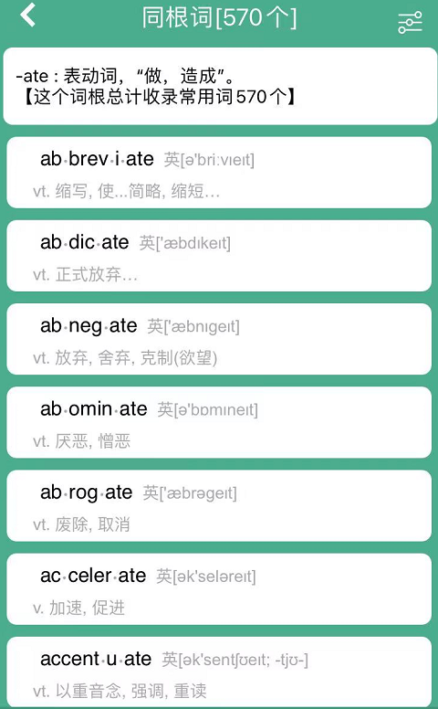
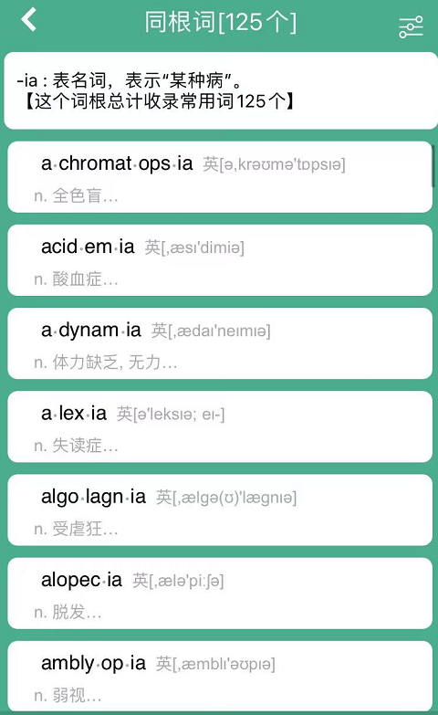

# 咬文嚼字-课本相关

@(TOEFL)[托福, TOEFL, 词根词缀,咬文嚼字]

[toc]

## -al / -ial 表形容词， ”...的“

## -ic：表形容词, "...的"

| 单词                     | 解释                                                         | 单词                          | 解释                                                         |
| ------------------------ | ------------------------------------------------------------ | ----------------------------- | ------------------------------------------------------------ |
| acid-ic 【əˈsɪdɪk】 | 酸的;酸性的;很酸的                                           | academ-ic                     | a.学术的(与实践性、技术性相对);学业的;教学的(尤指与学校教育有关);学习良好的 n.高等院校教师;高校科研人员 |
|                          |                                                              |                               |                                                              |
| autom-ic                 | 原子的，原子能的                                             | aur.ic                        | 金的                                                         |
| authent.ic               | 可靠的，可信的，真正的                                       | auto.bio.graph.ic             | 自转的                                                       |
| zo.ic                    | a. 动物的, 有...的(动物)生活方式的, 有生物的, 含有动植物遗迹的化石的 | a.zo.ic                       | **`-a`**：加在单词前，表示“在…的”；表示“不、无、非”；表示“加强”。源自希腊语 a-, an- "not." 无生命痕迹的，无生的 |
| a-centri-ic              | 无中心的                                                     | agatic 【æg'nætɪk】      | 男系亲属的，男方的；同族的                                   |
| Arabic                   | 阿拉伯语的，阿拉伯人的                                       | barbar-ic 【bɑːrˈbærɪk】 | 残暴的;野蛮的;没有文化的;野蛮人的;原始部落人的               |
| calc.ic 【kælsɪk】  | 含钙的;石灰质的                                              | civic civ-ic             | 公民的，市的                                                 |
| democratic               | 民族的                                                       | hydr-ic                       | 氢气的，含氢的                                               |
| manson-ic                | 共济会会员的                                                 | mim-ic                        | a. 模仿的, 摹拟的 n. 效颦者, 模仿者, 小丑, 仿制品 vt. 模仿, 摹拟 【第三人称单数：mimics；现在分词：mimicking；过去分词：mimicked】 *"I'm so sorry", she mimicked* |

## -ate: 表动作，“做，造成”

## -ment: 表名词，“行为或结果” 

##  -ia：表名词，某种疾病

##  -ant 表名词，“…人”。

### 表形容词，“…的，具有…性质的”

- discordant adj. 不一致的

> dis 不 + cord 心 + ant …的，具有…性质的 → 不是一条心的 → 不一致的

- extravagant adj. 奢侈的

> extra 超过 + vag 走 + ant …的，具有…性质的 → 漫游过多 → 奢侈的

- exuberant adj. 茂盛的

> ex 出 + uber 果实 + ant …的，具有…性质的 → 出果实的 → 茂盛的

- intoxicant adj. 醉人的

> in 使… + toxic 毒 + ant …的，具有…性质的 → 酒精中毒 → 酒精 → 醉人的

- repentant adj. 后悔的

> repent 后悔 + ant …的，具有…性质的 → 后悔的

- resistant adj. 抵抗的

> resist 抵抗 + ant …的，具有…性质的 → 抵抗的

### 表名词，“人”

- accountant n. 会计

> account 账目 + ant 人 → 打理账目的人 → 会计

- adjutant n. 副手；副官

> adjut 帮助 + ant 人 → 副手；副官

- aspirant n. 有抱负者

> aspire 热望，立志 + ant 人 → 有抱负者

- assistant n. 助手

> assist 帮助 + ant 人 → 助手

- inhabitant n. 居民

> inhabit 居住 + ant 人 → 居民

- participant n. 参与者

> participate 参加 + ant 人 → 参与者

###  表名词，“…剂，…物”

- lubricant n. 润滑剂

> lubric 滑 + ant …剂，…物 → 润滑剂

- retardant n. 阻化剂

> retard 延迟，阻止 + ant …剂，…物 → 阻化剂

- stimulant n. 兴奋剂

> stimul 刺 + ant …剂，…物 → 刺激物 → 兴奋剂

- suppressant n. 抑制物

> suppress 抑制 + ant …剂，…物 → 抑制物

### 同义词辨析

| 单词                                | 解释                                                         |
| :---------------------------------- | :----------------------------------------------------------- |
| **candidate**  n. 候选人；申请人 | 〔辨析〕指竞选的候选人或某一职位的申请人。   〔例证〕  Who will be the presidential candidate?    The defeated candidate demanded a recount.   Tom is the strongest candidate for the position. |
| **applicant**  n. 申请者，求职者 | 〔辨析〕通常指正式提交书面材料申请某一职位、高校入学资格等的人。   〔例证〕   We give preference(优先权) to applicants with some experience.   He is the best applicant for the job.  There is no lack of applicants to this college |
| **aspirant**  n. [正式]有志者    | 〔辨析〕**通常指有雄心壮志要取得成功或荣誉的人**。    〔例证〕   An aspirant for literary honor.   They're aspirants to the title of world champion |
| nominee.  n. 被提名者            | 〔辨析〕通常指某一职位、奖项等的提名候选人。    〔例证〕   a presidential nominee.   an Oscar nominee.   He is the nominee for the position. |

## -age 表示“状态，总称”

| 单词                                             | 解释                                                         | 单词                                                         | 解释                                                         |
| ------------------------------------------------ | ------------------------------------------------------------ | ------------------------------------------------------------ | ------------------------------------------------------------ |
| **acre-age**[^1][^2] 【ˈeɪkərɪdʒ】          | acre【ˈeɪkər】：英亩（4 840平方码，约为4 050平方米） an area of land measured in acres [U, C] 大块土地；英亩数 | **advantage** 【ədˈvæntɪdʒ】             advant.age | **`advant-` = ahead**, 表示“前面”，来源于法语 avance 以前，其字母 d 是在 16 世纪时加=>先行优势 |
| amperage 【ˈæmpərɪdʒ】                      | 按倍数                                                       | anecdotage 【'ænek,dotɪdʒ】                             | anecdote【ˈænɪkdoʊt】 n. 轶事, 奇闻                          |
| arbitr-age 【ˈɑːrbɪtrɑːʒ】                  | **`arbitr-`** = judge, 表示“判断”。复合词根：ar-=ad- + bit-走。 | arbitr-ary 【ˈɑːbɪtrəri】                               | arbitr-判断 + **`-ary`**形容词后缀 → 做出[自己的]判断 → 武断的。 |
| bandage 【ˈbændɪdʒ】                        | band-带子 + -age, 表名词 →用带子束缚。                       | baronage                                                     | baron 【ˈbærən】 男爵（英国男爵头衔为Lord;其他国家为Baron） n. 男爵, 男爵爵位, 贵族 |
| baronetage 【bærənɪtɪdʒ】 baron-et-age | **baron**: 男爵 **`-et`**： 表示“小”。源自拉丁语 -ellus, diminutive suffix. | barrage 【bəˈrɑːʒ】                                     | **`barr-` = bar, barrier**, 表示棍子引申为“栏”。 火力网;弹幕射击;(尤指)掩护炮火;堰;水坝;拦河坝 |
| blindage                                         | （军事）盲障；掩体；隐蔽部 (esp formerly) a [protective](https://www.collinsdictionary.com/zh/dictionary/english/protective) [screen](https://www.collinsdictionary.com/zh/dictionary/english/screen) or structure, as over a [trench](https://www.collinsdictionary.com/zh/dictionary/english/trench)。这个完全不同于地堡Bunker。 | brewage                                                      |                                                              |
| brokerage                                        |                                                              | buoyage                                                      |                                                              |
| cabbage                                          |                                                              | **carnage** 【ˈkɑːrnɪdʒ】 carn.age                 | carn- = flesh, 表示“肉，肉欲”，原始含义“切、砍”下来的一块肉。源自拉丁语 caro (词干 carn-) "flesh." 大屠杀 |
| ballotage 【bælɔ'tɑ:ʒ】                     | n. 决选投票                                                  |                                                              |                                                              |

[^1]:  1.acorn（橡子）：中世纪时用来喂猪的坚果英语单词acorn【ˈeɪkɔːrn】原本指的是林木所结的任何一种坚果。它在古英语中写作acern，由acer（空旷土地) + n（nut，坚果）构成，字面意思就是“空旷土地中的坚果”。其中acer就是单词acre（英亩）的词源。中世纪时，欧洲人在空旷林地里养猪，橡子是猪所吃的主要食物，因此acorn后来专指“橡子”。直到现在，著名的西班牙黑毛猪在屠宰前5个月必须放牧在纯天然的橡树林下，以树上跌落的橡子为食。
acorn：['ekɔrn] n. 橡子，橡实
acre：['ekɚ] n. 土地，地产；英亩
[^2 ]:  2.acre（英亩）：一对牛一天能耕的面积英语单词acre【ˈeɪkər】原本并非计量单位，而是“耕开的土地”的意思。后来，acre才演变为计量单位，一英亩到底有多大呢？其实就是平均一对牛一天能耕的面积。在古代英国，耕地时通常使用一对牛来拉一把犁，一天下来，这对牛能耕的面积就是一英亩。后来英国政府才明确规定了acre的面积，等于大约6亩、0.4公顷。
acre： ['eɪkə] n.英亩，土地，地产
acreage：['ekərɪdʒ] n. 面积，英亩数

## -ess:表名词，“女性、雌性"

| 单词      | 解释                                                | 单词          | 解释                           |
| --------- | --------------------------------------------------- | ------------- | ------------------------------ |
| Caffe-ine |                                                     | dis-cip-l-ine |                                |
| doctr-ine | = to teach, 表示“教”。源自拉丁语 docere "to teach." | fam-ine       | fam-来自拉丁语fames,饥饿，饥荒 |

## -ine 表名词，“状态，药物，化学物品”等

| 单词      | 解释                                                | 单词          | 解释                           |
| --------- | --------------------------------------------------- | ------------- | ------------------------------ |
| Caffe-ine |                                                     | dis-cip-l-ine |                                |
| doctr-ine | = to teach, 表示“教”。源自拉丁语 docere "to teach." | fam-ine       | fam-来自拉丁语fames,饥饿，饥荒 |

## -ary 表形容词，“…的”。

| 单词 | 解释 | 单词 | 解释 |
| ---- | ---- | ---- | ---- |
|      |      |      |      |
|      |      |      |      |

