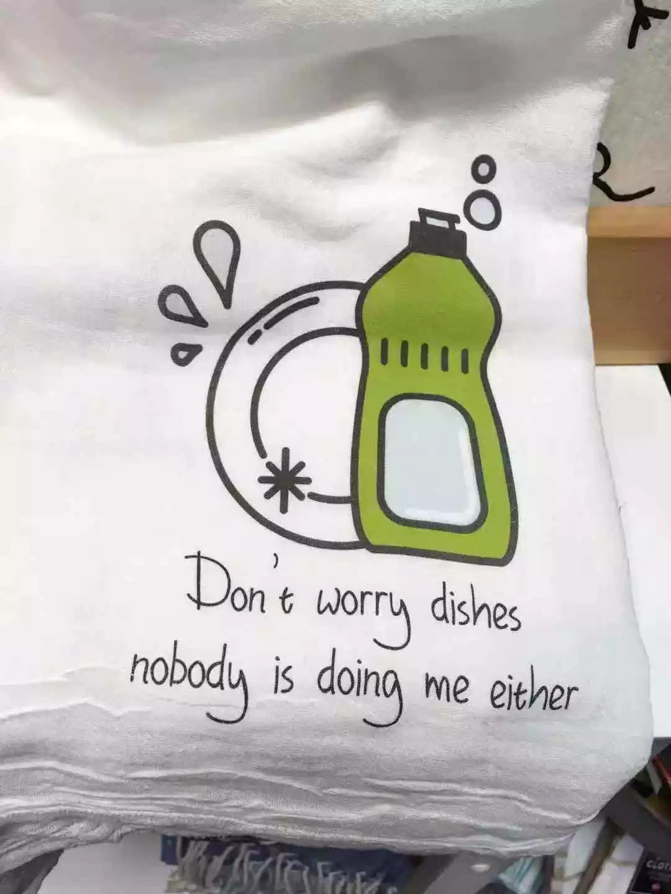
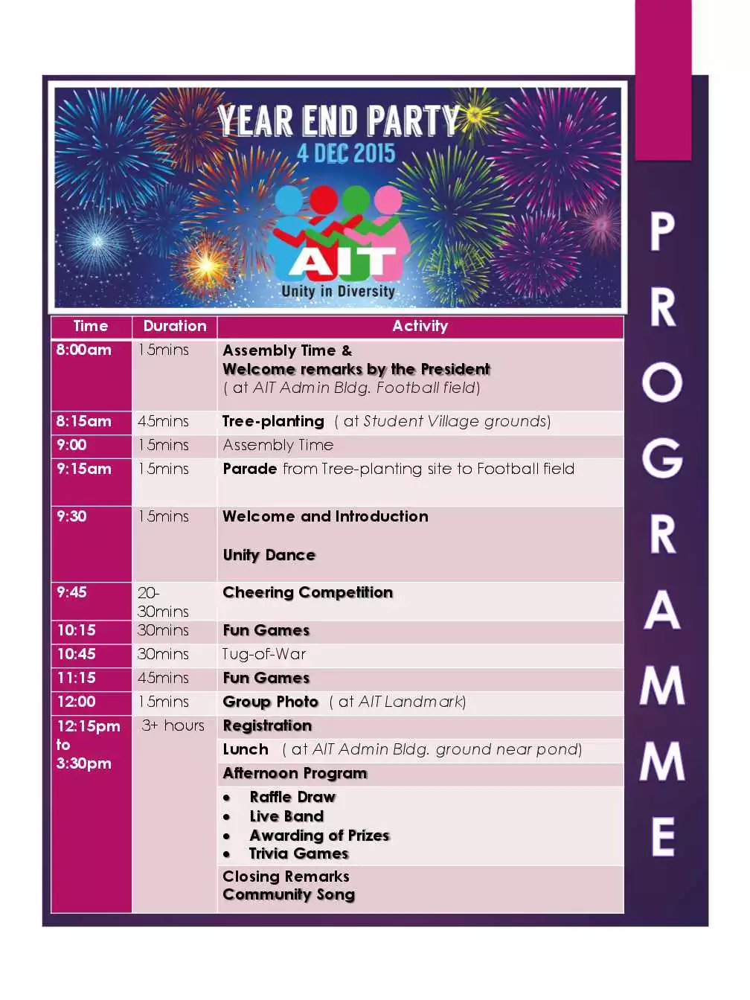

# 侃英语每日一词
@(TOEFL)[托福, TOEFL, 词根词缀,咬文嚼字]

> 公众号：KanEnglish

[toc]

## 1. Alma mater：母校 (不是 mother school)

alma mater 主题的雕像都是女性。其实，alma mater 是拉丁语，原义就是指“滋养生命的母亲”。

alma 源自于拉丁词根 alere，表示“滋养”；mater 也是拉丁词根，表示“母亲”（英文中有很多来自于 mater 的单词，比如 matrix，表示“母体”；material，表示“原材料”等）。

在古罗马时代，alma mater 指“谷物女神”（给人类提供食物的女性神祗）。18世纪开始，英国人用它来指代自己毕业的大学，象征学校给予学生以母亲般的营养和滋润。

再看看牛津词典中的解释：

词典中，我们了解到 alma mater 诞生于17世纪中叶，意为：someone or something providing nourishment（提供滋养的人或物）。

> 原文：https://dwz.cn/ooCkSZU5 
> 发布时间： 2019-1-2

## 2.  Do the dishes：洗盘子 (不是Wash the dishes) 

Don’t worry dishes. Nobody is doing me either.

首先，worry 确实是一个不及物动词，后面要加介词 about，才能跟宾语，比如：
> Don't worry about me.

因此，这里Don’t worry dishes其实少了一个逗号，这句话应该写成 Don’t worry, dishes. 这句话是抹布对盘子（dishes）说的，翻译成中文是：“别担心，盘子”。

其实“洗盘子”，老外都会说“do the dishes”，这更简单易说。

所以，nobody is doing me either 表示“也没有人洗我”。我们再联系上句话一起理解一下：Don’t worry, dishes. Nobody is doing me either. 整句话的意思是不是：别担心，盘子。也没有人洗我。

大家脑补一下：

一个脏脏的水槽（sink）里堆着一些未洗的盘子和一块脏抹布。抹布可怜兮兮地对盘子们说：“别担心，盘子。也没有人洗我。”（Don’t worry, dishes. Nobody is doing me either.）这是抹布对盘子的惺惺相惜呢！

这一下大家能明白抹布身上这句英语的冷幽默了吧？

> 原文： https://dwz.cn/690cyjex
> 发布时间： 2019-1-3 09:47:20

## 3. Shoot me & beats me

> https://dwz.cn/rbrZMoH1

How many stars are there in the sky?（天上有多少星星？）
beats me （这个问题把我打败了）。

### 3.1  打死我也不愿意
口语：
> A：It’s about ten-hour drive to get there.
> B: What? 10 hours? Shoot me.

偏书面语：
> I'd rather be shot than drive 10 hours to get there.

> A：The teacher wants you to team up with Ann.
> B:  No, please shoot me.
>  
>  I’d rather be shot than team up with Ann.

能不能体会出来？“shoot me”在这里并不是真的想让别人开枪打死自己，而是表达一种“宁愿被开枪打死也不愿意干某事”，以证明这件事情多么讨厌和恶心。也可以说：kill me。

### 3.2  那又如何

> A：Actually you are wrong. Pluto has now been considered as a dwarf planet. (事实上，你错了。冥王星已经被认为是矮行星了。)
>  
> B: Shoot me. (那又如何。)

这里的 shoot me 有种挑衅、反讽的意味，即“那又怎样，开枪打死我啊！”。 前面最好加上** So what?**（那又怎样）或者 **Whatever**（无所谓），效果更佳。

### 3.3 抛、掷
> What a nice shot！

这里的 shot 就是 shoot 的名词形式，如果投篮没有命中，可以说：miss the shot。

### 3.4 递给我某物

shoot 如果表示“投、掷”的意思，那么 shoot me something 就表示“把...递给我”，比如：
> Please shoot me that book.  请把那本书递给我。

### 3.5  shit 的委婉语
shoot 是 shit 的委婉语。Shit 是个粗口，类似中文里的“cao（第四声）”，但一些比较注重形象的人往往会说“靠”或“擦”，来代替那个比较硬核的字。

英文中也一样，有些人觉得用“shit”来表达情绪不文明，便选择说 shoot。比如：
> Shoot! I missed the shot.

另外，shoot 还可以表达“有话快说，有屁快放”，比如有人跟你说“我有一句话，不知当讲不当讲”。这时，你就可以说：shoot!

## 4. Year-end Party V.S. Annual Party

不少大公司的英文翻译也确实是 annual party, 但是，annual 这个词表示“一年一度”的，比如：
> Tomato Fight is an annual event in a small Spanish town. （西红柿大战是西班牙小镇一年一度的盛事）。

“年会”确实也是“一年一度”的盛事，上面阿里巴巴年会的翻译也没有问题。但是 annual party 仅表示“一年一度的派对”，时间不一定在年末。请注意下面这家公司 annual party的时间为9月23日。

所以，要想获得准确的翻译，还得思考原文的本质。“年会”一般在一年的末尾举办，中国有些地方把这个时间称为“尾牙”，即指商家一年活动的尾声。“年会”中的“年”的翻译最好体现出“末尾”的意思。

因此，**year-end party**（年终聚会）来表示“年会”会更为准确一些。

下面是一张国外年会的安排表。相比之下，显得中规中矩、清汤寡水，没有中国公司年会上的妖野萌贱的元素，但里面有些表达值得我们学习：

| 汉语|  英语   |   备注|
| :-------- | --------:| :------: |
| 集合时间|   assembly time |  |
| 领导/主席讲话|   Welcome remarks by the president |  |
| 趣味活动|  fun games |  |
| 小游戏|   trivia games|  |
| 拔河|   tug-of-war |  |
| 集体照|   group photo |  |
|**抽奖活动**|  raffle draw |  |
| 乐队现场表演|   live band |  |
| 颁奖|   awarding of prizes**[praɪz]** |  |
| 结束讲话|   closing remarks |  |

## 5. Bird Person/Cat Person/ Pet Person

### 5.1 动物 + person ( person 有时也用 people 代替)
> Are you a cat person or a dog person? 
> 你是喵星人的铲屎官还是汪星人的铲屎官？ 

>  
>  顺便说下，“铲屎官”可别直译为 shovel shit officer 噢！其实用一个“pet person” 就可以搞定了。

bird person 在英文表达并不多见，但还是可以被理解的，就是 bird lover（鸟类爱好者）的意思。

### 5.2 people person
根据上述结构，难道 people person 是“人类爱好者”？我们来看看词典中的解释吧：

people person 是英文中的一个习语，表示“喜欢并擅长与人打交道的人”，我们可以将之译为“交际花”、“社交达人”、“八面玲珑的人”。造个句子巩固一下：
> Tom is such a people person, who can get along with anybody.

### 5.3 music lover / music fan, 不可以是music person

“某某 person”可以表示“喜欢…之人”，但“某某”只限于某种动物，如果你想表达“喜欢音乐的人”，最好不要说成 music person，还是老老实实说成 music lover 或者 music fan比较好。

### 5.4 Cat People V.S. Cat Woman
另外，后面的 person 也别轻易改成 man 或者 woman，否则就很有漫画里“超级英雄”的喜感了。

比如你想说“I’m a cat person”（我喜欢猫），结果你说成了“I’m a cat woman”，妥妥的DC 女英雄“猫女”既视感。

### 5.5 小结
1. cat person：爱猫之人
2. dog person：爱狗之人
3. pet person：养宠物的人、“铲屎官”
4. bird person：爱鸟之人，但比较少用，也可以说 bird lover
5. people person：善于交际的人、八面玲珑的人
6. music lover/fan：喜欢音乐的人

## 6. 为什么牙痛用 ache，嗓子痛却用 sore
> https://dwz.cn/ruvRiRhI

### 6.1 ache
ache 所描述的疼痛通常发生在身体的某个部位，持续时间较长，但强度不高。比如
- headache (头痛)
- stomachache [**ˈstʌməkˌek**] (肚子痛)
- toothache (牙痛)
- earache (耳朵痛)

ache 描述的疼痛一般不会影响你正常生活，你可以忍受它们，甚至可以 ignore them。

### 6.2 pain
而 pain 所描述的疼痛更突然、更猛烈，会影响你正常生活，你很难忍受，无法 ignore。比如你切菜的时候不小心切到了手：
> Yesterday, I accidentally cut my finger. That was a great pain.
大家可以脑补一下这种疼痛...你无法继续切菜了，肯定要找创口贴了吧？

另外，女性朋友生孩子的时候，那种痛应该是人类的极限了，也可以用 pain 来表示，叫做 **birth pain**（分娩之痛）。

所以，持续时间较短、强度高的疼痛用 pain。

### 6.3 hurt

上面的 ache 和 pain 通常用作名词，而 hurt 通常用作**动词**，表意较泛，**各种程度的痛感都用它来描述**，比如：
> My back hurts.

上述句子也可以说：*I have a pain/ache in my head*. 至于用 pain 还是 ache，取决于这种痛感的时间和强度，但 hurt 就显得比较含糊了。

### 6.4 sore

这个词大家别翻译为“酸”，sore 跟“酸”没啥关系，也是一种“痛感”。在持续时间上和强度上类似 ache，但区别在于 sore 尤其指身体某个部位因为"使用过度"而出现的疼痛。

比如你用嗓过度，嗓子痛，就要用 sore了，说完整是：
> I have a sore throat 

再如，你用眼过度，眼睛干涩甚至疼痛，就可以说：
> I have sore eyes
>  
>  碍眼的人或事物，可以说成**eyesore**(名词)，比如： This ugly building is a real eyesore.

再比如你锻炼时肌肉拉得太猛，导致肌肉疼痛，可以说：
> My muscles are very sore after playing badminton.(羽毛球)

走路走太多了，脚疼，你可以说：
> My feet are so sore after hours of walking.

**Sore 除了表示过度使用造成的疼痛；还可以表示因感染造成的发炎而导致的疼痛**。

### 6.5 小结
最后总结一下：

- **ache**：通常作名词，时间较长，强度不高，可以忍受。
- **pain**：通常作名词，时间较短，强度高，很难忍受。
- **hurt**：通常作动词，表义较泛。
- **sore**：通常作形容词，因"使用过度"而引发，时间较长，强度不高，可以忍受。

顺便提一下，上述这些描述疼痛的词还可以表达“精神上的痛苦”，比如：
> Breaking with her causes me a great deal of **heartache**.
>  
>  She suffers a great **pain** in this relationship. 
>  *上句也可以写成 She is painful in this relationship. *
>   
>   I didn't mean to **hurt** your feeling.

#### sore point 
sore 可以跟 point 搭配，sore point 表达“痛心之事”、“伤心事”，比如：
> Sue has not married, which is a **sore point** for her parents.

