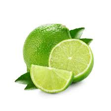
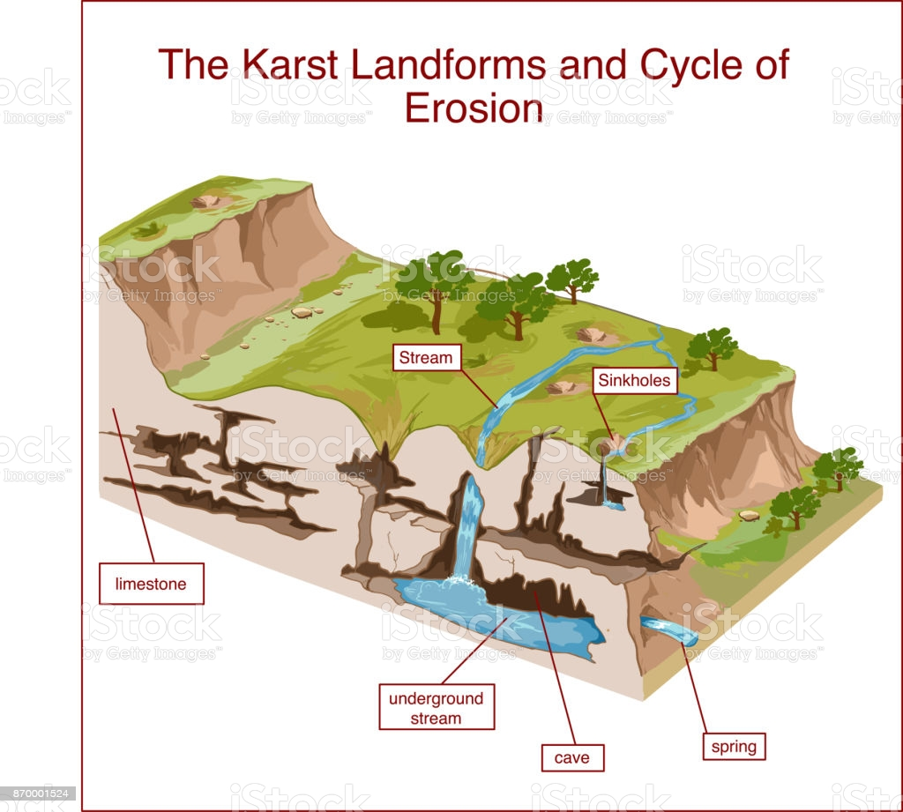
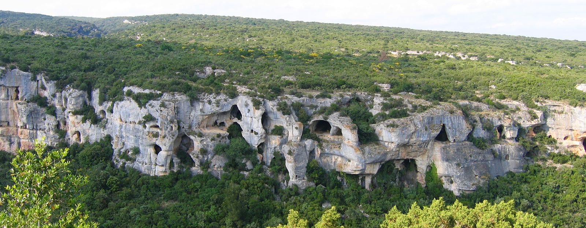

# 需要强化记忆的单词

大部分都是印欧本地语，少部分是古希腊、古罗马词根。

| 单词                                                         | 解释                                                         |
| ------------------------------------------------------------ | ------------------------------------------------------------ |
| rive  riven  river                                 | rive 【raɪv】裂开;裂罅;碎片； riven【ˈrɪvn】裂开;分裂;撕开;拧去 (from; away; off);使烦恼rive的过去分词和过去式 river【ˈrɪvər】河;江;(液体)涌流 |
| **oar** 【ɔːr】                                         | a long pole with a flat blade at one end that is used for rowing a boat 船桨;铝合金桨;划桨。 oarfish:桨鱼;勒氏皇带鱼 **put/stick your oar in**: 多管闲事；横插一杠子 The trustworthiness is like the barge-pole oar of life ship, controlling the direction of life. |
| **orc** 【ɔrk】                                         | an imaginary creature like a very ugly, violent human, that is described in books by J.R.R. Tolkien 半兽人（源自英国小说家托尔金的作品，也译作兽人，奥克，欧克） |
| **OCR**                    【ˌoʊ siː ˈɑːr】             | OCR：***optical character recognition*** Very natural, we introduce the artificial neural networks into OCR algorithm design.(很自然地，我们在光学字符识别算法设计中引入了人工神经网络。) |
| **galley** 【ˈɡæli】                                    | **galley**  n.单层甲板的桨帆船。地中海风向多变，船如果光有帆，逆风或无风怎么办？用桨。但是用桨吧，水手得24小时划船，因为不划桨船就不动。另外，划桨前进的速度无论如何如何是太快不了的。怎么办？桨帆并用的galley船应运而生，但词源unknown，这也说明古代地中海地区确实有很多古代文明。 |
| **corridor** 【ˈkɔːrɪdɔːr】                             | 走廊(一国领土通过他国境内的狭长地带);(建筑物内的)过道;通道;(火车上的)走道;空中走廊(一国领空中允许他国飞机经过的区域)：a long narrow passage in a building, with doors that open into rooms on either side。 the corridors of power：(sometimes humorous) 权力走廊（高层政治决策机构） the higher levels of government, where important decisions are made. You'll find his office just along the corridor. |
| **secular** 【ˈsekjələr】                               | 现世的；世俗的；非宗教的：not connected with spiritual or religious matters (of priests 司祭) 教区的；在俗的：living among ordinary people rather than in a religious community He spoke about preserving the country as a secular state.(他谈及了保持该国世俗化的问题。) Mexico is a secular state and does not have diplomatic relations with the Vatican(墨西哥是个世俗国家，和梵蒂冈没有外交关系。) |
| **reef** 【riːf】                                       | 礁；礁脉 a long line of rocks or sand near the surface of the sea： a coral reef （珊瑚礁） 缩帆部；帆的可收缩部：a part of a sail that can be tied or rolled up to make the sail smaller in a strong wind  ***coal*** 【koʊl】:煤炭 \|  ***carol*** 【ˈkærəl】颂歌;圣诞颂歌 \| ***coral***【ˈkɔːrəl】n.珊瑚;珊瑚虫  adj.  珊瑚色的;红色的;粉红的 ***Coral*** 源自希腊语 korallion, 后借道法语进入英语。取这个名字的人（卡洛尔），寓意有着如宝石一般高贵夺目的气质。 |
| **balsa** 【ˈbɔːlsə】                                   | 热带美洲轻木(尤用于制作模型)the light wood of the tropical American balsa tree , used especially for making models. Strong lightweight wood of the balsa tree used especially for floats(轻而坚韧的轻木木料，用于制筏。) |
| **hump** 【hʌmp】                                       | （平面上的）大隆起物；（尤指）土墩，丘，冈 a large lump that sticks out above the surface of sth, especially the ground； （某些动物的）峰；（尤指）驼峰 a large lump on the back of some animals, especially camels |
| **lime** 【laɪm】                                       | 石灰;酸橙;酸橙汁;酸橙树 |
| **limestone** 【ˈlaɪmstoʊn】                            | lime【石灰】 + stone【石头】。石灰岩是以方解石为主要成分的碳酸盐岩，是烧制石灰和水泥的主要原料，是炼铁和炼钢的熔剂。美式英语中多用limerock。 |
| **karst** 【kɑrst】                                     | 喀斯特；岩溶:an area of land formed of rock such as limestone that is worn away by water to make caves and other formations |
| **vicinity** 【vəˈsɪnəti】                              | **vill-** 表示“村庄、农场”，常引申为“邻居、附近”。源自拉丁语 villa "country house, farm," vicus "quarter or district of a town, neighborhood." **-ity** 表名词，指具备某种性质。 周围地区;邻近地区;附近:the area around a particular place. There is no hospital in the immediate vicinity.附近没有医院。 Both of these grow in coastal waters, often in the vicinity of coral reefs.(这两个都在沿海水域生长，通常在珊瑚礁的附近) |
| **per-tin-ent** 【ˈpɜːrtnənt】 **Pertinence** **Pertinency** | appropriate to a particular situation：有关的;恰当的;相宜的  **`per-`**完全的 + **tin-**抓住，握住 + **`-ent`**形容词后缀。  **`per-`** 表示“完全，贯穿，自始至终，向前”。forth, ford 是其同源词。 **`tin-`** = hold, 表示“拿住”，来自拉丁语，原意表示“展开”。 **`-ent`** 表示形容词，“…的”。 |
| **pebble** 【ˈpebl】                                    | 鹅卵石；砾石:a smooth, round stone that is found in or near water。 A tsunami is not like dropping a pebble into water and seeing the ripples go out equally in all directions. |
| **spinach** 【ˈspɪnɪtʃ】                                | 菠菜：a vegetable with large dark green leaves that are cooked or eaten in salads 来自盎格鲁法语 spinache,来自古法语 espinoche,来自阿拉伯语 isfanak,来自波斯语 ispanakh,一种绿色蔬菜。比较汉语菠菜，原名波斯菜。 |
| **graze** 【ɡreɪz】                                     | 吃草;(在草地上)吃青草;放牧;放牛;放羊;擦伤，擦破(皮肤) There were cows grazing beside the river The land is used by local people to graze their animals I feel and grazed my knee. The bullet grazed his cheek. |
| **lemur** 【ˈliːmər】                                   | 狐猴(栖居于马达加斯加岛)an animal like a monkey , with thick fur and a long tail, that lives in trees in Madagascar |

### Kast

###  river & arrive &rival

- **arrive（到达）：水路运输中船只抵达河岸**

  英语单词**arrive**（到达）与**river**（河流）有关系吗？没错，它们其实是同源词。

  古代交通不发达，公路很少，所以天然形成的河流及大洋是非常重要的交通途径。英语单词**arrive**（到达）就与古代的水运方式有关。

  **arrive**源自拉丁语arripare，由ad+ripa组合构成。ad表示toward、 near（靠近），因为后面的ripa以r开头所以改写为ar；ripa表示“河岸、海岸”，如英语单词**riparian**（河边居民）。

  英语单词**river**（河流）与**arrive**同源，它源自拉丁语riparius（河岸的）。

  - arrive：[ə'raɪv] vi.达到，达成。记：ar（=ad，靠近）+rive（river的岸边）→靠岸
  - arrival：[ə'raɪv(ə)l] n.到达，到来，到达者
  - river：['rɪvə] n.河，江
  - riparian： [raɪ'peərɪən] n.河边居民，河岸拥有者adj.河边的

- **rival（对手）：在河两面争夺河水的人**

  英语单词**rival**和**river**（河流）同源，来自古拉丁文rivalis，本意是“河对面的人、共饮一江水的人”。

  在古代，围绕一江一河往往会展开激烈的争夺，由近邻演变为对手。所以当rivalis借道法语进入英语并演变为rival时，很快被赋予了“竞争对手、敌手”的含义。

  - rival： ['raɪvl] n.竞争对手，敌手adj.竞争的v.竞争
  - rivalry： ['raɪvlri] n. 竞争；对抗；竞赛
  - rivalrous： ['raɪvlrəs] adj. 敌对性的；有竞争性的
  - unrivalled：[ʌn'raɪv(ə)ld] adj. 无与伦比的；无敌的
  - river： ['rɪvɚ] n. 河，江

