# 需要强化记忆的单词

大部分都是日耳曼本地语，少部分是古希腊、古罗马词根。

日耳曼本语的最大的一个特征就是和现实生活中的物品可以一一对应，一旦掌握就好理解，比如舔狗就是舔狗：

很少会有引申出比如校长之意，因此一旦和现实本体一一对应，就很好记。

| 单词                                                         | 解释                                                         |
| ------------------------------------------------------------ | ------------------------------------------------------------ |
| rive  riven  river                                 | rive 【raɪv】裂开;裂罅;碎片； riven【ˈrɪvn】裂开;分裂;撕开;拧去 (from; away; off);使烦恼rive的过去分词和过去式 river【ˈrɪvər】河;江;(液体)涌流 |
| **oar** 【ɔːr】                                         | a long pole with a flat blade at one end that is used for rowing a boat 船桨;铝合金桨;划桨。 oarfish:桨鱼;勒氏皇带鱼 **put/stick your oar in**: 多管闲事；横插一杠子 The trustworthiness is like the barge-pole oar of life ship, controlling the direction of life. |
| **orc** 【ɔrk】                                         | an imaginary creature like a very ugly, violent human, that is described in books by J.R.R. Tolkien 半兽人（源自英国小说家托尔金的作品，也译作兽人，奥克，欧克） |
| **OCR**                    【ˌoʊ siː ˈɑːr】             | OCR：***optical character recognition*** Very natural, we introduce the artificial neural networks into OCR algorithm design.(很自然地，我们在光学字符识别算法设计中引入了人工神经网络。) |
| **galley** 【ˈɡæli】                                    | **galley**  n.单层甲板的桨帆船。地中海风向多变，船如果光有帆，逆风或无风怎么办？用桨。但是用桨吧，水手得24小时划船，因为不划桨船就不动。另外，划桨前进的速度无论如何如何是太快不了的。怎么办？桨帆并用的galley船应运而生，但词源unknown，这也说明古代地中海地区确实有很多古代文明。 |
| **corridor** 【ˈkɔːrɪdɔːr】                             | 走廊(一国领土通过他国境内的狭长地带);(建筑物内的)过道;通道;(火车上的)走道;空中走廊(一国领空中允许他国飞机经过的区域)：a long narrow passage in a building, with doors that open into rooms on either side。 the corridors of power：(sometimes humorous) 权力走廊（高层政治决策机构） the higher levels of government, where important decisions are made. You'll find his office just along the corridor. |
| **secular** 【ˈsekjələr】                               | 现世的；世俗的；非宗教的：not connected with spiritual or religious matters (of priests 司祭) 教区的；在俗的：living among ordinary people rather than in a religious community He spoke about preserving the country as a secular state.(他谈及了保持该国世俗化的问题。) Mexico is a secular state and does not have diplomatic relations with the Vatican(墨西哥是个世俗国家，和梵蒂冈没有外交关系。) |
| **reef** 【riːf】                                       | 礁；礁脉 a long line of rocks or sand near the surface of the sea： a coral reef （珊瑚礁） 缩帆部；帆的可收缩部：a part of a sail that can be tied or rolled up to make the sail smaller in a strong wind  ***coal*** 【koʊl】:煤炭 \|  ***carol*** 【ˈkærəl】颂歌;圣诞颂歌 \| ***coral***【ˈkɔːrəl】n.珊瑚;珊瑚虫  adj.  珊瑚色的;红色的;粉红的 ***Coral*** 源自希腊语 korallion, 后借道法语进入英语。取这个名字的人（卡洛尔），寓意有着如宝石一般高贵夺目的气质。 |
| **balsa** 【ˈbɔːlsə】                                   | 热带美洲轻木(尤用于制作模型)the light wood of the tropical American balsa tree , used especially for making models. Strong lightweight wood of the balsa tree used especially for floats(轻而坚韧的轻木木料，用于制筏。) |
| **hump** 【hʌmp】                                       | （平面上的）大隆起物；（尤指）土墩，丘，冈 a large lump that sticks out above the surface of sth, especially the ground； （某些动物的）峰；（尤指）驼峰 a large lump on the back of some animals, especially camels |
| **lime** 【laɪm】                                       | 石灰;酸橙;酸橙汁;酸橙树 |
| **limestone** 【ˈlaɪmstoʊn】                            | lime【石灰】 + stone【石头】。石灰岩是以方解石为主要成分的碳酸盐岩，是烧制石灰和水泥的主要原料，是炼铁和炼钢的熔剂。美式英语中多用limerock。 |
| **karst** 【kɑrst】                                     | 喀斯特；岩溶:an area of land formed of rock such as limestone that is worn away by water to make caves and other formations |
| **vicinity** 【vəˈsɪnəti】                              | **vill-** 表示“村庄、农场”，常引申为“邻居、附近”。源自拉丁语 villa "country house, farm," vicus "quarter or district of a town, neighborhood." **-ity** 表名词，指具备某种性质。 周围地区;邻近地区;附近:the area around a particular place. There is no hospital in the immediate vicinity.附近没有医院。 Both of these grow in coastal waters, often in the vicinity of coral reefs.(这两个都在沿海水域生长，通常在珊瑚礁的附近) |
| **per-tin-ent** 【ˈpɜːrtnənt】 **Pertinence** **Pertinency** | appropriate to a particular situation：有关的;恰当的;相宜的  **`per-`**完全的 + **tin-**抓住，握住 + **`-ent`**形容词后缀。  **`per-`** 表示“完全，贯穿，自始至终，向前”。forth, ford 是其同源词。 **`tin-`** = hold, 表示“拿住”，来自拉丁语，原意表示“展开”。 **`-ent`** 表示形容词，“…的”。 |
| **pebble** 【ˈpebl】                                    | 鹅卵石；砾石:a smooth, round stone that is found in or near water。 A tsunami is not like dropping a pebble into water and seeing the ripples go out equally in all directions. 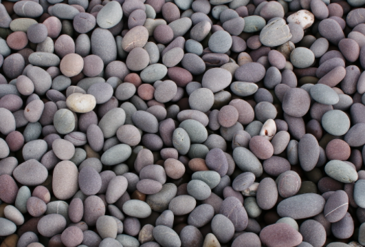 |
| **spinach** 【ˈspɪnɪtʃ】                                | 菠菜：a vegetable with large dark green leaves that are cooked or eaten in salads  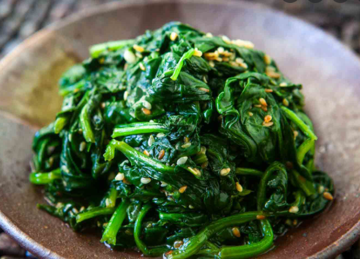 来自盎格鲁法语 spinache,来自古法语 espinoche,来自阿拉伯语 isfanak,来自波斯语 ispanakh,一种绿色蔬菜。比较汉语菠菜，原名波斯菜。 |
| **graze** 【ɡreɪz】                                     | 吃草;(在草地上)吃青草;放牧;放牛;放羊;擦伤，擦破(皮肤)  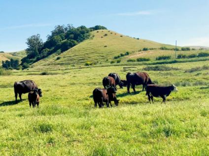 There were cows grazing beside the river The land is used by local people to graze their animals I feel and grazed my knee. The bullet grazed his cheek. |
| **lemur** 【ˈliːmər】                                   | 狐猴(栖居于马达加斯加岛)an animal like a monkey , with thick fur and a long tail, that lives in trees in Madagascar  |
| **axi-om** 【ˈæksiəm】                                  | n. 自明之理, 公理, 原理, 格言 【复数：axioms】 **`axi-`**价值 + **`om`** → 有价值的理论 → 公理 ...the long-held axiom that education leads to higher income. |
| **pharaoh** 【ˈferoʊ】                                  | - 来自希腊语 Pharao,来自希伯来语 Par'oh,来自埃及语 Pero',埃及国王尊称，字面意思即大屋。 a ruler of ancient Egypt |
| **Harp**                                                     | a triangular - shaped instrument that has a curved neck and strings stretched between the neck and the body , at an angle to the sound box .  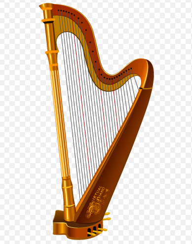 学习竖琴（**Harp**）是很难的（**Hard**) Harp on about sth. 喋喋不休的说：My grandfather harps on about the war all the time. |
| **peat** 【piːt】                                       | 词源不详。可能来自凯尔特语*pett,小块，小量，词源同 piece,patch.后引申词义小块泥土，泥煤，泥炭等。 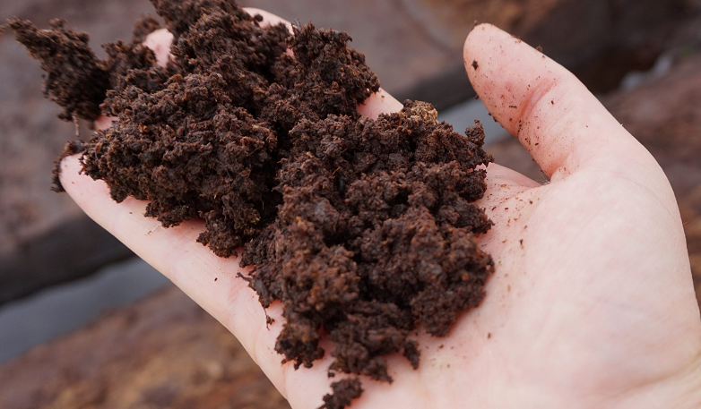** Peat** is decaying plant material which is found under the ground in some cool, wet regions. Peat can be added to soil to help plants grow, or can be burnt on fires instead of coal. |
| **picture-sque                     ** 【ˌpɪktʃəˈresk】  | - 来自 picture,图片，照片，-esque,形容词后缀，如…的。比喻用法。 古雅的;优美的;古色古香的;生动的;栩栩如生的 The inn is picturesquely situated on the banks of the river. |
| **rut**                                                      | n. 车辙; <比喻>刻板, 惯例; **发情期** v. 形成车辙; **发情** 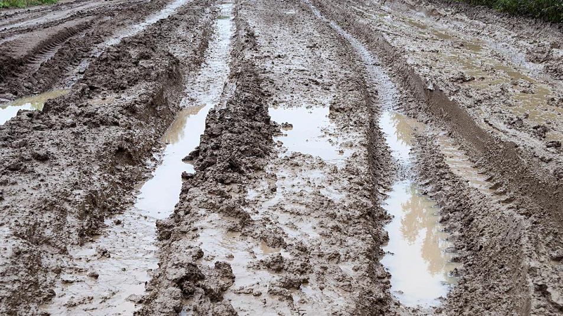 【复数：ruts；过去分词：rutted；现在分词：rutting】 In the present, Michael finds himself in a similar creative runt. |
| **porcelain** 【ˈpɔːrsəlɪn】 破稀烂                | 1 - 来自中古法语 procelaine,来自意大利语 porcellana,贝壳，瓷器，因其相似的光泽而得名，来自拉丁语 porcellus,小猪，词源同 pork,-elle,小词后缀。据说是因为贝壳的孔隙有如母猪的外阴而得名。 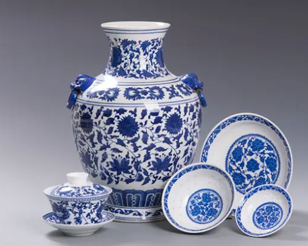 英语单词porcelain（瓷器）来自意大利语porcellana，它是一种贝壳，外表有着瓷器一样明亮光泽。porcellana来自意大利语porcella（年轻的母猪），与英语中的pork（猪肉）同源。当意大利看到外表明亮的中国瓷器时，就用同样有着明亮光泽的贝壳porcellana来称呼它，经由法语进入英语后，拼写变成了porcelain。现在，谁还能想到，porcelain（瓷器）与pork（猪肉）还有这样的渊源呢？ n.瓷器;瓷 \|  adj.瓷(器)的;脆的;易碎的;精美的 |
| **bulwark** 【ˈbʊlwɜːrk】                               | 1. (formal) 保护者，防御者（指人或事物）a person or thing that protects or defends sth。eg: a bulwark against extremism(坚决反对极端主义者) 2. 堡垒；防御工事 a wall built as a defence 3. [usually pl.] （船的）舷墙: he part of a ship's side that is above the level of the deck |
| **camouflage** 【ˈkæməflɑːʒ】                           | (军事上的)伪装，隐蔽;(动物的)保护色，保护形状;隐瞒。 Her angry words were camouflage for the way she felt.（她以气愤的言辞掩盖自己的真实感情。） The soldiers camouflaged themselves with leaves Her size was camouflaged by the long loose dress she wore.（她穿的那件宽松长裙掩饰了她的身材。） |
| **dial** 【ˈdaɪəl】                                     | v.拨号;拨(电话号码) n.**表盘;刻度盘;标度盘;仪表盘;**(收音机、炉、灶等的)调节盘，控制盘;(旧式电话机的)拨号盘。 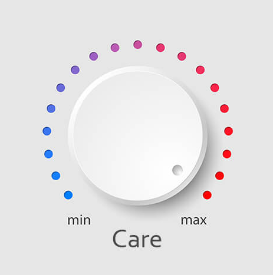 来自拉丁短语rotadialis , daily wheel "rotate diurnal"，一种古代测太阳运转的日晷，后用来指相关圆形物体。 |
| **peri-pher-al** 【pəˈrɪfərəl】                         | **`peri-`**四周 + **`pher-`**带来 + **`-al`**形容词后缀 → 周边带来的 → 不重要的 , 外围的。 周边的;外围的;次要的;附带的;与计算机相连的 |
| **dome** 【doʊm】                                       | **`dome-`** = house, 表示“屋，家”。来自拉丁语 domus "house" 及 dominus "master of a household, lord" 穹顶;圆屋顶;圆顶状物;穹状建筑物;圆顶体育场  /   加圆屋顶于…上成圆顶状 |
| **Slope** 【sloʊp】                                     | n. 斜坡, 山坡; 斜率 v. 使倾斜; 悄悄地走, 溜              |
| **Slop** 【slɑːp】                                      | 晃荡;(常指)溢出，溅出;倒出;使泼出;使溅洒； 泔水;(倒掉的)剩饭菜;污水;脏水 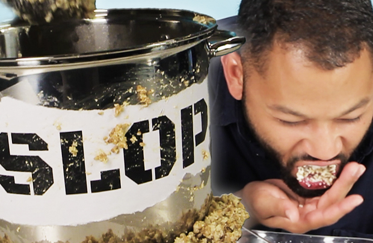 |
| **foli-ar** 【ˈfoʊliər】                                | foli-叶子 + -ar： 叶的;叶状的  **`foli-`** = leaf, 表示“树叶”。源自拉丁语 folium "leaf." **`-ar`** 表形容词，“…的”。源自拉丁语 -alis, adjective suffix. |
| **cenote** 【sɪ'nəʊtɪ】                                 | 【地】(石灰岩溶蚀形成的)天然水井 。  [a natural well](https://www.journeymexico.com/blog/cenotes-in-mexico) formed by the collapse of an overlying limestone crust: often used as a sacrificial site by the Mayas (尤指墨西哥的)天然井 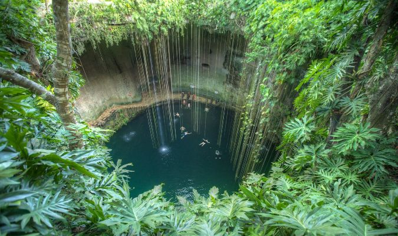 |
| **bov-ine** 【ˈboʊvaɪn】                                | a. (似)牛的, 迟钝的n. 牛科动物 ： bov-牛 + -ine **`bov-`** = ox, 表示“牛”。源自拉丁语 bos (词干 bov-) "ox, bull, cow." 更多同源词... **`-ine`** 表形容词，“…的”。 |
| **reindeer** 【ˈreɪndɪr】                               | a large deer with long antlers (= horns shaped like branches), that lives in cold northern regions |
| **smother** 【ˈsmʌðər】                                 | 缩写自中古英语 smorthre,浓烟，来自古英语 smorian,使窒息，闷死，-ian,表动词，词源可能同 smolder. -ther,工具格后缀，比较 tether,mother.引申比喻义抑制，扼杀。 a rich dessert smothered in cream（涂了厚厚一层奶油的多脂甜点） |
| **avalanche** 【ˈævəlæntʃ】                             | 雪崩;山崩。 俗词源解读为 avaler-,向下，词源同 valance,挂布。-anche,名词后缀，同-ance。 |
| **ramble** 【ˈræmbl】                                   | n. 漫步, 随笔 v. 漫步, 漫游, 闲逛; 漫谈; 蔓延 可能来自 roam,漫游，-le,表反复。插入字母 b,比较 number,numerate.引申诸相关词义。 |
| **beckon** 【ˈbekən】                                   | v.召唤；吸引；示意，n.表召唤的点头；手势。这个单词不太好记，但招财猫the beckoning cat都见过吧？而且用食指或勾手召唤别人的姿势也做过好多次吧？实际上，明白beckon实际是beacon ['biːk(ə)n] n.灯塔这个单词的异体就明白了。这两个单词追溯到印欧根的意思是“to shine”。 推荐： beckon是由beacon变体而来。因此含义具有很强的关联性 |
| **Legume** 【ˈleɡjuːm】                                 | 豆类;荚果;豆科植物;豆科;豆类植物。any plant that has seeds in long pods . Peas and beans are legumes |
| **spurge** 【spɜːdʒ】                                   | 戟科;大戟;大戟属;大戟属植物;红乳草 any of numerous plants of the genus Euphorbia |
| **mustard** 【ˈmʌstərd】                                | 末;芥菜;芥;芥末酱;芥末黄;褐黄色 a small plant with yellow flowers, grown for its seeds that are crushed to make mustard |
| **oasis** 【oʊˈeɪsɪs】                                  | 来自希腊语oasis , 沙漠绿洲，最终来自埃及语。 (沙漠中的)绿洲;(困苦中)令人快慰的地方(或时刻);乐土;乐事。An **oasis** is a small area in a desert where water and plants are found. |
| **thaw** 【θɔː】                                        | 解冻;(结冰后)融化，融解;天气暖和得使冰雪融化(或解冻);(使冷冻食品)化冻 n.解冻时期;融化季节;(敌对国家之间)关系缓和 It's starting to thaw  Leave the meat to thaw completely before cooking(让冻肉完全化冻后再烹煮。) Relations between the two countries thawed a little after the talks(谈判后两国关系缓和了些。) |
| **guru** 【ˈɡʊruː】                                     | 古鲁(印度教或锡克教的宗教导师或领袖);专家;权威;大师 a Hindu or Sikh religious teacher or leader a person who is an expert on a particular subject or who is very good at doing sth |
| **frame**                                                    | 有**陷害**的意思。 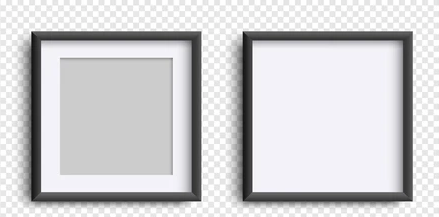 n. 框架, 构架, 骨架; 眼镜框; 体形; 体系, 体制; 帧, 画面 v. 给…做框; 诬陷; 表达; 环绕 |
| **timber** 【ˈtɪmbər】                                  | 1 - 来自古英语 timber,房屋，建筑物，来自 Proto-Germanic*timran,建筑物，来自 PIE*deme,建造，修建，来自 PIE*dom,屋子，住所，词源同 dome,domicile.后引申词义建筑材料，树木，木材，木料等。  n.木材;用材林;(用于建筑或制作物品的)树木;林木;(建筑等用的)木料;(建造房屋用的)大木料;栋木;(造船用的)肋材 vt.用木料支撑;备以木材 roof timbers（房檩（**lǐn**） |
| **lad** 【læd】                                         | n. 青年, 家伙, 少年, 情人 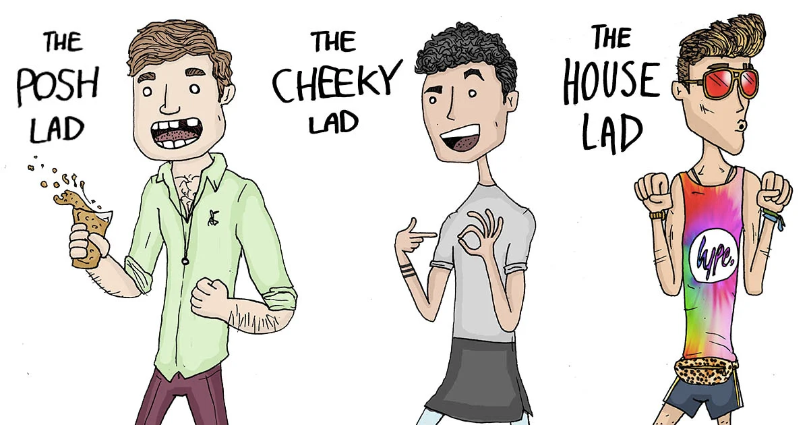 可能来自lead的过去分词，即被引导者，被带领的人，后用来指年轻的小伙。 |
| inter∙city                                                   | 城市间的，城际的，市际的(通常中途停站不多)  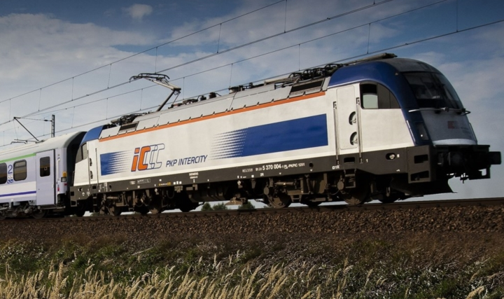 intercity travel |
| **fiss-ion** 【ˈfɪʃn】                                  | **`fiss-`** = to split, 表示“分裂”。源自拉丁语 findere (过去分词 fissus) "to split." **`-ion`** 表名词，“行为、动作、状态、过程、结果；物品”等。 (核)裂变，分裂;细胞分裂;裂体生殖;(化学键)断裂;裂变 Nuclear fission releases tremendous amounts of energy. |
| intrin∙sic                                                   | intro- 表示“向内，入内”。 secut-,sequ-,su-  = follow, 表示“跟随”。源自 拉丁语 sequi "to follow," sequester "follower." intrin-内在的 + sic-=seq-跟随，沿着 → 固有的，内在的。 |
| tapestry                                                     | n. 挂毯, 绒绣 vt. 用挂毯装饰 来自古法语 tapisserie,织锦，壁毯，挂毯，来自 tapiz,毯子，地毯，通过拉丁语借自希腊语 tapes,纺织品，布料，毯子，词源同 tape. |
| crook-ed                                                     | crook n. 钩, 弯曲部分, 坏蛋 vt. 使弯曲, 诈骗 vi. 弯曲 -ed 形容词后缀，加在名词后表示“如...的”；加在动词后表示“被...的”。 |
| **riddle**                                                   | riddle既可用作名词，指“谜”或“谜语”，有时也作动词用，表示“猜谜”或“解谜” She asked me a riddle. 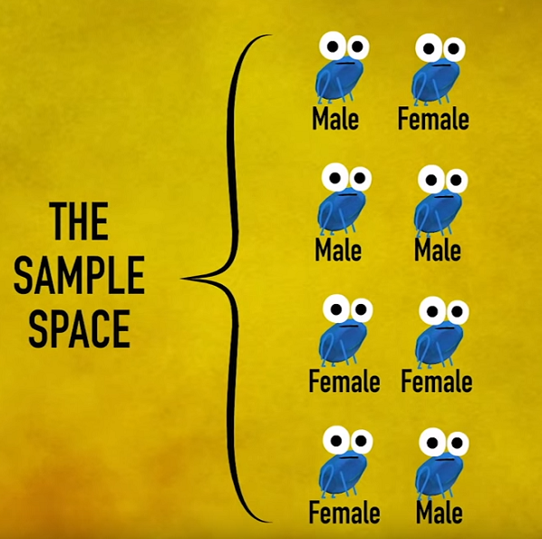 I know the answer to the riddle. 我知道谜底。 |
| **fung-us**                                                  | fung- 表示“真菌”，和表示海绵的单词 sponge 同源。 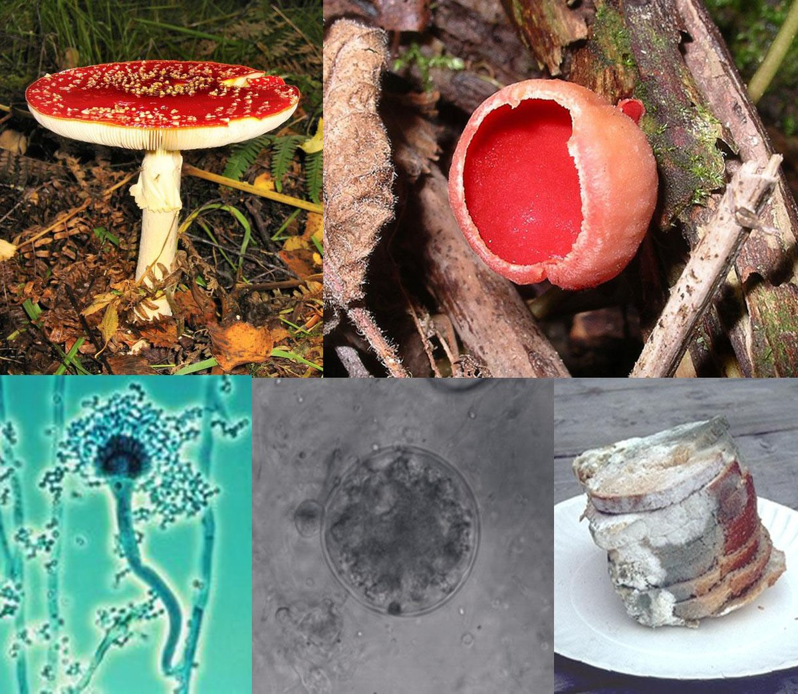 |
| **stout**                                                    | n. 浓烈黑啤酒, 矮胖子 a. 强壮的, 勇敢的, 坚定的, 结实的, 矮胖的 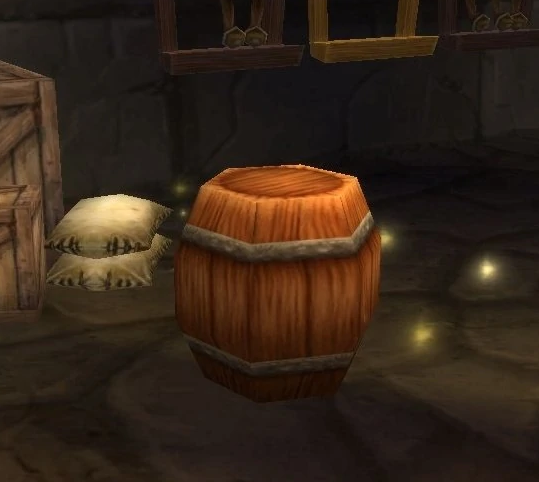 来自古法语 estout,勇敢的，狂暴的，骄傲的，来自 Proto-Germanic*stultaz,雄壮的，庄严的，沉稳的，来自 PIE*stel,放置，站立，词源同 stall,still.字母 l 软化为 u.词义贬义化为粗壮的，肥壮的。 |
| **sap**                                                      | n. 汁液; <喻>元气; 棍棒; <非正式>笨蛋; 地道 v. 使虚弱; <古>逐渐破坏 1 - 来自古英语 saepm,来自 Proto-Germanic*sapam,来自 PIE*sab,液体，汁液，来自 PIE*sap,品尝，品味，词源同 savor,insipid. 2 - 来自中古法语 saper,挖地道，来自拉丁语 sappa,铲子，词源可能同 spade,铲子。其比喻义削弱，破坏可能受上一词义影响。 |
| **rinse** 【rɪns】                                      | n. 清洗, 染发, 染发剂 vt. 以清水冲洗, 漱, 漂清 vi. 被漂净 【过去分词：rinsed；现在分词：rinsing；第三人称单数：rinses】 范围：六级,GRE,雅思 单词笔记   ［添加］ 词源说明(童理民)   1 - 来自中古英语 rinsen,冲洗，来自古法语 rinser,冲洗，来自 Proto-Germanic*hrainisona,清洁，净化，来自 PIE*krei,ker,分开，筛选，词源同 riddle,crisis. |
| **outlying**                                                 | outlying :a. 在外的, 边远的, 偏僻的, 题外的                  |
| **defiance** def∙i∙ance                                 | defy  vt. 藐视, 挑衅, 使落空 n. 挑战 -ance  表名词，“性质，状况”，一般缀于动词后。 |
| **tread** 【tred】                                 | 踩;踏;践踏;走;踩碎 n.步法;步态;脚步声;(轮胎的)**胎面**;外胎花纹;(台阶或楼梯的)踏步板;梯面;踏面 过去式： **trod**过去分词： **trodden** 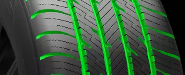 古英语 tredan "to tread, step on, trample; traverse, pass over." |
| **aerosol** 【ˈerəsɑːl】                                | **`solv-,solu-,solut-`** = loosen, 表示“松开”。源自拉丁语 solvere "to loose, untie." **`aero-`** = air, 表示“空气，充气”等。源自希腊语 aer "air."   气溶胶;气雾剂;(喷油漆、头发定型剂等的)喷雾器，雾化器  |
| **tuck** 【tʌk】                                        | n. 褶; 去赘皮手术; 食品, 零食 v. 塞进, 折叠, 卷起; 把…藏入, 收藏; 用…盖住 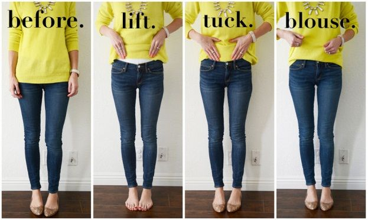 来自中古荷兰语 tucken,卷起，折起，来自 Proto-Germanic*teug,拉，推，PIE*deuk,拉，推，词源同 duct,tug.后用于指把裤脚折边，塞进。 She tucked an unruly lock of hair behind her ear.她把一缕不听话的头发撩到耳后。 Jack tucked his shirt in. |
| **blouse** 【blaʊs】                                    | 衬衫;(女式)短上衣 A piece of clothing like a shirt, worn by women   **a big girl's blouse** 懦弱的男人；胆小不自信的男人 |
| **haul** 【hɔːl】                                       | vt. 拖;(用力)拽;用力缓慢挪动到(某处);强迫(某人)去某处； n. 大量非法物品;很高的得分;旅行的距离;旅程   来自中古英语halen,拉升，抬高，原指航海时升帆，拉索，可能来自PIE*kel,叫，呼喊，词源同call,claim.引申词义水手升帆时喊的号子。或来自PIE*kel,升起，举起，词源同hill,excel.后词义由向上拉扩展为向前拉，运输，搬运等 |
| **mesh** 【meʃ】                                        | n. 网孔, 网丝, 网眼, 网状物, **圈套**, **困境**，陷阱, 啮合 vt. 以网捕捉, 啮合, 使缠住 vi. 落网, 相啮合 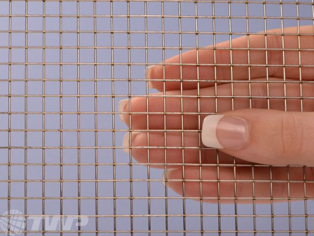  来自古英语 max,网，来自 PIE*mezg,纺织，编织，可能来自 PIE*meik,混合，词源同mix,miscellany. |
| **fringe** 【frɪndʒ】                                   | n. 边缘, 端, 流苏, 穗, **刘海儿**，(沿…边缘的)一排(树木、房屋等) vt. 加穗于, 加饰边于 a. 边缘的, 附加的 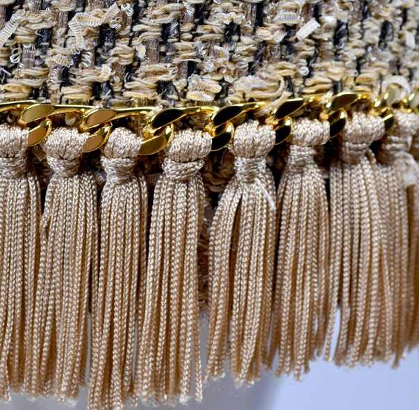 |
| **drape** 【dreɪp】                                     | vt.将(衣服、织物等)悬挂，披;遮盖;盖住;装饰;使(身体部位)放松地搭在…上 n.(厚长的)**帘子，帷帘，帷幕**  In US English, *[drapes](https://daily.wordreference.com/2020/09/17/intermediate-word-of-the-day-drape/)*, most commonly in the plural form, are a type of curtain (in the UK, we only use “curtains” for this). It is also the way in which a piece of fabric or clothing [hangs](https://daily.wordreference.com/2019/09/19/intermediate-word-of-the-day-hang/). As a verb, to *drape* means ‘to cover or adorn with cloth,’ ‘to adjust a piece of fabric into graceful folds,’ or ‘to let something hang or fall carelessly.’ In medicine, to *drape* means ‘to surround a part of the body that’s being examined or operated on with cloth.’ |

### Kast

###  river & arrive &rival

- **arrive（到达）：水路运输中船只抵达河岸**

  英语单词**arrive**（到达）与**river**（河流）有关系吗？没错，它们其实是同源词。

  古代交通不发达，公路很少，所以天然形成的河流及大洋是非常重要的交通途径。英语单词**arrive**（到达）就与古代的水运方式有关。

  **arrive**源自拉丁语arripare，由ad+ripa组合构成。ad表示toward、 near（靠近），因为后面的ripa以r开头所以改写为ar；ripa表示“河岸、海岸”，如英语单词**riparian**（河边居民）。

  英语单词**river**（河流）与**arrive**同源，它源自拉丁语riparius（河岸的）。

  - arrive：[ə'raɪv] vi.达到，达成。记：ar（=ad，靠近）+rive（river的岸边）→靠岸
  - arrival：[ə'raɪv(ə)l] n.到达，到来，到达者
  - river：['rɪvə] n.河，江
  - riparian： [raɪ'peərɪən] n.河边居民，河岸拥有者adj.河边的

- **rival（对手）：在河两面争夺河水的人**

  英语单词**rival**和**river**（河流）同源，来自古拉丁文rivalis，本意是“河对面的人、共饮一江水的人”。

  在古代，围绕一江一河往往会展开激烈的争夺，由近邻演变为对手。所以当rivalis借道法语进入英语并演变为rival时，很快被赋予了“竞争对手、敌手”的含义。

  - rival： ['raɪvl] n.竞争对手，敌手adj.竞争的v.竞争
  - rivalry： ['raɪvlri] n. 竞争；对抗；竞赛
  - rivalrous： ['raɪvlrəs] adj. 敌对性的；有竞争性的
  - unrivalled：[ʌn'raɪv(ə)ld] adj. 无与伦比的；无敌的
  - river： ['rɪvɚ] n. 河，江

## 奇怪的知识又增加了

### Hat Trick帽子戏法

Hat Trick帽子戏法。1858年，英国，板球手HH•斯蒂芬森在一场板球比赛中连续3次击中门柱得分，赛后兴奋的球迷们为斯蒂芬森买了一顶帽子作为奖赏，后来Hat Trick这个表达也被应用到水球、足球和手球等体育项目中的连续三次得分。世界杯决赛史上唯一的帽子戏法是1966年决赛中，英国的赫斯特进了西德三球。

### treadmill & tread

1.treadmill ['tredmɪl] n.踏车，跑步机；单调的工作。tread n.&amp;v.踩踏，与单词trap [træp] n.陷阱；圈套，vi.设陷阱，有关。mill，磨坊。机械引入前，欧洲的磨坊用人力或畜力驱动磨面机，有时被罚做苦役的囚犯也被迫做这项没完没了及其枯燥的活。可是现在很多人在健身中心的跑步机上花钱做同样的事情。 

2.tread [tred] n.踏；胎面；步态；鞋底；踏板；梯级，v.踩；踏。这个单词与trap n.陷阱；圈套，v.诱捕和trip n.&amp;v.旅行；绊倒以及trampe v.流浪；踩踏等有关。美国独立战争期间，Christopher Gadsden设计了一个以美国特有的响尾蛇为图案的黄底旗帜，蛇下方的文字为：DON'T TREAD ON ME.寓意要反击英国。
