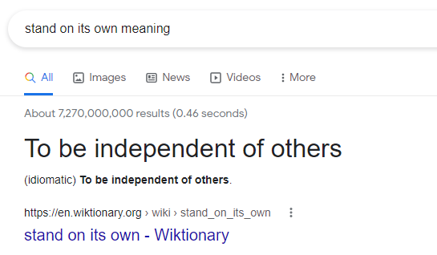

# 听写经验教训

## 69-03 Rewrite Page

| 时间      | 次数 | 备注 |
| --------- | ---- | ---- |
| 2022-1-10 | 5次  |      |
| 2022-2-21 | 5次  |      |
| 2022-4-12 |      |      |

### 重点词汇

| 英文                                                         | 中文         | 解释                                                         |
| ------------------------------------------------------------ | ------------ | ------------------------------------------------------------ |
| **Jane Eyre **                    【dʒeɪn ɛr】          | 简爱         | 通篇文章有一个高频的词汇是 **Jane Eyre**贯穿全文，我因为不知道，虽然大致推断出这是一个作家或者小说，但是总觉得隔了一层什么。 |
| **[Antoinette](https://en.wikipedia.org/wiki/Antoinette)** 【ˌæntwəˈnɛt】 | 安托瓦内特   | **Antoinette** is a given name, that is a diminutive feminine form of [Antoine](https://en.wikipedia.org/wiki/Antoine) and [Antonia](https://en.wikipedia.org/wiki/Antonia_(name)) (from Latin *Antonius*). （这是安东尼和安东尼娅的女性昵称） 文章里面，男人的论文是基于《海藻无边》，该书的主角就是 Antoinette. |
| **Wide Sargasso Sea**                                        | 《海藻无边》 | Sargasso Sea本意是大西洋上的一个洋流                         |
| draw the line                                                | 划清界限     | 划定界限;划清界线 reasonably object (to) or set a limit (on) Where do you draw the line between genius and madness? 天才和疯狂之间如何划界呢？ |
| [Jean Rhys](https://www.google.com.hk/search?newwindow=1&sxsrf=APq-WBtgXlWP7VAug_myPMZ6vbU5LfBPPA:1649753208845&q=Jean+Rhys&stick=H4sIAAAAAAAAAOPgE-LUz9U3MM5ILypQ4gAxC02Ny7RkspOt9JPy87P1y4syS0pS8-LL84uyrRJLSzLyixaxcnqlJuYpBGVUFu9gZdzFzsTBAAAzT39XSQAAAA&sa=X&ved=2ahUKEwjRkOvPkY73AhVEplYBHcVVD7EQmxMoAXoECHIQAw) |              | 《海藻无边》的作者，于1960年代写了这本书且获得了文坛认可     |
| **West Indes** 【west ˈɪndiz】                               | 西印度群岛(  | 西印度群岛(位于加勒比海和大西洋之间，包括安的列斯群岛和巴哈马群岛) a group of islands between the Caribbean and the Atlantic, that includes the Antilles and the Bahamas |
| parallel(s) 【ˈpærəlelz】                               |              | If something has a **parallel**, it is similar to something else, but exists or happens in a different place or at a different time. If it has **no parallel** or is **without parallel**, it is not similar to anything else. |
| **have Ven**                                                 |              | **语气助动词 + have Ven** 表猜测： Maybe Rhys would've written a similar book anyway. |
|                                                              |              |                                                              |

### 全文

Just can hear a rough taking between the professor and student. Student write a novel by referring Jane Eyre, but he didn't have any further discussion about Jane Eyre, so the professor suggests him to re-write the page?

- P： I'm gong to suggest you rewirte this page, Rong?

- S：That's bad, huh! 

  > 这里听成了 no bad, huh! 感觉学生听起来有点相当自信的意思

- P： Actually, not bad at all. your paper is very well written, but it has a major problem. One that we need to talk about. The novel you wrote about.  The Wide Sargasso Sea, you know that's based on another novel, right?

  > The why the socres are C? Your novel is based on another novel, right?

- S: Yeah, it based on Jane Eyre. 

- P: Right, so, why didn't you discuss Jane Eyre in your paper?

- S: Well....I've never read Jane Eyre, but I aslo thank that  **The Wide Sargasso Sea**  can stand on its own... 

  > 这里有个固定搭配： stand on its own 是我从未听过的，因此反复听力10来次未能听懂。最后在百度翻译等帮助下逐渐推断出来。 
  >
  > 
  > 这个成语应该是  **[stand on your own (two) feet](https://dictionary.cambridge.org/dictionary/english/stand-on-your-own-two-feet)**  的简写形式
  >
  > - After that, the Jin forces dared not cross the Yangyze River and the Southern Song could **stand on its own feet**.  此后，金军不敢轻易渡江，南宋朝庭得以立足江南。

- P: I don't think anyone would dispute that. Jane Rhys is a wonderful author, and if we're just reading a book for fun. But if you would wirte an acdemic paper on this book, well, I don't think you can do that without acknowledging Jane Eyre.

- S: Ah, I not sure, I mean, because \*** really,  ~~it~~ isn't every book that's ever been written and influenced by other books , so...like.. it difficult to know where <u>to</u> draw the line. 

  > - influence可以做动词....
  > - 中间打※的那段说的飞快，带有情绪，很难听的动

- P: But we're not talking about **subtle** influences in this case.

  > subtle: 我听的出来很熟悉，但是不知道什么意思。。。。一开始以为是sudden,或者suddle,或者saddle....

- P: ~~You should hear~~ The issue here is a very concreat case of one writer basing her book directly on another book, and the very famous one of that.

- S: But [Jane Rhys](https://en.wikipedia.org/wiki/Jean_Rhys) didn't just re-write  Jane Eyre, did she?

  > 这里牵涉到文学只是, Jane Rhye这个人写了一本叫《海藻无边》（*Wide Sargasso Sea*）的书，描述了简爱的前传

- P: If you read Jane Eyre, you'd know that ~~what we still was~~ Rhys did was , in a sense, she re-invented it by writting it from the point of view of the secondary character in Jane Eyre.

  > In a sense: 在某种意义上;从某种意义上说;从某种意义上来说;就某种意义来说;在某种意义上说
  >
  > What we still was <==> What Rhys did was, 真尼玛离谱

- P. Antoinette, the main character that you wrote so much in your paper, she's just a minor character in Jane Eyre, someone we hear about but hardly ever see.

- P. So do you think Rhys would've written The Wide Sargasso Sea, if Jane Eyre had never been written?

- S: I don't know, I mean, I saw a lot of ~~paralle~~ parallel between Antoinette and Jane Rhys, they were both born in the ~~Western D?~~  West Indies  and then moved to England as a young woman

  > Westin D：这个词也是从未听说过的，查了字典才知道是：
  >
  > **West Indes [west ˈɪndiz]**: 西印度群岛(位于加勒比海和大西洋之间，包括安的列斯群岛和巴哈马群岛) a group of islands between the Caribbean and the Atlantic, that includes the Antilles and the Bahamas
  >
  > **paralles**: 应该是复数形式，但是音频里面真真切切没有任何复数形式。(尤指不同地点或时间的)极其相似的人(或情况、事件等);相似特征;相似特点;(地球或地图的)纬线，纬圈。 If something has a **parallel**, it is similar to something else, but exists or happens in a different place or at a different time. If it has **no parallel** or is **without parallel**, it is not similar to anything else.

- Maybe Rhys would've written a similar book, anyway. 

  > 语气助动词 (modal auxiliaries )三种用法：
  >
  > - 表达义务、意愿、责任、能力、许可: Might I ask a big favor of you?
  > - 非事实语气 ( 虚拟语气？）: If I were boy
  > - 猜测用法（条件语气？）**语气助动词 + have Ven** 表猜测: 
  >   - That would have been the mailman just now; I found some new mail in the box.（猜过去）

- Then why didn't she just base Antoinette on her own life , why use the character someone else invented?

  > 灵魂四问

- And isn't there more to ~~the~~ this setting ~~that~~ and just where the author ~~happened~~ happens to come from?

  > that原来是and，构成并列句。。。
  >
  > where the author happens to come from 这句话真尼玛的难以理解是什么意思！首先是对**happen to** 这个短语不理解：
  >
  > **happen to**: 发生在…身上 / **碰巧**：
  >
  > - You don't **happen to** know his name, do you?  你不会碰巧知道他的名字吧？
  > - Did you happen to see her leave last Wednesday? 上周三你有没有碰巧看见她离开？
  > - If you **happen to** talk to him, leave him call me. 如果你碰巧能和他说话，让他给我打个电话。
  > - I **happen to** be an aficionado of the opera, and I love art museums.  碰巧我是个歌剧迷，而且我爱去艺术博物馆。
  > - I **happen to** have the official statistics with me. 我身边恰好有官方的统计数字。
  >
  > 整句话需要结合上面那两句疑问：（为什么作者Rhys不把Antoniette的背景建立在她自己的人生经历上，）这样做岂不是有更多（作者更了解的）背景（Isn't there more to the settings), 以及作者碰巧也来自那里。
  >
  > 然后查了一下  Jean Rhys 是来自加勒比海岛多米尼加：Jean Rhys, CBE was a British novelist who was born and grew up in the Caribbean island of Dominica. From the age of 16, she was mainly resident in England, where she was sent for her education. 海藻无边的故事大多设定定牙买加（Jamaica),牙买加距离加勒比很近。
