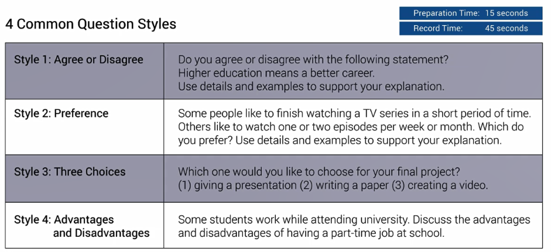
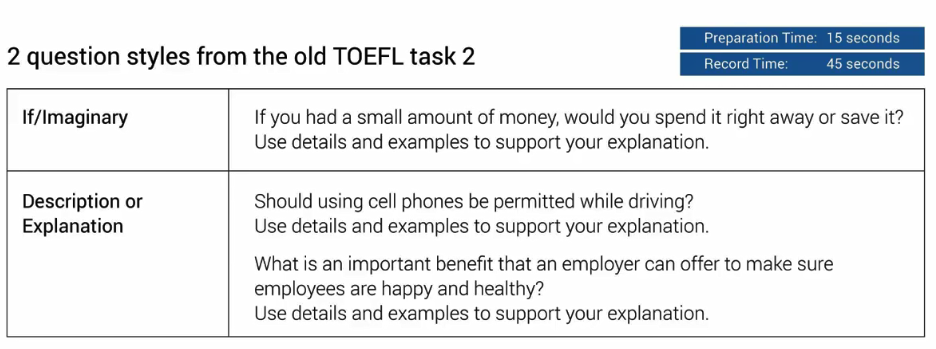

# Master TOEFL Speaking Task 1

[toc]

New TOEFL Speaking Guide by BestMyTest, Dennis.

## Common question styles

> 4x Common question styles on the TOEFL speaking 1

###  4 Common Question Styles

### 2 question styles from the old TOEFL task 2

## Speaking templates 

> 2x Speaking templates for the TOEFL tasking 1 

## Sample answers

>  4x Speaking sample answers

## Grading Rubrics 

> How the TOEFL speaking task is grade.

#### robust（强壮的）：用作建材的红色硬木

古代罗马人发现一种颜色发红的橡木质地特别坚硬，因此广泛使用这种橡木作为建筑材料。这种橡木在拉丁语中称为***rubus***，来自***ruber***（**red**，红色）。

***rubus***的形容词是***robustus***，本意是“***rubus***做的”。由于rubus特别坚硬，因此**robustus**也就衍生出“坚硬、强壮，像橡树一样”的意思。英语单词**robust**就来源于***robustus***。

英语中表示“红色”的词根**`rub-`**同样来自拉丁语***ruber***（红色）。

- rub-：红色，红色的
- red： [rɛd] n. 红色，红颜料；赤字adj. 红色的
- robust： [rə(ʊ)'bʌst] adj.强健的，强壮的，粗野的，粗鲁的
- ruby：['rubi] n. 红宝石；红宝石色adj. 红宝石色的vt. 使带红宝石色
- rubicund：['ruːbɪk(ə)nd] adj. 红润的；透红的
- **rubric**： ['rubrɪk] n. 红字标题；红色印刷；题目 adj. 印为红字的

