# 阅读经验教训

[toc]

| 用时                 | 准确率 | 日期     |
| -------------------- | ------ | -------- |
| 17分钟（建议14分钟） | 50%    | 2022-1-7 |
|                      |        |          |
|                      |        |          |

**Pushback** is a [negative](https://www.collinsdictionary.com/zh/dictionary/english/negative) [response](https://www.collinsdictionary.com/zh/dictionary/english/response) to a change or a plan, often a [refusal](https://www.collinsdictionary.com/zh/dictionary/english/refusal) to [accept](https://www.collinsdictionary.com/zh/dictionary/english/accept) it.

There's been a lot of pushback from conservatives on this issue

##  Official66-2 Vision of the land

| 日期       | 题目                                                         | 用时   | 字数 | 准确率 |
| ---------- | ------------------------------------------------------------ | ------ | ---- | ------ |
| 2021-11-29 | [Vision of the Land](http://top.zhan.com/toefl/read/start.html?article_id=2461&scenario=13&type=2) | 缺失   | 666  | 80%    |
| 2021-12-13 | 同上                                                         | 25分钟 | 666  | 70%    |

**生词：**

| 单词                               | 解释                                                         | 单词                                            | 解释                                                         |
| ---------------------------------- | ------------------------------------------------------------ | ----------------------------------------------- | ------------------------------------------------------------ |
| **vantage** 【ˈvæntɪdʒ】      | 优势;平分后所获得的第一分                                    | **advantage** 【ədˈvæntɪdʒ】               |                                                              |
| **howl** 【haʊl】             | v.<怒号;呼啸;嗥叫;长嚎大声叫喊 n.(狗、狼等的)嗥叫，长嚎;喊叫声; (狂风的)啸鸣，怒号 | **howling**                                     | howling: 怒号的;猛烈的;很大的;极端的 a howling success(轰动的成就) She flew into a howling rage(她暴跳如雷。) |
| **wild** [waɪld]              | 自然生长的;野的;野生的; 天然的;荒凉的;荒芜的; 缺乏管教的;无法无天的;放荡的 | **wilder** 【ˈwaɪldər】                    | v. 使困惑, 使迷惑; 令走向歧途; <古>使迷路 【过去分词：wildered；现在分词：wildering；第三人称单数：wilders |
| **wilderness** 【ˈwɪldərnəs】 | 荒野;荒无人烟的地区;杂草丛生处 The Antarctic is the world's last great wilderness Their garden is a wilderness of grass and weeds. | **howling wilderness**                          | 荒僻的旷野;He found him in a desert land, and in the waste howling wilderness.   |
| **time-honored**                   | 历史悠久的；in compliance with a time honored custom; China is a country with a time-honored civilization and a land of ceremony and decorum. | **subdue** 【səbˈduː】                     | 制服;征服;制伏;控制;抑制，压制，克制(感情) Troops were called in to subdue the rebels. |
| receptacle 【rɪˈseptəkl】     | A **receptacle** is an object which you use to put or keep things in. **container; holder; vessel;** **= socket(1)** 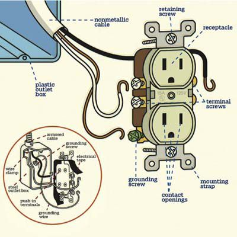 | **menacing** 【ˈmenəsɪŋ】                  | v.威胁;对…构成危险;危及 adj.威胁的;危险的;恐吓的 If someone or something looks **menacing**, they give you a feeling that they are likely to cause you harm or put you in danger. |
| **Puritan** 【ˈpjʊrɪtən】     | The **Puritans** were a group of English Protestants in the sixteenth and seventeenth centuries who lived in a very strict and religious way.清教徒 | **canopy** **canopies**  【ˈkænəpiz】 | (床、座位等上面的)罩篷，遮篷，罩盖;顶篷;天篷;(尤指森林里)天篷似的树荫;(飞机的)座舱盖 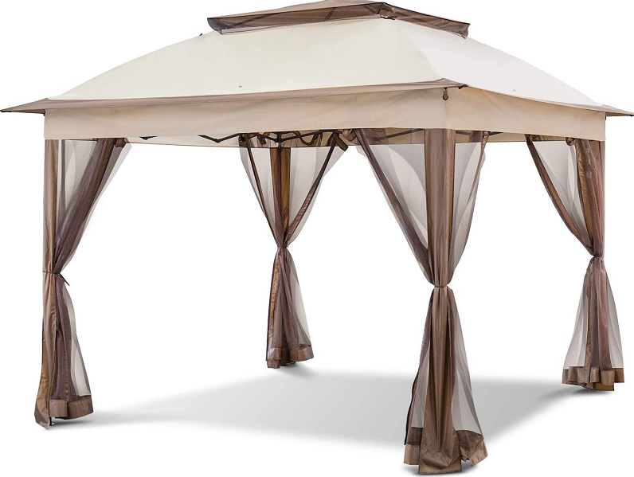 |
| **raccoons** 【ræˈkuːn】      | 浣熊;北美浣熊;浣熊的毛皮 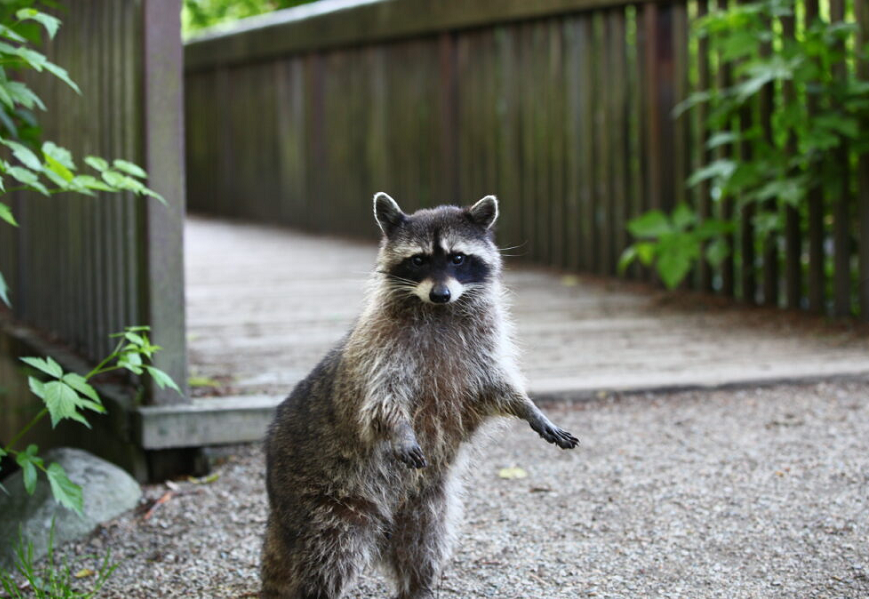 | **beaver** 【ˈbiːvər】                     | n.<海狸;河狸(水栖啮齿动物，加拿大的象征);海狸毛皮(用以制作衣帽);女子阴部 v.埋头苦干 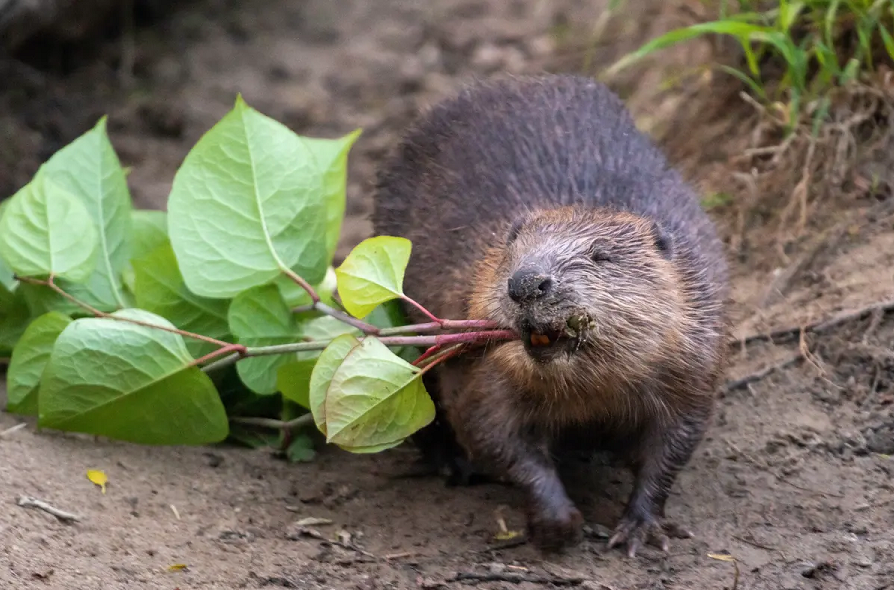 |
| **otter** 【ˈɑːtər】          | 水獭【 **tǎ** 】 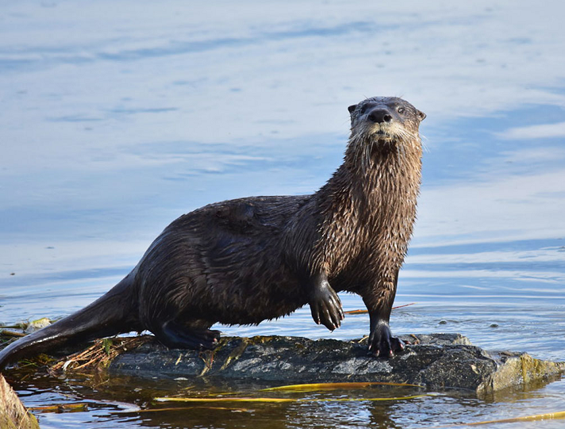 | **marmot** 【ˈmɑːrmət】                    | 旱獭 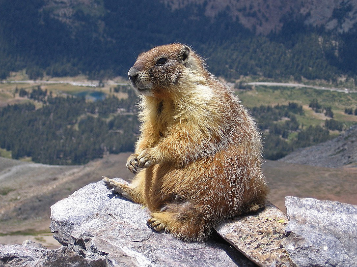 |
| **sea otter**                      | 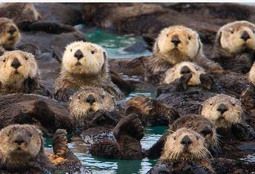 | **sloth** 【sloʊθ】                        | 树獭 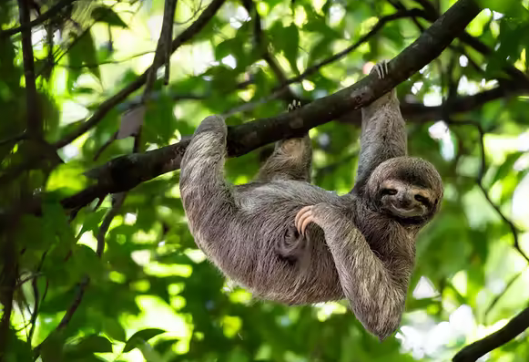 |

racoons, beavers, otters, 

- Native American visions of the landscape not surprisingly featured people living in harmony with nature, whose riches they celebrated in seasonal rituals and through time-honored practices. 在印第安人对自然景观的想象中，人们与自然和谐相处，他们通过季节性的仪式和历史悠久的实践来庆祝自然的财富。
- In contrast, the European colonists who intruded on this harmonious world often viewed it as alien and menacing 相比之下，入侵这个和谐世界的欧洲殖民者往往认为它是陌生的、具有威胁性的
- the initial Puritan settlement 最初的清教徒定居地
-  Rivers **could**, and often **did**, change course abruptly or flood during sudden rainstorms. 河流可能而且经常会突然改变路线，或者在突然的暴雨中泛滥。

### Vantage vs Advantage

An advantage is a benefit: “an advantage for me” means you’re getting something out of it.

You wouldn’t say it’s a vantage for me. Vantage refers to sight, more commonly a vantage point. For example, if you climb to the top of a hill, you have a good vantage point over the city

-  create sweeping vistas,

- have brought results neither anticipated nor intended. ？？？

- 【good】have reshaped the natural environment to meet their physical wants and spiritual needs.

- Native American visions of the landscape not surprisingly **featured** people living in harmony with nature,

- This remote, rocky, barren, bushy, wild-woody wilderness, a receptacle for lions, wolves, bears, foxes, racoons, beavers, otters, and all kind of wild creatures, a place that never afforded the Natives better than the flesh of a few wild creatures and parched Indian corn inched out with chestnuts and bitter acorns, now through the mercy of Christ [has] become a second England for fertility in so short a space, that it is indeed the wonder of the world

- In part,  （某种程度上） = to a certain extent =  to some degree=  in a way

  >  In a way it was one of our biggest mistakes

- Seeking to tame the land and to conquer their fear of it, generations of seventeenth- and eighteenth-century settlers nevertheless failed to gain the mastery they desired. 

- other human undertakings have brought results neither anticipated nor intended

- An undertaking is a task or job, especially a large or difficult one.

  > Organizing the show has been a massive undertaking

If you give an undertaking to do something, you formally promise to do it.
When he delivered his budget he gave an undertaking to increase spending on health.

- invariably ：To expedite travel and facilitate the shipment of agricultural produce, newcomers invariably built their homes along rivers.
- So, rather than adapting to their new land, the English either changed it by cutting trees, b、
- Microcredit is one example, in part because poor men seem to be more feckless borrowers than their female counterparts.
  如小额贷款，部分原因是贫困妇女相较贫困男性而言更为软弱

##  Official66-3 What is Coral

| 日期      | 题目                                                         | 用时                                   | 字数 | 准确率 |
| --------- | ------------------------------------------------------------ | -------------------------------------- | ---- | ------ |
| 2021-12-2 | [What is Coral?](http://top.zhan.com/toefl/read/start.html?article_id=2462) | 25分钟 （**25.8** words/ minutes) | 645  | 60%    |

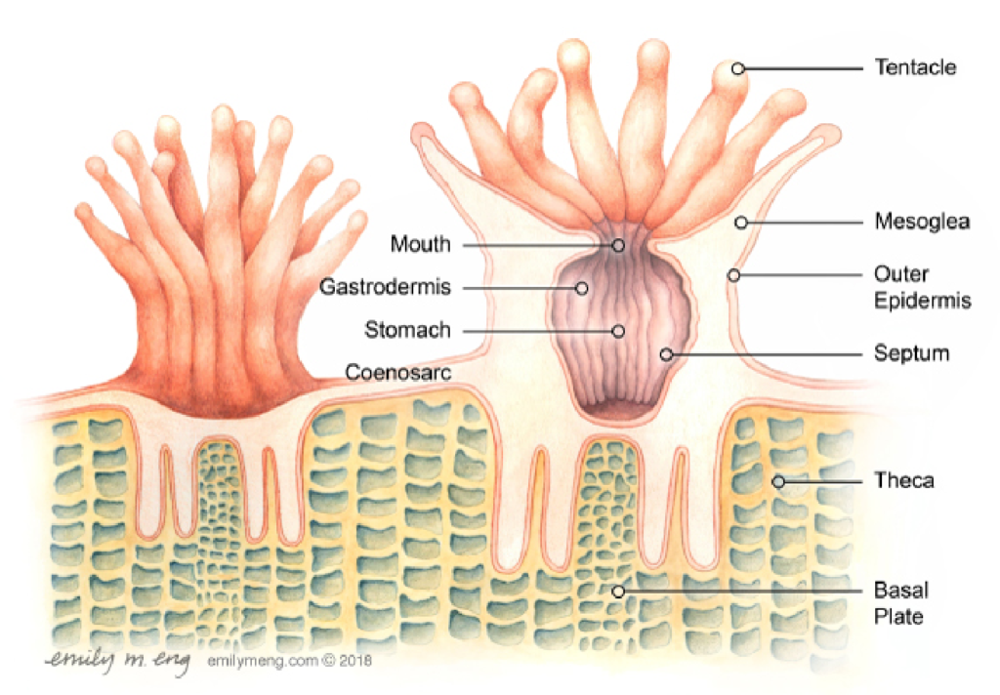

**生词：**

| 单词                                                         | 解释                                                         | 单词                                               | 解释                                                         |
| ------------------------------------------------------------ | ------------------------------------------------------------ | -------------------------------------------------- | ------------------------------------------------------------ |
| **polyp** 【ˈpɑːlɪp】                                   | 来自拉丁语 polypus,乌贼，章鱼，来自希腊语 polypos,乌贼，章鱼，来自 polys,许多的，pous,脚，词源同 foot.后用于指鼻息肉，因形如章鱼而得名。  息肉;(尤指)鼻息肉;(水螅型)珊瑚虫;水螅虫 | **poly** 【ˈpɑːli】                           | 同 polytechnic;(旧时英国的)理工学院(现在多已改为大学) In a poly plant, security is another problem. （在多晶硅厂，安全也是一个很大的问题。） |
| **coral polyps**                                             | 珊瑚虫;珊瑚蟲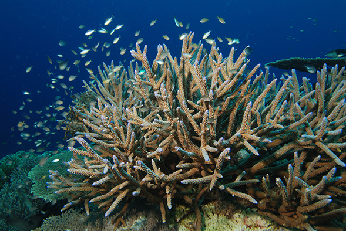 | **gorgonian** 【gɔː'gəʊnɪən】                 | 蛇发女怪（似）的；（与）柳珊瑚（有关）的  柳珊瑚；柳珊瑚目，珊瑚虫纲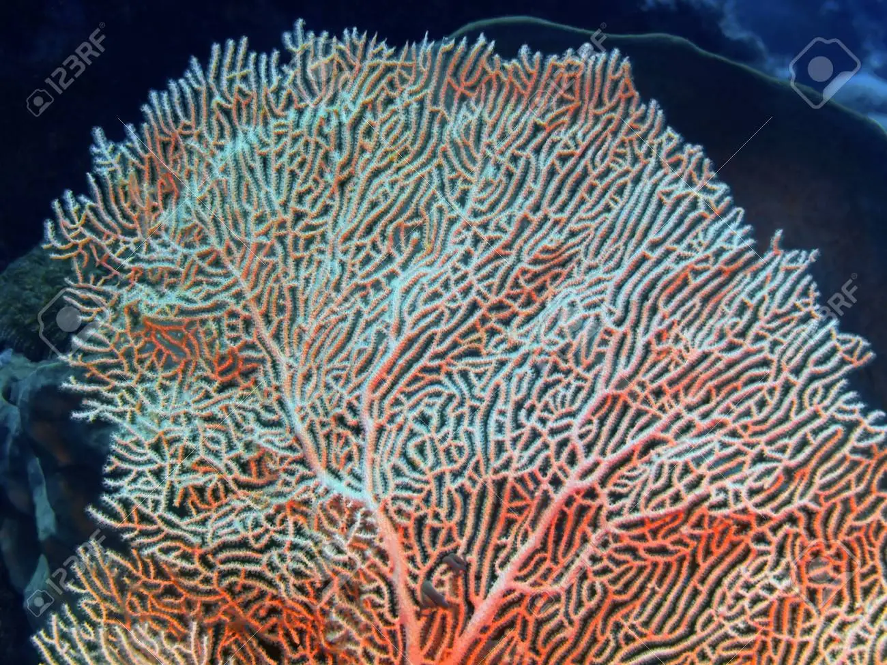 |
| **cnidaria** 【naɪˈderɪə】                              | an alternative name for the invertebrate phylum(无脊椎动物门的另一个名称) | **cnidarian** 【nɑɪ'deəri:ən】                | 腔肠动物;刺细胞动物;刺胞动物;动物门;胞动物 radially symmetrical animals having saclike bodies with only one opening and tentacles with stinging structures 放射状对称的动物，囊状身体只有一个开口，触手有刺状结构 |
| **Carbonate** 【ˈkɑːrbənət】                            | n.碳酸盐 vt.使与碳酸化合；给…充碳酸气；使化合成碳酸盐[脂]；把…烧成炭 a salt that contains carbon and oxygen together with another chemical（一种含有碳和氧以及另一种化学物质的盐） | **Caclium carbanate** 【ˌkælsiəm ˈkɑːrbənət】 | a white solid substance that exists naturally as chalk(滑石粉) , limestone and marble  (symb CaCO₃) (chemistry 化) 碳酸钙 |
| **vertebra** 【ˈvɜːrtɪbrə】 (pl. vertebrae)        | any of the small bones that are connected together to form the spine 椎骨;脊椎 | **vertebrate** 【ˈvɜːrtɪbrət】                | **`vertebra-`** = joint, vertebra, 表示“椎骨, 脊椎或连接处”，源自拉丁语 vertebra，和词根 vert-（转）同源，-bra 为拉丁语工具格。 -**`ate`** 表名词，“人或地位”。  脊椎动物(包括所有哺乳动物、鸟类、鱼类、爬行动物和两栖动物) / 有脊椎的，脊椎动物的 any animal with a backbone , including all mammals , birds, fish, reptiles and amphibians |
| **invertebrate** 【ɪnˈvɜːrtɪbrət】                      | 无脊椎动物；无脊骨的;软弱无能的any animal with no backbone , for example a worm | **invertebrate cnidarians**                        | 无脊椎动物                                                   |
| **hydorids** 【haɪdrɔɪd】                               | 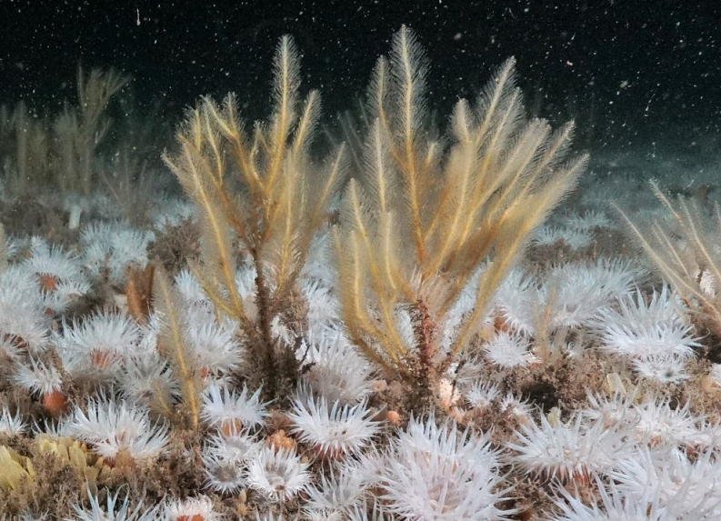 colonial coelenterates having the polyp phase dominant(以息肉相为主的群体腔肠动物) | **tentacle** 【ˈtentəkl】                     | **`tent-`**  = stretch, 表示“伸展”，引申为“倾向”等。源自拉丁语 tendere "to stretch, extend." **`-acle`**  表名词，“…物品，状态”。  触角;触手;触须;(大的地方、组织或系统难以避免的)影响，束缚，约束 |
| **anemones** 【əˈnɛməniz】                              | 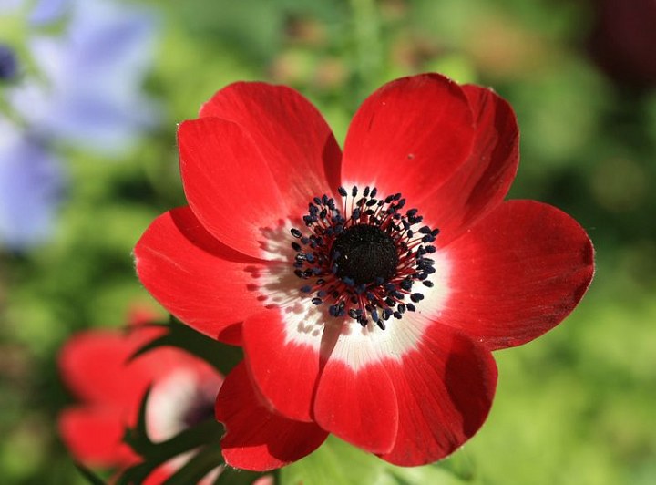 银莲花，风花(开杯形有黑心的白、红、蓝、紫花)a small plant with white, red, blue or purple flowers that are shaped like cups and have dark centres | **Sea anemone** 【ˈsiː əneməni】              | 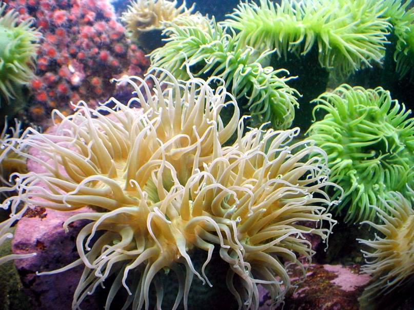 a simple, brightly coloured sea creature that sticks onto rocks and looks like a flower（海葵) |
| **nematocysts** 【nemətəʊˌsɪsts】 nemato-cyst 刺细胞;刺胞细胞 | **`nemato-`** = thread, 表示“线”。源自希腊语 nema "thread." **`cyst-`** = bladder, pouch, 表示“囊”, 医学上引申为“膀胱”。源自希腊语 kustis "bladder, bag" < "bellows." 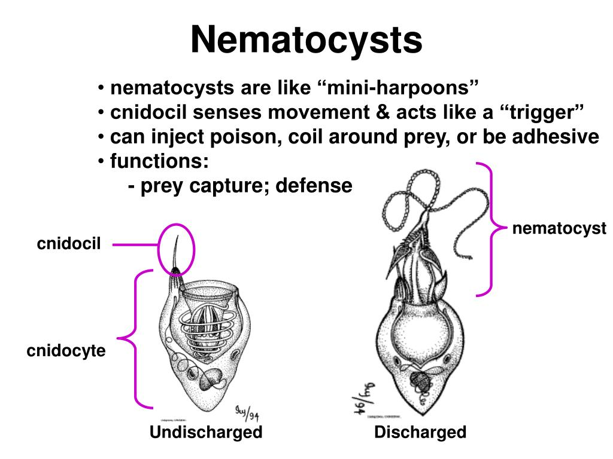 | **stinging cells**                                 | 刺细胞 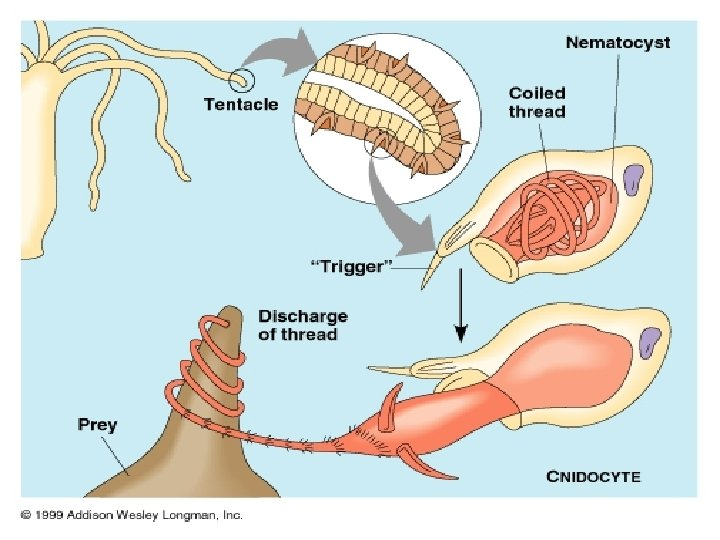 |
| **bud**                                                      | n.芽;苞;花蕾;半开的花;未长大的叶 vi.发芽                | **bud off** 【bʌd ɔːf】                       | 发芽；出芽                                                   |
| Sea whips                                                    | 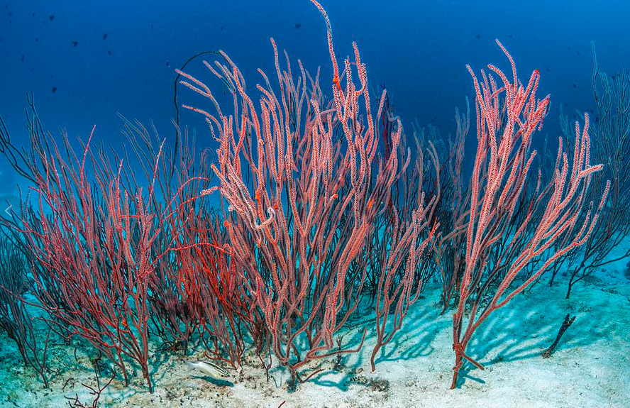 | Sea fans                                           | 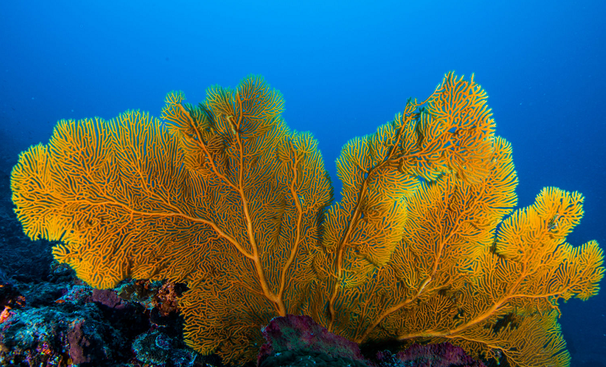 |
| **secrete** 【sɪˈkriːt】                                | vt. 分泌;隐藏，藏匿(小物件) to produce a liquid substance / to hide sth, especially sth small | **secret** 【ˈsiːkrət】                       | 秘密;秘诀;机密;奥秘;诀窍;奥妙                                |
| **amphibian** 【æmˈfɪbiən】 amphi-bi-an            | **`amphi-`** = both, 表示“两个，两种”，amphoter- 中的 -ter- 表示比较级。源自希腊语 ampho "both." **`bi-`** = life, 表示“生命，生物”。源自希腊语 bios "life." **`-an`** 表名词和形容词，“…地方，…人”。 两栖动物(的) |                                                    |                                                              |
| **microscopic** 【ˌmaɪkrəˈskɑːpɪk】                     | adj.极小的;微小的;需用显微镜观察的;使用显微镜的              | microscopic needle                                 | 我也不知道这是一个什么鬼                                     |

### Colonial organisms  群体生物

要理解为什么Colonial有包含群体、群落的意思有点困难。因为如果是直接查字典，不论网络上哪个字段都是表示殖民的意思：

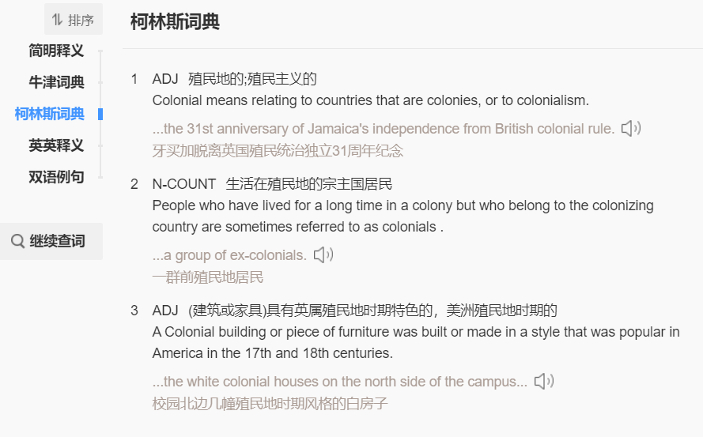

殖民给我的印象是不好的，都是帝国主义干的勾当，带有贬义色彩。实际上望文生义可以得出这个词当初应该是中性色彩。

[殖](https://baike.baidu.com/item/%E6%AE%96/4832682?fr=aladdin)：有生长，繁殖、增殖等多种释义。英文对应的有 breed, grow, multiply. 

> ⒈孳生：生～。养～。繁～。～民地。
>
> ⒉种植：“农～嘉谷”。
>
> ⒊兴生财利：货～（经商）。

《史记·货殖列传》其实就翻译为"**Colonization biography**"。

那么 Colonial 为什么会有群落的意思呢？ 这就要追溯到该形容的名词形态：Colony了：

**colony 【ˈkɑːləni】**

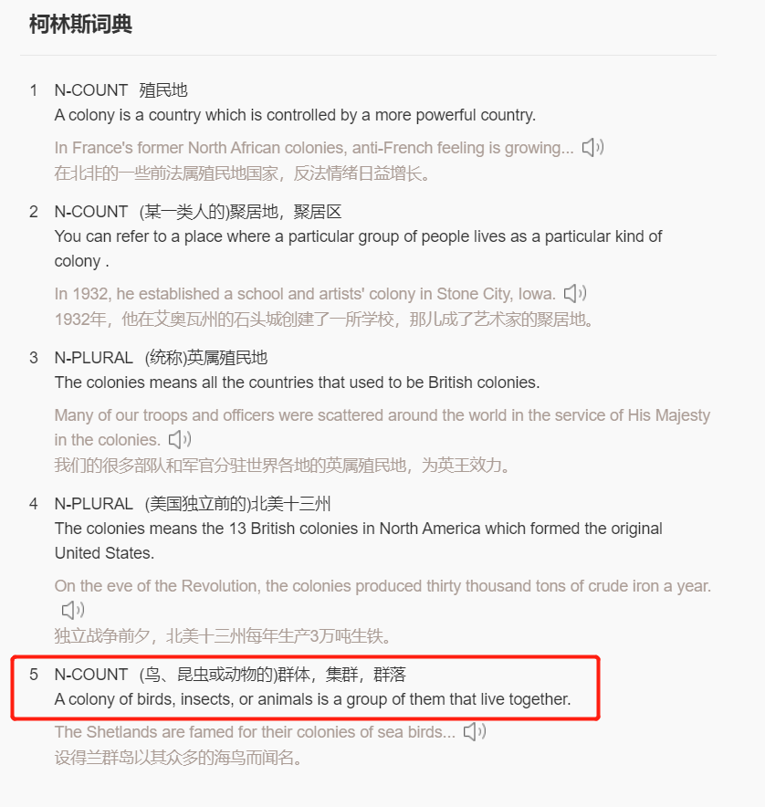

那么：Colonial organisms 解释为一群有机物在滋生，生长，繁殖，生物学界翻译为“**生物群落**”就不足为奇了

- **new polyps bud off the initial founding polyp**, and gradually colonies of thousands or even millions of polyps will grow, each connected to its neighbors by living tissue. 

  > **新的息肉从最初形成的息肉中萌芽出来**，并逐渐形成数千甚至数百万个息肉的群体，每一个都通过活组织与其邻居相连。

- **In isolation** a coral polyp looks very similar to a sea anemone, but unlike sea anemones, which live separated from each other, corals form colonies.

  > **单独来看**，珊瑚虫看起来与海葵非常相似，但与海葵不同的是，珊瑚虫彼此分开生活，珊瑚形成了群落。

- Coral reefs would not exist if it were not for the ability of coral polyps to **secrete** limestone or calcium carbonate.

  > 如果没有珊瑚虫分泌石灰石或碳酸钙的能力，珊瑚礁将不复存在。

- 

- **rather** like a glove coming part way off a hand

- ridges: the calcium carbonate crystals form ridges

- . Some form large **boulders**, where the polyps live in small, isolated depressions or **grooves** in the skeleton.

##   Official66-3 Timberline Vegetation on Mountains

[Timberline Vegetation on Mountains](http://top.zhan.com/toefl/read/start.html?article_id=3&scenario=13&type=2)

| 日期       | 数据                          | 备注                       |
| ---------- | ----------------------------- | -------------------------- |
| 2021-12-21 | 时间：25分钟 准确率：71% | 使用先看题再阅读的方式时间 |

在经过三次艰难刷题之后，察觉方法不大对，查阅知乎才知道应该要先看题目再刷题，速度和准确率都跟上来，剩下的就是重点词汇的复习。

| 单词                              | 解释                                                         | 单词                             | 解释                                                         |
| --------------------------------- | ------------------------------------------------------------ | -------------------------------- | ------------------------------------------------------------ |
| **tundra**       【ˈtʌndrə】 | 冻土带;冻原，苔原(树木不生，底土常年冰冻的北极地区)  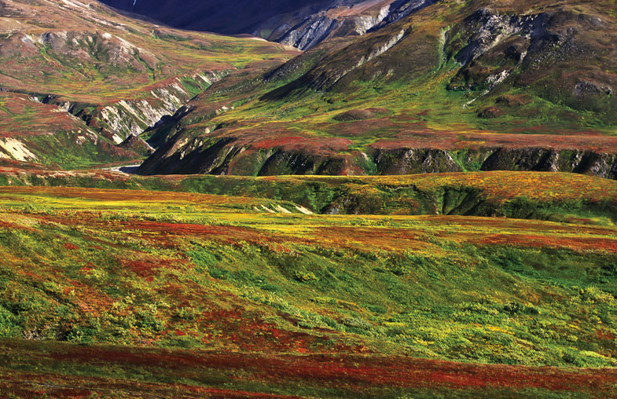 the large flat Arctic regions of northern Europe, Asia and N America where no trees grow and where the soil below the surface of the ground is always frozen. 来自俄罗斯语 tundra,来自北极某土著语言 tundar,沼泽平原。 | **steppe**         【step】 | 草原;(尤指东南欧及西伯利亚树少的)大草原;干草原。 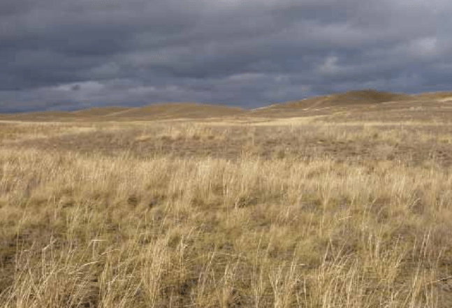 **Steppes** are large areas of flat grassy land where there are no trees, especially the area that stretches from ***Eastern Europe across the south of the former Soviet Union to Siberia.*** 来自俄罗斯语 step',大草原，尤指从东欧横穿苏联南部直至西伯利亚的大片地区。 |
| **deciduous** 【dɪˈsɪdʒuəs】 | **`de-`**  来自拉丁语介词形式 de, 表示“从，从...离开，从...向下，向下” **`cid-`**  = fall, 表示“落下，降临”。源自拉丁语 cadere "to fall, die." **`-uous`**  表形容词，表示“…的”，用于化学领域表示“亚酸的，低价（金属）的”。  每年落叶的：A **deciduous** tree or bush is one that loses its leaves in the autumn every year. |                                  |                                                              |
|                                   |                                                              |                                  |                                                              |

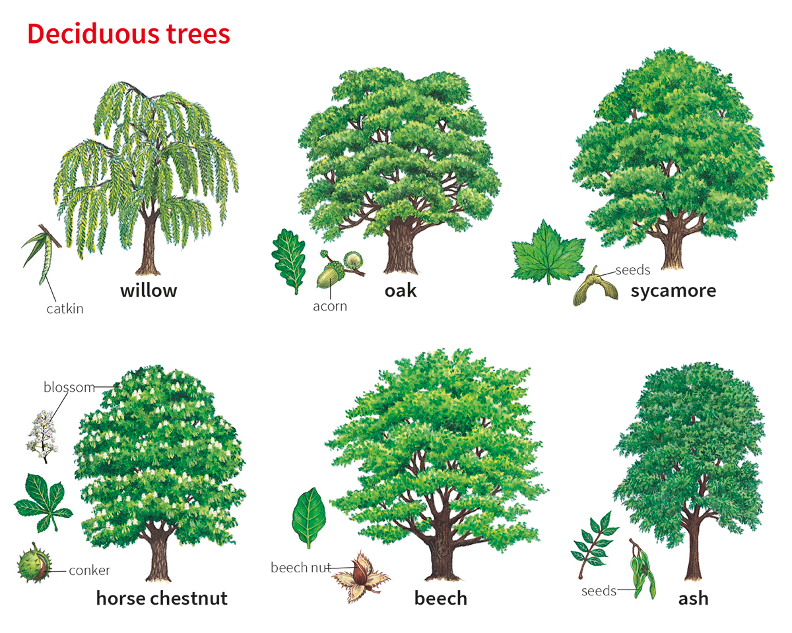

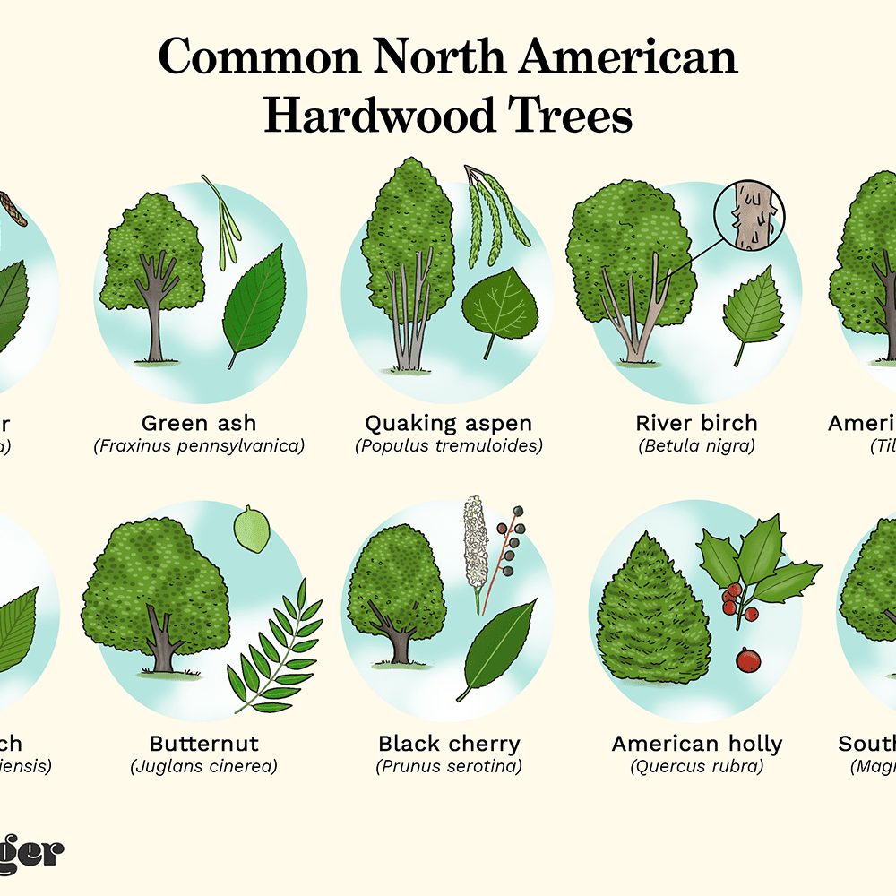

Wind velocity also increases with altitude and may cause serious stress for trees, as is made evident by the deformed shapes at high altitudes.

> C. The deformed shapes of trees at high altitudes show that wind velocity, which increase with altitude, can cause serious hardship for trees. [正确]
>
> D. Increased wind velocity at high altitudes deforms the shapes of trees, and this may cause serious stress for trees.[错误]

这道题是说 风速随着海拔增高而增加，导致树木受到严重的压力，而树木的变形就是前面提到压力的**证据**。

我选了D，D的意思是，在高海拔上出现的风力 扭曲了树木，从而导致了树木的承受压力。

D的问题出在 ：风速扭曲树木,进而导致树木承受压力； 而原题目的意思是：风速导致树木压力，而扭曲是这种压力的表现。所以说D是**把原文非主要成分变成主要成分，改变了原文的结构**。

Timberline

semiarid steppe 

deciduous trees?

deciduous trees (those that lose their leaves) 

There are some areas, however, where broadleaf deciduous trees form the timberline. 

 trees tend to attain greater heights on the ridges

velocity

altitude 

Too much snow, for example, can smother trees, and avalanches and snow creep can damage or destroy them

alpine 

The most striking characteristic of the plants of the alpine zone is their low growth form. 

##   Official63-1 The Sumerians and Regional Interdependence

[The Sumerians and Regional Interdependence](http://top.zhan.com/toefl/read/start.html?article_id=2495&scenario=13&type=2)

| 日期       | 数据                          | 备注                                                 |
| ---------- | ----------------------------- | ---------------------------------------------------- |
| 2021-12-22 | 时间：20分钟 准确率：60% | 题目两个关键字，一个印象不深刻，另一个和其他意思混淆 |

-  **Region** 单词和**Religion**单词混淆， 导致浏览题目寻求答案过程中遇到较大的预期偏差；

  > 这两个词很接近，阅读过程很容易造成概念性的混淆。题目问的是社会区域演变，宗教虽然穿插其中，但是明显是2个不同侧面 

- **inter-dependence**是 相互依赖;相互依存 的意思； **in-dependence**是  独立;独立(之日);自主;自立 （不依赖）的意思。单个单词看我肯定懂，放在长文中快速阅读就不一定理解，这就是阅读英文书和刷题的重要性。

- 

## Official65-1 The Pit Organs of Snakes

[The Pit Organs of Snakes](http://top.zhan.com/toefl/read/start.html?article_id=2463&scenario=13&type=2)

**neither...nor**草拟吗的 neither 可以被省略，或者被 **cannot**替换

Blindfolded, the snake **cannot** be guided by vision; **nor** is it guided by the sense of smell, for it will strike correctly even at a moving, cloth-wrapped electric bulb.

| 单词                                 | 解释                                                         | 单词                             | 解释                                                         |
| ------------------------------------ | ------------------------------------------------------------ | -------------------------------- | ------------------------------------------------------------ |
| **rattle-snake** 【ˈrætlsneɪk】 | vt. 使嘎嘎响, 使紧张, 喋喋不休 n. 嘎嘎声, 拨浪鼓, 喋喋不休的话 推荐： 拟声词，-le , 表反复。  词源说明(童理民)   1 - 拟声词，-le,表反复。 | **membr-ane** 【ˈmembreɪn】 | membr-膜 + -ane n. 薄膜, 膜, 羊皮纸  membr-  = limb, member, 表示“身体的一部分”。医学上会特指身体的一部分“膜”。 源自拉丁语 membrum "limb, member." 1 - 来自拉丁语 membrana,皮肤，membrum,肢体，四肢，器官，部分。 引申词义身体内的膜，植物的细胞膜。 |
|                                      |                                                              |                                  |                                                              |
|                                      |                                                              |                                  |                                                              |

- rattlesnake
- It is **thought** 不要看成 It is **though** 【ðoʊ】
- infrared 
- blindfold 初步推测：把眼睛蒙蔽起来？
  - **adj.**眼睛被蒙住的；盲目的
  - **n.** 眼罩；遮眼布
  - **v.**蒙住(某人)眼睛；无法理解
-  A variety of stimuli,
- membrane
- photochemical
- pigments 
- analogous 
-  Either the effect is photochemical, which means that the infrared radiation is absorbed by a specific compound, analogous to the light-sensitive pigments in the eye, or the pit organs are sensitive to the slight temperature rise caused when infrared radiation reaches it. 
- mammalian 
- stereoscopic
-  When infrared radiation falls on the facial pit organ, electric activity can be recorded from the optic tectum, the part of the brain with which the optic nerve is connected. 

## Official 65-2 [Early Research on Air](http://top.zhan.com/toefl/read/start.html?article_id=2475&scenario=13&type=2)

| 用时                 | 准确率 | 日期     |
| -------------------- | ------ | -------- |
| 17分钟（建议14分钟） | 50%    | 2022-1-7 |
|                      |        |          |
|                      |        |          |

receptacle  airborne 

most chemists left them unaccounted for until the beginning of the eighteenth century.  => left them unaccounted for ??

combustion respiration

pharmacists 

metallurgists 

incoercibility  “the incoercibility of gases will remove them from our researches for a long time to come.???

Hales was a botanist and chemist as well as a physiologist

staple

In devising this apparatus, Hales had coincidentally furnished an instrument for catching and holding air, which could then be subjected to various tests.

 Used in this way, the apparatus became known as the pneumatic trough.
