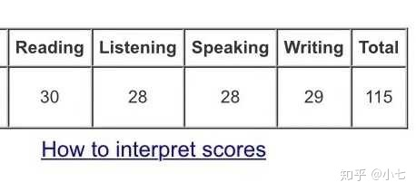
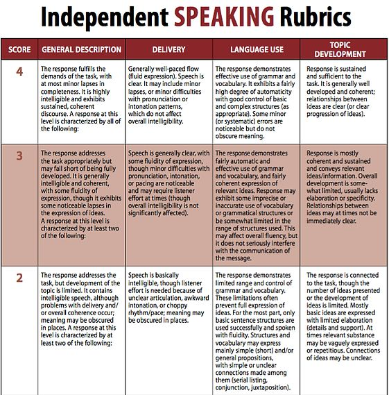

# 托福100+有哪些建议

[toc]

> 作者：小七
> 链接：https://www.zhihu.com/question/27244993/answer/834390633
> 来源：知乎
> 著作权归作者所有。商业转载请联系作者获得授权，非商业转载请注明出处。

--2020/7/4更新-- 谢谢大家对这篇攻略的肯定！评论和私信有很多小伙伴想要分享资料，在回答最下面更新了获取方法！！！希望对大家有帮助！

---以下为原回答--

谢邀，按照惯例先亮分，托福总分115分

**全篇字数一万➕，保证案例与细节齐飞，干货共细节一全。基本四个部分所有需要的重点，怎么做，做什么都讲清楚，托福备考，一篇就够啦！**

阅读满分，那先从阅读开始吧。

## 托福阅读

不多废话直接内核干货。诚意满满。

###  阅读考试内容

阅读是托福考试的第一部分，旨在测试**我们理解学术文章和段落的能力，这些文章大概接近大学水平。** 

考生有60-80分钟的时间来回答基于三到四个段落的问题。**每个托福阅读段落的长度大约为700字，接下来会有12-14个问题。**传说部分段落来自美国大学的教科书，无论如何，内容很学术就对了。

**那么会遇到哪些题型？**

知道考试中会发生什么当然是很重要的，这里我会介绍三种阅读中会遇到的题型，每种题型会附带官方范例和解题技巧（也就是大多数考试机构会教的内容）。

通常阅读部分中会遇到三种题型：

#### 1. Standard Multiple Choice

这就是最常见的四选一，也是托福阅读中最常见的问题类型。针对的考察内容会各有不同，有些会考整个段落的内容，有些针对特定句子或短语，或者特定单词的含义。

范例↓

**解题技巧**

每一个选项都要读。

这个点挺傻的，但是考试的时候经常会忘记，ETS很喜欢出迷惑性选项，如果读到某一项就选了，很容易错过正确答案，做题的时候要仔细分析各个选项之间不同的关键点，保证其他错误选项都能排除。

在文章中找依据。阅读中的问题一定能在文章中找到答案，ETS比较良心的一点是题目正好也是按照文章的段落顺序出的，所以依次去对应的段落寻找依据就好。

#### 2. Insert a sentence

每一篇文章都会有一道插入句子的题目。有四个不同的地方可以插入新句子，**我们就要找出句子最适合的位置。**

范例↓

**解题技巧**

很重要的第一点还是，要尝试每一种选项的可能性。

另外要理清相关段落中每一个句子的作用。

比如在范例中几个句子的作用就有总论点、阐释、反驳，另外还会遇到的比如举例子、分论点等等，插入的句子要符合原本段落的行文逻辑，即功能与前后句相同或相关，且正确位置不会改变原文内容或意思。

做题的时候关注连接词和代词，个人经验是代词的用处会更大一些，连接词的难度比较低，通常还是要分析代词和句子作用来理清逻辑。

#### 3. Reading to learn

通俗来说就是主旨题。**每篇文章的最后都是主旨题**，需要从六个选项中选出三个最能概括全文或题目意思的选项。主旨题占2-3分，选对部分可以部分得分。

范例↓

**解题技巧**

起初这类题型对我自己来说是错误率最高的。后来发现很容易出错的点是**被次要信息迷惑**。这类选项很容易在文章中找到支撑信息，但其实文章或段落的主要观点应该要比这类信息更隐蔽，需要更进一步的分析和总括。

预留足够的时间给最后一道题。个人经验是做最后一道题的时候常常需要回到原文纵览文章，如果太急的话容易遗漏信息，所以一定要留下时间回顾全文。

不是文章所有的部分都需要概括。比如首段经常只是引入，这部分的内容就不用纠结是否要包含在内，还有些段落只是作为转折或小段总结，也不是全文信息的重点。

###  备考策略

以上的内容是对阅读部分有了初步的了解，知道要考什么才能针对性地进行训练，系统性地备考后就能把上面的解题技巧融会贯通、熟练运用啦！

#### 扩充词汇量

**词汇量对托福考试的每个部分都很重要，但阅读部分能获得的增益效果最大**，我们熟悉一个单词，通常都是从看到单词并识别这一步开始的，其他section中需要考听力辨单词或需要自己输出单词，要求都会更高一些，但在阅读中输入和输出的[转换率](https://www.zhihu.com/search?q=转换率&search_source=Entity&hybrid_search_source=Entity&hybrid_search_extra={"sourceType"%3A"answer"%2C"sourceId"%3A834390633})是最快最高的。而且阅读中相当一部分的题目会直接考察单词意思，简单粗暴。

市面上单词书非常多，随便挑一本就行了（我瞎说的）。个人建议是不要选顺序版的，背起来非常枯燥，而且形近的单词都放在一起了，更容易混淆意思。按照单词出现频率排序的单词书会比较好，因为…多数情况我是背不完一整本单词书的，所以这样的排序至少保证我把前面的高频词都背完了哈哈哈

背单词的方法各人都有不同，我喜欢依靠app刷熟悉度，每个单词都会比较快地过一遍，记录下不熟悉的单词，然后再反复快速地刷熟悉度，一遍一遍筛，直到每个单词都过关；最后在考试前一个星期再过两遍全部的单词。这种方法的好处是再次遇到新词时能很快反应出意思，但是新词量的基数不能太大，否则还是要老老实实地强记一遍哒。

#### 练习阅读学术性文章

练习阅读最重要的还是要回到阅读本身，不过阅读的内容越接近考试水平越好。**托福阅读文章通常来自大学水平的学术书籍**，所以联系阅读的文本最好也是各科目的学术性文章。

我在国外的一些备考文章中看到过，可以找题目中有“Introduction” 或 “Beginning”的，比如Introduction to Psychology这种。我记得那会儿我正好在读牛津通识读本系列，虽然不是刻意为了备考托福，但可能歪打正着了哈哈。

**怎么读呢，个人不建议一次性大量阅读。那样信息量会非常大，也完全不像托福考试的模式了，有些本末倒置**。

每天只需要读main body中的一两页，阅读的同时花时间总结一下每一段的内容，作者在这一段中提出了哪些要点？使用了哪些论点或例子来支撑主要内容？如果有不认识的单词，核心的就翻字典查，非核心的，就锻炼一下通过上下文猜词的能力。

有一点想要提醒一下大家，个人觉得没必要强行记忆特定领域的词汇。这些专有名词在领域之外就不会遇到了，而且很可能翻译成中文也不知道是啥，重要的是理解文章所解释的机制和过程，花里胡哨的名词在脑中替换成ABCD就可以。

但是！！备考时间紧的话，这部分的阅读练习直接用TPO的考题就行，阅读和思考的步骤不变，**重点在于锻炼抓重点、做总结（和无视专业术语）**的能力。

#### 寻找适合自己的解题步骤

我看过很多种不同的解题步骤，每种都有各自的道理。有的会先浏览一遍考题，然后再读文章，这样对需要抓的信息点会有大致的把握；有的就直接开始阅读，因为提前阅读考题的话时间也许会来不及，这两种方法建议在练习的时候都尝试一下，个人感觉差别就在于阅读速度，看看怎样不需要过多的重复阅读。

我个人的方法属于歪门邪道，不通读文章也不通读问题，拿着考题直接开始做，因为阅读出题的顺序与文章一致，每道题会涉及的内容最多也就是一个段落（除了最后一道题），直接找对应段落来做题能帮我排除干扰信息，反而速度更快一些；而且这样我能预留更多的时间给最后一道主旨题（对我个人而言错误率最高的题型）。

这种方法大家也可以试试，我觉得运用的前提是对托福阅读的出题思路已经比较熟悉，能够很快找到题目相对应的段落，否则还是以常规的两种解题步骤比较保险。

#### 找准节奏

如果在每篇文章上花费相同的时间，那么每篇文章都会有20分钟的时间来回答12-14个问题，这个时间是非常紧的，所以节奏非常重要，要将解决一篇文章的时间细分到很小的时间节点，**比如花五分钟阅读整篇文章，一分钟回答每个问题**。

但是这个节奏也与不同的解题步骤有关，所以还是要在练习中摸索适合自己的节奏，但是一旦找到了一个节奏，考试就要严格按照这个节奏走，不然就很可能来不及做完所有题目。

#### 学会利用上下文

上下文的联系对于托福阅读来说非常非常非常非常重要。以词汇题为例，即使我们花了很多时间来扩展词汇量，考试的时候仍然可能会遇到不确定的单词。这时候就要通过通过上下文来填补这个词义空缺。

我个人的经验来说，其实词汇题并不常考非常难的单词，反倒是多义词经常出现，有时依赖自己的词汇量反而会出错。毕竟托福想考的还是我们对整篇文章的理解，而非单个单词的记忆。

除了词汇题，解决其他的题目也常常需要上下文来辅助，所以一定要多看看上面几句和下面几句啊！

#### 最后，使用行号

这是个很傻的tip哈哈，但是挺好用的，托福在一篇文章中每五行就会编个号，这就是一个导航，帮助我们节省时间找到对应的单词或句子。另外，也可以对照这个，看自己为了找一个答案，到底阅读了多少行。

通常一个问题的答案在五行内是可以找出答案的（除了主旨题），如果读了十行还没找到，就不要浪费时间继续往下啦，那些内容是留给后面的答案的=v=

想说的就这么多，其实我对阅读的准备并不多，最后能够考出高分也是因为平时专业中就在阅读很多类似于托福考试的学术文本，把考试练习内化到了平时的学习当中，总之多多阅读多做总结才是王道！

## 托福听力

听力确实是个磨人的小妖精，语篇长，话题学术，且无法提前看到题目（我们属鱼的可还能活）

个人觉得听力80%靠能力，20%靠技巧，相较于题型、笔记等，更重要的是如何练习提升听力能力，掌握了“术”之后，选择合适的“器”才能起作用。

如何判断自己的“术”是否精进呢？

先试着做一套题。

**考试通常包含三种听力材料，对话、学术讲座、包含讨论的学术对话。**

后面两种听力材料会稍难一些，可以先用难的测试一下自己。在自我检测的时候，主要考量以下几点：

> 1.听材料的时候，能否跟上节奏，把握每句的大致意思。
> 2.听完后，能否总结出材料的大致内容，不会出现大段遗忘的情况。
> 3.做每道题时，是否知道考点出自材料的哪一部分。
> 4.辨析选项时，能否有思路地排除错误选项or得出正确选项。

如果以上几点都能做到，可以直接去学习做题技巧，类似于笔记怎么记呀、题型有哪些呀，或者无脑刷题也不会有太大偏差（只是提升效率很低）。如果还做不到，建议从能力训练开始。

### 听力能力

训练方法有非常多，基本遵循着一种，坚持练习和有效反思，就能提升。

**我个人练习的方法：**如果第一遍做新题的时候没有一种掌控感（基本全都听清楚），就回去进行听写。如果有能力的话，强烈建议加快倍速，个人感觉坚持加快倍速真的很有用，如果长期习惯了1.5倍速（可以从1.2倍速起步），再听原速真的是感到相当幸福了，感觉是一字一句念给你听。

app上就有分句精听的功能，有全套的TPO听力材料（可能也许还是缺了一点点），且换句，调速更方便。这个就看自己喜好去下载就行。

当然练习的时候不必把自己限制在一个倍速内，如果某一句话在某一速度下听写有难度，可以逐步放慢速度，直到听清为止。

不过上面这个方法也有一个问题，可能某些句子听多少遍都听不懂。

这是因为，听力跟不上可能有几种原因。

> ①单词没有学过；
> ②单词发音对不上，可能句子中有连音，也可能自己学的是错的；
> ③句子结构太复杂，从句套从句就lost；
> ④材料篇幅太长，属鱼的记不住（比如我）

上面的听写方法只能应对后两种原因，对于前两种，不知道就是不知道，听不清就是听不清。

如果遇到这种情况，就需要在听写之前再加几个步骤。

在做了一遍新题后，先不要对答案，读原文script。

通读原文后，对照着题目找出每一道题的出题点，再做一遍题目（建议保留第一遍做的选项）。

此时，再对照答案，可以看出哪部分是因为“听不出”而选错的，哪部分是因为“听不懂”而选错的。

对于两类错误答案，在分析反思时应该有不同的处理。

如果是“听不出”，可以反复播放对应的听力段落，锻炼读音、连音、语句结构等导致出错的方面。

如果是“听不懂”，可以返回原文文本，积累不认识的单词。

说到这里，还有一点想提醒大家。**做听力时，并不需要每一个词语都能听懂。**

对于出题者来说，多数考生没有考试材料的背景信息，题目才算比较公平，所以许多学术背景的听力材料都会选择千奇百怪的知识点作为主题。

考试并不希望考生 understood before listening, 但考生应该 understood after listening. 所以，在练习时，不需字字句句都掌握（性价比也不高），**但是考点出现的相关句子一定要掌握。**

作者：小七
链接：https://www.zhihu.com/question/27244993/answer/834390633
来源：知乎
著作权归作者所有。商业转载请联系作者获得授权，非商业转载请注明出处。

### 题目反思

回到对于做过题目的反思（最重要，划重点）。

不反思，无进步，这一点对于能力提升非常非常非常重要。

个人的习惯是分析完当天模考题目之后再回去分析几篇之前出错的篇目（建议这一遍加快倍速，但量力而行）。认真做笔记。 听力结束后，先不要做题看题，先去看你的笔记。

这里说一说我总结出的一个方法，大家自己可以根据自己的习惯和喜好来尝试。

**一，看着笔记，根据对文段（lecture）的理解，先划结构。是总分，还是并列？等等。**

**二，（重点来了），猜题猜考点。**

拿笔把自己认为的，很有可能会作为题目出现的信息点标记出来，最好再猜一下考法。（有的时候不一定会是作为题目，这个信息点作为题肢或者是干扰项出现也是一种胜利），然后做题。看看自己是否猜的准确（用另一种颜色的笔标记）。

这样站在出题者的立场来做题，慢慢地会摸索出一些规律，不求所有的题目都踩对，但对重要节点会有更强的敏感性。

其他高人也总结过譬如开头、结尾、举例、对比、重复等节点容易出题，但我在做题时总是忘记，只能靠实践出真知了。

用这个方法，逐渐会感受到对材料的掌控，练到后期会比较舒服，已经很清楚题目要考的到底是什么，自己就不会再去附会或者是过度推理了。

如果有朋友像我一样是用电脑复习、做笔记的，建议听写和反思建一个文件夹就好，还可以根据每一句话分析错因（嗯很多时候错因是没听见），或者是对应到自己学到的方法，这样复习效率会高一些。

能力的问题讲完了，我们再来说说**技巧**。个人觉得听力能依靠的技巧不多，多数情况听力都是跟着材料的节奏走，技巧没有内化的话也基本用不上。不过有两点是我在练习时关注过的，内化后也确实有用。

### 题型相关

在教听力时，教给小朋友的就是区分题型的方法。

然后发现没什么用。

考试的时候也没时间区分题型，基本大部分题目就靠暴力拆解。

不过了解题型，对听材料时获取信息很有帮助，知道有哪些题型，就大概能够预判哪些语段内容会覆盖考点。

**托福听力大致有六类题型：主旨题、例子作用题、例子细节题、对比题、结尾题、重听题。**

主旨题基本开门见山，例子作用能在主要话题与展开讨论的转折处找到，细节和对比则在讨论过程中，结尾…就是结尾。

做题时不必遵照区分题型、运用解题方法的步骤来进行（也没这个时间），了解题型也是为了培养对信息的敏感度，听材料时知道哪些内容必须获取，做题时知道应该回溯哪一部分寻找答案。如果对题型的了解完全内化了，那么运用不同题型的解题技巧来答题也是可行的。

### 笔记相关

起初我对记笔记也感到非常无力。全力记下全部内容，后来发现做题的时候根本用不着笔记，也看不清自己写了啥，有时候还影响我集中注意力去听。后来干脆不记了，但分数不稳定，脑子记住多少都靠缘分。

后来换了一种方式，概括来说就是，**笔记只记重要的内容（逻辑上的因果转折并列等，例子，术语，观点态度），关注文章的结构（总分，线性，对比，并列等）**，如此笔记才能够派上用场。

什么是重点内容，联系刚才所说的题型，开头、举例、对比、转折、结尾等，容易出考点，另外也要靠能力锻炼时磨出来的敏锐度，把握到出题的共性。后期比较神的时候，听到某一段就会自动提起精神，自个儿提醒考点来了考点来了。

与此同时，结构对于做题也有帮助，因为无论是什么结构，每一小板块一般只有一道题。

关于不同类型材料的结构，在这里简单地总结一下

#### 1. Conversation

无论是男学生、女学生、男老师、女老师、图书管理员、食堂员工（这倒是没见过），对话一般都遵循这样的结构：

- 先打招呼，以示礼貌，长短不一，这部分不是很重要
- 其中一个人表明来意，可能是讨论问题的，也可能是处理事务的，偶尔会直接陈述，但通常以问题的形式抛给对方
- 两个人开始讨论如何处理这个问题。这里一般会有几个来回，他们可能先一起讨论一下当下形势（这个词有点大），然后提出一个方案。通常第一个解决办法不会直接被接受，因为接受了对话就结束了。所以就会有不接受的原因，以及进一步的讨论和解决方案
- 最后有一个可行的解决方案，然后两人可能道别（or not)

这几个步骤里，①很少出题，②④通常出一题，③出题点会多一些。

#### 2. Lecture

Lecture的出现形式，可能是教授一个人滔滔不绝，也可能有学生加入一起表演，但结构通常如下：

- 引入话题。有些教授会开门见山，也有教授废话多一些，委婉引入。然后教授抛出这堂课教授的主要内容，通常会有一小段定义。
- 详细讲解。通常教授会分点进行论述，个人经验，可以在这部分找到三个分点，并且会有例子对应。
- 简单总结。课堂最后的收尾。

那么对于Lecture，常见的出题点会出现在最初的话题引入、三个分论点、总结处出现。有时会再加一道单句重复的题目，

所以记笔记的时候，要锻炼自己整理结构的能力，小结构之间的转换，尽量用明显的符号分隔出来，这样做题回顾时才能尽快定位到需要的信息。

最重要的是，不要追求一字一句记录。

一旦记笔记影响到自己听下一句的内容，就马上停笔转到下一句，听完整材料内容是最最首要的。

听说读写中，个人觉得听力是最依靠真实能力的，即使有快速提升的方法，也仅是在能力提升的方法上比较讨巧，省却了无用功的时间。就坚持练习和反思吧，that’s the only magic.

## 托福写作

### 考试内容

托福写作是整个托福考试的最后一个部分，但实际上它综合了阅读和听力，并且需要比口语更加formal的输出。

简单来说，托福写作需要我们写出一个结构清晰、论据明确的论文，并在此同时考察我们对英语语法和词汇的掌握。

#### **具体考试内容**

托福写作部分持续50分钟，包含两个任务：综合写作和独立写作。

我们有20分钟的时间来完成综合写作任务，30分钟的时间来完成独立写作任务。

完成考试后，作文将由几名（通常是四名）考官一起评分。每篇论文都会得到一个0-5之间的分数。这两个分数的平均再被换算为0-30的分数，也就是最后看到的作文成绩。

#### **托福综合写作**

托福综合写作任务会用到听力，阅读和写作三个方面的技巧。最开始考生有三分钟的时间阅读一段短文，然后你会听一个大约两分钟长的音频，讨论与短文同一主题的内容。 阅读和听力结束后，考生有20分钟的时间来整合这两部分的信息，完成作文，这部分不要求考生提出自己的讨论（想讨论也不行！忍住！）

在写作期间，考生可以再次查看短文，但无法再听到音频内容，所以**建议在听音频时做笔记。**

 音频的内容一定对应短文内容，所以要注意抓取短文中**几个分段的关键词**，这些关键词通常会在音频中出现，与之相关的就是应该做笔记的部分。综合写作官方建议的长度时150-225字，最终评分的依据是作文中是否包含了短文和音频的几个要点，且是否有效地整合了两方面的信息，要找出短文和音频之间点与点的对应。

### 托福作文结构

这部分就是我们常说的“作文模板”。虽然模板一直被诟病，但模板本身并没有错，这是一个把握文章结构的捷径。有了结构，考官就能很清晰地看到文章中的采分点，当然就比较好得分。那我们就来看看如何构建一篇托福作文。

一般来说，我在写托福作文时会写四到五段。

作者：小七
链接：https://www.zhihu.com/question/27244993/answer/834390633
来源：知乎
著作权归作者所有。商业转载请联系作者获得授权，非商业转载请注明出处。

**第一段明确点明文章的主要观点或主要论点。**这第一段就是我们的主旨段，其中无论其他内容写了啥，一定要有一句thesis statement, 概括文章每一段的核心内容，整篇文章也需要与这句[thesis statement](https://www.zhihu.com/search?q=thesis+statement&search_source=Entity&hybrid_search_source=Entity&hybrid_search_extra={"sourceType"%3A"answer"%2C"sourceId"%3A834390633})直接相关。

然后，第一段之后的两至三段提出**分论点**，用于详细阐述总论点，我们要能够非常清楚地解释这个分论点。在这几个分论点段中就可以抛出例子来作为支撑。通常这个段落中我会采用的结构是分论点+一句解释+例子+结合例子解释论证分论点。

最后一段是一个**总结** ，重申总论点，并总结全文提出的所有分论点。在最后一段如果有可能的话，可以点明几个分论点之间的联系。没有联系的话…就简单的总结一下就可以了。

把这些内容分配到各个段落时，最重要的一个原则是一个段落只用于解释一个想法或一个论点。尽量不要把不同的论点放在同一个段落中（除了开头和结尾段）。

总结一下格式：

• 第1段：总论点（主要观点）

• 第2段：支持这一论点的第一个分论点

• 第3段：支持这一论点的第二个分论点

• 第4段：支持这一论点的第三个分论点。

• 第5段：结论（论点重申）

通常来说在托福作文中，我不建议使用反例或对立观点。对立观点的使用要更为复杂一些，在使用时需要注意即使这个论点是从反方拿来的，这也仍然要服务于正方（即我选择的一方）的观点，所以提出对立观点后还要指出它的弱点或它为什么无关紧要。

嗯，说了这些看上去非常复杂，那么就不要使用了哈哈哈，考GRE的时候再来看这个技巧吧。

在有了文章的结构之后，下一步填入各部分之间的连接，让全文流畅起来。

最简单的一个方法就是多用连词和副词，什么although, while, nonetheless, furthermore, 只要是符合逻辑的，就可以放在段落和句子的连接处，把你脑子中的逻辑外显出来。

还有其他的比如first of all, besides, [on the other hand](https://www.zhihu.com/search?q=on+the+other+hand&search_source=Entity&hybrid_search_source=Entity&hybrid_search_extra={"sourceType"%3A"answer"%2C"sourceId"%3A834390633}), all in all 这种，就是要向模板学习的啦！平时练习的时候抓住一套连词和插入语来使用，考试的时候就可以自然地写成文了。

一些分类连词例子.

### 语法很重要

嗯，大家都很讨厌学语法（其实我还挺喜欢的哈哈），但是语法对于作文来说真的很！重！要！

写作部分考官一定会死死抓住我们的语法漏洞，因为其他地方这些漏洞都不太明显。口语还比较随意，总会有表述打着语法的擦边球，但是在写作中，糟糕的语法会很明显地呈现出来，也就会直接影响我们的作文分数。

对于语法基础不太扎实的小伙伴，我的建议就是keep it simple。诚然复杂的句式可以给作文加分，但是这样也更容易出错，加分项也可以靠单词、论证逻辑来获得，语法不过关的话，老老实实使用基本句式比较保险。

我在英文网站上找到了一些对英语学习者常见语法错误的总结，很其实是基本的[语法元素](https://www.zhihu.com/search?q=语法元素&search_source=Entity&hybrid_search_source=Entity&hybrid_search_extra={"sourceType"%3A"answer"%2C"sourceId"%3A834390633})：

**• 现在时和过去时：**这两个如果出错的话，基础要从零学起了鸭。知道正确的动词结尾，修改不规则的动词形式，常常会见到“people says”这种简单的小错误。

**• 掌握现在完成时和过去完成时之间的区别：**  “I have been doing” or “I had been doing”？两者的区别在于相对应的完成节点是在现在还是过去。

**• 动名词和[条件状语](https://www.zhihu.com/search?q=条件状语&search_source=Entity&hybrid_search_source=Entity&hybrid_search_extra={"sourceType"%3A"answer"%2C"sourceId"%3A834390633})：**  能够丰富表达的简单语法结构

### 考试中的小tips

**Tip 1: 考前复习自己囤的句式**

练习多了，就会有一些自己惯用的句式或插入语，比如我最喜欢用first of all, [on top of that](https://www.zhihu.com/search?q=on+top+of+that&search_source=Entity&hybrid_search_source=Entity&hybrid_search_extra={"sourceType"%3A"answer"%2C"sourceId"%3A834390633}), while, to conclude, 这些，写作其实没什么可以临时抱佛脚的，考前再看一遍这些，骗骗自己的脑子，我肚子里还是有点墨水的！

**Tip 2：花几分钟来写个大纲**

考试的时候因为时间紧，经常会省略这步，但我的经验是写一个提纲会让整个作文的过程更有规划，省去写到中间顿笔愣住的时间。

**Tip 3：提笔前再读一遍题目**

偶尔会出现的情况，写到中间感觉不太对劲，自己好像跑题了，这时候再另起一稿大概就来不及了，所以我会养成习惯，提笔之前再读一遍题目，确保自己没瞎，再动笔写。当然第一个tip写提纲这个点也可以帮助避免跑题这个问题。

**Tip 4：预留时间回顾一遍作文**

在写完作文之后，尽量节省些时间回顾，即使留出一分钟也足够再浏览一遍文章了，反正我每一次（真的是每一次）都能检查出拼写或语法错误。这个时间要在平时练习的时候就预留出来，考试的时候只会更慌乱更费时，所以要习惯小于30min的写作时间，把检查这一步也养成习惯。

很多朋友问过我练习的时间和篇数，但由于专业原因，本身就会练习英语学术写作，所以我真正针对托福写作的练习时间并不长。

从考前二十天开始，隔天轮换练习综合写作和独立写作。这一段时间的练习主要目的是熟悉考试形式，消化两种tasks 各自的写作技巧，摸索适合自己的节奏（即构思、列提纲、写每一段、查错这些步骤各需要几分钟）；到考前十天开始，按照考试的形式每日模拟练习综合写作和独立写作。

如果需要积累单词句式、练习语法的话，备考战线需要拉得更长一些。

要分享的就这些啦，再总结一遍，写作最重要的是结构、语法和timing，单词和句式的变化都可以包括在结构中，在一些惯用的结构句上变换自己的遣词造句，然后将这些内容在平时练习时转化为习惯，多写多练习，大家加油！

## 托福口语

辛苦看到这里的大家啦，还剩下最后一个part，一口气看完我们就去愉快的实践吧！

这个问题我仔细来说一说。

**图文并茂，每一个问题我都差不多举出了实例，阅读应该读哪些，听力听什么信息，我的复习计划是怎么样的，Q1—Q6应该分别怎么样回答，希望对大家有帮助吧！**

口语对无论对谁来说都得认真对付。我身边挺多朋友“差不多”裸考在110上下，而“差”的这点准备时间几乎都放在口语上。

为什么口语就需要花大力气准备呢（当然是因为难）。

即便我们英语系的同学每天上课都在用英语说英语，托福口语考的东西也与我们平时适应的speaking模式非常不一样。也就是说，练习托福口语，**需要花费大量的时间来适应考试的形式和内容，学会应付考试的“技巧”**。

当然对于我来说，平时英语系的上课内容也是很有用的，提升的是应对考试的口语“能力”，这部分潜移默化的积累自然必不可少，能力+技巧，就能攻克敌方水晶啦！！！

那么对于非英语系的朋友们，这两方面分别应该怎么提升呢？

就像打游戏一样，需要练习操作的熟练度，也需要了解每个角色的技能，掌握炫酷的连招；操作是否熟练，这要看自己花多少时间，基本是各人自己的造化；而技能连招的学习，一个人琢磨出的经验就能传授给许多人，从这个角度来说，“技巧”是更容易获得的。

那我们就从“技巧”说起。

考试技巧是对症下药，比如文科考试定理“三短一长选最长”，就来自我们对文科考试特征的观察和迷思——正确答案废话比较多。对付托福口语六道题目，也要了解，考试怎么评分，考试都在考啥。

###  评分标准

口语如何评分，大家在OG上可以看到最完整最官方的解释，这里我们简单地说一下（但是大家还是要去看OG啊！！！）。

官方的评分标准有三个维度：Delivery, Language Use, Topic Development. 

Delivery考察口语答案是否清晰，表达是否流利，会关注到的是**语音、语调和表述节奏**。

Language Use考察考生能否正确、恰当、有所变化地**运用词汇和句式**，注意多运用不同的词汇、语法结构，保证使用正确。

Topic Development 考察考生**能否全面回答考点**，表述有逻辑，通篇连贯，并能够有效利用答题时间。

这里给大家一个checklist：

- Answer the topic question
- Point of view is clear
- Direct and well-organized
- Sentences are logically connected
- Details and examples support the main idea
- Expresses complete thought
- Easy to comprehend
- Wide range of vocabulary
- Only minor errors

在练习的时候可以对照是否每一点都达到了，如果九条都能做到就非常棒啦！

### 考试内容

众所周知（不知道请面壁反思），口语的六道题分为Q1-Q2 Independent Task独立口语题和Q3-Q6 Integrated Task综合口语题。

#### Independent Task 1

Independent Task 1有点像上小学时遇到的作文题，提出一个open-end question,我们需要做45秒钟的叙述。

**第一题传统的考试内容为people, place, activity, suggestion这几大方面。**

举几个栗子：

“Please describe the place you live in”,

“Please describe a thing you have recently done that, ten years ago, you never imagined you would do”

不过近年来第一题的考法也不太传统了，毕竟总听大家说有多喜欢去家旁边的公园玩也不是很有趣。

如今第一题越来越多的情况是三选题，也就是从open-ended question 变成了 [closed-ended question](https://www.zhihu.com/search?q=closed-ended+question&search_source=Entity&hybrid_search_source=Entity&hybrid_search_extra={"sourceType"%3A"answer"%2C"sourceId"%3A834390633})，当然具体内容怎么展开还是open to everyone。

三选题是怎样呢，再来看几个栗子叭。

“Among the following jobs, which do you think is most exciting one and why?

1.Airplane pilot 2.Actor 3.Detective”

“Which one of the following areas should government invest money on?

1.Education 2.Health 3.Space exploration”

对比TPO中最传统的几类题目，现在的题目更加具体，从前它会问 “what do you think is the most exciting one and why”，现在它更可能问“among the three jobs, which do you think is the most exciting one and why”。

这样的转变，是更简单还是更难了呢。

我个人觉得更简单了。

就以这两道题目为例，如果遇到第一题，我要在脑海里找一个听起来exciting的职业，再思考这个职业有什么特点和现实例子；遇到第二题，直接从第二步开始构思就可以了。

也许大家会问，这第一步很难吗？当然难啊！！！！！想起练习第一题时遇到的各类问题，当十五秒倒计时开始时，努力在脑中搜刮答案而无果，就很想为自己平平无奇的人生落泪了。

了解第一题的特点后，我们来攻克这第一关。

刚才提到，通常拿到第一题时，我们会用15秒来寻找一个target，然后围绕这个target思考分论点。但从我的经验来说，15秒要做这两件事，时间很紧。

所以在备考时我会**积累自己的语料库**，尽量节省第一个步骤寻找target的时间。

#### 语料库怎么积累呢？

**我用了TPO和以往的真题。**

拿到TPO，也不是一道一道按顺序刷下去，先把每一份TPO的Q1浏览一遍，进行**分类整理**。

Q1中会出现的主题基本就是person, place, activity, suggestion，如果分得细一些，可以再多些assignment, experience等等，将所有题目按照主题分类，然后再开始一个主题一个主题地刷，刷的同时进行整理，不需要把每道题完整的答案记下来，将自己使用过的target和分论点记下来，慢慢地就能扩充起自己的语料库。

我的经验是，一个主题刷到五六个题目后，就会发现有能够套用的target了。等到感觉相当一部分的题目都能利用到自己使用过的target，这个语料库就算建起来啦。

在节省了第一步的时间后，我们来看，第二步构思分论点应该怎样进行。

45秒的答案中，我们需要描述自己选择的target，然后给出理由。从题目形式的转变我们也可以看出，ETS并不想在寻找target这一步过多地为难大家，他们看重的还是***describe what + explain why***，尤其是后一点。

Describe what这一步我通常会分配5-7秒的时间，基本也就是回答第一个最基本的问题，由于Q1提问的大多是具体人事物，所以肯定会有一两句描述或者联系；之后就说说接下来我选择TA的几点理由。

Explain why 我会找2个理由，这样每个分论点大约17-20秒，论点不会太单薄，也不会铺展得太远扯不回来。

思考why的时候，有一点非常非常重要：**不要说理，记住加例子比纯说理更有用**。这是我自己和身边朋友都踩过的误区，可能大家都适应了议论文写作，更倾向于从理性的角度展开叙述。

如果以这种方式explain why，一方面可能答案会很“干”，另一方面可能会用到比较难的词汇，在说答案的时候更容易卡壳。

更讨巧的方式，我觉得是**use examples, make it personal**。

还是以exciting job这道题为例子，三个选项中我选detective，如果以说理的思路，可能会说①detective要做很多神秘的探索工作，解谜的过程令人excited，

②detective的工作是破案，破案后能够获得帮助他人的喜悦和自我满足感。这样说没有什么毛病，但“解谜”的英文是什么，“自我满足感”的英文是什么，说完这两句后再说啥，这些都是自己挖的坑。

但如果以举例、联系个体经验的思路，我会说①我个人就非常喜欢[detective film](https://www.zhihu.com/search?q=detective+film&search_source=Entity&hybrid_search_source=Entity&hybrid_search_extra={"sourceType"%3A"answer"%2C"sourceId"%3A834390633})，我见过福尔摩斯、摩斯探长他们的工作方式，他们做的事情，比如查看现场、询问证人、与搭档一起讨论思考等，都非常有趣且令人兴奋，

②我见过他们破案后的样子，他们自己很兴奋，其他人也为他们兴奋，而且每次破案成功，他们都会与不同的人分享，这样的工作我觉得很有意义令人兴奋。这种方式，将例子融入说理的过程中，加入自己的经验、喜好和感受，就很少会遇到无话可说的困境。

遇到三选题时，如果用上面的技巧还是找不到话说，也可以选择explain why A and why not B/C，即说两个正面理由或一正一反都可以。

总之，能保证1-2句开头+2段explain why（**不加总结句没有关系！**），45秒的时间和内容就比较好把握。

#### Independent task 2

Independent Task 2是二选题，通常就是给一个statement问你是否赞同，或者给出两种偏好，问你偏向哪个，基本都要求用details和examples支持自己的观点。

我感觉在Q1的形式改变后，Q1与Q2有些趋同了，准备方式和答题规划也可以与Q1差不多。我在备考时，觉得Q2与高中时遇到的英语作文题很相似，没有花费太多精力，基本是与Q1一并准备的。

Q2最重要的就是听题目指令。**题目明确要求加入details和examples，就不能完全在说理（重要的事情只说了两遍！）**。

Q2的答案结构我会这样分布：1句opinion（即做选择）+1 reason & 1 detail/example + 1 reason & 1 detail/example. 结构和时间分配与Q1类似。Q2的说理性稍强一些，所以我在结构中特意要点明我的两个支撑论点，然后必不可少的就是细节和例子。这么说有点干，我们也掏出例子来看看：

Which one would you prefer? Go to a college in your hometown or go to a university in a new town?

这是17年的一道真题，算比较常规，拿到这道题我们先来做选择。

我读大学前也受过这种灵魂拷问，所以我选了 [in a new town](https://www.zhihu.com/search?q=in+a+new+town&search_source=Entity&hybrid_search_source=Entity&hybrid_search_extra={"sourceType"%3A"answer"%2C"sourceId"%3A834390633}). 先说第一句opinion：Personally, I’d like to go to a new town for college. 

然后我们就来说理由。Reason 1：我喜欢认识新的城市，体验另一个城市的生活。Example 1：我上大学的时候，去了另一个城市Shanghai, 在这里我找到了新的生活爱好，周末会与这个城市的人们一起看展、看音乐剧、听音乐会，这些资源在我自己的城市就没有这么多。

说到这里，大约花了25-27秒，剩下的时间正好再说1 reason & 1 detail/example。Reason 2：Besides, 在另一个城市读大学，可以培养我的独立性。Example 2：还是以自己为例子，我读大学时自己办过身份证、签证，自己找实习，自己出行旅游，这些都为我毕业后的独立生活做了很好的准备。

这样45秒差不多刚好，如果时间多了，再加一句总结，如果时间不够，减去一个列举的小例子。从上面这个答案，我们再来看几个答题时可以注意的地方。

- 第一，给出[detail/example](https://www.zhihu.com/search?q=detail%2Fexample&search_source=Entity&hybrid_search_source=Entity&hybrid_search_extra={"sourceType"%3A"answer"%2C"sourceId"%3A834390633})的方式有很多。在这个例子里我两个detail都用了列举的方式，当然也可以只选一个“看展”或者“办签证”展开详细举例；另外，不用自己举例，找身边朋友的例子也可以。

  我个人不太赞成用名人，比如乔布斯这些万人皆可用的例子。每次我用这些都会卡壳，因为这不是我自己亲身体验过的，也只能生搬硬套。况且托福口语的题目其实非常贴近校园生活，自己身边都是大把能用的例子啊！！！用考试机会吐槽一下基友不好吗！！

- 第二，记得**加连接词，转换用词**，比如开头我把prefer换成了I’d like to, 在两个reason之间加上了Besides。这些其实都不难，只是组织语句的习惯，平时在练习的时候可以把答案录下来，回头查看有没有忘记加连接词或转换同义表述，每次提醒自己，养成习惯。

- 第三，逻辑不完美没有关系。上面的回答如果仔细看，其实有些逻辑gap，但大家要学会放过自己哈哈哈哈。托福终究是个语言考试，题目抛出后，它更看重你如何组织语句自圆其说，而非关注你的思想逻辑有多深刻。在短暂的15秒准备时间内，如果想不到特别好的reason，没有关系，抓住最早出现在脑海里的两个点，想出细节去补充。**语言和内容，一定以语言为先**。

#### Integrated Tasks

Q3 & Q4 综合阅读与听力，Q5 & Q6 综合听力。Q3和Q5的背景通常是校园，而Q4和Q6是[学术信息](https://www.zhihu.com/search?q=学术信息&search_source=Entity&hybrid_search_source=Entity&hybrid_search_extra={"sourceType"%3A"answer"%2C"sourceId"%3A834390633})，类似课堂授课。这四道题看起来很复杂，但我觉得是最容易通过练习和技巧来提分的。

Q1 & Q2 还得自己想内容，找词语组织句子，Q3 - Q6需要回答的内容都规定好啦，词语也给啦，所以它考的只是**获取信息、整合信息和组织语言**的能力。

#####  Integrated Task 3 

Integrated Task 3 先给出一段阅读材料，通常是学校的一个notice或者announcement，比如“我们要在图书馆里建一个食堂啦”，“我们要把食堂拆掉建车库啦”，诸如此类。然后会给出一段听力材料，就是两位吃瓜群众的对话，大部分是一位捧哏一位逗哏，逗哏这位可能会吐槽这个notice，也可能会赞美这个notice，无论是[agree/disagree](https://www.zhihu.com/search?q=agree%2Fdisagree&search_source=Entity&hybrid_search_source=Entity&hybrid_search_extra={"sourceType"%3A"answer"%2C"sourceId"%3A834390633})，TA一般都会给出2个理由，偶尔也会有3个。

于是，题目问我们，这个人agree or disagree, and why.

第一步，我要知道在阅读和听力两段材料中，那些信息是要放在答案里的。

听力材料中要获取的信息比较好找，①逗哏的态度，②逗哏的reason1+支撑信息，③逗哏的reason 2+支撑信息（有时候会有reason 3）。

**在阅读材料中，哪些是需要的呢？**①逗哏支持或者攻击的事儿到底是啥，也就是阅读材料的main idea；②逗哏第一个reason针对的是什么，也就是阅读材料的reference 1；②逗哏的第二个reason针对的是什么，即阅读材料的reference 2。

这些就是我们需要找到的内容。获取信息后，**将阅读材料和听力材料中的内容一对一地配对起来**。这是我认为Integrated Task中最重要的一点。如果仍然按照阅读、听力的顺序组织答案，做的只是复述内容，并不能体现出你对两个材料之间关联的理解，所以一定要将信息整合起来。

我会采用的结构是：①听力材料agree/disagree *with*+ 阅读材料main idea（大约10秒）；②*Firstly, concerning* 阅读材料reference 1 + 听力材料reason 1 & detail（大约20秒）；③*Secondly, considering* 阅读材料reference 1 + 听力材料reason 2 & detail（大约20秒）；④*Finally,* 总结或者听力材料reason 3.

斜体字是我常用的连接词，可以由个人喜好替换，各部分分配的时间也可以按照题目具体的内容进行调整，把握时间这一点要在平时掐表练习。

##### Integrated Task 4

Integrated Task 4 经常被认为是最难的一题。这道题其实很像大学上课的模式，老师先给大家阅读材料，关于一个新的知识点，其中可能有2个需要掌握的重点；然后老师觉得大家自学材料肯定不够，就基于这个阅读材料开始讲解，对于材料的2个重点都会给出例子和解释。

那我们需要做的，和Q3类似，**获取阅读和听力的信息，整合两方面的信息。**

阅读需要找的信息是

> ①核心的知识点（一个term，有时候就是阅读材料的题目）
> ②与知识点相关的2个[key concept](https://www.zhihu.com/search?q=key+concept&search_source=Entity&hybrid_search_source=Entity&hybrid_search_extra={"sourceType"%3A"answer"%2C"sourceId"%3A834390633}). 我做题的经验基本遇到的都是2个重点，但不排除会有1个或3个的情况。

听力需要找的信息是 

> ①用来解释知识点的例子，
> ②例子中对应key concept 1的阐述，
> ③例子中对应key concept 2的阐述。

答题的结构，仍然是将阅读中的三点和听力中的三点一对一地匹配起来。

①*according to* 阅读材料，main term + 2 key concepts；

②*In the lecture, the speaker used*听力中的例子；

③*For one thing*, 阐述1 *demonstrates*key concept 1；

④*As for*key concept 2，*the lecturer explained that*阐述2.

斜体字连接词可以按照自己的喜好替换，注意③和④的语句结构有些小变化，前者是阐述在前，后者是key concept在前，主要是为了遣词造句的多样化，大家也可以自己调整。

##### Integrated Task 5

Integrated Task 5 开始只有听力材料作为支撑，我们需要根据听力材料来组织答案。

Q5又回到校园生活，通常是一位同学遇到了problem，找另一个同学诉苦寻求帮助。这道题要提取的信息相对简单，①这位同学遇到了什么problem，②他们提出了哪两个可能的solution（可能是A同学提的，可能是B同学提的，也可能一人提一个），③这两个solution都有什么不足的地方（对话中会提及）。

题目会问problem和solution都是啥，并且最后会让你选一个solution并解释理由。

这样的答题结构就很清晰了：problem + solution 1 &不足 + solution 2 & 不足 + 你的选择。

我觉得这个部分唯一要注意的是做选择部分，不能否认题目所给的信息。

举个例子，比如一个小女孩说自己时间很紧，既要做课堂作业又要完成社团活动，一个solution是社团活动请假，但她觉得这个活动非常重要。那我们在做选择的时候，不能说“其实这个社团活动可能没有那么重要”…例子有点扯，但大家应该知道这个意思啦。

##### Integrated Task 6 

Integrated Task 6 有点像在做听力，内容就像把Q4中阅读和听力材料的内容都放在了一段听力材料里。

通常材料会就一个问题或一个概念讨论，多数情况都会从两个或三个角度展开，每个角度也会涉及例子和阐述。

结构也就是按照之前所说的，将概念的几个方面和例子的几个方面相对应起来。这一题想要提醒的点就是，如果概念或者问题的关键词不认识，没有关系，笔记随便记一个拼写就可以。

题目就是想考察大家有没有听懂解释呀，所以肯定会找大家不熟悉的概念，听不懂是非常正常的。不要懵，听懂后面就可以！！

以上就是我在准备口语时会使用的“技巧”啦，练习时使用的工具就是TPO，考满分的托福考试模拟界面，以及手机的录音功能，这些基础的工具就足够了。

整个托福备考阶段，我的重心都放在口语上，每天能够匀出较多的时间来练习、整理和自我反馈，每日分配的时间也是根据自己课表的剩余时间排的，所以大家可以根据自己的情况进行调整~口语就是多说多练，让自己适应英语，适应考试，大家加油！

**大家的私信我看啦，需要免费资料的朋友见评论区，是我当时备考的一些托福资料，包括TOP口语解析，写作替换词，写作思路，口语写作精选词组等。希望对大家有帮助喔！**

以上就是托福备考我的全部心得啦，希望对大家有帮助，祝福大家都能110➕！如果对大家有帮助，希望能点个赞。

## 更多干货：

[小七：托福阅读TPO1-65真题文本+答案，阅读练习提分必备473 赞同 · 1696 评论文章](https://zhuanlan.zhihu.com/p/285909833)

[小七：托福听力TPO1-65题目+原文文本+音频+答案解析，听力快速提分必备664 赞同 · 2390 评论文章](https://zhuanlan.zhihu.com/p/281431445)

[小七：托福口语TPO1-65真题文本+音频，口语语料积累必备577 赞同 · 1457 评论文章](https://zhuanlan.zhihu.com/p/291025673)

[小七：托福写作TPO1-65原题文本+综合写作音频，写作训练必备285 赞同 · 463 评论文章](https://zhuanlan.zhihu.com/p/296525905)

[小七：这份托福词汇总结帮助我考到115分403 赞同 · 959 评论文章](https://zhuanlan.zhihu.com/p/276169239)

作者：小七
链接：https://www.zhihu.com/question/27244993/answer/834390633
来源：知乎
著作权归作者所有。商业转载请联系作者获得授权，非商业转载请注明出处。