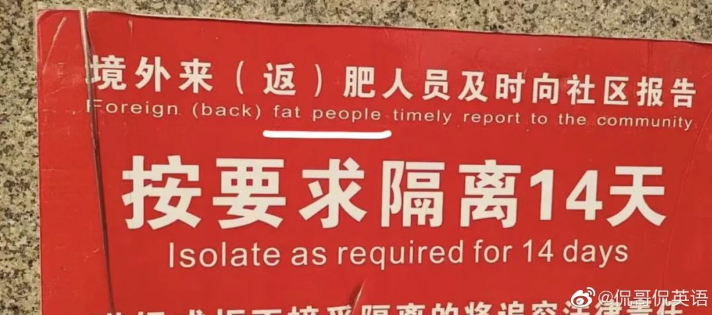
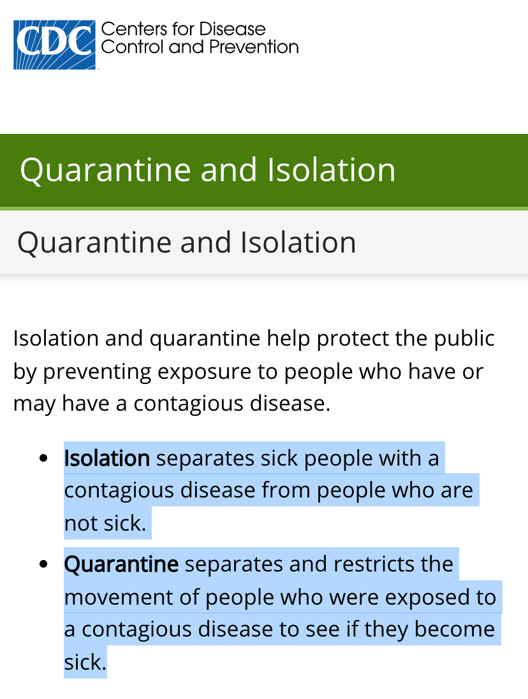

# When, On, Timely

之所以对这个话题感兴趣，是因为最近在写邮件的时候发下经常遇到困惑。特别是当....时候，只会用When，而这篇文章带给我另一个表达的视角。

读者中有合肥人民吗？是不是感觉被冒犯到…

我们看到第一句话：**“境外来（返）肥人员及时向社区报告”**

Foreign (back) fat people timely report to the community

有网友还这样调侃，既然 fat people 不能回，thin people可以回咯？

其实后半部分 timely report to the community 问题不大，timely 前最好加个 must（必须）以显示必要性，最后再加个 **`upon arrival`**（到达时）强调报告的时间点，**timely** 有点多余。

“来（返）”的字眼也不用翻出来，反正都要汇报，所以“境外来（返）肥人员”可以简化为“境外来的人员”：**travelers from abroad**

整句可以这样翻：

**Travelers from abroad must report to the community upon arrival.**

“Isolate as required for 14 days”这里的 isolate 最好换成 **quarantine**。

这个词有个小故事，话说14世纪的欧洲爆发了一场可怕的传染病，夺去了1/3的人口，当时的人们不知道这是什么恐怖疾病，便叫它 the black death（黑死病），后来才知道这是一种鼠疫（plague【pleɪɡ】）。

当时意大利的威尼斯推出隔离措施，对任何疫情地区来的人实行强制隔离40天，取得很好的效果，这项隔离最终也帮助了人们战胜了黑死病。

因为隔离措施是意大利人的首创，英文中表示隔离的 quarantine，来自意大利语中quarantina，表示 40 days（40天）。

那么 isolate 和 quarantine有什么区别呢？

根据美国疾病防控中心（CDC）官网的说明，isolation 指“隔离已经感染的病人”，而 quarantine 指隔离“可能的感染者”。

所以，小区里的这种隔离提示，用 quarantine 可能更合适一点。

Comments:

1. Travelers 好像稍微还是有点问题吧？是否会意味着在海外工作和学习的那些students employees, workers返回就不必隔离了？要不换成Those who come back from abroad……个人愚见。
2. 既然前句译成**陈述句**“ Travelers from abroad must timely report to the community upon arrival.”，后句译成**祈使句**“Quarantine as required for 14 days” 便觉有点不协调。可以也用陈述句：“A 14-day quarantine is required.”  或干脆合二为一译成：“ **Travelers from abroad must (因后有“upon arrival”, 为免语义重复，此处 “timely”可省去） report to the community upon arrival  and go through a 14-day quarantine as required.** ”
3. 土澳新闻里isolate&amp;quarantine都可以用在隔离“可能的感染者” 今天一则新闻标题： International arrivals to isolate for seven days in SA
4. isolate的用法没毛病，英语母语国家这么用的也比较普遍，而且是媒体上。
5. "timely report to the community"这个也是有问题的，timely是个形容词，不是副词。非得用这句式的话，应该是report to the community in a timely manner。 **timely 可以做副词哦，韦氏词典有明确标注**。
6. 这是谷歌翻译，看来比有道强太多了：**People who come to Hefei from abroad must inform the community in time and be quarantined for 14 days as required**

## Reference

1. [一句英文防疫提示，得罪了全体合肥人。。。](https://mp.weixin.qq.com/s/bTjpZZ2tLUntWqpDkytS_g)