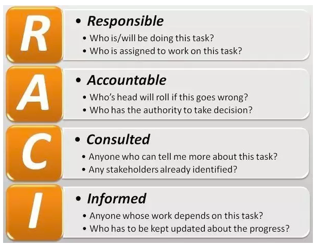
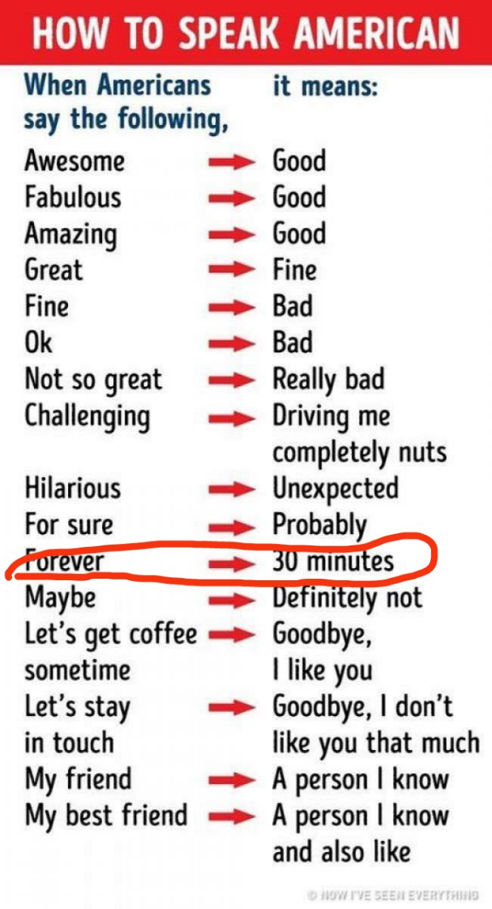
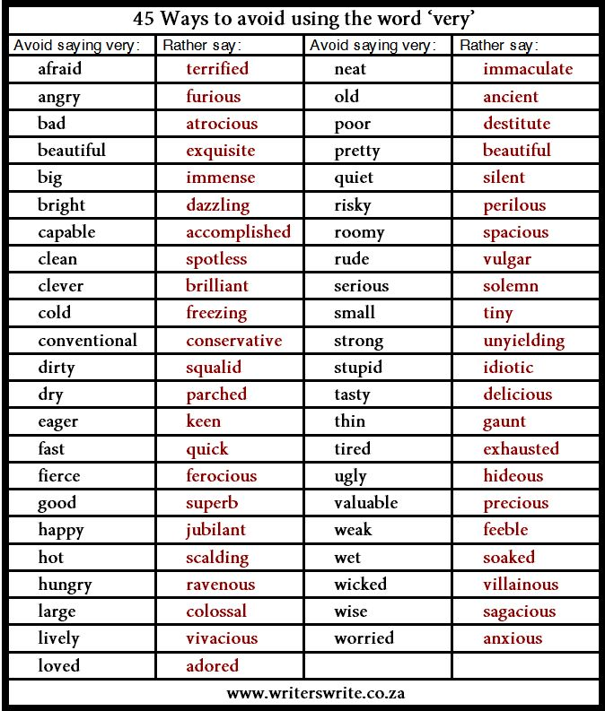
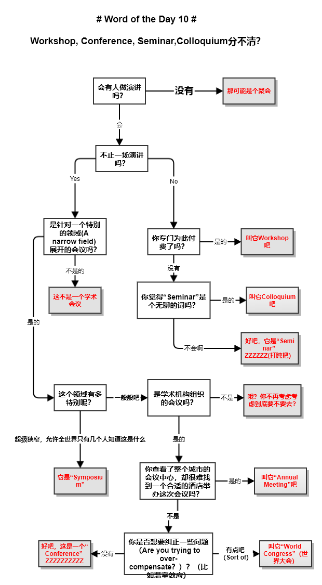
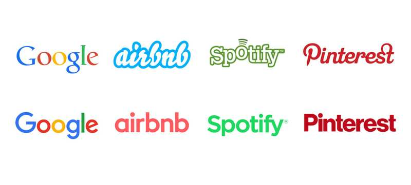

# Word of the Day Phase I
@(哦呵呵)[Toastmasters, Word of the Day]

如果一个人不想做某件事，通常不是由于客观条件不允许，而是他有下面四种心态之一：恐惧（Fear）、排斥（Rejection）、自卑（Low self-esteem）、怠惰（Laziness）。
--[《不要对自己撒谎》](http://www.efficientlifeskills.com/if-you-want-to-make-progress-stop-lying-to-yourself/)

[toc]

## Word of the Day 1  Tradeoff：人生的取舍
**Tradeoff**

相信很多人都看过《断舍离》这本书，号称“历史上最强大的人生整理法”...书我没看过，但是这本书的的核心说的就是“**取舍思维**”。取舍这种思维，英文有一个可能更形神兼备的词：**tradeoff**。**两个好东西我不可能都要，那么我愿意牺牲（off）一点这个，来换取（trade）一点那个**。Tradeoff是“理工科思维”的起源。你想下用下班后的时间读书，就不能看电影，你不能又读书有看电影又加班有饭局，这里引申出我们不得不在生活中做出各种取舍，而很多烦恼恰恰来自不愿意或者不知道取舍。

例句：The tradeoff of territory or land for peace. 以领土或土地换取和平的交易(宋朝就是以幽云十六州的土地换取了百年和平，是一种tradeoff。）

## Word of the Day 2 responsible vs accountable
**Responsible vs. accountable**

在头马学到的最大的一件事就是**“凡事有交代，件件有着落，事事有回音”**。我曾经因为忙碌，答应过很多朋友的事情没有做到，微信上很多guest询问我也没来得及答复，导致错失很多机会。My pain is your gain. 因此我们今天就来谈谈**责任**。

提起责任，大家想到单词一般是**responsible**。其实还有一个是**accountable**,这么这两个词具体啥区别呢？用一个栗子来说明：

假设现在**Yunny**叫**officer team**一起把俱乐部场地部署一下，这时候我们7个人都是**responsible**， 我们可能会马马虎虎的做，做砸了也没关系，因为法不责众嘛，**芋泥不可能只责怪我一人**。但是如果Yunny看穿了这一点，直接指派我说“Lee你跟officer team一起去部署一下场地，因为你最帅，所以你是总负责，如果我回来看见场地还是原样，就拖你出去砍了”。这时候大家都还是responsible,只有我变成了**accountable**.

所以accountability在项目管理中是一个非常重要的概念， 避免的**「三个和尚没水喝」**的状况。**一件事可以由多个人repsonsible，但是只能有一个人来accountable.** 这个人可以把这个事情安排给别人做，但是自己还是要对结果和进度负责。最后搞砸了，只有这个人会被held accountable. （中文中「追究责任」翻译成英文是 hold someone accountable.）

领导干部问责制，英文叫做accountability system, 就是只要是发生了问题，不管是谁的过错造成的，这个单位的领导首先要承担责任。

现在你能告诉我下面这两句话的差别了吗:
1.  I need someone responsible for this task.
2.  I need someone accountable for this task.

**引用参考**: 
1. https://zhuanlan.zhihu.com/p/27479193
2. https://www.diffen.com/difference/Accountability_vs_Responsibility
3. https://business.simplicable.com/business/new/RACI-responsible-versus-accountable: RACI Responsible Versus Accountable

The main difference between **responsibility** and **accountability** is that responsibility can be shared while accountability cannot. Being accountable not only means being responsible for something but also ultimately being answerable for your actions. Also, accountability is something you hold a person to only **after** a task is done or not done. Responsibility can be before and/or after a task.

> To operate effectively and efficiently, the project manager needs to understand where **responsibility, accountability, and authority reside** within the organization. (PMBOK-P42)
>  
>  为有效且高效地开展项目，项目经理需要了解组织内的**职责、终责**和职权的分配情况。

## Word of the Day 3 Acronym vs. Initialism
**Acronym v.s Initialism**

我们知道**APP**这个单词读作**[æp]**而不是**[ei pi pi]**,虽然国内很多人和机构(特别是罗辑思维带的头)都念**[ei pi pi]**。但是如果你不知道正确念法，看一些国外论坛视频会一脸黑人问号。

所以今天就来谈谈英语两个种缩写(**Abbreviation**)式： **Acronym['ækrənɪm]** 和 **Initialism[ɪ'nɪʃəˌlɪzəm]**. 

**Acronym**和**Initialism**通常都是取自一个词组的首字母作为缩写(极少数例外)。我们之所以称一个缩写词是**Acronym**是因为**这个词可以作为一个单词来发音( be pronounceable as a word)**。譬如National Aeronautics and Space Administration（美国国家航空航天局 ）的缩写**NASA**是可以发音为 **[næsə]**,那么NASA就是一个Acronym.

**Initialism**则是那些无法被作为一个(新)词发音的缩写词，而只能一个个字念，譬如：**FBI** (Federal Bureau of Investigation,美国联邦调查局)。

除此之外，一些词语如"**ex.**"是"**example**"的简写形式( a shortened form of a word)，它既不属于Acronym，也不属于Initialism，它就是一个abbreviation.

而**APP**是**Application**的缩写，又可以自然而然的发**[æp]**,是一个典型的**Acronym**，因此我们下次可以用**[æp]**来正确的代替**[ei pi pi]**。

### 句号的争议

另一个关于**Acronym**和**Initialism**的争议: 是否在缩写词后面加上**.**(英语的句号，翻译为**period**). 有的语法书建议大家加上这个period，有的则不需要。争议的焦点在于：添加一个句号会让句子看起来更混乱了(还以为是整段句子在这里结束了), 而且因为Acronym & Initialism通常是大写，所以已经可以让读者知道这是一个缩写，而不需要用句号标识出来。

原话：
> usually arguing that to add the periods can sometimes make things **look messier** and **it’s already clear by the all-capitals that it’s an abbreviation**, so the periods are pointless.

但是一些有影响力的媒体，譬如纽约时报，在写作指导里面是要求加上句号：
>Nevertheless, some influential style guides, many of them American, **still require periods in certain instances**. For example, **The New York Times' guide** recommends following each segment with a period when the letters are pronounced individually, as in K.G.B., but not when pronounced as a word, as in NATO. The logic of this style is that the pronunciation is reflected graphically by the punctuation scheme.

英语里面的语法争议应该让语法家去搞定。就如同我们争议豆腐脑是甜的还是咸的一样，一般人能吃就买了吃，不必要耗费时间在里面争议。

对于需要写作的同学，建议能用全写就不用缩写，譬如用United States去替代U.S.

**引用参考**:
1. http://www.todayifoundout.com/index.php/2012/05/the-difference-between-an-acronym-and-an-initialism/
2. https://en.wikipedia.org/wiki/Acronym#Pronunciation-dependent_style_and_periods

## Word of the Day 4  **“i.e.” v.s “e.g”**
**“i.e.” v.s “e.g”**

昨天提到在**Acronym** 和 **Initialism** 之外还有一个就是单纯的**Abbreviation**.  今天就索性谈谈两个最容易混淆的Abbreviation: **i.e.** 和 **e.g**。

先来看一面南非的国旗，然后看下面2句话：

- Tara decorated the hall with colors of the South African flag (**e.g.**, green, black, and gold).
- Tara decorated the hall with colors of the South African flag (**i.e.**, green, black, gold, blue, red, and white).

结论： - **“I.e.” 必须指出一件事物所包含的所有东西;  而“e.g.” 可以只说明一件事物中的某些样例**. 

**引用参考**:
1.  https://www.quora.com/What-is-the-abbreviation-of-that-is-to-say

## Word of the Day 5  Beyonce的一首神曲
**If I were / was 之争** 
今天说的这个话题，原来觉得简单，后来越查越深，差点弃坑。
If I were you 用于：假设在**相同的情况**下我会采取(跟别人不一样)的行动，（主要用于给对方建议），譬如：
- If I were you, I would study more. 
- I would study more if I were you.

如果我是你，我会更努力学习。但是这个是假设 （**hypothetical situation**），因为我不可能是你。

当年[Beyonce](https://baike.baidu.com/item/%E7%A2%A7%E6%98%82%E4%B8%9D%C2%B7%E5%90%89%E8%B5%9B%E5%B0%94%C2%B7%E8%AF%BA%E6%96%AF/11037900?fromtitle=Beyonce&fromid=1677364&fr=aladdin)一首*If I were boy*更是敲醒了多少直男：
If I were a boy, I think I could understand, how it feels to love a girl...

这时候**Justin Bieber**的粉丝会说，不对啊，Justin唱过一首**If I was your boyfriend, I'd never let you go...**. If I were/ was的语法争论也相对激烈,又一个豆腐脑咸甜之争...

实际上If I were/was判断的情况相当复杂，写在群里怕大家看晕了，因此一笔带过，这里简单提一下区别：

普遍上的，**If I was是用于陈述性客观性的事实（indicative），而If I were...是带有假设性(hypothetical )的虚拟语气(subjunctive )的**。比较下面连句话：

- If I was sick, she would give me medicine that tasted terrible. （如果我生病了，她会让我吃一种极其难吃的药）
这句话是客观陈述，如果我生病了，她(医生)会给我吃药。这时候If是可以用Whenever代替的。

- If I were sick, I wouldn't be here. （如果我生病了，我就不会在这儿了）
这句话是虚拟语气，我没有生病，但是我假设了那种场景。

所以，Justine Bieber说"If I was your boyfriend, I'd never let you go..."应该是不恰当的，“我是你男票”，这个假设一下可以；但是被你**was**一下，岂不是成了单方面宣布你是人家的男票，**这等好事我也想天天was**...

**引用参考**
1. http://www.grammar.cl/english/if-i-were-you.htm
2. When is it correct to use "If I was" vs. "If I were" in standard English? https://english.stackexchange.com/questions/660/when-to-use-if-i-was-vs-if-i-were
3. 

## Word of the Day 6 美式夸人
**Good, Awesome, Fantastic** 

今天谈谈**Good**这个尴尬的词语。为什么尴尬呢，因为在英语（至少美语）里面，good差不等恒等于just so so了。所以通常如果你真做的好，会用great/excellent/awesome/terrific/fantastic来代替good.

当然上述说的是普遍情况，并不是每一个人都是这样。如果你有个朋友说good,然后会给你说一大堆你到底哪里good,那这个good是真good.

因此敲黑板啦Evluator们，以后咋们尽量用这些词语去代替good.

另外我做Evaluator的时候，除了喜欢说good,还有一个高频词是very,也许我们可以用一些不同的词语来代替这个very（We always have a new adjective that is more extreme than the normal adjective.  So instead of using "very+adjective" just use a different, stronger adjective.）
 

**引用参考**:
1. 

## Word of the Day 7 101：入门
**101** 
最近在阅读一些文章的时候经常会遇到一个代号--101. 譬如：Web Architecture 101: The basic architecture concepts I wish I knew when I was getting started as a web developer. 或者 Microsoft Excel 101，好奇到底是什么意思。

翻阅材料才知道这个是“新手入门”的意思。这个典故来自于美国的大学，美国大学的第一门课程代码是101，表示这门课程是不需要任何前提，你来就开始可以开始读的，如果你发现一门课程代码是201又看不懂，可能你要回去复习下101。

附录：Web Architecture 101: The basic architecture concepts I wish I knew when I was getting started as a web developer: https://engineering.videoblocks.com/web-architecture-101-a3224e126947

> If there was one course I could add to every engineering education, it wouldn’t involve compilers or gates or time complexity.  It would be Realities Of Your Industry 101, because we don’t teach them and this results in lots of unnecessary pain and suffering. (https://www.kalzumeus.com/2011/10/28/dont-call-yourself-a-programmer/)
> 
>   Web Architecture 101: The basic architecture concepts I wish I knew when I was getting started as a web developer(https://engineering.videoblocks.com/web-architecture-101-a3224e126947)

**引用参考**:
1. https://english.stackexchange.com/questions/14265/what-does-something-101-mean

## Word of the Day 8  Span of control:管理幅度
**Span of control**
管理幅度（Span of control）是一个高深难解的话题...相信一些头马老会员做到高阶项目，会频繁的遇到Coach, Facilitator, Coordinator这些词。 麦肯锡把管理岗位分成了五种角色原型（注意以下是麦肯锡的解释，可能跟头马的不能一一精确对应，但是还是很具有参考价值）：
1. **player**
   这些管理者拥有高度的个人权责，因为从事的工作类型复杂，工作内容也几乎无法复制，所以他们没有标准化流程。这种管理岗位需要大量的学习和模仿，工作多年才能完全游刃有余，他们的管理幅度通常是3-5个直线下属
2. **coach**
   他们也拥有高度个人权责，有一定的流程指导，下属通常要做一种以上的工作。人们需要一年的时间做到游刃有余，因为他们所需的技能需要在固定模式下进行大量的学习与模仿，他们的管理幅度通常是6-7个直线下属。
3. **supervisor**
   这些管理者享有中等程度的个人权责，在执行方面有更高的管理者监督。工作上有标准化流程，直线下属的工作类型单一。这种岗位通常用不了6个月的时间就能做到游刃有余，他们的管理幅度通常是8-10个直线下属。
4. **facilitator**
  他们的个人权责有限，通常管理的是他人的日常工作。工作内容基本上也是标准化的，团队成员做着同类型或相似的工作。这种岗位只要1-2个月的时间就能做到游刃有余，因为所需的技能很快就能学会，他们的管理幅度通常是11-15个直线下属。
5. **coordinator**
  这些管理者的大多数工作内容就是管理日常工作，工作内容高度标准化或自动化，团队从事的是相同的基础工作。通常只需两周就能做到游刃有余，因为需要的技能不多，他们的管理幅度通常是15人或以上

## Word of the Day 9 down to earth 接地气
**down to earth ，feet on the ground **

这两个词都是**接地气**的意思。

解释: sensible and practical, in a way that is helpful and friendly

例句：Lee ~~was~~ is always level-headed with both feet on the ground

## Word of the Day 10 Workshop, Conference, Seminar, Colloguium

## Word of the Day 11 Off the charts: 出色
**Off the charts**: When something is so great, it doesn't fit on the chart anymore, it is literally OFF THE CHARTS.  

例句:  The presentation was OFF THE CHARTS. (这个演讲真的是太出色了。)
延伸例句： Her appearance is OFF THE CHARTS (她颜值爆表。)（不大确定这样表达对不对，是不是很中式）

## Word of the Day 12 Put our heads together.
**Put our heads together:集思广益** 

这个看字面意思也好理解，我们几个碰碰头（想办法），毕竟三个臭皮匠，顶的上一个诸葛亮。
例句：Let's put our heads together and develop a new strategy.

## Word of the Day 13
Trademark (™) Registered ® 

&trade;商标(Trademark)。是指那种企业已经向商标局（Trademark Office）提交申请了该商标，但是还未正式审批。&trade;起到一个提醒其他商家注意不要侵权的情况（实际上如果这时候其他商家做了侵权事情，由于还未正式审批，所以商家也只能干瞪眼。但是一旦审批通过情况就不一样了）。

&reg; 注册商标（Registered）。企业成功注册了该商标。该商标现在主语普通法（common-law）的保护之下了。

https://www.lawtrades.com/blog/answers/intellectual-property-differences/

## Word of the Day 14 In someone's DNA
**In someone's DNA. **
    eg. Where is Steve in all this? Well, he's in my heart, and he is deep in Apple's DNA.

## Word of the Day 15 Stand for sth.
**Stand for sth.**

 Stand for sth.  When you "Stand for soemthing". It is so important to you that you insist on it. 
  eg. Steve Jobs stood for simplicity.
 
 Meaning #2 Stand for something. Represent or symbolize something. 
 eg. For Americans, the American flag stands for freedom. 
 
## Word of the Day 16 Grok: 通过直觉而不是理性推到get到一件事
**Grok**
最近在翻一本书，书名叫Grokking Algorithms: An illustrated guide for programmers and other curious people。中文翻译《图解算法》。我对书名中包含的 Grokking一词感到不是很理解。牛津一下才知道：

>(US, slang) Verb 英式： [grɒk] 美式： [grɑ:k]
>
> to understand sth something completely using your feeling rather than considering the facts.
大意是：通过你的直觉get到一件事，而不事通过你的理性推断。（也许这事儿你女票更擅长...）

也许有的同学会说，吓！这个老外开了个这么长的书名，远不如我们国内学者翻译的《算法图解》来的简单有力。
不过，[熊逸的这篇文章](http://www.yopai.com/show-2-195086-1.html)似乎有不同的解读，我也颇受启发：

## Word of the Day 17 Shower v.s Bathub

https://www.fixr.com/comparisons/shower-vs-bathtub

## Word of the Day 18 Serif and Sans-Serif
Serif and Sans-Serif

下图上排是以前的logo，下排是现在的logo。各公司都不约而同，选择了加粗的直线式无衬线字体，这样是为了更醒目、辨识度更高吗？

网友 @chun1iu 评论："不是更加醒目，而是更加中庸，更容易被所有人接受。不会很喜欢，也不会很反感，就是很大众。这些公司的成长过了标新立异的阶段而已。"

## Word of the Day 19
What is the difference between neurological and psychiatric disorders?

http://www.brainfacts.org/diseases-and-disorders/mental-health/2018/what-is-the-difference-between-neurological-and-psychiatric-disorders-070618

神经疾病（比如帕金森病、癫痫、阿尔茨海默病）都涉及神经系统（大脑，脊髓和神经）的故障或损伤，精神疾病的标志则是行为不安和情绪状态。

## Word of the Day 20
**Fall behind on sth.**

## Word of the day 21 Economics -经世济民
欧洲传来的Economy一词，在今天的汉、日、韩语中，都以“经济”对译。“经济”是“经世济民”的缩写，本意是对国家社会的管理、对民众的救助。和今天经济一词的含义不同，它并不专注于财富与市场，和只讨论供求、盈亏，日趋数学化的Economics（经济学）更是大异其趣。在17到19世纪的东亚语境中，“经世”代表了东亚政治思想朝向现代的内在转化。

## Word of the Day 22
**eyes on the prize**

'Keep your eyes on the prize' is an English idiom. It means to stay focused on the positive outcome which should result from your particular endeavour. It is also meant as a way of encouraging one if the going gets tough.

[Eyes on the Prize](https://en.wikipedia.org/wiki/Eyes_on_the_Prize) is an American television series and 14-part documentary about the Civil Rights Movement in the United States. 

名词复数前加the和不加the的区别：

1、the+复数名词，表示特指某一类人或事。复数名词本身表示泛指这一类人或事。比如：the pens on the desk 特指桌上的几只钢笔；pens 只是泛指钢笔
2、用在表示乐器的名词之前加the，运动类的不用。比如：play the piano，play football 。

3、the与单数名词连用表示一类事物，如the dollar 美元; the fox 狐狸；或与形容词或分词连用，表示一类人：the rich 富人; the living 生者。 

4、指世界上独一无二的事物。例如： Which is the biggest, the sun, the earth or the moon? 太阳、地球和月亮哪一个最大？

## Word of the day 23
** Theorem v.s theory **
What is the difference between a theorem and a theory? The two words seem to be used to describe very similar things, but yet do not seem to be interchangeable.

For example, we have Pythagoras' theorem and Einstein's theory of relativity.

---------------------------

A theorem is a result that can be proven to be true from a set of axioms. The term is used especially in mathematics where the axioms are those of mathematical logic and the systems in question.

A theory is a set of ideas used to explain why something is true, or a set of rules on which a subject is based on.

> 1. https://english.stackexchange.com/questions/38973/difference-between-theorem-and-theory
> 2. https://www.quora.com/What-is-the-difference-between-a-theory-and-a-theorem

## Word of the day 24: Blush v.s Flush

"Blush" and "flush" can both mean "red-faced."  The difference is what caused the person's face to be red.
A "blush" shows that a person is embarrassed or feeling shy.  If a pretty girl smiles at a boy, he may blush.  Blushing is considered charming and a sign of love or modesty.

A "flush" is a red face caused by other things including anger, nervousness, heat, illness, some medications, or physical effort.  If I run for 15 minutes, my face will be "flush".  Flushing is not considered charming or attractive.

https://www.quora.com/What-is-the-difference-between-blush-and-flush-in-the-following-sentence

## Word of the day 25 Difference Between Complicated and Complex
	
What is the difference between Complicated and Complex?

• Complex and complicated are near synonyms and are adjectives that are used almost interchangeably.

• However, complex is used more in science and math problems while complicated is used more in social relationships

• Medical conditions are also termed complicated and their symptoms as complications

• Complicated means something that is intricate and hard to understand

• Complex is something that has many parts that are interrelated though it may or may not be difficult to understand

1. [Difference Between Complicated and Complex](https://www.differencebetween.com/difference-between-complicated-and-vs-complex/)

