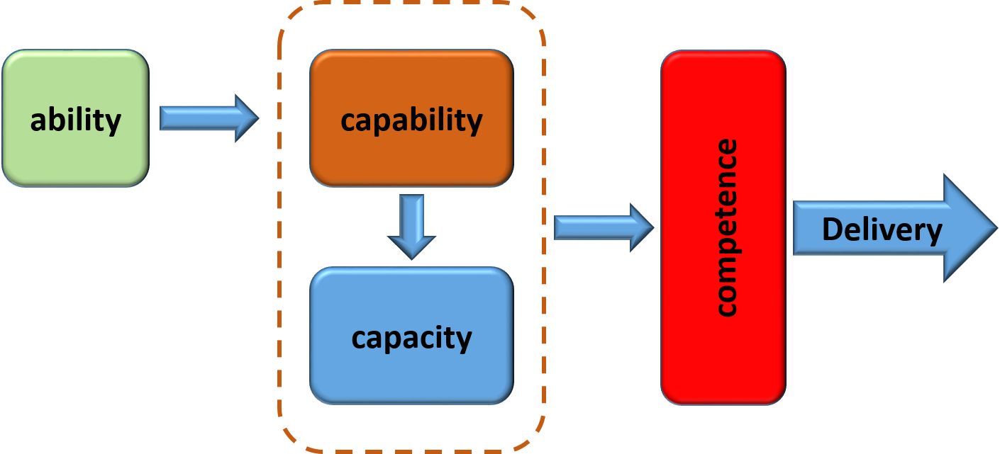
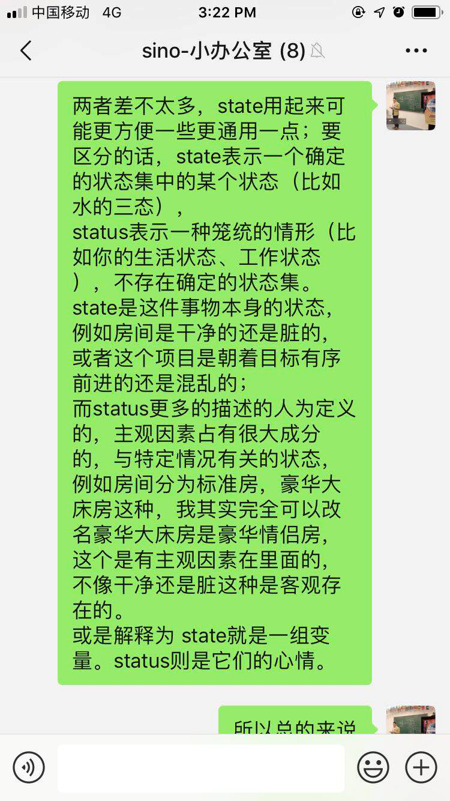

# Word of the Day Phase Ⅱ
@(哦呵呵)[Toastmasters, Word of the Day]

[toc]

如果一个人不想做某件事，通常不是由于客观条件不允许，而是他有下面四种心态之一：恐惧（Fear）、排斥（Rejection）、自卑（Low self-esteem）、怠惰（Laziness）。
--[《不要对自己撒谎》](http://www.efficientlifeskills.com/if-you-want-to-make-progress-stop-lying-to-yourself/)

## Day1. Competence vs ability
P343

In an individual it is accepted that an **ability** is the skill or competency to perform a task whether it is physical or mental. An ability is something that is inherent as it is dependent upon the genetic makeup of a person.

An ability is therefore an attribute that is either there or not. Organisations do not inherently have abilities that can be exploited. Individuals within an organisation do.

A **capability** on the other hand is a feature, ability, faculty or process that can be developed or improved. A capability is a collaborative process that can be deployed and through which individual competencies and abilities can be applied and exploited. A capability can refer to an ability that exists in an individual but can be improved upon.

For example:

- A runner may finish a marathon in 3 hours but may through training have the capability to complete a course in less than 2.5 hours. - A student may be regularly obtaining average grades but with study could achieve significantly better. - A researcher may have good analytical skills that can be greatly enhanced if they are provided with appropriate toolsets. - A business decision maker demonstrates the ability to make good decisions but could make excellent decisions if provided with sufficient relevant information.

Within a business setting a **Business Capability** is the articulation of the capacity, materials and expertise an organisation needs in order to perform its core functions. Defining the Business Capability does not mean that the organisation can deploy it. It must have the capacity to do so.

It is essential that an organisation when defining its required Business Capabilities understands its **capacity** to deliver. When discussing capacity, it is important to ask "How much do we have?" and the related questions, "How much is needed?" and "When do we need it?"

Having the capacity to deliver goods and services is more important than just having the capability. If a required Business Capability cannot be delivered through capacity issues, then reputational and financial damage is likely to occur.

**So what is the difference between Capacity and Capability?**

A Capacity is the ability that exists at present whilst capability refers to the higher level of ability that could be demonstrated under the right conditions.

As well as understanding abilities, capabilities and capacity it is important for an organisation to be aware of its **competence**. This is the quality or state of being functionally adequate or having sufficient knowledge, strength and skill to deliver what is required. Competence therefore is another word describing the 'know-how' or 'skill' of an individual or business.

As an example:

-   I have the ability to run
-   I have the capacity to run a 100m race in 18 seconds
-   I have the capability to improve my capacity through training to 15 seconds.
-   As a runner I am incompetent as I cannot compete successfully.

Organisations focus on the capabilities that they require in order to succeed. With good strategies and forward planning in place they may also be cognisant of the capacity that they require in order to deliver successfully. Hopefully they will also be realistic about their competence to deliver quality products and services.

Unfortunately, organisations often fail to realise the benefit of their greatest asset -- the individuals it employs. Individuals often have abilities that are frequently **under-utilised** within their workplace. This may be that the role in which an individual sits does not require the skills that demonstrate their abilities. Consequently, entire valuable skills sets may be unused through there being no organisational awareness that they exist or the imposition of organisational constraints to their being leveraged. Business Capabilities that could be enhanced remain stagnant through ignorance of the actual capacity within the organisation or reluctance to cross organisational boundaries.

A successful organisation will be aware of all of its assets, understand the Business Capabilities it requires, have sufficient capacity and be competent in its delivery.

https://www.businessprocessincubator.com/content/ability-capability-capacity-and-competence/

## Day2.  Impact V.S Influence 

> influence是强调潜移默化的影响，impact是冲击力  (Johnson)

1. influence多表示**对人的影响，还有表示支配，控制**。impact表示强大作用，冲击，**通常是用来表述不好的事情，有负面色彩**。
2. influence的固定搭配有：~ (on/upon sb/sth)影响；作用 ；~ (over sb/sth)支配力；控制力；影响力 ；~ (on sb/sth)有影响的人（或事物） 。impact的固定搭配有：~ (of sth) (on sb/sth)巨大影响；强大作用 ；~ (on/upon) sth（对某事物）有影响，有作用； ~ (on/upon/with) sth(formal) 冲击；撞击 。
3. 例句比较：
> Users increasingly want more than just interaction and influence. 用户想要得到的，越来越不仅仅是互动和支配权。
> Such schemes mean little unless they impact on people. 这些计划没什么意义，除非它们对人民产生影响。

affect v. 影响 
通常由物作主语，多产生消极作用。
〔例证〕The food is for the areas affected by the flood.食物是为受洪水影响的地区准备的。

1. [What is the difference between influence and impact?-wikidiff](https://wikidiff.com/influence/impact)
2. [Impact and Influence: A Key Competency for Top Performers](http://www.humanresources.com/684/impact-and-influence-a-key-competency-for-top-performers/)
3. [Understanding the Influence/Impact Grid (Influence/Impact Matrix) for Stakeholder Management](https://www.brighthubpm.com/resource-management/81618-what-is-the-influenceimpact-grid-influenceimpact-matrix/)

## Day3.  Randomized controlled trial

[Parachute use to prevent death and major trauma when jumping from aircraft: randomized controlled trial](https://www.bmj.com/content/363/bmj.k5094)

这张图取自一篇2018年12月发表的正式论文，作者单位是哈佛大学医学院，论文题目叫做《从飞机跳下时，降落伞防止伤亡的作用研究》。

研究小组让一组人带着降落伞，另一组人不带（就像上图），都从停在草坪上的小飞机跳下来。可想而知，所有人都平安无事，因此论文经过模型分析，一本正经地得出结论：降落伞没有明显作用。

这篇论文不是恶搞。它想用一个讽刺的实证研究来证明，医学界传统的双盲测试有重大弊端。医生当中流传着一句名言：没有降落伞，谁愿意从飞机跳出来？意思是只有那些有降落伞的病人（即知道自己死不了的人），才会参加双盲测试。

这是因为，如果不考虑那些无药可救的绝症，一般来说，风险比较小的病人，更可能参加双盲测试，因为就算被抽到对照组，天天吃安慰剂，也不怕被耽误。但是，如果测试对象都是风险小的病人，试验结果很可能就是新药无效，因为病人本来就会康复。

这篇论文就是用实验证明：如果你想让没有降落伞的人，参加双盲测试，他们只会愿意从停着的小飞机上跳下来，因此你会得到降落伞（新发明）没用的结论。这是我看过的最好玩的论文之一，推荐大家看看，它完全采用最严谨的学术语言和论证过程，写得一丝不苟，最后得出了一个荒谬的结论。

## Day4.  Prohibit V.S Suppress

 As verbs the difference between **prohibit** and **suppress** is that prohibit is to forbid, disallow, or proscribe officially; to make illegal or illicit while suppress is to **put an end to**, especially with force, to crush, do away with; to prohibit, subdue. 

##  Day5. Speciality v.s Specialty v.s Specialized

In general usage, **specialty** and **speciality** are very closely related and often interchangeable. English reference books say various things about them, but in general writers tend to treat them as if they're the same word. 

*Specialty* is more common in American, Canadian and Australian English (which is more surprising, because Australian English usually follows British), and it's usually a noun meaning *something in which a person or business specializes*. 

*Speciality* is more common in British English, and it's often an adjective (as in the phrase specialty store and specialty products).

>  Doctors training for General Practice must complete programmes in a number of specialties, including Paediatrics. (接受全科培训的医生必须修完包括儿科学在内的多门专业课程。)
>   
>  regional specialties (地方特产)

## Day6.  Word of the day ??
When is café used and when is coffee shop used? Are there any differences? Which is more widespread?

Café is a commonly used loan-word in English. Being French it has a connotation of being either classy or pretentious, depending on your point of view. Coffee shop has no similar connotations.

> https://english.stackexchange.com/questions/113302/caf%C3%A9-vs-coffee-shop-in-american-english

## Day7.  Word of the Day 26 Hype Cycle
**Circle vs Cycle**

As **nouns** the difference between `circle` and `cycle` is that circle is (lb) **a two-dimensional geometric figure**, a line, consisting of the set of all those points in a plane that are equally distant from another point while cycle is **an interval of space or time in which one set of events or phenomena is completed**. 
As **verbs** the difference between `circle` and `cycle` is that **circle is to travel around along a curved path** while **cycle is to ride a bicycle or other**. 

1. https://wikidiff.com/circle/cycle

## Day8.  Word of the Day 1? Dues v.s fees
**Dues v.s fees.**

 Dues are monies charged to members to support various programs of the organization while fees 
are monies charged to non-members (pledges) or monies charged for a service. 
https://deltasigmapifraternity.wordpress.com/2012/02/28/dues-vs-fees/

Examples of both dues and fees with current amounts can be found below. 
Member dues--- $25,145,810
New member fees -- 3,320,776  charter fees--

## Day9.  Word of the Day ?? Literally
**Literally**

## Day10.  Word of the Day ?? Bottom up v.s Top down
**Bottom up v.s Top down.**

**Reference**
1. http://www.answers.com/Q/What_does_the_saying_eyes_on_the_prize_mean
2. https://en.wikipedia.org/wiki/Eyes_on_the_Prize
3. jianqiaocidhttps://dictionary.cambridge.org/zhs/词典/英语/the

## Day11.  State v.s Status

 

两者差不太多，state用起来可能更方便一些更通用一点；要区分的话，state表示一个确定的状态集中的某个状态（比如水的三态）。
 
status表示一种笼统的情形（比如你的生活状态、工作状态），不存在确定的状态集。

state是这件事物本身的状态，例如房间是干净的还是脏的，或者这个项目是朝着目标有序前进的还是混乱的； 

而status更多的描述的人为定义的，主观因素占有很大成分的，与特定情况有关的状态，例如房间分为标准房，豪华大床房这种，我其实完全可以改名豪华大床房是豪华情侣房，这个是有主观因素在里面的，不像干净还是脏这种是客观存在的。

或是解释为 state就是一组变量。status则是它们的心情。

state：比较常用，各种状态都可以用它，但是它更着重于一种心理状态或者物理状态。
Status：用在人的身上一般是其身份和地位，作“状态，情形”讲时，多指政治和商业。

### 拓展  ajax中的State & Status
ajax中`readyState`，`statusText`，`onreadystatechange`，`window.status`
怎么一会state一会是status都晕乎了?

**state所指的状态，一般都是有限的、可列举的，status则是不可确定的。**
比如
- readyState -- 就那么四五种值
- statusText -- 描述性的文字，可以任意
- onreadystatechange -- 那么四五种值之间发生变化
- window.status -- 描述性的文字，可以任意

1. https://www.cnblogs.com/likebeta/archive/2012/07/03/2574595.html
2. https://blog.csdn.net/sym134/article/details/81066629

## Day12.  an edge on

an edge on :
> Three centuries of the demonstrated power of the empirical approach give us an edge on poor Sizi.
> > To have an advantage over someone or something; to be in a more favorable position than someone or something else.

参考：
1. [have an edge on](https://idioms.thefreedictionary.com/have+an+edge+on)

## Day 13 Evolutionary and Revolutionary Innovation

> EVOLUTION (the definition of the word by way of Freedictionary.com) is defined as gradual change, adaptation, progression, metamorphosis.

----
>REVOLUTION is defined as forcible overthrow for an entirely new system…drastic, disruptive, far-reaching, momentous change.

1. [Re: Revolutionary Vs. Evolutionary Innovation](https://www.reinventioninc.com/revolutionvsevolution#:~:text=EVOLUTION%20%28the%20definition%20of%20the,far-reaching,%20momentous%20change.)
2. [Evolutionary and Revolutionary Innovation](http://timkastelle.org/blog/2012/08/evolutionary-and-revolutionary-innovation/#comment-81704)

## Day 14  Scenario v.s Sceen v.s Situation

https://www.evernote.com/l/ALo7Jbuxf8BEKYE8DIJr6C3RW5G60OHUBH0/

## Day 15  Lockup vs Lockdown - What's the difference?

There is no formal logical distinction here, but the answers below capture the common usage of the phrases.

**`Lockup` - is commonly associated the jails and incarceration because of crime committed by the person locked up.**

**`Lockdown` - is associated with restricting movement and access for safety purposes. The people in lockdown are victims.**

However, this is not always the case. If I remember correctly prisons use the term ‘lockdown’ to refer to locking prisoners in their cells to prevent riots or in emergencies.

As so often context is important.

--------------------------------------

As nouns the difference between lockup and lockdown is that lockup is that lockup is (slang) a jail, prison while lockdown is (*in an institution, such as a prison or school *) the confinement of people in their own rooms (or cells) as a security measure after a disturbance.

1. [Lockup vs Lockdown - What's the difference? -- Wikidiff](https://wikidiff.com/lockdown/lockup)
2. [What is the difference between a lockup and a lockdown? -- Quora](https://www.quora.com/What-is-the-difference-between-a-lockup-and-a-lockdown#:~:text=Originally%20Answered:%20What%20is%20the%20difference%20between%20lockdown%20and%20lockup,inside%20under%20threat%20of%20penalty.)
