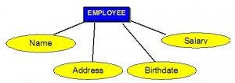
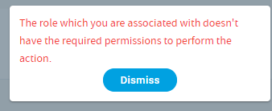
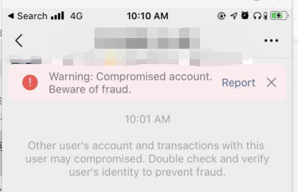
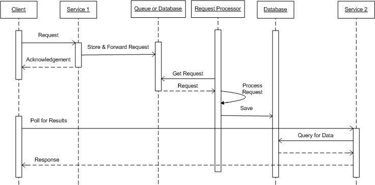
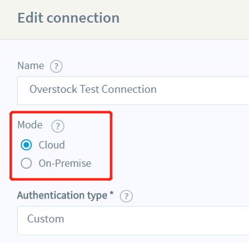

#常见翻译清单- 高度相似的词汇(1)
@(星瑞格)[翻译, 公司, 公司业务, dbAudit翻译]

[toc]

## 6.  高度相似的词汇

### 6.1 relative vs related vs relevant

Get map and ship-confirm relevant data

### 6.2 Associated v.s Related

`be associated with`  v.s `be related to`  

在做翻译的时候，遇到这样一张表：`T_BP_OrderRows` 与 `T_BP_Order`表通过主外键**关联**。我第一次翻译的时候，用的是`be related to` 
> Storing order items (goods) which **are related with** T_BP_Order

后来去[Google](https://opentextbc.ca/dbdesign01/chapter/chapter-8-entity-relationship-model/)了一下，觉得` be associated with`更妥当点。

> Each attribute has a name, and it associated with an entity and a domain of legal value...

数据库的属性（字段/主外键）等用**be associated with**更好点。

| be related `to`  |     v.s |    be associated `with`| 
| :-------- | :--------| ------: |
| **`有亲属关系的;属同一家族的，与..有因果关系（侧重直接因果关系）`**    |   |  **`和…联系在一起; 与…有关,与..有联系（侧重于间接有联系）`**  | 
|**1. People who are related belong to the same family**   **2. If two things are related, there is a connection between them. **| | **1.If one thing is associated with another, the two things are connected with each other**|
|High unemployment is related to high crime rates. 高失业率和高犯罪率有因果关系。||Lust now seems to be associated with casual sex and loose morals  色欲如今似乎与性生活随便和道德放纵联系在一起了。 |

- **References:**
1. [Chapter 8 The Entity Relationship Data Model - Database Design](https://opentextbc.ca/dbdesign01/chapter/chapter-8-entity-relationship-model/)
2. [be related to 与 be associated with 的区别](http://ask.yygrammar.com/app_q-28891.html)

- **截图**：

https://integrator.io/pg/marketplace/google

- **Wayfair**:
>  "message": "Purchase Order: CS266877285 for this Ship Notice **is not associated with** provided Supplier ID: 3215",

### 6.3 Type v.s Category (类型与类别)

Products can be broadly classified into **`product types`**, such as **Software** and **Hardware**. 

A `product type` can be further organized into several `categories`. For example, software may be sub-divided into **Business software** and **Educational software categories**. Each product type can consist of several product categories. Each product category can further be grouped into sub-categories to better organize and manage them. The administrator sets up a list of product types and categories from which users can select what they need.

- **References:**
1. [Product Types vs Product Categories - sugarcrm](https://support.sugarcrm.com/Knowledge_Base/Products_Quotes/Product_Types_vs_Product_Categories/)
2. [.Net 框架 - 张子阳的博客](http://www.tracefact.net/tech/042.html)
3. [Difference between Type and Category - wiki.genexus.com](https://wiki.genexus.com/commwiki/servlet/wiki?2212,Difference%20between%20Type%20and%20Category)
4. [How to Optimize Google Shopping Product Categories -  godatafeed](https://www.godatafeed.com/blog/google-shopping-product-categories)
5. [Amazon categories, product types and item types - support.farapp.com](https://support.farapp.com/hc/en-us/articles/217185677-Amazon-categories-product-types-and-item-types)
6. [Topic: Product Categories vs Product Types  (Read 2885 times)](https://forum.virtuemart.net/index.php?topic=85099.0)

### 6.4 Compromised

Wikepedia关于数据库审计两处提到了**Compromised**

>......Verizon Business’ caseload of 90 confirmed breaches involving 285 million **compromised** records during 2008—75 percent of all breached records came from **`compromised` database servers.**
> 
> In addition, since targeted attacks frequently result in attackers gaining privileged user credentials, monitoring of privileged activities is also an effective way to identify **`compromised` systems.**

------------------
Facebook网站的**[hacked](https://m.facebook.com/hacked)**地址，就是**Report Compromised Account**。（My Account Is Compromised)
> If you believe your account **has been compromised by another person or a virus**（如果您认为您的帐户已被他人或病毒入侵）, please click the "My Account Is Compromised" button below. We'll help you log back into your account so that you can regain control.

- **References:**
 1. [Facebook-Report Compromised Account](https://m.facebook.com/hacked)
 2. [Database activity monitoring -- Wikipedia](https://en.wikipedia.org/wiki/Database_activity_monitoring)

### 6.5 If Any(如果有的话)
We need to make sure that non-admins can be restricted to viewing specific channels. For example, a Costco sales rep should only be able to view the data for the Costco channel (plus their other channels, **`if any`**)

eg:
> This type of version control allows the clone of the complete codebase (repository) including its full history on every developer’s system. [If any](https://medium.com/swlh/things-about-git-and-github-you-need-to-know-as-developer-907baa0bed79) time server(main repository) dies, any of the developer’s repository can be copied on to the server which helps restore the server.

### 6.6 Fuzzy、Precise/exact and wildcard queries (无果)

微软官方的[Query with Full-Text Search](https://docs.microsoft.com/en-us/sql/relational-databases/search/query-with-full-text-search?view=sql-server-ver15)这篇文章提到：
> Match single words and phrases with **precise** or **fuzzy** (less precise) matching.

| Col1      |     Col2 |   Col3   |
| :-------- | --------:| :------: |
| precise query |   约 333,000,000 |  |
| exact query |   约 141,000,000 |  |

[这篇中国人写书籍提到](https://books.google.com.hk/books?id=EB4PKgzNb1YC&pg=PA499&lpg=PA499&dq=fuzzy%20query%20vs%20exact%20query%20precisely%20query&source=bl&ots=_pf3gUexSK&sig=ACfU3U1YKfvGRNU7_KahGD0BD3G8UNB6aw&hl=zh-CN&sa=X&redir_esc=y&sourceid=cndr#v=onepage&q=fuzzy%20query%20vs%20exact%20query%20precisely%20query&f=false)：
> Queries include **`exact query, fuzzy query and wildcard queries`**

### 6.7 Request/Acknowledge(请求--答复模式)

-  **Response**
 > When a client transmits a message and then blocks until a response is received, the interaction is often referred to as request-response messaging

- **Acknowledgement**
> Asynchronous Update with Acknowledgement - This interaction requires a client to transmit a request message, but does not require the client to block for a response.

> Acknowledge: A letter saying that sth has been received:  I didn't receive an acknowledgement of my application.

- **参考**：
1. [Request/Acknowledge](http://servicedesignpatterns.com/ClientServiceInteractions/RequestAcknowledge)
2. [Difference between acknowledgement and response in JAXM](https://searchapparchitecture.techtarget.com/answer/Difference-between-acknowledgement-and-response-in-JAXM#:~:text=When%20a%20client%20transmits%20a,to%20as%20request-response%20messaging.&text=2%29%20Asynchronous%20Update%20with%20Acknowledgement,to%20block%20for%20a%20response.)

### 6.8 Mode v.s Type v.s Method

https://integrator.io/pg/dashboard

另外`Mode`还可以表示：众数。参考可[汗学院的Mean(平均数)、median（中位数）和Mode(众数)](https://www.khanacademy.org/math/statistics-probability/summarizing-quantitative-data/mean-median-basics/a/mean-median-and-mode-review)。

- **参考**：
1. [model vs type -- wordreference.com](https://forum.wordreference.com/threads/model-vs-type.327048/)

### 6.9 On Premise vs. Cloud
> 本地部署 与 云端部署。

- 根据Wikipedia的[这篇文章](https://en.wikipedia.org/wiki/On-premises_software)，解释到， **On-premises**才是正确的语法，但是现在很常见的写法是***On-premise***； 也可以缩写成***on-prem***。
> **On-premises software** (commonly misstated as on-premise, and alternatively abbreviated "on-prem") is installed and runs on computers on the premises of the person or organization using the software, rather than at a remote facility such as a server farm or cloud

- 与之相反的部署是**Off-premises**部署，也就是**Software as a service (SaaS) / Cloud**
- 关于**On-premise**语法的争议，[Wikipedia](https://en.wikipedia.org/wiki/On-premises_software)也提出来了，最后也提到大部分公司和新闻机构都用了这个语法上有问题的词语，因此**On-premise**已经变成了**On-premises**的一种常见变体了。
> There is some debate as to the grammatical correctness of the term on-premise as a synonym for on-premises. 
>  
> In normal English usage, a premise is a proposition or presupposition in a logical argument, while premises (as well as being the plural of premise) means a property and its grounds, and is used only in the plural form. 
>  
> People have mistakenly used what they believe to be the singular form premise, yet such use is incorrect in common or legal contexts. 
>  
> When referring to technology, many companies and news sources commonly misuse the term on-premise such that it has become a common variant of on-premises.

参考文章：
1. [On Premise vs. Cloud: Key Differences, Benefits and Risks](https://www.cleo.com/blog/knowledge-base-on-premise-vs-cloud)
2. [On-premises software -- Wikipedia](https://en.wikipedia.org/wiki/On-premises_software)

### 6.10 Authentication v.s Authorization

**[Authentication type](https://integrator.io/pg/connections/edit/connections/5e839c821935ae58948eb6d3)** :
The HTTP adaptors the following authentication types: 
- **Basic**: Select Basic if your service implements the HTTP basic authentication strategy. This authentication method adds a Base64 encoded username and password values in the 'authentication' HTTP request header. 
- **Cookie**: Select Cookie if your service relies on session-based authentication. Session based authentication is typically implemented by including a unique cookie into the HTTP request header. By selecting this option, the platform will automatically create and insert this cookie into every HTTP request it sends to your application. 
- **Custom**: Select Custom for all other types. If you select the Custom authentication method, integrator.io will not perform any special authentication. It is up to the user to configure the HTTP request fields (method, relativeUri, headers, and body) of the import and export models to include {{placeholders}} for any authentication related values. These values can be stored in Encrypted and Unencrypted fields of this connection. 
- **Token**: Select Token if your service relies on token-based authentication. The token may exist in the header, URL, or body of the HTTP request. This method also supports refreshing tokens if the service being called supports it. 
- **Digest**: Select Digest if your service relies on digest authentication.With “Digest” auth, the client sends a first request to the API, and the server responds with a few details, including a number that can be used only once (nonce), a realm value, and a 401 unauthorized response. An encrypted array of data including username and password combined with the data received from the server in the first request is then sent back. The server uses the passed data to generate an encrypted string and compares it against what is sent in the previous step to authenticate requests.'
- **OAuth 2.0**:
- **WSSE**:

#### 什么是认证（Authentication）

通俗地讲就是**验证当前用户的身份**，证明“你是你自己”（比如：你每天上下班打卡，都需要通过指纹打卡，当你的指纹和系统里录入的指纹相匹配时，就打卡成功）。

互联网中的认证：

- 用户名密码登录
- 邮箱发送登录链接
- 手机号接收验证码
- 只要你能收到邮箱/验证码，就默认你是账号的主人

#### 什么是授权（Authorization）

**用户授予第三方应用访问该用户某些资源的权限**

- 你在安装手机应用的时候，APP 会询问是否允许授予权限（访问相册、地理位置等权限）
- 你在访问微信小程序时，当登录时，小程序会询问是否允许授予权限（获取昵称、头像、地区、性别等个人信息）

实现授权的方式有：
- cookie
- session
- token
- OAuth

#### 什么是凭证（Credentials）

**实现认证和授权的前提**是需要一种**媒介（证书）** 来标记访问者的身份。
> 在战国时期，商鞅变法，发明了照身帖。照身帖由官府发放，是一块打磨光滑细密的竹板，上面刻有持有人的头像和籍贯信息。国人必须持有，如若没有就被认为是黑户，或者间谍之类的。

在现实生活中，每个人都会有一张专属的居民身份证，是用于证明持有人身份的一种法定证件。通过身份证，我们可以办理手机卡/银行卡/个人贷款/交通出行等等，这就是**认证的凭证**。

> 在互联网应用中，一般网站（如掘金）会有两种模式，游客模式和登录模式。游客模式下，可以正常浏览网站上面的文章，一旦想要点赞/收藏/分享文章，就需要登录或者注册账号。当用户登录成功后，服务器会给该用户使用的浏览器颁发一个令牌（token），这个令牌用来表明你的身份，每次浏览器发送请求时会带上这个令牌，就可以使用游客模式下无法使用的功能。
>  
>  这个令牌(Token)就是访问资源接口（API）时所需要的资源凭证

--------------------------
**参考：**
 1. [还分不清 Cookie、Session、Token、JWT？ --知乎](https://zhuanlan.zhihu.com/p/164696755)
 2. [傻傻分不清之 Cookie、Session、Token、JWT -- 掘金网](https://juejin.im/post/6844904034181070861)

