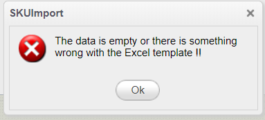
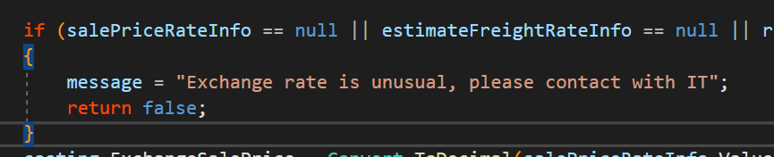
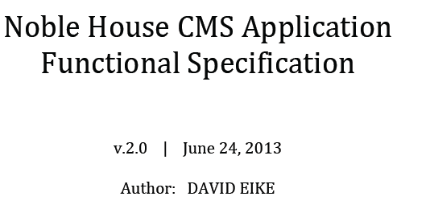

#常见翻译清单- 高度相似的词汇(2)
@(星瑞格)[翻译, 公司, 公司业务, dbAudit翻译]

[toc]


### 6.11 独立的组件:Stand-alone(而不是independent)

Connections, imports, exports, and lookups are [all stand-alone resource components](https://docs.celigo.com/hc/en-us/articles/360019292691) in integrator.io, and therefore each resource can be used in multiple flows without the need to make a copy of the same object every time. This is only true if you want to use identical resources in multiple flows.


[standalone/independent -- wordreference.com](https://forum.wordreference.com/threads/standalone-independent.3598145/)

### 6.12 Wrong v.s Incorrect




One of my clients advised me to use 'incorrect' over 'wrong' in content writing.

I agree that *incorrect* can be a "softer" word than *wrong*, particularly when pointing out someone's mistake. The two words indeed overlap in meaning, but the word *wrong* can be used to refer to moral lapses, while *incorrect* isn't really used that way. That's why *wrong* can seem like a "more negative," "more harsh," or "more personal" word than *incorrect*. Compare these definitions from Collins:

> **wrong** (*adjective*)
> **1** not correct or truthful ⇒ *the wrong answer*
> **2** acting or judging in error ⇒ *you are wrong to think that*
> **3** immoral; bad ⇒ *it is wrong to cheat*

with these:

> **incorrect** (*adjective*)
> **1** false; wrong ⇒ *an incorrect calculation*
> **2** not fitting or proper ⇒ *incorrect behaviour*

As for any difference where you'd use one word for speech and the other for writing, I wouldn't agree with that difference. When talking about grammar problems, I think you could use either one, irrespective of whether speech or writing is being evaluated:

> -   That sentence uses the wrong verb tense.
> -   That sentence uses an incorrect verb tense.

In that case, *wrong* isn't all that more "harsh" than *incorrect*, because it's clear from the context that we are only talking about verb conjugation, and not some kind of moral belief or behavior. I think either sentence could be used to correct someone's speech or writing.

1. [Wrong or incorrect? -- Stackexchange](https://ell.stackexchange.com/questions/13087/wrong-or-incorrect)


### 6.13 111th v.s 111st

Further information: [English ordinal numbers](https://en.wikipedia.org/wiki/English_ordinal_numbers "English ordinal numbers")

-   *-st* is used with numbers ending in *1* (e.g. *1st*, pronounced *fir**st***)
-   *-nd* is used with numbers ending in *2* (e.g. *92nd*, pronounced *ninety-seco**nd***)
-   *-rd* is used with numbers ending in *3* (e.g. *33rd*, pronounced *thirty-thi**rd***)
-   As an exception to the above rules, all the "teen" numbers ending with *11*, *12* or *13* use *-th* (e.g. *11th*, pronounced *eleven**th***, *112th*, pronounced *one hundred [and] twelf**th***)
-   *-th* is used for all other numbers (e.g. 9th, pronounced *nin**th***).
-   One archaic variant uses a singular *-d* for numbers ending in 2 or 3 (e.g. *92d* or *33d*)

1. [Ordinal indicator --Wikepedia](https://en.wikipedia.org/wiki/Ordinal_indicator#English)
2. [111th Division -- Wikepedia](https://en.wikipedia.org/wiki/111th_Division)


### 6.14 Contact me v.s Contact with me




> Q: I think it should always be "contact me" as contact is a transitive verb and should be followed by an object. But could someone clarifies? Is "contact with me" correct usage in some context?

When used as a verb, "contact" is always transitive. As such, you are correct: it should always be "contact me."

Note that the phrase "contact with me" may appear as an object in other situations, where it may be mistaken for a verb. Example: The other day, my long lost brother **made contact with me**. In this example, made is the verb, and contact is its direct object.

```
message = "Exchange rate is unusual, please contact the Administrator";
```

- **参考**：

1. [Should it (always) be “contact me” or (sometimes) “contact with me”? -- Stackexchange](https://english.stackexchange.com/questions/30524/should-it-always-be-contact-me-or-sometimes-contact-with-me)
2. [“Contact me” vs. “Contact with me” --stackexchange.com ](https://ell.stackexchange.com/questions/136082/contact-me-vs-contact-with-me)

### 6.15 Requirements v.s Sepcifications




The sound-bite answer is that **requirements are what your program should do** **the specifications are how you plan to do it**.

Another way to look at it is that the **requirements represent the application from the `perspective of the user`, or the business as a whole. The specification represents the application from the `perspective of the technical team`**. 

Specifications and requirements roughly communicate the same information, but to two completely different audiences.

-------------------

Requirements document what is needed - they shouldn't specify the how, but the what. Specifications document how to achieve the requirements - they should specify the how.

In many places these documents are not separate and are used interchangeably.

- **参考：**

1. [What is the difference between requirements and Specifications? -- StackOverflow](https://softwareengineering.stackexchange.com/questions/121289/what-is-the-difference-between-requirements-and-specifications)

### 6.16 Go live & live data

> WARNING: You have selected a Production application! Any changes you make will directly affect live data.
[Go-live is the time at which something becomes available for use](https://searcherp.techtarget.com/definition/go-live-go-live). In software development, for example, go-live is the point at which code moves from the test environment to the production environment. 

As a verb, go-live means to make such an event happen.


- **If any time server dies.**
This type of version control allows the clone of the complete codebase (repository) including its full history on every developer’s system. [If any time server(main repository) dies,](https://medium.com/swlh/things-about-git-and-github-you-need-to-know-as-developer-907baa0bed79) any of the developer’s repository can be copied on to the server which helps restore the server.


- **参考：**
1. [go-live (go live) -- TechTarget](https://searcherp.techtarget.com/definition/go-live-go-live)
2. [Things About Git and Github You Need to Know as Developer -- Medium](https://medium.com/swlh/things-about-git-and-github-you-need-to-know-as-developer-907baa0bed79)


### 6.17 Encoding v.s Escaping

- **参考：**
1. [Is Encoding the same as Escaping? -- StackOverflow](https://stackoverflow.com/questions/4354228/is-encoding-the-same-as-escaping)

### 6.18 TB、GB、 MB、KB怎么发音

- TB = **TeraByte /ˈterəbaɪts/**
- GB= **Gigabytes /`ˈgɪgəˌbaɪts`/**
- MB = **Megabytes `/ˈmɛgəˌbaɪts/`**
- KB = **KiloBytes /`ˈkɪloʊˌbaɪts`/**

**Tabular Representation of various Memory Sizes:**
|    NAME   |      EQUAL TO     |               SIZE(IN BYTES)              |
|:---------:|:-----------------:|:-----------------------------------------:|
|    Bit    |       1 bit       |                    1/8                    |
|   Nibble  |       4 bits      |                 1/2 (rare)                |
|    Byte   |       8 bits      |                     1                     |
|  Kilobyte |     1024 bytes    |                    1024                   |
|  Megabyte |  1, 024kilobytes  |                1, 048, 576                |
|  Gigabyte |  1, 024 megabytes |              1, 073, 741, 824             |
| Terrabyte |  1, 024 gigabytes |           1, 099, 511, 627, 776           |
|  Petabyte | 1, 024 terrabytes |         1, 125, 899, 906, 842, 624        |
|  Exabyte  |  1, 024 petabytes |      1, 152, 921, 504, 606, 846, 976      |
| Zettabyte |  1, 024 exabytes  |    1, 180, 591, 620, 717, 411, 303, 424   |
| Yottabyte | 1, 024 zettabytes | 1, 208, 925, 819, 614, 629, 174, 706, 176 |


The ascending prefixes *tera* (1000^4^), *peta* (1000^5^), *exa* (1000^6^), *zetta* (1000^7^), and *yotta* (1000^8^) are based on the Greek-derived [numeric prefixes](https://en.wikipedia.org/wiki/Numeric_prefix "Numeric prefix") *tetra* (4), *penta* (5), *hexa* (6), *hepta* (7), and *octo* (8). In addition, the final letters of the alphabet, *z* and *y*, appear in the largest SI prefixes, *zetta* and *yotta*. Similarly, the descending prefixes *zepto* (1000^-7^) and *yocto* (1000^-8^) are derived from Latin/Greek *septem*/*hepta* (7) and *octo*/*oktô* (8) plus the initial letters *z* and *y*.

8个字节含二进制位____。
A、8个
B、16个
C、32个
D、64个

【答案】D.
一个字节等于8位

----------------

- **参考：**
1. [Understanding file sizes | Bytes, KB, MB, GB, TB, PB, EB, ZB, YB](https://www.geeksforgeeks.org/understanding-file-sizes-bytes-kb-mb-gb-tb-pb-eb-zb-yb/)
2. [Unit prefix --Wikipedia](https://en.wikipedia.org/wiki/Unit_prefix)

### 6.19 Technology-implementation-agnostic(与技术实现无关的)

GraphQL is not a framework, but a [technology-implementation-agnostic](https://developer.akamai.com/blog/2019/04/08/graphql-101-what-why-and-how) specification. (GraphQL不是一个框架，而是一个与技术实现无关的规范)

**agnostic `/æɡˈnɑːstɪk/`**: A person who believes that it is not possible to know whether God exists or not.  (不可知论者（认为上帝存在与否是不可知的）


### 6.20 wait v.s await:

First, there is no noun form for 'await'. Await is used only as a verb and requires an object. It is often used in more **`formal`** or **serious** writing and speaking. It takes the place of “to wait for.”

For example, you can say, “We await your answers to these questions,” instead of “We wait for your answers to these questions.”

It is commonly used when you are waiting for something expected but not in the immediate sense. For example:

> “The couple await the birth of their first child.”

1. [Wait or Await? --VOA](https://learningenglish.voanews.com/a/wait-or-await-/5089141.html)

### 6.21 Locale v.s Location

```javascript
window.locale = {
    "fileupload": {
        "errors": {
            "maxFileSize": "File is too big",
            "minFileSize": "File is too small",
            "acceptFileTypes": "Filetype not allowed",
            "maxNumberOfFiles": "Max number of files exceeded",
            "uploadedBytes": "Uploaded bytes exceed file size",
            "emptyResult": "Empty file upload result for customer"
        },
        "error": "Error",
        "start": "Start",
        "cancel": "Cancel",
        "destroy": "Delete"
    }
};
```

Location refers to a specific point on a map. Think of an address on a street, or a geographical place that can be found on a chart. Locale is more general. 

In the dictionary, the definition for locale is "a place where something happens or is set, or that has particular events associated with it". For example, "**her summers were spent in a variety of exotic locales**"

Locale seems to be used less often, and it is not interchangeable with the word location.


1. [What is the difference between locale and location? -- italki](https://www.italki.com/post/question-412058?hl=en)


### 6.22 Stage

- 第一次见到Stage这个词是Git管理软件SourcTree,当时看到两个buttons【Stage All】、【Stage selecte】,当时完全不理解Git的工作方式，所以对这两个按钮非常陌生，一头雾水。好在随着操作多了，也就麻木了
- 之后在系统的学习Git过程中才知道Git把版本控制分为了三个部分：
	1. Working directory (工作区)
	2. Stage/index area (暂存区)
	3. Repository(仓库)
-  在理解了整个Git原理之后，再回去看Stage就一下子就的好理解了
-  Stage这个单词有非常多的意思，其中名词有这样一种解释：a period or state that sth/sb passes through while developing or making progress
> 发展或进展的）时期，阶段，状态
> - This technology is still in its early stages. 
> - The children are at different stage of development
> - Don't worry about the baby not wanting to leave you─it's a stage they go through
-  最后可以看到那2个按钮的意思是：添加（所选/全部）文件到暂存区，是动词，也是前面那个名词的意思延伸过来的。

然后今天看到邮件里面有这样一行文字：
> Hi gents,
> 
> Thanks for joining the quick call just now.
> 
> Please find below the summary and actions discussed:
> 
> **1. Current subscription of AWS Aurora DB**
- **Anthony **will share the current Aurora subscription - **both Production and Staging**
- **NH team **will confirm back the desired Reserved Instance subscription