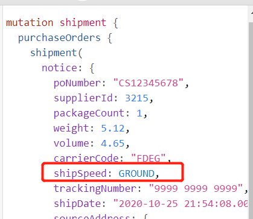
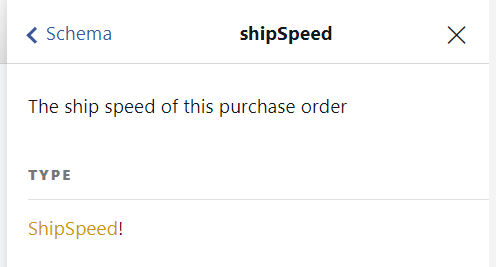
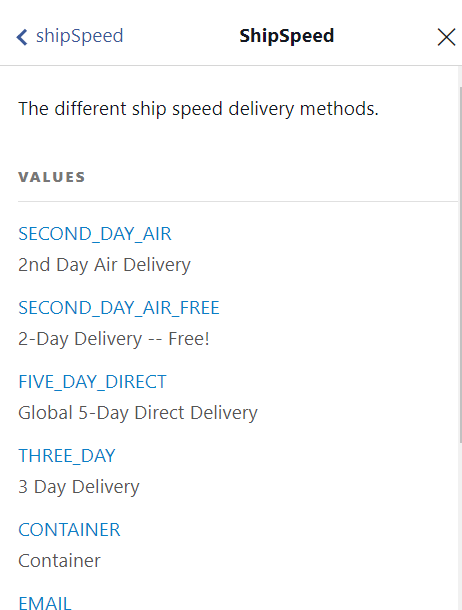

# 常见翻译清单-Part 1
@(星瑞格)[翻译, 公司, 公司业务, dbAudit翻译]

[toc]


说明：多个词组，一般以第一个为准。譬如 默认值/缺省值，一般以 默认值 为准。 但是有时候有些地方会出现 缺省值，如果既定现实，就无需修改。

## 0. 常用的提示

| Col1      |     Col2 |   
| :-------- | --------:| 
| error|   An error has occurred **while** trying to ...|
|alread exists| The same name already exists|
|Attempting stop| (do [IISRESET](https://serverfault.com/questions/622198/access-denied-trying-to-run-iisreset-logged-in-as-a-local-aministrator))<br>Type Regedit then hit enter| 
|1 Questions **remaining**| 如果是我容易翻译成 [1 Questions left](https://university.celigo.com/assessment/Question?questionId=5583894&courseId=3338502&moduleId=8139867&LPId=110861)| 
|**Something went wrong [generating](https://nhservices-review.eliteextra.com/x/api/track/1) the track url** | 我容易翻译成： Something is wrong when/while generating the track url|
|Cloud-based| 容易写成 Based on cloud|


[How to Write Good Error Messages](https://uxplanet.org/how-to-write-good-error-messages-858e4551cd4)


- It gives you a tour of the data in this Sandbox and shows you some of the queries you can run.
- You can **advance** the guide by clicking on this arrow.
- If this is **`indeed`** correct then you don't need to do anything.(如果这确实是正确的，那么你不需要做任何事情)
- 

## 1. Common 
| 简体     |     繁体 |   英文   |
| :-------- | :--------| :------ |
| 数据库 | 資料庫 | Database| 
|数据孤岛| |[Data Silos](http://haystackdata.com/introduction-to-self-service-analytics-part-2-data-silos/)(注意不是Data Island)|
| 服务器 | 伺服器 | Server| 
|数据仓库| 數據倉儲 | Data Warehouse|
|用戶|使用者|User|
| 审计 | 稽核| Audit|
| 缓冲  |   緩衝 |  Buffer| 
| 缓存|   快取|  Cache|  |
|内存 | 記憶體|  Memory|
|文件|檔案|File|
|默认值/缺省值|預設值|Default value|
|告警 | 警示 |  Alert|
|访问| 存取 | Access |
| 配置/设置| 設定/配置/設置 |  Setting/Configuration |
|列/字段 | 欄位 | Column |
|即席查询[^1] | |  Ad Hoc |
|数据库弱点 || DB Vulnerabilities<br> 不是 DB Weakness|
|等保法|資安等保法|AMGPIS|
|策略 | 政策|Policy |
|模板| 範本| template|
|界面|介面|Interface/UI|
|自定义|客製化|Customize / custom[^2]|
|本周|本週[^3]|This Week| 
|标签|标籤[qiān]|Label、Tag|
|任务调度|排程|Schedule|
|调度程序|排程|Scheduler[^4]|

[^1]: 由用户自定义查询条件（通常是系统报表），可以理解为立马生效的查询。（An ad hoc activity or organization is done or formed only because a situation has made it necessary and is not planned in advance.）

[^2]:可以参加下图 Microsoft的截图，正确应该是 customize,  大家通用 custom

[^3]:Nina: 好問題,兩個我看都有人用, 我查了一下,以前是都有人用,不過應該是"週" 比較正式

[^4]: computer hardware that arranges jobs to be done by the computer in an appropriate order

## 2. 按钮 Button
所有英文按钮，首字母都必须大写
| 简体     |     繁体 |   英文   |
| :-------- | :--------| :------ |
| 添加 | 新增 | Add |
|查找| 搜尋 |Search| 


## 3. 校验 Validation

| 对象 | 简体     |     繁体 |   英文   |
|:--------:| :-------- | :--------| :------ |
| IP地址 | IP地址格式不正确  | |
| 手机号码 | IP地址格式不正确  | |
| 电话/传真 | IP地址格式不正确  | |
|xx已存在|xx已存在||xx already exists[^4]|
|密码校验|Invalid new password: needs to be min. 8 characters long and contain one number, one uppercase and one lowercase character[^5]||


[^4]: The Record Already Exists, UUID already exists. 若翻译为xxx has already exists. has本身是动词，exist也是动词；
[^5]: 参考了 BrightPearl的UI

### 3.1 邮件
主要参考[Gmail](https://mail.google.com/mail/u/0/#inbox?compose=new)的:

| 对象 | 简体     |     繁体 |   英文   |
|:--------| :-------- | :--------| :------ |
| 发件人为空 |  | | Please specify at least one **recipient** |
|发件人不合法| || The address "1" in the "To" field was not **recognized**. Please make sure that all addresses are properly formed.|
|Subject（Title)为空|||Send this message without a subject or text in the body?|
|Do not reply | ||This e-mail was sent from a notification-only address. Any reply to this e-mail will not be received by Overstock.com If you need further assistance please contact our Customer Care team|
|Reply to this email| ||Please let us know by replying to this email or give us a call at 1-9---843-2446  and we will be more than happy to help|

## 4. 法规法条相关

- **国会和各州的立法机关出台的规定叫“法律（law）”**
- **政府机构出台的规定叫“规章（regulation）”**
> 引用自《灰色企业家2：法规是怎样积重难返的？--精英日课4》（万维钢，2020-9-7）
>  Clyde Wayne Crews Jr., [How Many Rules And Regulations Do Federal Agencies Issue?](https://www.forbes.com/sites/waynecrews/2017/08/15/how-many-rules-and-regulations-do-federal-agencies-issue/#732b5d321e64) forbes.com Aug 15, 2017.

### 4.1 法规法条与法规遵守翻译

**起因**：对审计和数据安全行业的：法律、法规、法条已经compliance具体指代什么感到混乱和困惑。

| 简  |     繁|   英 | 
| :-------- | --------:| :------|
| **合规审计** |  法條施行對照單 | **Compliance** | 
| **法规** | 法規  |  **Regulations** |
| **法条**|  法條 | **Acts** |
|**法律**|法律 | **Law**|

说明:
1. 根据这篇文章[Facebook Lenses](https://stratechery.com/2018/facebook-lenses/),可以推断的出来，***DGRP***是一种**Regulation**，不是**Compliance**,也不称呼**Law**(Regulation是Law的具体实现，算是Law的子集)
> of course neither company wants to incur the costs entailed in such significant **regulation**, which will absolutely restrict the amount of information they can collect. (当然，两家公司都不想承担此类重大监管所需的成本，这将绝对限制他们可以收集的信息量。)
2. 实际上GDRP就是**(the European Union’s) General Data Protection Regulation**的缩写，可以参考阅读这篇文章[Open, Closed, and Privacy](https://stratechery.com/2018/open-closed-and-privacy/)
3. 那么法律(Law)与法规(Regulation)的区别在哪呢？可以参考这篇文章[Difference Between Law and Regulation](https://www.differencebetween.com/difference-between-law-and-vs-regulation/),总结出如下三点：
> 1. Laws originate in the legislative assembly whereas regulations originate in administrative agencies and departments.(法律起源于立法议会，而法规则来自行政机构和部门)
>  <br>
> 2.  Regulations are subordinate to the laws though they are enforceable just like law. (法规与法律一样具有强制执行效力，但是法规却服从与法律)
>  <br>
> 3. Regulations are introduced to help in the implementation of laws. （法规的引入是为了帮助法律的实施，to make the implementation of these laws easier）
4. 根据[Differences: Acts and Regulations](https://www.slp.wa.gov.au/faq.nsf/Web/Topics/C39627DF9C3527E348256CA8000DCBE5)文章，大意是**Regulation,Rules,Code**是Act的具体实现，而Act是由国会(Parliament)通过的法案。
5. 那么**law**和**act**的区别，[](https://law.stackexchange.com/questions/16660/what-is-the-difference-between-a-law-and-an-act)文章给出了非常详细的解释：
6. **Compliance** 单从字面比较难以理解（顺从是什么鬼），但是结合这里上下文，可以看的出来，是当前企业购买了审计产品，并设置好了策略，进而实现了regulation的各项规定，因此可以翻译为成功地**实施了法规/法条**的过程（**是否合规的意思**）。
> 实际上[牛津字典](https://dictionary.cambridge.org/dictionary/english/compliance)对 compliance的第一条解释是：
>  
> The act of obeying an order, rule, or request. 
>  
> 那么针对法律的compliance是可以翻译为合规的意思。**compliance audit** 就是 合规性审计。


### 4.2 法规名称翻译

相关ID：[dbAudit法条名称列表确认](http://192.168.82.98/issues/4842)

| 简      |    繁| 英 |
| :-------- | --------:| ------: |
| 审计追踪| 稽核追蹤 |  Auditing   |
| 异常管理|   異常管理 |  Abnormality Mgmt |
| 等保法|  資安等保法 | [AMGPIS](http://www.lawinfochina.com/display.aspx?id=6401&lib=law&SearchKeyword=&SearchCKeyword=%d0%c5%cf%a2%b0%b2%c8%ab%b5%c8%bc%b6%b1%a3%bb%a4)|
| ISO17799|  ISO17799 | ISO17799|
| Basel II III|  Basel II III | Basel II III|
| HIPAA法案|  HIPAA | [HIPAA](https://www.sciencedirect.com/topics/computer-science/health-insurance-portability-and-accountability-act)<br> **Health Insurance Portability and Accountability Act** |
| SOX|  SOX| [SOX](https://www.sciencedirect.com/topics/computer-science/sarbanes-oxley-act)<br>**Sarbanes–Oxley Act**|
| GLBA法案|  GLBA| [GLBA](https://www.sciencedirect.com/topics/computer-science/gramm-leach-bliley-act)<br>**Gramm-Leach-Bliley Act**|
| PCI-DSS|  PCI-DSS | PCI-DSS|
| COBIT|  COBIT| COBIT|
| ISO27001|  ISO27001| ISO27001|
| 个资法 |  個資法| Personal Information Protection Law|
| ISO27011|  ISO27011| ISO27011|

### 4.3 参考信息

#### lawinfochina:
> 目前中国只有针对行业的个人信息保护法，如下：
> 1. [互联网企业个人信息保护测评标准 [现行有效] ](http://www.lawinfochina.com/display.aspx?id=23460&lib=law)
>  <br>
>2. [信息安全技术 公共及商用服务信息系统个人信息保护指南 [现行有效] ](http://www.lawinfochina.com/display.aspx?id=23476&lib=law)
><br>
> 3. [信息安全技术 公共及商用服务信息系统个人信息保护指南 [现行有效] ](http://www.lawinfochina.com/display.aspx?id=23476&lib=law)
>     <br>

#### 等保法：
> [公安部、国家保密局、国家密码管理局、国务院信息工作办公室关于印发《信息安全等级保护管理办法》的通知 [现行有效]](http://www.lawinfochina.com/display.aspx?id=6401&lib=law&SearchKeyword=&SearchCKeyword=%d0%c5%cf%a2%b0%b2%c8%ab%b5%c8%bc%b6%b1%a3%bb%a4)
>  
>   **the Administrative Measures for the Graded Protection of Information Security** AMGPIS

#### 小结：
1. Graded:等级； Classification:分类。
2. 关于法规法条的设计，参考这篇文章[dbAudit专项记录–法规法条](https://www.evernote.com/l/ALr2spaNAbJImoyNLosUqjzL-ehlXfm0Q7A/)


## 5.  奇怪的知识又增加了

### 5.1 Variation [`ˌveriˈeɪʃn`]

- [A variation of an export is a looup](https://docs.celigo.com/hc/en-us/articles/360019292691-Introduction-to-integrator-io). (Lookups 是导出的一种变体)
- A change, especially in the amount or level of sth. （数量、水平等的）变化，变更，变异
- A thing that is different from other things in the same general group. (变异的东西；变种；变体)

###  5.2 Scarce v.s Scare

- **Scarce /skeə(r)s/ **
> Before the arrival of recorded music, what [used to be scarce](https://eriktorenberg.substack.com/p/build-personal-moats) was the actual music itself. 

- **Scare /skeə(r)/**
 >  scare the shit out of sb / scare sb shitless.

### 5.3 Curation /ˌkjuːˈreɪʃən/ 策展/策划
> n.	治疗；【IT】(对数字信息的)综合处理；策展

**The action or process of selecting, organizing, and looking after the items in a collection or exhibition.** 

eg:
> It’s important to know that moats change over time as conditions change. Before the arrival of recorded music, what used to be scarce was the actual music itself — required an in-person artist.  After recorded music, the music itself became abundant and [what became scarce was curation](https://eriktorenberg.substack.com/p/build-personal-moats), distribution, and self space. *护城河会随着条件的变化而变化。比如，录音技术诞生之前，稀缺的是音乐本身，你想听音乐，就需要有一个艺术家给你现场表演。现在，音乐录音到处都是，稀缺的是策划、发行和个性的展示。*


### 5.4  as-is / as it is (原样)

> Edit merchant info including name, wms parameters, and schedules. [Any fields left off will be left as-is.](https://developers.cartrover.com/?version=latest#079c1875-9b93-4b23-9b43-736d928bdf44) （任何未完成的字段将按原样保留）。


第一次看到 这句话，真有点一脸懵逼，随着分析发现，主要是对**as-is**不懂。如果改成**as it is**可理解性就大幅提升了。

查了几个字典：
(or **as it is**)： in the existing state of affairs /  in the state that something is in at the present time.
> Will you wait till it's finished or take it home as-is?  你是等着它完全做好呢，还是就这样拿回家？


### 5.5 Schema

[A schema defines](https://developer.akamai.com/blog/2019/04/08/graphql-101-what-why-and-how) the structure of objects and the relationship between them. 

记得当年刚毕业第一次遇到**Schema**这个单词，一个全新的术语，很难理解，对这个单词一直存在着模模糊糊的认知，直到最近开始接触GraphQL方面的编程，才对这个单词有一个比较完整的认识。

在做GraphQL的Query和Mutation过程中，经常遇到一些不符合Schema的校验导致报错的情况，比如：

  


如果这里的`shipSpeed`传递进去的不属于内置的这些数据，着会报错：


```
Expected type ShipSpeed at value.shipSpeed.
```

我想一开始看文档我是看不明白的，只有通过不断的调试，测试，观测，让系统自动给出**反馈**，才能解决问题。不仅仅解决问题，更重要的是通过这种方式我能不断感知到系统是如何运作，以及一些难以理解的术语，比如Sechema，到底是怎么回事。 一旦跨过去这道坎，后面对这个概念相关的领域就是一片坦途，感觉好简单，一如当年反复阅读和编程过几次C#委托之后的情况。


### 7.5 on behalf of 

Are you signing up [on behalf of](https://zoom.us/activate?code=zDNPISAQHYi5ySD1TzFReva9kSpn3GNN1XnFC2PSRnM.AG.sMJNde8QoaYiAS8CsW8Be53GMZCyxkY-ayfrArrE09AX-puIibwdrIC-iuDLJj1g1qO-yk0oLod05tjRgqUDCR2XvyFHSoGCFm82UbPA049FUz8eePikGQpMj5hTc2WMST1vltcdnw.WzXAY31E0daePWIvrAyj5A.meCEnhxhcH7GZZA_&fr=signup) a primary or secondary (K-12) institution?

### 7.6  Automate what should be automated

[Unparalleled](https://apilayer.com/) suite of productivity-boosting Web APIs & cloud-based micro-service applications for developers and companies of any size

### 7.7 Criteria `[kraɪ'tɪriə]`

#### 1. 不要误写成 **Crit`i`eria**

#### 2. [Search Criteria](https://www.ibm.com/support/knowledgecenter/SSSH5A_7.1.2/com.ibm.rational.clearquest.api.tut.doc/topics/cqapi_filters_and_fields.htm) v.s [Search condition](https://docs.oracle.com/database/121/TTSQL/search.htm#TTSQL262)

You can [specify certain criteria in a search condition](http://www.cs.toronto.edu/~nn/csc309/guide/pointbase/docs/html/htmlfiles/dev_searchcondandpredicates.html) and predicate for an SQL statement to perform to the database. 

#### 3. Criteria vs Criteras


### 7.8 orchestration  /[ˌɔrkɪ'streɪʃn/

In essence, this means Kubernetes is [a container orchestration engine](https://www.zhihu.com/question/22436320/answer/32477238), a platform designed to host and run containers across a number of nodes. 
> Kubernetes是一个容器编排(管理)引擎

- the arrangement or scoring of music for orchestral performance.
> "Prokofiev's mastery of orchestration"

- the planning or coordination of the elements of a situation to produce a desired effect, especially surreptitiously.
 > "the orchestration of the campaign needed tightening"


### 7.9 Combination / combined 用法

the combination of xxx and xxx;

- Ideally, we have a hybrid, **a combination of both** functional **and** project organization.
- [The combination of massive reductions](https://frame.work/blog/in-defense-of-dumb-tvs) in panel costs, decreasing costs for embedded compute, and the ready availability of content platforms from Google, Roku, **and** others have made the term irrelevant.
- Decreasing prices and decreasing margins on TVs **combined with** long replacement cycles have driven companies to take advantage of built-in smarts to enable a new revenue source: user data and advertising. 

### 7.10 hosting service （托管服务）

Github is a **cloud-based [host service](https://medium.com/swlh/things-about-git-and-github-you-need-to-know-as-developer-907baa0bed79)** for Git repositories. 

从这里可以看出，.NET的主机，其实就是托管的意思，如果不知道背后英文的意思，那么理解所谓的主机，在思维上会和传统上的主机练习在一起，形成隔阂，有点难以理解。


### 7.11 Infographics

[Infographics](https://www.educba.com/stock-vs-inventory/): A picture or diagram or a group of pictures or diagrams showing or explaining information.

## 8. 邮件用词记录

- **Escalation process**:  Maybe we should agree on an 'escalation process' to see how or when we will contact BP directly to resolve some open issues. 
- Thanks guys for **reaching out directly to** XXX.  Actually, I asked Lee to **copy in** XXX **`for his awareness`** and yet to formally escalate the issue to him because it is impacting small number of orders only.  Apologize for causing some panic on your end without prior notice.
- Looking forward to hearing back. Cheers.
- I found an order example from the list that ~~which~~ was not **manually fulfilled** and **`a comparison of` how it should have run with Automations**, please take a look.
- Thanks for **sending this `over`**. (Send this over to me ?).
- Thanks for your patience.
- Hi xxx, **Just keeping you ~~update~~ updated here**.
- I will **`be in touch`** today.


## 9. References & Connection
1. [Laws and Regulations - sciencedirect. ](https://www.sciencedirect.com/topics/computer-science/laws-and-regulation)

2. [What is the difference between a law and an act? -  StackExchange](https://law.stackexchange.com/questions/16660/what-is-the-difference-between-a-law-and-an-act)

3. [哪些专业名词翻译得特别烂？](https://www.zhihu.com/question/27192923/answer/2068334212)

   > 哪些专业名词翻译得特别烂？ - Gengius的回答 - 知乎 https://www.zhihu.com/question/27192923/answer/2068334212

4. [北京市人民政府外事办公室](http://wb.beijing.gov.cn/so/s?tab=all&siteCode=1100000175&qt=%E8%8B%B1%E6%96%87%E8%AF%91%E5%86%99)

5. [常见外贸术语](https://www.evernote.com/l/ALrJb00sTXhFqJ7Sv7F7Wwi33x3UjE774Cw/)


##  10. 文档修订记录

| 版本号|     变化状态|   简要说明|  日期	|   变更人/参与者   |
| :-------- | :--------| :------ |:------ |:------ |
| V1.0|   建立| 新建文档 |2018-5-14  | Lee|
| V2.0|   增加| 新增`法规法条相关` |2019-5-14  | Lee|
|V2.1|增加| 新增`高频平写错误单词`|2020-5-14|Lee |
|V2.2|增加| 新增`高度相似的词汇`|2020-5-19|Lee |


*变化状态：建立，修改，增加，删除
