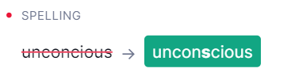

#常见翻译清单-Part 4 高频出错词汇
@(星瑞格)[翻译, 公司, 公司业务, dbAudit翻译]

[toc]

## 1. 高频出错词汇

最近在开发过程种，发现有些词汇拼写错误率非常高。都是靠**Resharper**指出来了。因此有必要在这里记录并时不时复习一下。

| 词语 |     错拼|   备注|
| :-------- | --------:| :------ |
|**Label**|Lable|老喜欢把e放在最尾巴...|
|**Field**|Filed|同上....|
| **Successfully** |   Sucessfully |  中间两个`c`容易拼漏掉一个|
|**Success**|Sucess| 理由同上...|
|**Corresponding to**  **/ˌkɔːrəˈspɑːndɪŋ/**|Crossponding to| |
|**[Scenario](https://www.evernote.com/l/ALo7Jbuxf8BEKYE8DIJr6C3RW5G60OHUBH0/)**|Senario| 经常把`SC`开头的`C`给漏掉了。|
|**Scene**  `[siːn]`|Sceen/Scnee| 这个是因为不会拼读....|
|**split `/splɪt/`**|splite|好几次了，老习惯性在尾巴上加e|
|**Extremely**|extremly |-ly前面容易把`e`给漏掉|
|`!`**Fulfillement**| Ful`l`fi`l`ement|多一个`l`，少一个`l`|
|**Responded**|responsed | **Response**是**`Respond`**的名词形式,因此 Reponse的动词形式分别是responds, responding, responded|
|**bound**| binded| 这个...完全是因为`bind`过去式不知道导致的|
|**Caught**|catched|同上 Exception caught|
|**Issue**||这次我经常习惯性打成了Issues，虽然没有错，但是在表示单个的时候应该用**Issue**|
|**Although**|aloutht|1\. 漏掉th; 2. 多打 t|
|**occasionally**|occationaly|1\. `sion` 拼成了 `tion` 2. y前面少了一个l|
|**unconscious** | unconcious||
|**configured** |configed | 2021-7-14 |
|**Merge**| merg| 2021-7-14|
|**negotiate**| negociate | 2021-8-13 |

## 2. 高频写错的句子

- Any 后面基本要跟上复试形式?(也要看名词的可数和不可数性质)： [Any + plural v.s any + singular](https://forum.wordreference.com/threads/any-singular-plural-if-you-have-any-problem-problems.1853363/)。 之所以说复数更正确，是因为我在写这句话的时候，被Grammarly提示需要加上s了：we ask them to raise alerts hourly when the process encounters any **exceptions**.
> [Both are correct](https://www.englishforums.com/English/AnyProblemsVsAnyProblem/wcmvq/post.htm#:~:text=Both%20are%20correct,%20but%20even,singular%20would%20sound%20really%20odd.), but even if you think they will have no problems, or even one problem, "any problems" is more common.
> 
> With "any questions" or "any question" the singular would sound really odd.
>  
> 2021-2-20 15:06:08

- [avoid doing sth](https://www.hjenglish.com/new/p963865/). (没有 avoid to do sth.)

## 3. 高频遗漏的介词

- Hi Dean, any progress about **the** CeligoWayfariCSN warehouse missing? 经常忘记定冠词 **The**.
- Thanks for following up **`on`** this issue.
- Due to **`THE`** lack of Custome Fields value.
- Since it occurs **`from`** time to time.
- I am very pleased to apply **`for`** the product manager position. 
- we really concern **`about`** what happened behind and how to avoid such a similar situation. 
- Being stuck **`in/with`** the past of the shadow
> [If you can be X, then you can say get X to express you (or someone else) are transitioning into state X](https://ell.stackexchange.com/questions/152966/be-stuck-vs-get-stuck). Often you can substitute become.
> 
> Once you are X, you have got X.
> 
> --------------
> I think you could use 'stuck in the past' though the two phrases do have subtle differences. ['Stuck' suggests a mentality](https://forum.wordreference.com/threads/trapped-in-the-past-vs-stuck-in-the-past.2936869/) (the person is too conservative, set in their ways, to 'move on') whilst 'trapped' suggests something external trapping one; some outside circumstances.
> 
> We talk of people being 'set in their ways' and this suggests being stuck rather than trapped.

- I tried to search **`for`** an order with BPID = 149601
- We will continue to closely monitor **`the`** relevant support system.
- So I think they have the experience dealing ~~to deal~~ with such a situation.

