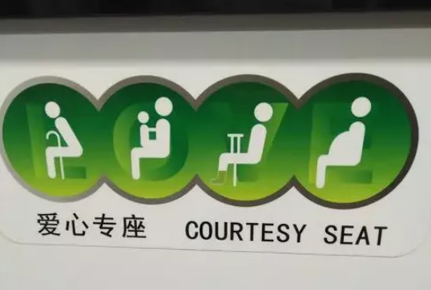
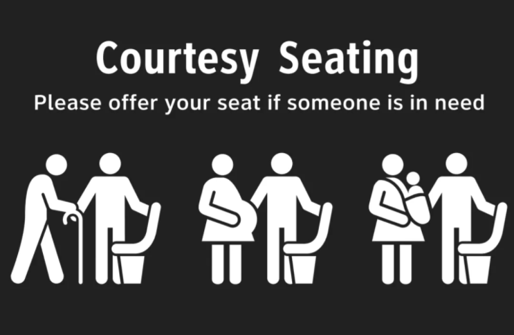
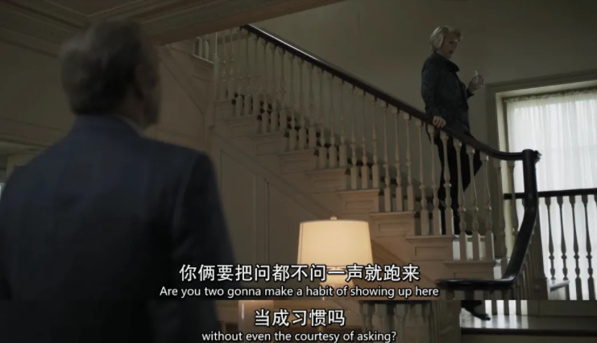

# Courtesy_vs_Politeness

[toc]

## 007的这句话

007系列电影第25部《007：无暇赴死》已经上映，前几天我去电影院看了，剧情我就不说了，视觉效果不错，我不是专业的影评人，电影就不做分析，只聊聊其中的一句英文：

- **I'm here as a professional courtesy.**

背景是007在酒吧里偶遇一位风姿绰约的黑人女子，作为风流特工的他自然照旧施展泡妞大法将女子带回自己的湖边别墅，但他不知道的是这位黑人女子也是英国特工，想要和她调情，结果黑人女子立即拆穿他并且说了上面这一句话。

此时中文字幕显示的翻译是：

- **我来这里是出于职业礼貌。**

我之所以对这句话印象深刻，是因为我听到了**courtesy**这个词。说实话，我对这个词既熟悉又陌生，熟悉是我似乎在哪里见过这个词，也知道大概意思，陌生的是其实我并不知道怎么使用它，也不知道它的的准确意思。

## Courtesy seat： 爱心专座

字典里的解释无非是“礼貌”“礼节”，但这样的解释很抽象，不知道和politeness及etiquette有什么区别。

我终于想到在哪里见过这个词了，原来是在公交车上。公交车上一般都有“爱心专座”，用于礼让给老弱病残孕的乘客。当时我看到“爱心专座”翻译成了 courtesy seat，而没有烂俗地翻译成love seat，觉得这个翻译有水平，所以特意去查了一下courtesy的意思。

通过在Google 搜索，证明这个翻译是地道的。

当时候觉得courtesy seat可能就是“礼让座位”。

## Courtesy vs Politeness

在007电影里我又见到了courtesy这个词，不禁引起了我的好奇，这种**courtesy**和**politeness**到底有什么区别呢？

经过搜索大量的资料和多方查证，我终于弄明白了，先说结论：

**politeness**和中文里“礼貌”是完全相等的，和**rude**是相对的概念，主要表现为言语、表情、肢体语言上，比如骂人、竖中指、斜着眼看人就是不礼貌的行为，随便打探人的隐私也是不礼貌的行为。

**courtesy是一种情商行为，让人觉得很舒服或者受到尊重，很类似于我们说的“会做人”**。特别注意，这是一种情商行为，取决于每个人是否有这个意识，不像politeness是有一定的规范的。

### courtesy是一种情商行为

比如你参加聚会，结果你有急事要晚到，你提前打电话告诉主人，这种行为就是**courtesy**，但很难用**politeness**去定义。

比如你到了酒店， 服务员称呼你为“先生”“女士”，这是politeness，你退房后，酒店客服打电话回访你，问你住得怎么样，对他们的服务有什么建议，这就是courtesy，这种电话叫courtesy call （电话回访），表示他们很重视你的服务体验。但我们也很难用politeness来描述这种行为。

过年过节，给客户发邮件送礼物的行为，也都叫courtesy。

这些行为其实都无关礼不礼貌，就算不做也不会觉得你是一个rude的人，只是如果做了的话，给人的体验会比较好，是情商高的体现，让人觉得你重视他。

### 美剧例子

举几个美剧的例子：

> *Are you two gonna make a habit of showing up here without even the **courtesy** of asking?*

去拜访别人之前，先打电话问一下主人是否方便，如果问都不问就直接去了，这就是低情商的行为，所以这里用了**without even the courtesy of asking.**

> *You know what, if this were anyone else but you, I wouldn't even be giving the **courtesy** of this meeting.*

这句话的意思是，如果是别人，我连见面的机会都不会给（不会给他这个面子）。

> *If you're really going to start working with Ben, at least give Dana the common **courtesy** of telling him the truth about what you guys are doing.*

做任何事情之前，知会一下和这件事有关联的人，这也是尊重别人高情商的体现，所以这里用了give the common courtesy。

## professional courtesy

回到007电影里，什么叫**professional courtesy**呢？

鉴于professional的两重意思，**professional courtesy**也有两重意思。

1. **professional**指“***职业上的***”，所以professional courtesy就是指同行之间互相尊重互相给面子产生的**同行规矩**，比如医生找医生看病不用收费，同行和同行做生意有“同行价”，以及官官相护，因为大家都是同行，互相客气一点。

2. **professional**指“***工作上的***”，这是和**personal** 相对的，所以**professional courtesy**就是指工作上对客户、对同事的尊重的行为。

   比如：

   > *The thank you letter is a **professional courtesy** and an opportunity to reconnect with your customers.*

在007电影里，黑人女特工说 **I'm here as a professional courtesy** ，是第二个意思，表示我来你这里是因为工作的缘故和你客气一下而已（不要以为我对你有什么私人感情）。

## 承蒙...（免费）提供

最后，courtesy有一个特别的好的用途，表示“承蒙...（免费）提供”，用于表示感谢他人的好意，用词组**（by） courtesy of ...**表示，其中by可以省略。

- *Photo **by courtesy of** US Fish and Wildlife Service.*
- *Available free online **by courtesy of** the authors.*
- *First prize is two tickets to Australia, **courtesy of** Southern Airlines.*
- The waitress brings over some congratulatory glasses of champagne, courtesy of the restaurant...（女侍者端来几杯饭店赠送的用来庆祝的香槟。）
- The air was fresh, courtesy of three holes in the roof...（房顶有3个洞，所以空气很清新。）

## Reference

1. [《007 无暇赴死》里一句职场英语，太有用了--史蒂芬的专栏](https://mp.weixin.qq.com/s/DDJanD6HyojCmrK_9_srCg)