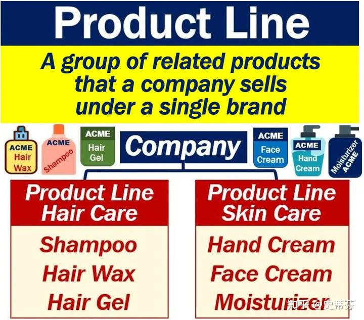
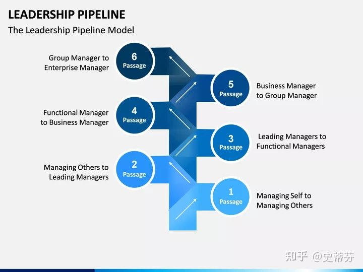

# 外企的 line manager是什么级别的领导？

最近有个小伙伴接到外企的面试通知，邮件里写到面试官的头衔是line manager，她来问我line manager是什么级别的经理，我一听乐了，原来这个名称还真会给人造成误解，从字面上看确实会以为是啥来头的经理，实际上这只对“直接上司”“[直线经理](https://www.zhihu.com/search?q=直线经理&search_source=Entity&hybrid_search_source=Entity&hybrid_search_extra={"sourceType"%3A"article"%2C"sourceId"%3A415116440})”的统称。

为什么会用到line这个词呢？

这里确实也会存在一些小小的误会。因为这个line这个词也可以指production line（[生产线](https://www.zhihu.com/search?q=生产线&search_source=Entity&hybrid_search_source=Entity&hybrid_search_extra={"sourceType"%3A"article"%2C"sourceId"%3A415116440})）。我刚毕业那会儿在外企工厂工作，每天和生产线打交道，我们一般称生产线就直接叫line，生产线的线长叫line leader，他负责管理一条line上所有的operator（操作员）。当统称所有的生产线的线长，也把他们叫line managers。[港资](https://www.zhihu.com/search?q=港资&search_source=Entity&hybrid_search_source=Entity&hybrid_search_extra={"sourceType"%3A"article"%2C"sourceId"%3A415116440})企业把生产线叫做“拉”，就是从line里音译过来，把线长叫做拉长，就是从line leader翻译而来。

大家可以看到，[line manager](https://www.zhihu.com/search?q=line+manager&search_source=Entity&hybrid_search_source=Entity&hybrid_search_extra={"sourceType"%3A"article"%2C"sourceId"%3A415116440})确实也可以指生产线的线长，没毛病。

除此之外，外企里还存在各种line。

比如product line（产品线），这个词组和production line（生产线）相似度很高，大家千万不要看错，它们是完全不同的东西。[product line](https://www.zhihu.com/search?q=product+line&search_source=Entity&hybrid_search_source=Entity&hybrid_search_extra={"sourceType"%3A"article"%2C"sourceId"%3A415116440})是某个品牌一个类别下的相似产品，它排列起来就像一根直线一样，如下图：

如一个品牌有hair care和skin care两个产品线，其中在hair care产品线下有洗发水、发蜡、发胶等产品，在skin care产品线下有护手霜、面霜、保湿霜等产品。这些产品在每个类别下是平行存在，就像一条线一样，因此叫product line。

有product line自然就有product line manager（产品线经理），不过这是市场部的范畴，有时候也简称line manager，每个product line manager负责一个产品线的市场推广。

还有line of business（业务线），这指以事业部方式管理的大公司，如每一条line指一个事业部，每一个事业部和其他事业部都是平行存在，互不干扰，就像[平行线](https://www.zhihu.com/search?q=平行线&search_source=Entity&hybrid_search_source=Entity&hybrid_search_extra={"sourceType"%3A"article"%2C"sourceId"%3A415116440})一样，国内也翻译为“条线制度“。

还有reporting line，即汇报线，有solid line reporting（实线汇报）和dotted line reporting （虚线汇报），常见于矩阵式管理的公司，前者指你真正的领导，后者是和你有合作关系的汇报对象，如[项目经理](https://www.zhihu.com/search?q=项目经理&search_source=Entity&hybrid_search_source=Entity&hybrid_search_extra={"sourceType"%3A"article"%2C"sourceId"%3A415116440})，或者总部垂直业务部门的领导。

公司还有leadership pipeline，指公司从上到下的领导职位晋升路线，pipeline原意指输送[天然气](https://www.zhihu.com/search?q=天然气&search_source=Entity&hybrid_search_source=Entity&hybrid_search_extra={"sourceType"%3A"article"%2C"sourceId"%3A415116440})或者石油的管道，引申为晋升管道。有一本著名的企业管理书就叫leadership pipeline，中文翻译成《[领导梯队](https://www.zhihu.com/search?q=领导梯队&search_source=Entity&hybrid_search_source=Entity&hybrid_search_extra={"sourceType"%3A"article"%2C"sourceId"%3A415116440})》，里面就提到了领导力发展的六个阶段，就像一条管道一样。

- Passage 1: From managing yourself to managing others;
- Passage 2: From managing others to managing managers;
- Passage 3: From managing managers to functional manager;
- Passage 4: From functional manager to business manager;
- Passage 5: From business manager to group manager;
- Passage 6: From group manager to corporate manager.

- 第一阶段：从管理自我到管理他人
- 第二阶段：从管理他人到管理经理人员
- 第三阶段：从管理经理人员到管理职能部门
- 第四阶段：从管理职能部门到[事业部总经理](https://www.zhihu.com/search?q=事业部总经理&search_source=Entity&hybrid_search_source=Entity&hybrid_search_extra={"sourceType"%3A"article"%2C"sourceId"%3A415116440})
- 第五阶段：从事业部总经理到集团高管
- 第六阶段：从集团高管到首席执行官

回到标题，line manager里的line无论是理解为reporting line还是pipeline，都说得通，他并不一定是真的是manager职位，就是管理层级上比你高一级的管理者。

## Reference

1. [外企的 line manager是什么级别的领导？--知乎--史蒂芬的专栏](https://zhuanlan.zhihu.com/p/415116440)