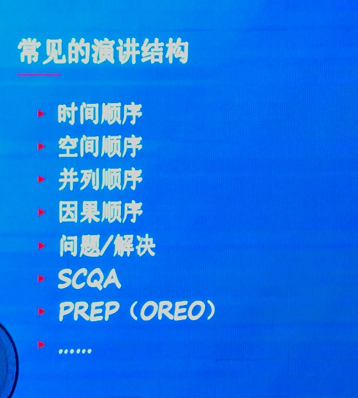
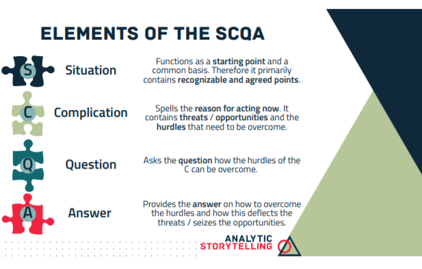

# 常见表达结构

[toc]

 

## What Why How

## 时间顺序

## 空间顺序

## 并列顺序

## 因果顺序

## 问题 / 解决

## SCQA

 

1. [build a clear structure for your story](https://analytic-storytelling.com/online_module/slides/AnalyticStorytelling_BuildAClearStructure.pdf)

## PREP (OREO)

1. Point（結論先行）開門見山，在談話開始就説出重點。
2. Reason（論據詳實）説明好處、原因。
3. Example（舉例說明）舉出具體的例子。
4. Point（聚焦重點）再次強調自己想主張的重點。

1. [運用『PREP』、『SCQA』表達架構，你能達到『簡短扼要、高效說服』](https://taiwantopsales.com/post/podcast/%E9%81%8B%E7%94%A8%E3%80%8Eprep%E3%80%8F%E3%80%81%E3%80%8Escqa%E3%80%8F%E8%A1%A8%E9%81%94%E6%9E%B6%E6%A7%8B%EF%BC%8C%E4%BD%A0%E8%83%BD%E9%81%94%E5%88%B0%E3%80%8E%E7%B0%A1%E7%9F%AD%E6%89%BC%E8%A6%81-2/)