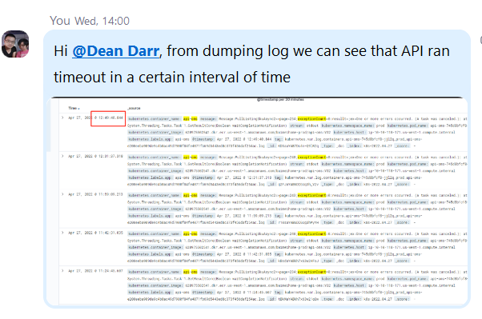
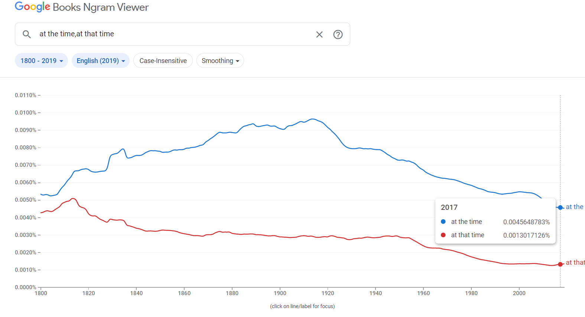

# 英语词组

## 时间表达

 

## 词组

- bite the bullet 咬紧牙关面对

- read between the lines 看出字里行间的意思；读懂言外之意

- The City That Never Sleeps （New York City) 被称为“不夜城”

- call it a day: 停止做某事，结束工作

- speak if the devil 说曹操，曹操就到

- to have all your Christmas come at once. 好事连连，鸿运当头

- make a long story short 长话短说

- cutting corners. 为了省事省钱而偷工减料

- take a rain check： 这次不行，改天吧

- dress like a dog's dinner: 形容某人穿的花里胡哨不得体

- a blessing in disguise 塞翁失马，焉知祸福

- nip it in the bud: 在萌芽状态消灭，防患于未然

- like chalk and cheese： 就像粉笔和奶酪，形容两个人的个性后者面貌截然不同

- when pigs fly 绝不可能，天方夜谭

- Actions speak louder than words

- an old head on young shoulders 少年老成

- Adam's apple 喉结

- set in stone: the plane is not set in stone

- butter up: 阿谀奉承，拍马屁

- costs an arm and a leg: 形容一件东西非常昂贵

- to keep it under your hat: 对某事保密

- a wild goose chase：像无头苍蝇无方向地做某事

- call for v. 需要，呼吁 (to need something). This dish calls for two eggs.

- take into consideration: 把…考虑进去;考虑到;顾及
  
  > The judge will take into consideration any previous convictions.
  
- all is not lost: 没有失去一切;没全完呢;一线生机

  > - When that happens, all is not lost.  当这种情况发生时，并不一定全是坏事
  > - But, all is not lost. There are many online services that let you download HLS videos without any hassle

- all-hands meeting（全员会）

- come in handy: 迟早有用, 派得上用场 (If something comes in handy, it is useful in a particular situation.)

  - I also like the fundraising aspect, which has come in handy in my job.
  - Memory debugging programs (see Resources) can come in handy when you're trying to detect memory leaks.

- XXX-minded: 有xxx意识（的人)
  - they’re responsible, community-minded person (他们是负责任、有社区意识的人)

- The past few years, **I’ve gotten really into** geocaching.

- in a certain interval of time ==> [at certain intervals](https://messagemedia.com/au/blog/what-are-webhooks/) 

   

- [More often than not](https://messagemedia.com/au/blog/what-are-webhooks/), the answer was no （多半；时常；往往）：
  - More often than not, a student will come up with the right answer.学生多半会作出正确的回答。

- To get your **[creative juices flowing](https://www.interaction-design.org/literature/article/10-simple-ideas-to-get-your-creative-juices-flowing)**, let’s picture this scenario （创造力流动起来）

- **get (one's) juices flowing**

  - ***To become inspired to greater creativity, productivity, or energy, or to cause such a feeling in someone.***

    - *I've* *been* *having* *trouble* *getting* *this* *essay* *started—I* *just* *need* *to* *get* *my* *juices* *flowing.*
    - *I* *find* *that* *a* *good* *run* *first* *thing* *in* *the* *morning* *always* *gets* *my* *juices* *flowing* *for* *the* *day* *ahead.*(我发现早上第一件事就是跑步，这会让我在接下来的一天充满活力。)
    - *We've* *been* *sitting* *here* *for* *an* *hour* *with* *nothing* *written,* *so* *let's* *play* *a* *few* *word* *games* *to* *get* *our* *juices* *flowing.*

  -  ***vulgar slang To arouse one sexually.***

    - *You* *can't* *expect* *the* *other* *person* *to* *be* *a* *mind-reader* *in* *bed.* *You* *need* *to* *learn* *what* *gets* *your* *juices* *flowing* *so* *you* *can* *tell* *your* *partner* *what* *you* *want.* (你不能指望对方在床上读心术。你需要知道什么能让你心潮澎湃，这样你才能告诉你的伴侣你想要什么。)

-  in the cards (**很可能发生**)

  - **At the time** I was still debating if a PhD was [in the cards](https://ludoro.github.io/blog/career/2022/02/14/newgrad.html) after my MSc (那时候，我还在为是否能在读完硕士之后拿到博士学位而争论。)

    - MSc:  理科硕士（全写为 Master of Science，大学理科中的中级学位）

  - If you [say](https://www.collinsdictionary.com/zh/dictionary/english/say) that something is **in the cards**, you mean that it is very likely to happen.

  - At the time. 在那时，那时候 (如果是我可能会用 at that time，[但是](https://books.google.com/ngrams/graph?content=at+the+time%2C+at+that+time&year_start=1800&year_end=2019&corpus=26&smoothing=3&direct_url=t1%3B%2Cat%20the%20time%3B%2Cc0%3B.t1%3B%2Cat%20that%20time%3B%2Cc0#t1%3B%2Cat%20the%20time%3B%2Cc0%3B.t1%3B%2Cat%20that%20time%3B%2Cc0))

     

- make up my mind (make a decision; decide.)
  - To [make up my mind](https://ludoro.github.io/blog/career/2022/02/14/newgrad.html), I have decided to keep using Julia while collaborating with the Alan Turing institute on some open ended research problems. 
-  kill two birds with one stone
  - During this time, my girlfriend was studying in Göteborg, Sweden. I have decided to [kill two birds with one stone](https://ludoro.github.io/blog/career/2022/02/14/newgrad.html): I moved in with her for 6 months while working at VolvoCars on my MSc degree related to computer vision.

- xxx has been nothing short of amazing: xxx简直太棒了
  - My time in Sweden has been [nothing short of amazing](https://ludoro.github.io/blog/career/2022/02/14/newgrad.html), It will be on my radar for when I am ready to settle down.我在瑞典的时光简直太棒了

- Shortly after that 在那不久后
  - [Shortly after that](https://ludoro.github.io/blog/career/2022/02/14/newgrad.html), I have moved to the little Saint-genis-Pouilly in France. 

<<<<<<< HEAD
-  set in stone: 一成不变；字面意思就是写在石头上的；固定不变 
  - That dependence is often [set in stone](https://www.mailbox.my/blog/posts/why-enterprise-software-is-bloated/) in the form of contracts, which in most companies is a [definite no-no](https://www.mailbox.my/blog/posts/why-enterprise-software-is-bloated/) for any changes.
  - These are just a few ideas - nothing is set in stone yet

=======
- stick around 呆在原处（等待）
>>>>>>> e827882ba666da6d9fc583378bbb0586c5779d06

  >  If you **stick around**, you stay where you are, often because you are waiting for something.

  - Stick around a while and see what develops...
  - Stick around; we'll need you to help us later

 

## on one's feet

> This will speak to your ability to [think quickly on your feet](https://www.thebalancecareers.com/tell-me-about-yourself-job-interview-question-2060956), as well as to prepare for important conversations at work.

In addition to the idiom (see the next entry) on one's feet, also see

- [dead on one's feet](https://idioms.thefreedictionary.com/dead+on+one's+feet); 

- [fall (land) on one's feet](https://idioms.thefreedictionary.com/fall+on+one's+feet); 

- [get to one's feet](https://idioms.thefreedictionary.com/get+to+one's+feet); 

- [set one back on one's feet](https://idioms.thefreedictionary.com/set+one+back+on+one's+feet);

-  [stand on one's feet](https://idioms.thefreedictionary.com/stand+on+one's+own+feet);

-  [think on one's feet](https://idioms.thefreedictionary.com/think+on+one's+feet).

  > To be able to think clearly in times of stress, especially when forming a solution to a pressing problem.
  >
  > - *Thank* *goodness* *you* *were* *able* *to* *think* *on* *your* *feet* *and* *find* *another* *way* *to* *stop* *the* *pipe* *from* *leaking.* *The* *whole* *basement* *would* *have* *flooded* ***otherwise**.*

## 《Python for Excel》

> A modern Environment for Automation and Data Analysis. By Felix Zumstein

- Pandas is Python’s **go-to** library for data analysis. (Preface | XIII)
  - [go-to](https://dictionary.cambridge.org/dictionary/english/go-to) ：**used to describe the best person, thing, or place for a particular purpose or need:**
    - He was the company's go-to guy for new ideas.
    - A side of salmon is the perfect go-to dish for a dinner party.
    - For 20 years, Wild Mountain was the go-to store for outdoor enthusiasts.
- a 
