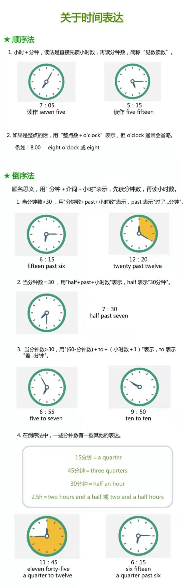

# 英语词组

## 时间表达

 

## 词组

- bite the bullet 咬紧牙关面对

- read between the lines 看出字里行间的意思；读懂言外之意

- The City That Never Sleeps （New York City) 被称为“不夜城”

- call it a day: 停止做某事，结束工作

- speak if the devil 说曹操，曹操就到

- to have all your Christmas come at once. 好事连连，鸿运当头

- make a long story short 长话短说

- cutting corners. 为了省事省钱而偷工减料

- take a rain check： 这次不行，改天吧

- dress like a dog's dinner: 形容某人穿的花里胡哨不得体

- a blessing in disguise 塞翁失马，焉知祸福

- nip it in the bud: 在萌芽状态消灭，防患于未然

- like chalk and cheese： 就像粉笔和奶酪，形容两个人的个性后者面貌截然不同

- when pigs fly 绝不可能，天方夜谭

- Actions speak louder than words

- an old head on young shoulders 少年老成

- Adam's apple 喉结

- set in stone: the plane is not set in stone

- butter up: 阿谀奉承，拍马屁

- costs an arm and a leg: 形容一件东西非常昂贵

- to keep it under your hat: 对某事保密

- a wild goose chase：像无头苍蝇无方向地做某事

- call for v. 需要，呼吁 (to need something). This dish calls for two eggs.

- take into consideration: 把…考虑进去;考虑到;顾及
  
  > The judge will take into consideration any previous convictions.
  
- all is not lost: 没有失去一切;没全完呢;一线生机

  > - When that happens, all is not lost.  当这种情况发生时，并不一定全是坏事
  > - But, all is not lost. There are many online services that let you download HLS videos without any hassle

- all-hands meeting（全员会）

- come in handy: 迟早有用, 派得上用场 (If something comes in handy, it is useful in a particular situation.)

  - I also like the fundraising aspect, which has come in handy in my job.
  - Memory debugging programs (see Resources) can come in handy when you're trying to detect memory leaks.

- XXX-minded: 有xxx意识（的人)
  - they’re responsible, community-minded person (他们是负责任、有社区意识的人)

- The past few years, **I’ve gotten really into** geocaching.

## on one's feet

> This will speak to your ability to [think quickly on your feet](https://www.thebalancecareers.com/tell-me-about-yourself-job-interview-question-2060956), as well as to prepare for important conversations at work.

In addition to the idiom (see the next entry) on one's feet, also see

- [dead on one's feet](https://idioms.thefreedictionary.com/dead+on+one's+feet); 

- [fall (land) on one's feet](https://idioms.thefreedictionary.com/fall+on+one's+feet); 

- [get to one's feet](https://idioms.thefreedictionary.com/get+to+one's+feet); 

- [set one back on one's feet](https://idioms.thefreedictionary.com/set+one+back+on+one's+feet);

-  [stand on one's feet](https://idioms.thefreedictionary.com/stand+on+one's+own+feet);

-  [think on one's feet](https://idioms.thefreedictionary.com/think+on+one's+feet).

  > To be able to think clearly in times of stress, especially when forming a solution to a pressing problem.
  >
  > - *Thank* *goodness* *you* *were* *able* *to* *think* *on* *your* *feet* *and* *find* *another* *way* *to* *stop* *the* *pipe* *from* *leaking.* *The* *whole* *basement* *would* *have* *flooded* ***otherwise**.*

## 《Python for Excel》

> A modern Environment for Automation and Data Analysis. By Felix Zumstein

- Pandas is Python’s **go-to** library for data analysis. (Preface | XIII)
  - [go-to](https://dictionary.cambridge.org/dictionary/english/go-to) ：**used to describe the best person, thing, or place for a particular purpose or need:**
    - He was the company's go-to guy for new ideas.
    - A side of salmon is the perfect go-to dish for a dinner party.
    - For 20 years, Wild Mountain was the go-to store for outdoor enthusiasts.
- a 
